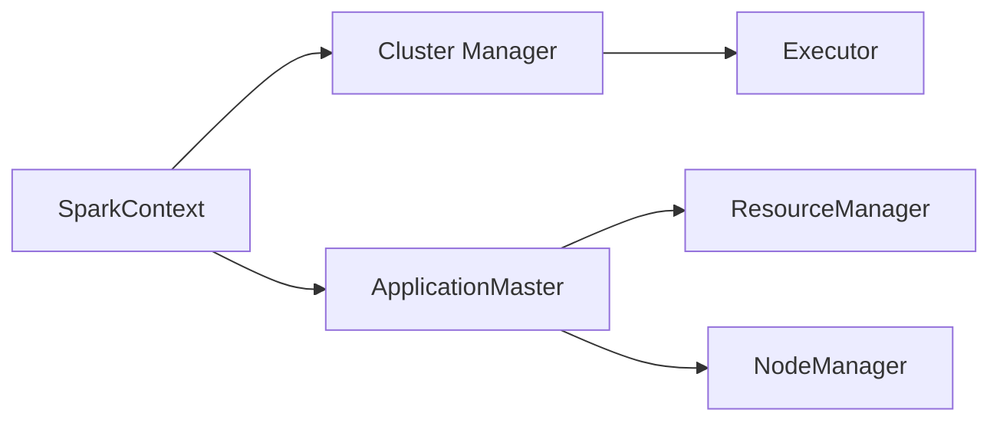

## 1.背景介绍

在大数据处理和分析中，Apache Hadoop已经成为了一种标准。然而，Hadoop的MapReduce模型并不适合所有的计算任务，尤其是那些需要频繁的数据迭代和交互的任务。为了解决这个问题，Apache Spark应运而生。Spark是一个开源的、通用的大数据处理框架，它提供了一种易于使用的数据处理API，并能够比Hadoop MapReduce更快地处理数据。

在Spark中，ApplicationMaster是一个重要的组件，它负责协调资源管理器（ResourceManager）和NodeManager，管理应用程序的执行。本文主要从理论和实践两个方面，深入剖析ApplicationMaster的工作原理。

## 2.核心概念与联系

在深入探讨ApplicationMaster之前，我们需要先了解一下Spark的基本架构和几个核心概念：

- **SparkContext**：SparkContext是Spark的入口，它与集群管理器进行通信，申请资源，并进行任务调度。

- **Cluster Manager**：集群管理器负责资源的分配和管理，Spark支持Standalone、Mesos、YARN等多种集群管理器。

- **Executor**：Executor是Spark的工作节点，每个Executor都会运行一些Task。

- **ApplicationMaster**：ApplicationMaster是YARN中的一个组件，它负责协调ResourceManager和NodeManager，管理应用程序的执行。

在Spark运行过程中，SparkContext会向Cluster Manager申请资源，并启动Executor。在YARN模式下，SparkContext会启动一个ApplicationMaster，由ApplicationMaster负责与YARN的ResourceManager和NodeManager交互，管理任务的执行。



## 3.核心算法原理具体操作步骤

ApplicationMaster的工作流程可以分为以下几个步骤：

1. **启动**：当SparkContext启动时，它会向Cluster Manager申请资源，并启动ApplicationMaster。

2. **资源申请**：ApplicationMaster会向ResourceManager申请资源，包括CPU、内存等。

3. **任务调度**：ApplicationMaster会根据资源情况和任务需求，进行任务的调度。

4. **任务执行**：ApplicationMaster会向NodeManager发送命令，启动Task在Executor上执行。

5. **状态监控**：ApplicationMaster会持续监控Task的执行状态，并向ResourceManager汇报应用程序的运行状态。

6. **结束**：当所有的Task都执行完成后，ApplicationMaster会结束，释放所有的资源。

## 4.数学模型和公式详细讲解举例说明

在ApplicationMaster的资源申请过程中，一个关键的问题是如何合理地分配资源。这涉及到一个优化问题，我们需要在满足任务需求的前提下，尽可能地减少资源的使用。

假设我们有n个任务，每个任务$i$需要$c_i$个CPU和$m_i$MB的内存，我们的目标是最小化资源的使用：

$$
\min \sum_{i=1}^{n} (c_i + m_i)
$$

同时，我们需要满足任务的需求：

$$
\forall i, c_i \geq c_{min,i}, m_i \geq m_{min,i}
$$

这是一个线性规划问题，可以使用诸如Simplex方法的优化算法进行求解。

## 5.项目实践：代码实例和详细解释说明

下面我们通过一个简单的Spark程序来说明ApplicationMaster的工作过程。

```scala
val conf = new SparkConf().setAppName("Simple Application")
val sc = new SparkContext(conf)
val data = Array(1, 2, 3, 4, 5)
val distData = sc.parallelize(data)
val result = distData.reduce((a, b) => a + b)
println(result)
```

在这个程序中，我们首先创建了一个SparkContext，然后创建了一个分布式的数据集，最后对这个数据集进行了一个reduce操作。

当我们提交这个程序到Spark集群时，SparkContext会向Cluster Manager申请资源，并启动ApplicationMaster。ApplicationMaster会负责管理这个应用程序的执行，包括资源申请、任务调度、任务执行和状态监控等。

## 6.实际应用场景

ApplicationMaster在很多大数据处理的应用场景中都有应用，例如：

- **数据分析**：在大数据分析中，我们需要处理大量的数据，这需要大量的计算资源。ApplicationMaster可以帮助我们高效地管理和使用这些资源。

- **机器学习**：在机器学习中，我们需要对大量的数据进行复杂的计算，例如梯度下降、聚类等。ApplicationMaster可以帮助我们有效地调度任务，提高计算效率。

- **实时计算**：在实时计算中，我们需要快速地处理数据，满足实时性的需求。ApplicationMaster可以帮助我们实现快速的任务调度，提高处理速度。

## 7.工具和资源推荐

- **Apache Spark**：Apache Spark是一个开源的大数据处理框架，它提供了一种易于使用的数据处理API，并能够比Hadoop MapReduce更快地处理数据。

- **Apache Hadoop**：Apache Hadoop是一个开源的分布式计算框架，它可以处理大量的数据，并提供了MapReduce等数据处理模型。

- **Apache Mesos**：Apache Mesos是一个开源的集群管理器，它可以有效地管理和使用集群的资源。

## 8.总结：未来发展趋势与挑战

随着大数据和人工智能的发展，数据处理的需求越来越大，而资源的管理和使用变得越来越重要。ApplicationMaster作为资源管理的关键组件，其在未来的发展趋势和挑战主要有以下几点：

- **资源管理的优化**：如何更有效地管理和使用资源，是ApplicationMaster面临的一个重要挑战。这需要我们不断优化算法，提高资源的使用效率。

- **任务调度的优化**：如何更快地调度任务，是ApplicationMaster面临的另一个挑战。这需要我们不断优化算法，提高任务调度的速度。

- **容错的提高**：在大规模的分布式计算中，故障是常态。如何提高系统的容错能力，保证任务的正常执行，是ApplicationMaster面临的一个重要问题。

## 9.附录：常见问题与解答

**Q: ApplicationMaster和ResourceManager有什么区别？**

A: ApplicationMaster和ResourceManager都是YARN的组件，它们的主要区别在于职责。ResourceManager负责整个集群的资源管理，而ApplicationMaster负责单个应用程序的执行管理。

**Q: ApplicationMaster如何进行资源申请？**

A: ApplicationMaster会向ResourceManager发送资源申请，包括CPU、内存等。ResourceManager会根据资源情况和其他应用程序的需求，决定是否分配资源。

**Q: ApplicationMaster如何进行任务调度？**

A: ApplicationMaster会根据资源情况和任务需求，进行任务的调度。具体的调度算法可以根据应用程序的需求进行定制。

作者：禅与计算机程序设计艺术 / Zen and the Art of Computer Programming