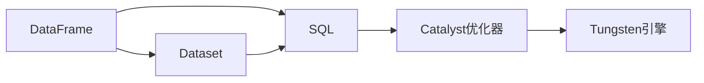

# 【AI大数据计算原理与代码实例讲解】Spark SQL

## 1. 背景介绍

### 1.1 大数据处理的挑战

在当今大数据时代,企业和组织面临着海量数据的处理和分析挑战。传统的数据处理方式已经无法满足实时性、高并发性和海量数据处理的需求。为了应对这些挑战,大数据处理技术应运而生,其中 Apache Spark 就是一个优秀的大数据处理框架。

### 1.2 Apache Spark 概述

Apache Spark 是一个快速、通用的大规模数据处理引擎,专为大规模数据处理而设计。它扩展了广泛使用的 MapReduce 计算模型,并且高效地支持更多计算模式,包括交互式查询和流处理。

### 1.3 Spark SQL 的诞生

Spark SQL 是 Spark 生态系统中的一个重要组件,它在 Spark Core 之上提供了一个名为 DataFrame 的编程抽象,并且支持通过 SQL 和 DataFrame API 进行结构化数据的处理。Spark SQL 的诞生,让 Spark 具备了处理结构化数据的能力,使得开发者能够以更加简洁、高效的方式进行大规模数据分析。

## 2. 核心概念与联系

### 2.1 DataFrame

DataFrame 是 Spark SQL 的核心概念之一,它是一种以 RDD 为基础的分布式数据集合。DataFrame 可以从各种数据源构建,如结构化的数据文件、Hive 表、外部数据库等。DataFrame 与传统的关系型数据库表类似,具有 schema(即列名和类型)信息。

### 2.2 Dataset

Dataset 也是 Spark SQL 的一个重要抽象,它集成了 RDD 和 DataFrame 的优点。Dataset 提供了强类型的 API,允许在编译时进行类型检查,同时还支持 Lambda 函数,能够进行复杂的操作。Dataset API 支持 Scala 和 Java 语言。

### 2.3 SQL

Spark SQL 支持使用标准的 SQL 语法对 DataFrame 进行查询。通过 SQL,用户可以方便地对结构化数据执行复杂的转换和聚合操作。Spark SQL 还支持用户自定义函数(UDF),扩展了 SQL 的表达能力。

### 2.4 Catalyst 优化器

Catalyst 是 Spark SQL 的核心组件之一,它是一个可扩展的查询优化框架。Catalyst 负责将 SQL 查询转换为执行计划,并对执行计划进行优化,如谓词下推、列剪裁、Join 重排等优化策略,从而提高查询性能。

### 2.5 Tungsten 引擎

Tungsten 是 Spark SQL 的另一个重要组件,它是一个高性能的内存管理和代码生成引擎。Tungsten 通过优化内存布局、使用堆外内存、代码生成等技术,显著提升了 Spark SQL 的执行效率。

下面是 Spark SQL 核心概念之间的关系图:



## 3. 核心算法原理具体操作步骤

### 3.1 DataFrame 的创建

DataFrame 可以通过多种方式创建,常见的创建方式包括:

1. 从结构化数据文件创建,如 CSV、JSON、Parquet 等。
2. 从 RDD 转换而来。
3. 从 Hive 表创建。
4. 从外部数据源创建,如关系型数据库、HBase 等。

示例代码:

```scala
// 从 JSON 文件创建 DataFrame
val df = spark.read.json("path/to/file.json")

// 从 RDD 转换创建 DataFrame
val rdd = sc.parallelize(Seq(("Alice", 25), ("Bob", 30)))
val df = rdd.toDF("name", "age")
```

### 3.2 DataFrame 的转换操作

DataFrame 支持多种转换操作,常见的转换操作包括:

1. select: 选择指定的列。
2. filter: 根据条件过滤行。
3. groupBy: 根据指定的列对数据进行分组。
4. orderBy: 根据指定的列对数据进行排序。
5. join: 对两个 DataFrame 执行 Join 操作。

示例代码:

```scala
// 选择指定的列
val selectedDF = df.select("name", "age")

// 根据条件过滤行
val filteredDF = df.filter($"age" > 18)

// 根据指定的列对数据进行分组和聚合
val groupedDF = df.groupBy("name").agg(avg("age").as("avg_age"))
```

### 3.3 DataFrame 的 Action 操作

DataFrame 的 Action 操作触发实际的计算并返回结果。常见的 Action 操作包括:

1. show: 在控制台显示 DataFrame 的内容。
2. count: 返回 DataFrame 的行数。
3. collect: 将 DataFrame 的内容收集到驱动程序中,返回一个数组。
4. save: 将 DataFrame 保存到外部存储系统,如文件系统或数据库。

示例代码:

```scala
// 显示 DataFrame 的内容
df.show()

// 返回 DataFrame 的行数
val count = df.count()

// 将 DataFrame 的内容收集到驱动程序中
val result = df.collect()
```

### 3.4 SQL 查询

Spark SQL 支持使用标准的 SQL 语法对 DataFrame 进行查询。可以通过 SparkSession 的 sql 方法执行 SQL 查询。

示例代码:

```scala
// 注册 DataFrame 为临时视图
df.createOrReplaceTempView("people")

// 执行 SQL 查询
val sqlDF = spark.sql("SELECT * FROM people WHERE age > 18")
```

## 4. 数学模型和公式详细讲解举例说明

### 4.1 TF-IDF 模型

TF-IDF(Term Frequency-Inverse Document Frequency)是一种常用于文本挖掘和信息检索领域的统计方法。它用于评估一个词语对于一个文件集或一个语料库中的其中一份文件的重要程度。

TF-IDF 的计算公式如下:

$$
tfidf(t,d,D) = tf(t,d) \times idf(t,D)
$$

其中:
- $tf(t,d)$ 表示词语 $t$ 在文件 $d$ 中的频率。
- $idf(t,D)$ 表示词语 $t$ 在整个文件集 $D$ 中的逆文档频率。

$idf(t,D)$ 的计算公式为:

$$
idf(t,D) = \log \frac{|D|}{|\{d \in D: t \in d\}|}
$$

其中:
- $|D|$ 表示文件集 $D$ 中的文件总数。
- $|\{d \in D: t \in d\}|$ 表示包含词语 $t$ 的文件数。

示例代码:

```scala
import org.apache.spark.ml.feature.{HashingTF, IDF, Tokenizer}

// 创建一个 DataFrame,包含 id 和 text 列
val sentenceData = spark.createDataFrame(Seq(
  (0, "Spark is great for big data processing"),
  (1, "Python is a popular programming language"),
  (2, "Spark and Python are used for data analysis")
)).toDF("id", "text")

// 将文本拆分为单词
val tokenizer = new Tokenizer()
  .setInputCol("text")
  .setOutputCol("words")
val wordsData = tokenizer.transform(sentenceData)

// 计算词频
val hashingTF = new HashingTF()
  .setInputCol("words")
  .setOutputCol("rawFeatures")
val featurizedData = hashingTF.transform(wordsData)

// 计算 IDF
val idf = new IDF()
  .setInputCol("rawFeatures")
  .setOutputCol("features")
val idfModel = idf.fit(featurizedData)

// 计算 TF-IDF
val rescaledData = idfModel.transform(featurizedData)
```

### 4.2 协同过滤模型

协同过滤(Collaborative Filtering)是一种常用的推荐算法,它基于用户的历史行为数据(如评分、点击等)来预测用户对物品的喜好程度。

协同过滤算法分为两类:
1. 基于用户的协同过滤(User-based CF)
2. 基于物品的协同过滤(Item-based CF)

基于用户的协同过滤的基本思想是,找到与目标用户相似的用户,然后根据这些相似用户对物品的评分来预测目标用户对物品的评分。

相似度计算常用的方法有:
- 欧几里得距离
- 皮尔逊相关系数
- 余弦相似度

皮尔逊相关系数的计算公式为:

$$
sim(u,v) = \frac{\sum_{i \in I_{uv}}(r_{ui} - \bar{r}_u)(r_{vi} - \bar{r}_v)}{\sqrt{\sum_{i \in I_{uv}}(r_{ui} - \bar{r}_u)^2}\sqrt{\sum_{i \in I_{uv}}(r_{vi} - \bar{r}_v)^2}}
$$

其中:
- $I_{uv}$ 表示用户 $u$ 和用户 $v$ 都评分过的物品集合。
- $r_{ui}$ 表示用户 $u$ 对物品 $i$ 的评分。
- $\bar{r}_u$ 表示用户 $u$ 的平均评分。

示例代码:

```scala
import org.apache.spark.ml.recommendation.ALS

// 创建一个 DataFrame,包含 userId、itemId 和 rating 列
val ratingsData = spark.createDataFrame(Seq(
  (0, 0, 4.0),
  (0, 1, 3.0),
  (1, 1, 5.0),
  (1, 2, 4.0),
  (2, 1, 3.0),
  (2, 2, 4.0)
)).toDF("userId", "itemId", "rating")

// 将数据集拆分为训练集和测试集
val Array(training, test) = ratingsData.randomSplit(Array(0.8, 0.2))

// 创建 ALS 模型
val als = new ALS()
  .setMaxIter(5)
  .setRegParam(0.01)
  .setUserCol("userId")
  .setItemCol("itemId")
  .setRatingCol("rating")

// 训练模型
val model = als.fit(training)

// 对测试集进行预测
val predictions = model.transform(test)
```

## 5. 项目实践:代码实例和详细解释说明

下面是一个使用 Spark SQL 进行数据分析的完整示例,包括数据加载、转换、聚合和可视化等步骤。

```scala
import org.apache.spark.sql.SparkSession
import org.apache.spark.sql.functions._

object SalesAnalysis {
  def main(args: Array[String]): Unit = {
    // 创建 SparkSession
    val spark = SparkSession.builder()
      .appName("SalesAnalysis")
      .master("local[*]")
      .getOrCreate()
    
    // 加载销售数据
    val salesDF = spark.read
      .option("header", "true")
      .option("inferSchema", "true")
      .csv("path/to/sales_data.csv")
    
    // 数据转换
    val transformedDF = salesDF
      .withColumn("total_price", col("quantity") * col("unit_price"))
      .withColumn("sale_date", to_date(col("sale_date"), "yyyy-MM-dd"))
    
    // 按日期和产品类别进行分组和聚合
    val aggregatedDF = transformedDF
      .groupBy(col("sale_date"), col("category"))
      .agg(
        sum("total_price").as("total_sales"),
        avg("unit_price").as("avg_price")
      )
    
    // 按日期排序
    val sortedDF = aggregatedDF.orderBy(col("sale_date"))
    
    // 可视化结果
    sortedDF.show()
    
    // 将结果保存到 Parquet 文件
    sortedDF.write.parquet("path/to/output")
    
    // 停止 SparkSession
    spark.stop()
  }
}
```

代码解释:

1. 首先,我们创建了一个 SparkSession,它是 Spark SQL 的入口点。

2. 使用 `spark.read` 加载销售数据,并指定 CSV 文件的选项,如是否有表头和是否自动推断数据类型。

3. 对加载的数据进行转换操作:
   - 使用 `withColumn` 创建一个新列 `total_price`,表示每个销售记录的总价格。
   - 使用 `to_date` 函数将字符串格式的日期转换为日期类型。

4. 使用 `groupBy` 和 `agg` 对数据进行分组和聚合操作:
   - 按照销售日期和产品类别进行分组。
   - 计算每个组的总销售额和平均价格。

5. 使用 `orderBy` 对聚合后的数据按照销售日期进行排序。

6. 使用 `show` 方法在控制台显示结果。

7. 使用 `write` 将结果保存到 Parquet 文件中,以便后续分析和处理。

8. 最