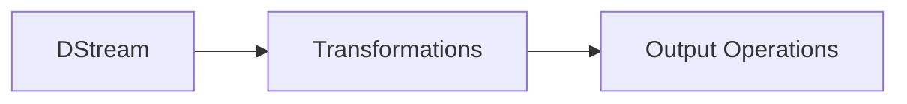
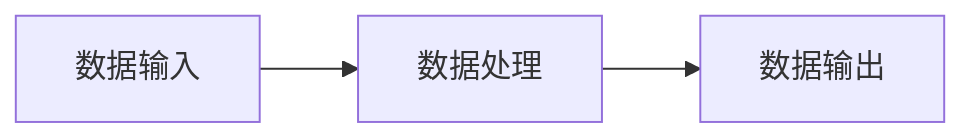

## 1.背景介绍

随着互联网和物联网的快速发展，我们每天都会生成大量的数据。这些数据中蕴含着宝贵的信息，如何有效地处理和利用这些数据，已经成为了当前的一个重要问题。这就引出了我们今天要讲的主题——Spark Streaming。

Spark Streaming是Apache Spark的一个扩展，它可以实时处理和分析大量的数据流。它的出现，让我们有了处理实时大数据的可能。

## 2.核心概念与联系

Spark Streaming的核心概念主要有三个：DStream，Transformations和Output Operations。

- DStream：DStream是Spark Streaming中的基本数据抽象，它代表了一个连续的数据流。
- Transformations：Transformations是对DStream进行操作的方法，例如map，reduce，filter等。
- Output Operations：Output Operations是将处理后的数据输出的方法，例如print，saveAsTextFiles等。

这三个概念之间的关系可以用下面的Mermaid流程图表示：



## 3.核心算法原理具体操作步骤

Spark Streaming的工作原理主要分为以下几个步骤：

1. 数据输入：Spark Streaming可以从多种来源接收数据，例如Kafka，Flume，HDFS等。
2. 数据处理：接收到的数据会被切分成一系列连续的数据块，每个数据块代表了一段时间内的数据。然后，这些数据块会被送入Spark引擎进行处理。
3. 数据输出：处理后的数据会被输出到文件系统，数据库或者实时仪表板等。

这个过程可以用下面的Mermaid流程图表示：



## 4.数学模型和公式详细讲解举例说明

Spark Streaming的数据处理是基于微批处理模型的。这个模型的基本思想是将连续的数据流切分成一系列小的批次，然后对每个批次进行处理。

假设我们的数据流中每秒钟有N条数据，我们希望每T秒钟处理一次数据，那么每个批次的数据量就是$N \times T$。

如果我们的处理时间为P，那么为了保证实时性，我们需要满足以下条件：

$$ P \leq T $$

也就是说，我们的处理时间必须小于或等于批次的时间。

## 5.项目实践：代码实例和详细解释说明

下面我们通过一个简单的例子来演示如何使用Spark Streaming。

首先，我们需要创建一个StreamingContext，这是Spark Streaming的入口：

```scala
val conf = new SparkConf().setAppName("NetworkWordCount")
val ssc = new StreamingContext(conf, Seconds(1))
```

然后，我们创建一个DStream，用于接收网络数据：

```scala
val lines = ssc.socketTextStream("localhost", 9999)
```

接着，我们对数据进行处理：

```scala
val words = lines.flatMap(_.split(" "))
val pairs = words.map(word => (word, 1))
val wordCounts = pairs.reduceByKey(_ + _)
```

最后，我们输出处理结果：

```scala
wordCounts.print()
```

这就是一个简单的Spark Streaming应用，它可以实时统计网络数据中的单词数量。

## 6.实际应用场景

Spark Streaming在很多场景中都有应用，例如：

- 实时监控：通过实时分析系统日志，我们可以及时发现系统的问题。
- 实时推荐：通过实时分析用户的行为，我们可以实时推荐用户可能感兴趣的内容。
- 实时风控：通过实时分析交易数据，我们可以及时发现并阻止欺诈行为。

## 7.工具和资源推荐

要学习和使用Spark Streaming，以下资源可能会有帮助：

- Apache Spark官方文档：这是最权威的资源，包含了详细的API文档和教程。
- Spark: The Definitive Guide：这本书详细介绍了Spark的各个方面，包括Spark Streaming。
- Spark Summit：这是一个关于Spark的大会，你可以在这里找到很多有用的演讲和教程。

## 8.总结：未来发展趋势与挑战

Spark Streaming是一个强大的实时数据处理工具，但是它也有一些挑战需要解决：

- 处理延迟：由于基于微批处理模型，Spark Streaming的处理延迟相对较高。
- 状态管理：在处理有状态的数据流时，如何有效管理状态是一个挑战。

未来，Spark Streaming可能会引入更多的优化和新特性，以解决这些问题。

## 9.附录：常见问题与解答

Q: Spark Streaming和Storm有什么区别？

A: Spark Streaming和Storm都是实时数据处理工具，但是它们有一些区别。首先，Spark Streaming是基于微批处理模型的，而Storm是基于事件处理模型的。这使得Spark Streaming的处理延迟相对较高，但是它可以更好地利用资源。其次，Spark Streaming是Spark的一部分，可以和Spark的其他组件（例如Spark SQL，MLlib）无缝集成。而Storm是一个独立的系统，需要额外的工作来和其他系统集成。

Q: Spark Streaming支持哪些数据源？

A: Spark Streaming支持多种数据源，包括Kafka，Flume，Kinesis，HDFS等。

Q: 如何调优Spark Streaming应用？

A: 调优Spark Streaming应用主要包括以下几个方面：选择合适的批次大小，合理设置并行度，以及使用高效的数据结构和算法。

作者：禅与计算机程序设计艺术 / Zen and the Art of Computer Programming