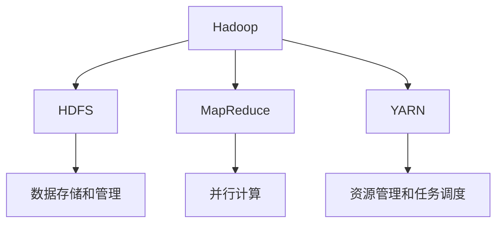
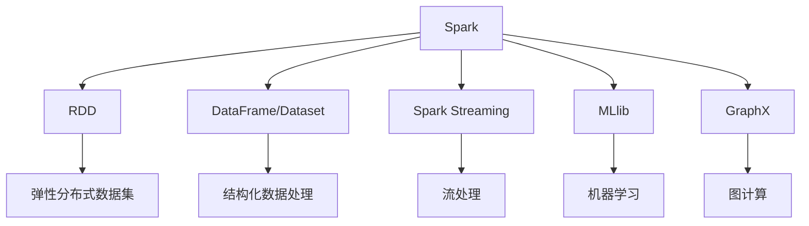
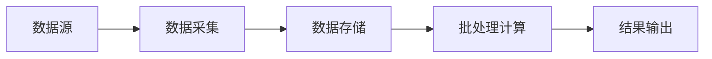
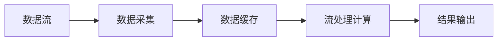
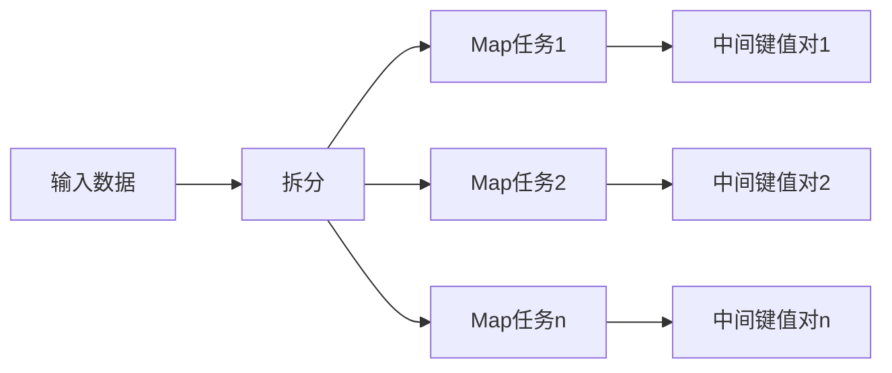
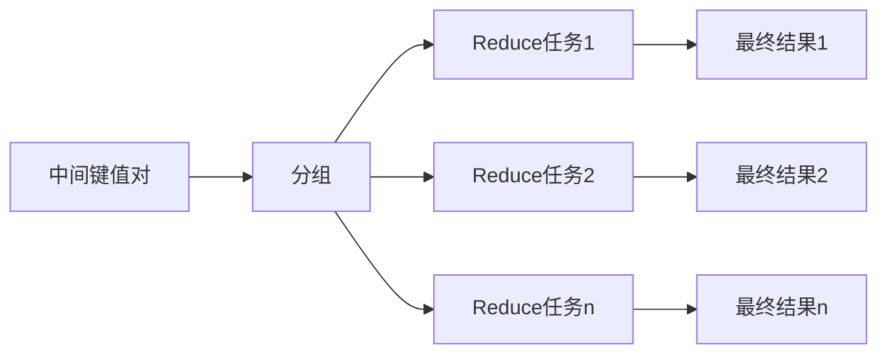
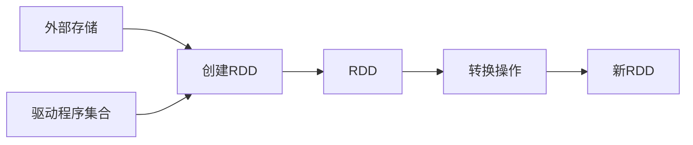
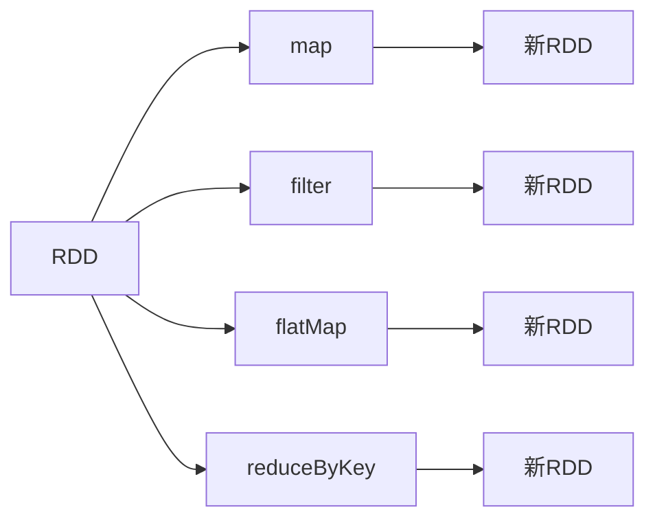
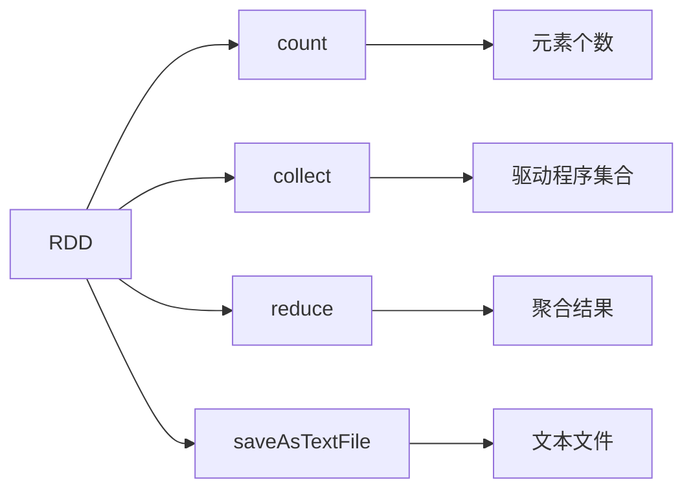

# 【AI大数据计算原理与代码实例讲解】大数据

## 1.背景介绍

随着大数据时代的到来,海量的数据正以前所未有的规模和速度被产生和积累。这些数据蕴含着巨大的价值,但同时也带来了新的挑战。传统的数据处理方法已经无法满足大数据环境下的需求,因此出现了一系列新的大数据计算框架和技术。

大数据计算是指对大规模、多样化的数据集进行存储、管理和处理的过程。它涉及到数据采集、传输、存储、处理和分析等多个环节。大数据计算的目标是从海量数据中提取有价值的信息,为企业或组织的决策提供支持。

## 2.核心概念与联系

### 2.1 大数据的4V特征

大数据具有4V特征,即Volume(大量)、Variety(多样性)、Velocity(高速)和Value(价值)。

- Volume(大量):指数据的规模巨大,通常以TB、PB甚至EB为单位。
- Variety(多样性):指数据来源多样,包括结构化数据(如数据库中的数据)、半结构化数据(如XML文件)和非结构化数据(如文本、图像、视频等)。
- Velocity(高速):指数据的产生、传输和处理速度极快,需要实时或准实时处理。
- Value(价值):指从海量数据中提取出有价值的信息,为企业或组织的决策提供支持。

### 2.2 大数据计算框架

为了有效处理大数据,出现了多种大数据计算框架,其中最著名的是Apache Hadoop和Apache Spark。

#### 2.2.1 Apache Hadoop

Hadoop是一个开源的分布式计算框架,由Apache软件基金会开发和维护。它包括以下核心组件:

- HDFS(Hadoop分布式文件系统):用于存储和管理大规模数据集。
- MapReduce:一种并行计算模型,用于在分布式环境中处理大规模数据集。
- YARN(Yet Another Resource Negotiator):负责集群资源管理和任务调度。



#### 2.2.2 Apache Spark

Spark是一种快速、通用的大数据处理引擎,比Hadoop的MapReduce更高效。它具有以下优势:

- 内存计算:Spark可以将中间数据保存在内存中,避免了频繁读写磁盘的开销。
- 通用性:Spark不仅支持批处理,还支持流处理、机器学习和图计算等多种计算模型。
- 易用性:Spark提供了丰富的API,支持多种编程语言,如Scala、Java、Python和R。



### 2.3 大数据计算模型

大数据计算通常采用以下两种模型:批处理模型和流处理模型。

#### 2.3.1 批处理模型

批处理模型是指将大量数据集中起来,作为一个批次进行处理。这种模型适用于对延迟要求不太严格的场景,如网页索引、日志分析等。MapReduce就是一种典型的批处理计算模型。



#### 2.3.2 流处理模型

流处理模型是指对持续到来的数据流进行实时或准实时处理。这种模型适用于对低延迟有较高要求的场景,如实时监控、在线交易等。Spark Streaming和Apache Flink是两种流行的流处理框架。



## 3.核心算法原理具体操作步骤

### 3.1 MapReduce算法

MapReduce是Hadoop中的核心计算模型,它将计算过程分为两个阶段:Map阶段和Reduce阶段。

#### 3.1.1 Map阶段

Map阶段的主要任务是对输入数据进行过滤和转换,生成中间键值对。具体步骤如下:

1. 读取输入数据,将其拆分为多个数据块。
2. 对每个数据块进行并行处理,执行用户定义的Map函数。
3. Map函数将输入数据转换为键值对的形式,作为中间结果输出。



#### 3.1.2 Reduce阶段

Reduce阶段的主要任务是对Map阶段的输出进行聚合和处理,生成最终结果。具体步骤如下:

1. 将Map阶段的输出按键进行分组,将相同键对应的值组合在一起。
2. 对每个组执行并行的Reduce任务,执行用户定义的Reduce函数。
3. Reduce函数对每个组的值进行聚合或其他操作,生成最终结果。



### 3.2 Spark RDD

Spark的核心数据结构是RDD(Resilient Distributed Dataset,弹性分布式数据集)。RDD是一种分布式内存数据结构,支持并行操作和容错。

#### 3.2.1 RDD创建

RDD可以通过以下方式创建:

1. 从外部存储系统(如HDFS、HBase等)加载数据创建RDD。
2. 通过驱动程序中的集合创建并行化RDD。
3. 对现有RDD进行转换操作,生成新的RDD。



#### 3.2.2 RDD转换操作

RDD支持丰富的转换操作,用于对数据进行过滤、映射、聚合等处理。常见的转换操作包括:

- map: 对RDD中的每个元素应用函数,生成新的RDD。
- filter: 返回RDD中满足条件的元素,生成新的RDD。
- flatMap: 对RDD中的每个元素应用函数,并将结果扁平化为单个RDD。
- reduceByKey: 对具有相同键的值进行聚合操作。



#### 3.2.3 RDD行动操作

行动操作用于触发RDD的计算并返回结果。常见的行动操作包括:

- count: 返回RDD中元素的个数。
- collect: 将RDD中的所有元素收集到驱动程序中。
- reduce: 使用给定的函数对RDD中的元素进行聚合。
- saveAsTextFile: 将RDD的元素保存为文本文件。



## 4.数学模型和公式详细讲解举例说明

在大数据计算中,常见的数学模型和公式包括:

### 4.1 MapReduce模型

MapReduce模型可以用以下公式表示:

$$
\begin{align*}
map &: (k_1, v_1) \rightarrow \text{list}(k_2, v_2) \\
reduce &: (k_2, \text{list}(v_2)) \rightarrow \text{list}(v_3)
\end{align*}
$$

其中:

- $k_1$和$v_1$分别表示Map阶段的输入键和值。
- $k_2$和$v_2$分别表示Map阶段的输出键和值,形成中间键值对。
- $v_3$表示Reduce阶段的输出值,即最终结果。

例如,对一组文本文件进行单词计数,Map函数将每个文件转换为单词和出现次数的键值对,Reduce函数对具有相同单词的键值对进行求和,得到每个单词的总计数。

### 4.2 TF-IDF模型

TF-IDF(Term Frequency-Inverse Document Frequency)是一种常用的文本挖掘模型,用于评估一个词对于一个文档集或一个语料库的重要程度。TF-IDF的计算公式如下:

$$
\text{tfidf}(t, d, D) = \text{tf}(t, d) \times \text{idf}(t, D)
$$

其中:

- $\text{tf}(t, d)$表示词$t$在文档$d$中出现的频率,可以使用以下公式计算:

$$
\text{tf}(t, d) = \frac{n_{t,d}}{\sum_{t' \in d} n_{t',d}}
$$

其中$n_{t,d}$表示词$t$在文档$d$中出现的次数。

- $\text{idf}(t, D)$表示词$t$在文档集$D$中的逆向文档频率,用于衡量词$t$的重要性,可以使用以下公式计算:

$$
\text{idf}(t, D) = \log \frac{|D|}{|\{d \in D : t \in d\}|}
$$

其中$|D|$表示文档集$D$中文档的总数,$|\{d \in D : t \in d\}|$表示包含词$t$的文档数量。

TF-IDF模型广泛应用于文本挖掘、信息检索和自然语言处理等领域。

## 5.项目实践:代码实例和详细解释说明

### 5.1 MapReduce单词计数示例

下面是一个使用Hadoop MapReduce进行单词计数的Python示例:

```python
from mrjob.job import MRJob
import re

# 定义Map函数
def mapper(_, line):
    words = re.findall(r'\w+', line)
    for word in words:
        yield word.lower(), 1

# 定义Reduce函数
def reducer(word, counts):
    yield word, sum(counts)

# 定义MapReduce作业
class WordCount(MRJob):
    def mapper(self, _, line):
        return mapper(_, line)

    def reducer(self, word, counts):
        return reducer(word, counts)

if __name__ == '__main__':
    WordCount.run()
```

代码解释:

1. 导入必要的模块和函数。
2. 定义Map函数`mapper`,它接受一行文本作为输入,使用正则表达式提取单词,并将每个单词转换为小写,生成(word, 1)的键值对。
3. 定义Reduce函数`reducer`,它接受一个单词和一个计数列表作为输入,对计数列表求和,生成(word, total_count)的键值对。
4. 定义MapReduce作业类`WordCount`,继承自`MRJob`类。
5. 在`WordCount`类中重写`mapper`和`reducer`方法,分别调用前面定义的Map和Reduce函数。
6. 在主程序中调用`WordCount.run()`方法,执行MapReduce作业。

运行这个程序,它将读取标准输入中的文本,并输出每个单词及其出现次数。

### 5.2 Spark RDD单词计数示例

下面是一个使用Spark RDD进行单词计数的Python示例:

```python
from pyspark import SparkContext

# 创建SparkContext
sc = SparkContext('local', 'WordCount')

# 从文本文件创建RDD
text_file = sc.textFile('input.txt')

# 将文本拆分为单词
words = text_file.flatMap(lambda line: line.split())

# 将单词转换为(word, 1)的键