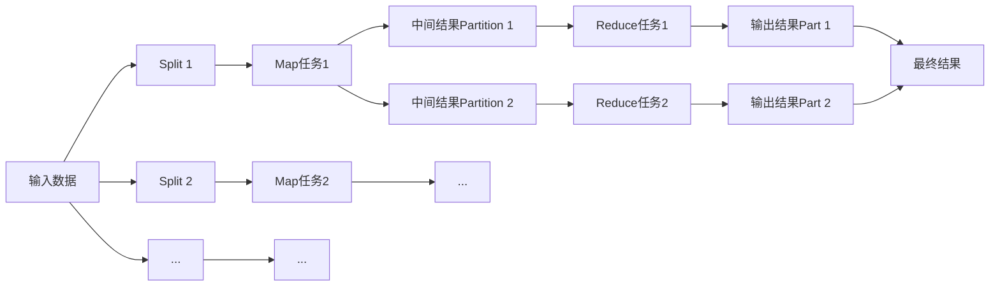

# 【AI大数据计算原理与代码实例讲解】批处理

## 一、背景介绍

### 1.1 大数据时代的计算挑战

在当今大数据时代,海量数据的存储和处理给传统的计算模式带来了巨大挑战。数据量的爆炸式增长使得单机处理变得力不从心,亟需一种新的计算模式来应对。

### 1.2 批处理的定义

批处理(Batch Processing)是一种高效处理海量数据的计算模式。它将大量的数据划分成一批一批进行处理,充分利用计算资源,避免频繁的IO操作,从而大大提高计算效率。

### 1.3 批处理的应用场景

批处理被广泛应用于大数据处理的各个领域,如日志分析、用户行为分析、推荐系统、机器学习等。每天产生的海量数据都需要通过批处理来进行清洗、转换和分析。

## 二、核心概念与联系

### 2.1 作业(Job)

在批处理中,一个完整的计算任务被称为一个作业(Job)。一个作业通常包含多个任务(Task),每个任务处理一部分数据。

### 2.2 任务(Task) 

任务是批处理的基本单位。一个任务处理一部分数据,多个任务并行执行,共同完成一个作业。任务之间相互独立,可以在不同的机器上执行。

### 2.3 数据切分

为了实现并行计算,需要将大规模数据切分成小份,每一份由一个任务来处理。数据切分是批处理的关键,好的切分策略可以充分发挥集群的并行计算能力。

### 2.4 任务调度

批处理通过任务调度来协调任务的执行。调度器根据任务之间的依赖关系和集群资源情况,合理地分配任务,尽可能提高集群的利用率和作业的执行效率。

### 2.5 容错机制

批处理必须能够容忍一定的失败。当某个任务失败时,框架要能够重新调度该任务,直到该任务成功完成。常见的容错机制有数据备份、任务重试等。

### 2.6 核心概念联系

下面用一张Mermaid流程图来展示批处理的核心概念之间的联系:


从图中可以看出,批处理首先将大规模数据切分,生成多个任务,任务组成作业。然后通过任务调度执行任务,并通过容错机制保证任务的正确执行。最后将任务的结果合并,得到最终的计算结果。

## 三、核心算法原理具体操作步骤

### 3.1 MapReduce

MapReduce是批处理的核心算法,由Map和Reduce两个阶段组成。

#### 3.1.1 Map阶段

1. 输入数据被切分成多个Split,每个Split由一个Map任务处理。
2. 对于每个Split,Map任务将其转化为key-value对的形式。
3. Map任务对每个key-value对执行用户定义的map函数,生成一系列中间key-value对。
4. 将中间结果按key进行分区,每个分区对应一个Reduce任务。

#### 3.1.2 Reduce阶段

1. 将Map阶段的输出按key进行归并,将相同key的value聚合在一起。
2. Reduce任务对每个key及其对应的一组value执行用户定义的reduce函数,生成最终的结果key-value对。
3. 将所有Reduce任务的输出合并,得到最终结果。

### 3.2 数据流

批处理的数据流可以用下面的Mermaid图来表示:



## 四、数学模型和公式详细讲解举例说明

### 4.1 词频统计

词频统计是一个经典的批处理问题,下面我们用数学语言来描述该问题。

设输入数据为一个文档集合$D=\{d_1,d_2,...,d_n\}$,每个文档$d_i$是一个单词序列$d_i=\{w_1,w_2,...,w_m\}$。词频统计的目标是计算每个单词$w$在文档集合$D$中出现的次数$count(w)$。

#### 4.1.1 Map阶段

对于每个文档$d_i$,Map任务将其转化为一系列键值对$\langle w, 1 \rangle$,表示单词$w$在文档$d_i$中出现了1次。

$$map(d_i) = \{\langle w_1, 1 \rangle, \langle w_2, 1 \rangle, ..., \langle w_m, 1 \rangle\}$$

#### 4.1.2 Reduce阶段

Reduce任务将Map阶段输出的键值对按单词$w$进行归并,对于每个单词$w$,将其对应的计数值累加,得到该单词的总频次$count(w)$。

$$reduce(\langle w, \{c_1, c_2, ..., c_k\} \rangle) = \langle w, \sum_{i=1}^k c_i \rangle$$

其中$c_1, c_2, ..., c_k$是单词$w$在不同文档中出现的次数。

### 4.2 矩阵乘法

矩阵乘法也可以用MapReduce来实现。设两个矩阵$A$和$B$,其中$A$是一个$m \times n$的矩阵,$B$是一个$n \times p$的矩阵,要计算矩阵$C=A \times B$。

#### 4.2.1 Map阶段

将矩阵$A$按行切分,将矩阵$B$按列切分。对于矩阵$A$的每一个元素$a_{ij}$,输出键值对$\langle (i,k), a_{ij} \rangle$,其中$k=1,2,...,p$。对于矩阵$B$的每一个元素$b_{jk}$,输出键值对$\langle (i,k), b_{jk} \rangle$,其中$i=1,2,...,m$。

$$map(a_{ij}) = \{\langle (i,1), a_{ij} \rangle, \langle (i,2), a_{ij} \rangle, ..., \langle (i,p), a_{ij} \rangle\}$$
$$map(b_{jk}) = \{\langle (1,k), b_{jk} \rangle, \langle (2,k), b_{jk} \rangle, ..., \langle (m,k), b_{jk} \rangle\}$$

#### 4.2.2 Reduce阶段

对于每一个键$(i,k)$,Reduce任务接收一组值$\{a_{i1}, a_{i2}, ..., a_{in}, b_{1k}, b_{2k}, ..., b_{nk}\}$,计算$c_{ik} = \sum_{j=1}^n a_{ij} \times b_{jk}$。

$$reduce(\langle (i,k), \{a_{i1}, a_{i2}, ..., a_{in}, b_{1k}, b_{2k}, ..., b_{nk}\} \rangle) = \langle (i,k), \sum_{j=1}^n a_{ij} \times b_{jk} \rangle$$

## 五、项目实践：代码实例和详细解释说明

下面我们用Python实现一个简单的MapReduce词频统计。

### 5.1 Map函数

```python
def map_func(file_path):
    with open(file_path, 'r') as f:
        for line in f:
            words = line.strip().split()
            for word in words:
                yield (word, 1)
```

Map函数读取文件,对于每一行,将其分割成单词,然后输出键值对(word, 1),表示该单词出现了1次。

### 5.2 Reduce函数

```python
def reduce_func(word, counts):
    yield (word, sum(counts))
```

Reduce函数接收一个单词和一个计数器列表,将计数器列表中的值累加,得到该单词的总频次。

### 5.3 主程序

```python
import multiprocessing

def word_count(file_pattern):
    # 读取所有文件
    file_names = glob.glob(file_pattern)
    
    # 创建进程池
    pool = multiprocessing.Pool()
    
    # Map阶段
    map_results = []
    for file_name in file_names:
        map_results.append(pool.apply_async(map_func, (file_name,)))
    
    # 关闭进程池,等待所有任务完成
    pool.close()
    pool.join()
    
    # 合并Map阶段的结果
    word_counts = {}
    for result in map_results:
        for word, count in result.get():
            if word not in word_counts:
                word_counts[word] = []
            word_counts[word].append(count)
    
    # Reduce阶段
    reduce_results = []
    for word, counts in word_counts.items():
        reduce_results.append(pool.apply_async(reduce_func, (word, counts)))
    
    # 关闭进程池,等待所有任务完成  
    pool.close()
    pool.join()
    
    # 合并Reduce阶段的结果
    final_result = {}
    for result in reduce_results:
        for word, count in result.get():
            final_result[word] = count
    
    return final_result

if __name__ == '__main__':
    result = word_count('*.txt')
    print(result)
```

主程序首先读取所有的输入文件,然后创建一个进程池。在Map阶段,对每个文件启动一个Map任务,将结果存储在map_results中。然后合并Map阶段的结果,将相同单词的计数器放在一起。在Reduce阶段,对每个单词启动一个Reduce任务,将结果存储在reduce_results中。最后合并Reduce阶段的结果,得到每个单词的总频次。

## 六、实际应用场景

批处理在实际中有非常广泛的应用,下面列举几个典型的应用场景。

### 6.1 日志分析

互联网公司每天会产生海量的日志数据,如用户访问日志、应用程序日志等。通过批处理可以对这些日志进行清洗、转换和分析,从中挖掘出有价值的信息,如用户行为模式、异常事件等。

### 6.2 用户行为分析

电商网站、社交网络每天会收集大量的用户行为数据,如浏览、点击、购买等。通过批处理可以对这些数据进行深入分析,发现用户的兴趣偏好,进而提供个性化的推荐和服务。

### 6.3 数据仓库

企业通常会将来自不同业务系统的数据汇总到数据仓库中,以支持数据分析和决策。数据仓库的数据通常是通过批处理生成的,如每天夜里进行数据ETL(抽取、转换、加载)。

### 6.4 机器学习

机器学习算法通常需要在大规模数据集上进行训练。批处理可以将训练数据分布到多个节点上并行处理,从而大大加快模型的训练速度。

## 七、工具和资源推荐

下面推荐一些常用的批处理工具和学习资源。

### 7.1 Hadoop

Hadoop是最著名的批处理框架,包括HDFS分布式文件系统和MapReduce计算框架。Hadoop支持在大规模集群上进行数据存储和计算,是大数据处理的事实标准。

### 7.2 Spark

Spark是一个基于内存的快速通用计算引擎,除了支持批处理,还支持交互式查询、实时流处理、机器学习等。Spark提供了比MapReduce更高级的API,使得编写批处理程序更加简单。

### 7.3 Flink

Flink是一个分布式流批一体化的计算框架。Flink以流为核心,同时支持批处理,擅长处理无界和有界数据集。Flink提供了丰富的时间语义和窗口操作,适合实时数据处理。

### 7.4 学习资源

- 《Hadoop权威指南》:系统讲解Hadoop原理和使用方法,适合Hadoop初学者。
- 《Spark快速大数据分析》:全面介绍Spark各个组件的原理和使用,适合Spark初学者。
- Coursera上的《大数据专项课程》:由加州大学圣地亚哥分校开设,系统讲解大数据处理的