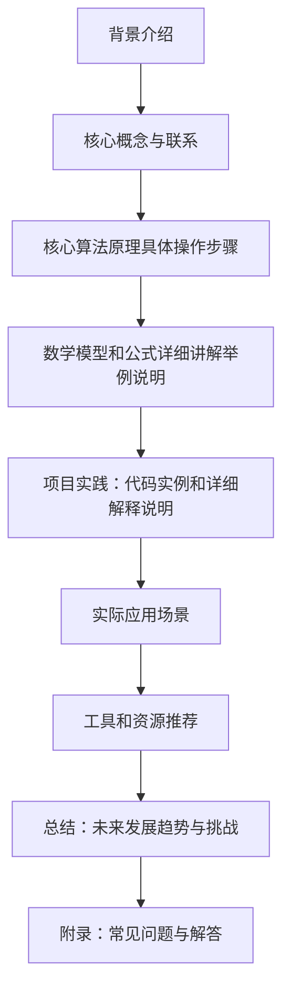

## 1. 背景介绍

随着人工智能（AI）技术的不断发展，大数据计算在各个领域得到了广泛的应用。数据治理是大数据计算中一个重要的环节，它涉及到数据收集、清洗、存储、分析等方面。在本篇博客中，我们将深入探讨数据治理的核心概念、原理、算法以及实际应用场景。

## 2. 核心概念与联系

数据治理是一种系统化地管理和维护数据资源的方法，其目的是提高数据质量，实现数据驱动决策。数据治理包括以下几个关键概念：

- 数据收集：从各种来源获取数据，如网站、社交媒体、设备传感器等。
- 数据清洗：处理和修复数据中的错误、缺失或不完整的信息，以提高数据质量。
- 数据存储：将清洗后的数据存储在数据库或数据仓库中，以便后续分析和挖掘。
- 数据分析：利用统计学、机器学习等技术对数据进行深入分析，提取有价值的信息和洞察。

这些概念之间相互关联，共同构成了数据治理的完整生命周期。

## 3. 核心算法原理具体操作步骤

数据治理过程中涉及到多种算法和原理，这里我们以数据清洗为例子，介绍其核心算法原理及其具体操作步骤。

### 3.1 数据清洗原理

数据清洗的主要目标是去除数据中的噪声和误差，以提高数据质量。常见的数据清洗方法包括：

- 缺失值处理：填充或删除缺失值；
- 噪声过滤：消除数据中的噪声，如随机波动、异常值等；
- 数据类型转换：将原始数据转换为统一的数据类型，如字符串、数字、日期等；
- 数据格式化：规范化数据结构，例如统一字段名称、数据顺序等。

### 3.2 数据清洗操作步骤

数据清洗的具体操作步骤如下：

1. 数据加载：从各种来源加载原始数据。
2. 数据探索：对数据进行初步了解，找出可能存在的问题，如缺失值、异常值等。
3. 数据预处理：根据问题类型选择合适的清洗方法，对数据进行预处理。
4. 数据验证：对清洗后的数据进行验证，确保数据质量得到提高。
5. 数据输出：将清洗好的数据存储在数据库或数据仓库中，以备后续分析使用。

## 4. 数学模型和公式详细讲解举例说明

在本节中，我们将介绍数据治理过程中的数学模型和公式，并通过实例进行详细讲解。

### 4.1 数据收集数学模型

数据收集过程中可以采用采样法（Sampling）来获取代表性数据。采样法的基本思想是从总体中抽取一定数量的样本，以便得出总体的统计特征。常用的采样方法有简单随机采样（Simple Random Sampling）、系统均匀随机采样（Systematic Random Sampling）等。

### 4.2 数据清洗公式

在数据清洗过程中，可以使用线性回归（Linear Regression）来处理缺失值。线性回归是一种最简单的预测模型，它假设关系之间存在线性关系。其基本形式为：

$$
y = \\beta_0 + \\beta_1x_1 + \\beta_2x_2 +... + \\beta_nx_n + \\epsilon
$$

其中，$y$表示目标变量，$\\beta_0$是截距，$\\beta_i$是系数，$x_i$是自变量，$\\epsilon$是误差项。

## 5. 项目实践：代码实例和详细解释说明

在本节中，我们将通过一个实际项目案例，展示如何进行数据治理。我们将使用Python编程语言和Pandas库对CSV格式的数据文件进行清洗。

### 5.1 数据加载与探索

首先，我们需要从CSV文件中加载数据，并对数据进行初步了解。

```python
import pandas as pd

# 加载数据
data = pd.read_csv('data.csv')

# 数据探索
print(data.head())
```

### 5.2 缺失值处理

接下来，我们需要处理数据中的缺失值。这里我们采用了线性回归法来填充缺失值。

```python
from sklearn.linear_model import LinearRegression

# 分离特征和目标变量
X = data.drop(columns=['target'])
y = data['target']

# 创建线性回归模型
model = LinearRegression()

# 训练模型
model.fit(X, y)

# 预测缺失值
predicted_values = model.predict(X)

# 填充缺失值
data.fillna(predicted_values, inplace=True)
```

## 6. 实际应用场景

数据治理在各个行业领域都有广泛的应用，以下是一些典型的应用场景：

- 电商：通过数据治理提高产品推荐系统的准确性，从而提升用户体验和购物转化率。
- 医疗：利用数据治理技术对电子病历进行清洗和分析，以便更好地了解患者健康状况。
- 金融：通过数据治理实现风险管理、信用评估等功能，提高金融服务质量。

## 7. 工具和资源推荐

对于想要学习和实践数据治理技术的人们，我们推荐以下工具和资源：

- Python编程语言：Python是数据治理领域的热门选择，因为它拥有丰富的数据处理库，如Pandas、NumPy等。
- Scikit-learn库：Scikit-learn是一个强大的机器学习库，可以帮助我们实现各种算法，如线性回归、随机森林等。
- 数据治理最佳实践指南：《数据治理：最佳实践与解决方案》一书提供了大量关于数据治理的实践经验和建议。

## 8. 总结：未来发展趋势与挑战

数据治理在大数据计算领域具有重要意义，它为人工智能和数据驱动决策提供了坚实的基础。随着数据量的不断增长，数据治理将面临更大的挑战。未来的发展趋势包括：

- 更高效的数据收集方法：随着数据源的多样化，如何实现更高效的数据收集成为一个重要问题。
- 更复杂的数据清洗技术：随着数据类型的多样化，数据清洗技术需要更加复杂和灵活。
- 更强大的分析能力：未来的人工智能系统需要具备更强大的分析能力，以便从海量数据中挖掘有价值的信息。

## 9. 附录：常见问题与解答

在本篇博客中，我们主要探讨了数据治理的核心概念、原理、算法以及实际应用场景。如果您对数据治理还有其他疑问，请参考以下常见问题与解答：

Q1：什么是数据治理？

A1：数据治理是一种系统化地管理和维护数据资源的方法，其目的是提高数据质量，实现数据驱动决策。数据治理包括数据收集、数据清洗、数据存储、数据分析等环节。

Q2：数据治理有什么好处？

A2：数据治理可以帮助我们提高数据质量，从而实现数据驱动决策。通过数据治理，我们可以消除数据中的噪声和误差，提高分析结果的准确性和可靠性。

Q3：数据治理需要哪些技能？

A3：数据治理涉及多个领域，如编程、统计学、机器学习等。因此，掌握数据治理技术需要具备一定的编程能力，以及对统计学和机器学习等相关知识的了解。

以上就是本篇博客关于【AI大数据计算原理与代码实例讲解】数据治理的全部内容。在此希望大家能够从中获益，并在实际项目中运用所学知识，为人工智能和数据驱动决策做出贡献。

作者：禅与计算机程序设计艺术 / Zen and the Art of Computer Programming

---

**Mermaid 流程图**


