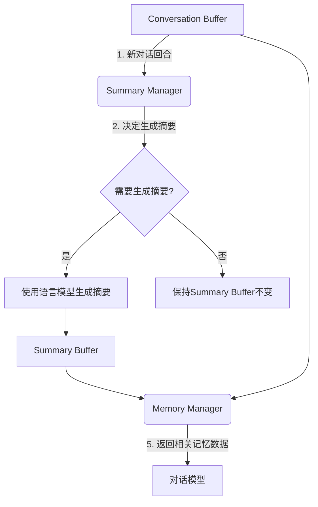

# 【LangChain编程：从入门到实践】ConversationSummaryMemory

## 1.背景介绍

在现代对话式人工智能系统中,记忆组件扮演着关键角色。它允许系统跟踪和记住过去的对话上下文,从而提供更加连贯、相关和个性化的响应。LangChain是一个强大的Python库,旨在构建可扩展和可组合的应用程序,包括对话式AI系统。其中,ConversationSummaryMemory是一种内存实现,专门用于管理对话历史记录和生成对话摘要。

### 1.1 为什么需要对话记忆?

对话式AI系统需要能够理解和回应用户的查询,同时考虑到之前的对话上下文。例如,如果用户问"它的价格是多少?"系统需要知道"它"指的是什么,才能给出正确的答复。通过存储和分析过去的对话,系统可以更好地理解用户的意图,并提供更加相关和连贯的响应。

### 1.2 传统方法的局限性

传统的对话记忆方法通常依赖于存储整个对话历史记录,然后在需要时进行搜索和分析。这种方法在处理大量对话时会变得低效和耗费资源。另一种方法是只存储最近的几个对话回合,但这可能导致上下文丢失,影响响应质量。

## 2.核心概念与联系

### 2.1 ConversationSummaryMemory概念

ConversationSummaryMemory是LangChain中用于管理对话记忆的一种内存实现。它的核心思想是,通过定期生成对话摘要,来压缩和总结对话历史记录的关键信息。这种方法可以在保持上下文相关性的同时,减少存储和处理的开销。

ConversationSummaryMemory由以下几个主要组件组成:

- **Conversation Buffer**: 用于存储最近的对话回合。
- **Summary Buffer**: 用于存储生成的对话摘要。
- **Summary Manager**: 负责决定何时生成新的摘要,以及如何合并新的对话和现有摘要。
- **Memory Manager**: 管理对话缓冲区和摘要缓冲区,并在需要时返回相关的记忆数据。

### 2.2 ConversationSummaryMemory工作流程

ConversationSummaryMemory的工作流程如下:

1. 新的对话回合被添加到Conversation Buffer中。
2. Summary Manager根据预定义的策略(如每隔几个回合生成一次摘要)决定是否需要生成新的摘要。
3. 如果需要生成新的摘要,Summary Manager将使用语言模型(如GPT)对Conversation Buffer中的对话进行总结,生成一个新的摘要。
4. 新生成的摘要将与Summary Buffer中的现有摘要合并。
5. Memory Manager在需要时返回Conversation Buffer和Summary Buffer中的相关记忆数据,供对话模型使用。

该过程的关键在于,通过定期生成对话摘要,系统可以保持对话上下文的相关性,同时避免存储和处理整个对话历史记录,从而提高效率和可扩展性。



## 3.核心算法原理具体操作步骤

ConversationSummaryMemory的核心算法原理包括以下几个关键步骤:

### 3.1 对话缓冲区管理

对话缓冲区(Conversation Buffer)用于存储最近的对话回合。它通常是一个有限长度的队列,当达到最大长度时,最早的对话回合将被移除。这样可以确保只保留最相关的对话上下文。

具体操作步骤如下:

1. 初始化一个空队列作为对话缓冲区。
2. 每当有新的对话回合时,将其添加到队列末尾。
3. 如果队列长度超过预设的最大长度,则移除队列最前面的对话回合。

### 3.2 摘要生成策略

摘要生成策略决定了何时生成新的对话摘要。常见的策略包括:

- **固定间隔策略**: 每隔一定数量的对话回合生成一次摘要。
- **上下文长度策略**: 当对话缓冲区长度达到一定阈值时生成摘要。
- **主题变化策略**: 当对话主题发生显著变化时生成新的摘要。

无论采用何种策略,都需要在摘要生成频率和上下文保留之间进行权衡。频繁生成摘要可以保留更多上下文,但也会增加计算开销。

### 3.3 摘要生成

当决定生成新的摘要时,Summary Manager将使用语言模型(如GPT)对对话缓冲区中的对话进行总结,生成一个新的摘要。

具体操作步骤如下:

1. 将对话缓冲区中的所有对话回合连接成一个字符串。
2. 使用语言模型(如GPT)对该字符串进行摘要,生成一个新的摘要字符串。
3. 将新生成的摘要添加到摘要缓冲区(Summary Buffer)中。

在生成摘要时,可以设置一些参数来控制摘要的长度、详细程度等。例如,可以限制摘要的最大长度,或者指定只摘要对话的某些部分(如问题或回答)。

### 3.4 摘要合并

当生成新的摘要时,需要将其与现有的摘要缓冲区进行合并。这个过程需要权衡新旧摘要的相关性和重要性。

具体操作步骤如下:

1. 从摘要缓冲区中获取所有现有的摘要。
2. 将新生成的摘要与现有摘要连接成一个字符串。
3. 使用语言模型对该字符串进行再次摘要,生成一个新的合并摘要。
4. 用新的合并摘要替换摘要缓冲区中的所有现有摘要。

在合并过程中,可以设置一些参数来控制合并后摘要的长度、详细程度等。例如,可以限制合并摘要的最大长度,或者指定只保留最近的几个摘要。

### 3.5 记忆数据检索

当对话模型需要访问记忆数据时,Memory Manager将从对话缓冲区和摘要缓冲区中检索相关的数据。

具体操作步骤如下:

1. 从对话缓冲区中获取最近的对话回合。
2. 从摘要缓冲区中获取所有现有的摘要。
3. 将对话回合和摘要连接成一个字符串,作为记忆数据返回给对话模型。

在检索记忆数据时,可以设置一些参数来控制返回的数据量和格式。例如,可以限制返回的对话回合数量,或者指定只返回摘要而不返回完整的对话回合。

## 4.数学模型和公式详细讲解举例说明

虽然ConversationSummaryMemory主要是一种基于规则和策略的算法,但在某些情况下,可以使用数学模型来优化其性能和效率。

### 4.1 对话缓冲区长度优化

对话缓冲区的长度直接影响了记忆的上下文范围和计算开销。过长的缓冲区可能导致不必要的计算开销,而过短的缓冲区可能导致上下文丢失。

我们可以使用一种基于信息熵的方法来确定最优的对话缓冲区长度。信息熵是一种衡量信息不确定性的度量,定义如下:

$$H(X) = -\sum_{i=1}^{n} P(x_i) \log_2 P(x_i)$$

其中,X是一个离散随机变量,取值为$x_1, x_2, ..., x_n$,且$P(x_i)$是$x_i$出现的概率。

在对话缓冲区的上下文中,我们可以将每个对话回合视为一个事件,计算不同长度缓冲区的信息熵。理想情况下,我们希望选择一个长度,使得信息熵最大化,即包含最多的上下文信息。

具体步骤如下:

1. 对于每个可能的缓冲区长度L,从对话历史记录中抽取长度为L的对话片段。
2. 计算每个片段中每个回合出现的概率$P(x_i)$。
3. 使用上述公式计算该长度L对应的信息熵$H(L)$。
4. 选择使$H(L)$最大化的L作为最优缓冲区长度。

通过这种方法,我们可以在保留足够上下文信息的同时,避免过长的缓冲区带来的计算开销。

### 4.2 摘要长度优化

与对话缓冲区长度类似,摘要长度也需要进行优化,以在保留关键信息和控制计算开销之间取得平衡。

我们可以使用一种基于最大熵原理的方法来确定最优的摘要长度。最大熵原理是一种在给定约束条件下选择概率分布的方法,它试图最大化熵,即不确定性或随机性。

在摘要长度优化的情况下,我们可以将摘要长度视为一个随机变量,并设置一些约束条件,如:

- 摘要长度必须在一定范围内。
- 摘要必须包含某些关键词或主题。
- 摘要必须满足一定的可读性或连贯性要求。

然后,我们可以使用最大熵原理找到满足这些约束条件的最优摘要长度分布。具体步骤如下:

1. 定义约束条件,如长度范围、关键词、可读性等。
2. 构建一个包含所有可能摘要长度的分布$P(L)$。
3. 使用拉格朗日乘数法,在给定约束条件下最大化熵$H(P) = -\sum_L P(L) \log P(L)$。
4. 求解得到最优的摘要长度分布$P^*(L)$。
5. 从$P^*(L)$中选择最可能的长度作为最优摘要长度。

通过这种方法,我们可以在满足各种约束条件的同时,找到最优的摘要长度,从而提高摘要的信息量和质量。

## 5.项目实践:代码实例和详细解释说明

以下是一个使用LangChain中ConversationSummaryMemory的示例代码,包括详细的注释解释:

```python
from langchain import ConversationSummaryMemory, ConversationSummaryBufferMemory
from langchain.llms import OpenAI

# 初始化OpenAI语言模型
llm = OpenAI(temperature=0)

# 创建对话缓冲区内存
conversation_memory = ConversationSummaryBufferMemory(llm=llm, max_token_limit=2000)

# 创建ConversationSummaryMemory
summary_memory = ConversationSummaryMemory(llm=llm, memory=conversation_memory)

# 添加一些对话回合
summary_memory.save_context({"input": "你好,我是Alice"}, {"output": "你好Alice,很高兴认识你!"})
summary_memory.save_context({"input": "我想预订一张从纽约到旧金山的机票"}, {"output": "好的,请告诉我出发日期和时间"})
summary_memory.save_context({"input": "我想预订6月15日上午10点的航班"}, {"output": "好的,我会为你查找可用的航班"})

# 获取当前记忆数据
memory = summary_memory.load_memory_variables({})
print(memory)

# 输出:
# Human: 你好,我是Alice
# AI: 你好Alice,很高兴认识你!
# Human: 我想预订一张从纽约到旧金山的机票
# AI: 好的,请告诉我出发日期和时间
# Human: 我想预订6月15日上午10点的航班
# AI: 好的,我会为你查找可用的航班

# 生成摘要
summary_memory.summarize_current_memory()

# 获取摘要
memory = summary_memory.load_memory_variables({})
print(memory)

# 输出:
# Alice想预订一张从纽约到旧金山的机票,出发日期为6月15日上午10点。我需要为她查找可用的航班。
```

代码解释:

1. 首先,我们导入必要的模块和类,包括`ConversationSummaryMemory`、`ConversationSummaryBufferMemory`和OpenAI语言模型。

2. 创建