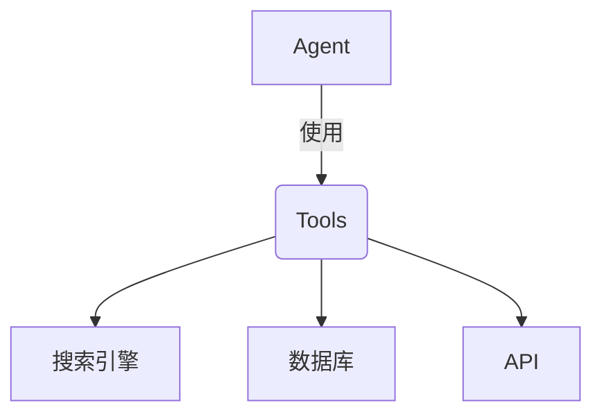
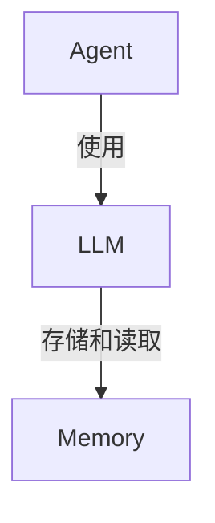
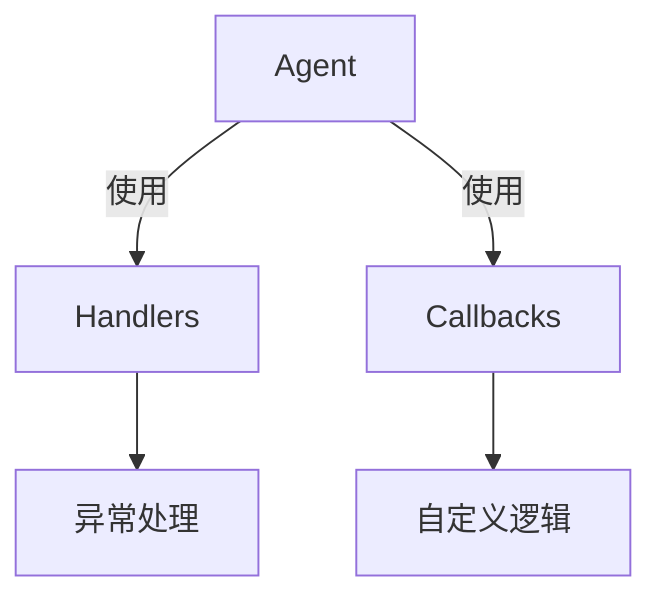
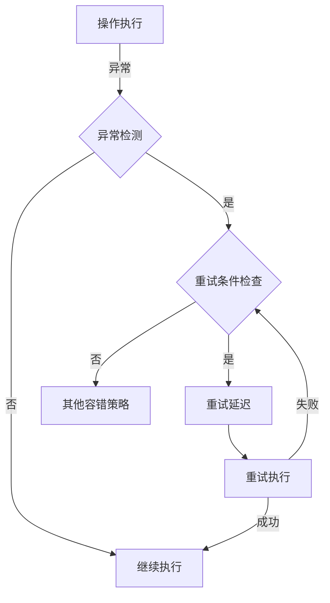
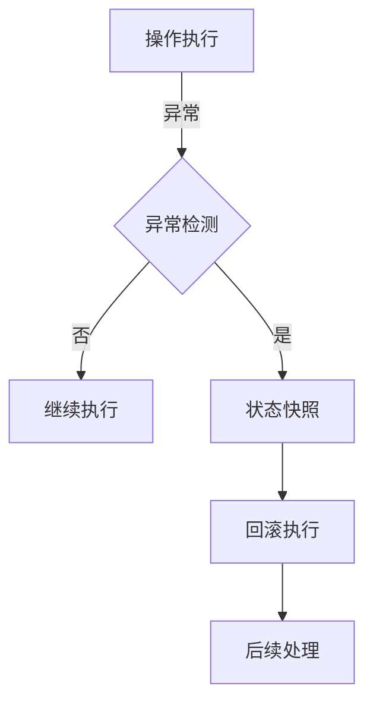
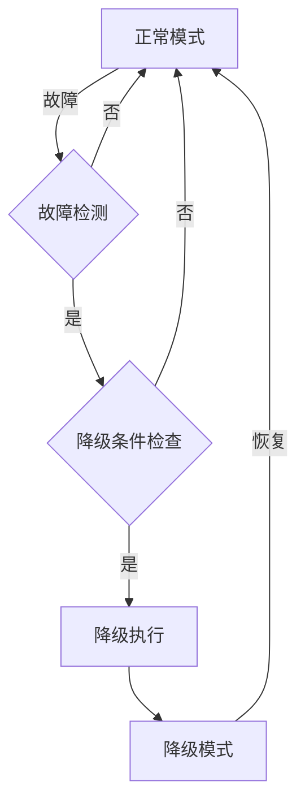

# 【LangChain编程：从入门到实践】容错机制

## 1.背景介绍

在现代软件开发中,容错机制扮演着至关重要的角色。随着系统复杂性的不断增加,确保应用程序的健壮性和可靠性变得更加困难。即使是最精心设计的系统也可能遇到意外情况或异常,这可能导致应用程序崩溃或数据损坏。因此,实现有效的容错机制对于保护系统免受故障影响、提高用户体验和维护系统的完整性至关重要。

LangChain是一个强大的Python库,旨在构建可扩展和健壮的应用程序。它提供了一系列工具和组件,使开发人员能够轻松地集成各种语言模型、知识库和其他数据源。LangChain还包含了一套全面的容错机制,帮助开发人员处理各种异常情况,确保应用程序的稳定性和可靠性。

### 1.1 什么是容错机制?

容错机制是指在软件系统中采取的一系列措施,旨在预防、检测和恢复系统故障或异常情况。这些措施可以包括:

- 错误检测和报告
- 故障隔离和恢复
- 重试和回滚机制
- 优雅降级和故障转移
- 监控和警报系统

通过实现适当的容错机制,应用程序可以在遇到异常情况时保持运行,减少数据丢失和系统停机时间,从而提高整体可用性和用户体验。

### 1.2 为什么需要容错机制?

在现实世界中,各种意外情况和异常都可能发生,例如:

- 网络中断或延迟
- 第三方服务或API故障
- 硬件故障或资源不足
- 软件bug或逻辑错误
- 用户输入错误或恶意攻击

如果没有适当的容错机制,这些异常情况可能会导致应用程序崩溃、数据损坏或其他严重后果。因此,实现健壮的容错机制对于确保系统的可靠性和稳定性至关重要。

## 2.核心概念与联系

在探讨LangChain的容错机制之前,让我们先了解一些核心概念和它们之间的关系。

### 2.1 Agents和Tools

LangChain中的Agents是指能够执行特定任务的智能代理。它们可以利用各种Tools(工具)来完成任务,例如搜索引擎、数据库、API等。Agents根据任务的需求,选择并协调使用适当的Tools来完成工作。

### 2.2 LLM和Memory

LangChain中的LLM(大型语言模型)是指用于自然语言处理的人工智能模型,例如GPT-3、BERT等。这些模型可以理解和生成人类可读的文本,并被用于各种任务,如问答、文本生成、文本摘要等。

Memory是LangChain中用于存储和管理对话历史、上下文信息和其他相关数据的组件。它可以帮助LLM保持对话的连贯性和一致性,并提供必要的背景知识。

### 2.3 Chains和SequentialChain

Chain是LangChain中的一个重要概念,它表示一系列步骤或操作的序列,用于完成特定的任务。每个步骤可以是一个LLM、Agent或其他组件。

SequentialChain是一种特殊的Chain,它按顺序执行一系列步骤,每个步骤的输出将作为下一步骤的输入。这种链式结构使得复杂任务可以被分解为多个较小的步骤,从而更容易管理和维护。

### 2.4 Handlers和Callbacks

Handlers和Callbacks是LangChain中用于处理异常情况和自定义行为的机制。

- Handlers用于捕获和处理特定类型的异常,例如网络错误、API超时等。它们可以执行重试、回滚或其他恢复操作。
- Callbacks则用于在特定事件发生时执行自定义逻辑,例如记录日志、发送通知等。

这些机制为LangChain提供了灵活的容错和扩展能力,使开发人员能够根据应用程序的具体需求进行定制。

## 3.核心算法原理具体操作步骤

LangChain的容错机制是基于一系列算法和原理构建的,包括重试、回滚、优雅降级等策略。让我们深入探讨其中的一些核心算法和操作步骤。

### 3.1 重试算法

重试算法是一种常见的容错策略,它在遇到特定类型的异常时,会自动重新尝试执行失败的操作。这种方法可以有效处理临时性故障,如网络中断或服务器过载等情况。

LangChain中的重试算法通常包括以下步骤:

1. **异常检测**: 首先,系统需要检测到特定类型的异常,例如网络错误、超时异常等。
2. **重试条件检查**: 系统会根据预定义的条件(如最大重试次数、重试间隔等)来决定是否进行重试。
3. **重试延迟**: 如果决定重试,系统会等待一段时间(通常是指数退避)后再次尝试执行操作。
4. **重试执行**: 重新执行失败的操作。
5. **成功或失败处理**: 如果操作成功,则继续执行后续步骤;如果仍然失败,则根据配置执行其他容错策略(如回滚或优雅降级)。

重试算法的关键在于合理配置重试次数、重试间隔等参数,以及选择适当的异常类型进行重试。过多的重试可能会浪费资源和时间,而过少的重试则可能无法有效处理临时性故障。

### 3.2 回滚算法

回滚算法是另一种常见的容错策略,它在操作失败时,将系统恢复到之前的已知良好状态。这种方法可以防止数据损坏或不一致,并确保系统的完整性。

LangChain中的回滚算法通常包括以下步骤:

1. **操作执行**: 执行某个操作或事务。
2. **状态快照**: 在操作开始前,记录系统的当前状态(如数据库快照、内存状态等)。
3. **异常检测**: 如果操作执行过程中发生异常,则进入回滚流程。
4. **回滚执行**: 使用之前记录的状态快照,将系统恢复到操作开始前的良好状态。
5. **后续处理**: 根据需要执行其他容错策略(如重试或优雅降级)或记录日志。

回滚算法的关键在于确保状态快照的准确性和完整性,以及正确地执行回滚操作。在一些情况下,回滚可能会导致数据丢失或不一致,因此需要权衡利弊并采取适当的措施(如日志记录、手动干预等)。

### 3.3 优雅降级算法

优雅降级算法是一种容错策略,它在系统出现故障或资源不足时,会将系统切换到一种降级模式,提供有限但可用的服务。这种方法可以确保系统的部分功能仍然可用,从而提高整体可用性和用户体验。

LangChain中的优雅降级算法通常包括以下步骤:

1. **故障检测**: 监控系统的健康状态,检测故障或资源不足的情况。
2. **降级条件检查**: 根据预定义的条件(如故障类型、资源利用率等)决定是否需要进行降级。
3. **降级执行**: 切换到降级模式,禁用或限制某些非关键功能,释放资源用于维护核心服务。
4. **监控和恢复**: 持续监控系统状态,一旦故障解决或资源充足,则恢复到正常模式。

优雅降级算法的关键在于正确识别系统的关键功能和非关键功能,以及合理配置降级条件和恢复条件。降级过多可能会严重影响用户体验,而降级不足则可能无法释放足够的资源来维护核心服务。

## 4.数学模型和公式详细讲解举例说明

在容错机制中,一些数学模型和公式可以帮助我们更好地理解和优化相关算法。让我们来详细讲解其中的一些重要模型和公式。

### 4.1 指数退避重试

指数退避重试是一种常见的重试策略,它在每次重试之前都会exponentially增加等待时间。这种策略可以有效防止过于频繁的重试请求导致资源浪费或服务器过载。

指数退避重试的等待时间通常由以下公式计算:

$$
backoff = base \times growth^{attempt}
$$

其中:

- $backoff$ 是等待时间(以秒为单位)
- $base$ 是初始等待时间(通常为1秒)
- $growth$ 是指数增长因子(通常为2)
- $attempt$ 是重试次数(从0开始计数)

例如,如果 $base=1$ 且 $growth=2$,那么等待时间序列将是:

- 第1次重试: $backoff = 1 \times 2^0 = 1$ 秒
- 第2次重试: $backoff = 1 \times 2^1 = 2$ 秒
- 第3次重试: $backoff = 1 \times 2^2 = 4$ 秒
- 第4次重试: $backoff = 1 \times 2^3 = 8$ 秒
- ...

通常还会设置一个最大等待时间上限,以防止等待时间无限增长。

### 4.2 几何分布

在重试算法中,我们经常需要计算在给定的最大重试次数内成功的概率。这个问题可以使用几何分布来建模。

几何分布描述了在一系列独立的伯努利试验中,第一次成功出现所需的试验次数的概率分布。对于重试算法,每次重试可以看作是一次伯努利试验,成功概率为 $p$。

在最大重试次数为 $n$ 的情况下,第一次成功出现在第 $k$ 次重试的概率为:

$$
P(X=k) = p(1-p)^{k-1}, \quad k=1,2,\ldots,n
$$

其中 $X$ 是几何分布的随机变量,表示第一次成功出现所需的试验次数。

我们可以计算在最大重试次数 $n$ 内至少成功一次的概率:

$$
P(X \leq n) = 1 - (1-p)^n
$$

这个公式可以帮助我们选择合适的最大重试次数,以达到期望的成功概率。

例如,如果每次重试的成功概率为 $p=0.6$,那么在最大重试次数为 $n=3$ 时,至少成功一次的概率为:

$$
P(X \leq 3) = 1 - (1-0.6)^3 \approx 0.936
$$

而如果我们希望至少成功一次的概率达到 $0.99$,那么需要设置最大重试次数为:

$$
n = \left\lceil \frac{\log(1-0