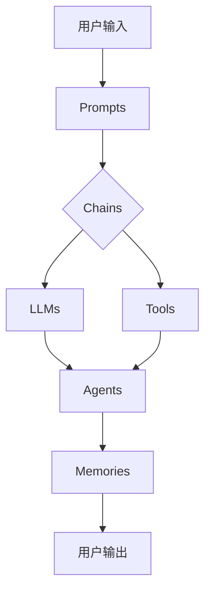

# 【LangChain编程：从入门到实践】方案优势

## 1. 背景介绍
### 1.1 人工智能与自然语言处理的发展
近年来,人工智能(AI)技术取得了突飞猛进的发展,尤其是在自然语言处理(NLP)领域。从早期的规则和统计方法,到如今基于深度学习的端到端模型,NLP技术正在不断突破,为人机交互带来革命性的变化。

### 1.2 大语言模型的兴起
随着计算能力的提升和训练数据的积累,以 Transformer 为代表的大语言模型(Large Language Models, LLMs)脱颖而出。GPT、BERT、T5 等模型在多项 NLP 任务上取得了超越人类的表现,展现出惊人的语言理解和生成能力。

### 1.3 LangChain 的诞生
尽管 LLMs 展现了巨大的潜力,但如何有效地应用它们来解决实际问题,仍然存在不小的挑战。这时,LangChain 应运而生。它是一个专为 LLMs 设计的编程框架,旨在帮助开发者更轻松地构建基于 LLMs 的应用程序。

## 2. 核心概念与联系
### 2.1 Prompts - 对话引导
Prompts 是 LangChain 的核心概念之一。它指的是我们提供给 LLMs 的输入文本,用于引导模型生成我们期望的输出。设计优质的 Prompts 是有效利用 LLMs 的关键。

### 2.2 Chains - 任务链
Chains 是由一系列 Prompts 和 LLMs 组成的任务流。它将复杂的任务分解为多个步骤,每个步骤由特定的 Prompt 和 LLM 负责,前一步的输出又成为下一步的输入,形成一个任务链。

### 2.3 Agents - 智能代理
Agents 是更高层次的抽象,它包含了决策逻辑,能够根据用户意图动态选择和执行合适的 Chains。Agents 让应用程序具备主动分析问题、制定计划并自主执行的能力。

### 2.4 Memories - 记忆机制
Memories 赋予了 LangChain 应用程序存储和利用历史对话信息的能力。通过将上下文信息维护在 Memories 中,应用程序可以进行多轮对话,从而提供更加个性化和连贯的用户体验。

### 2.5 Tools - 外部工具集成
LangChain 提供了与各种外部工具和服务集成的能力,如搜索引擎、数据库、API 等。这使得 LLMs 可以访问和利用外部知识,极大拓展了应用的可能性。

## 3. 核心架构与工作流程


LangChain 的工作流程如下:
1. 用户通过界面输入自然语言请求
2. 系统将用户输入转化为适当的 Prompts
3. Prompts 被发送到预先定义好的 Chains 中
4. Chains 调用底层的 LLMs 和集成的外部 Tools 进行处理
5. Agents 根据设定的逻辑动态选择和执行 Chains
6. Chains 的处理结果被保存到 Memories 中
7. 最终的结果通过用户界面返回给用户
8. 用户可以继续输入,开始新一轮的交互

## 4. 数学原理与算法解析
### 4.1 Transformer 架构
LangChain 中的 LLMs 大多基于 Transformer 架构。Transformer 是一种完全基于注意力机制的序列到序列模型,其核心是自注意力(Self-Attention)机制和前馈神经网络(Feed-Forward Networks)。

给定输入序列 $\mathbf{x}=(x_1,\dots,x_n)$,Transformer 的自注意力机制可以表示为:

$$
\begin{aligned}
\mathbf{Q} &= \mathbf{X}\mathbf{W}^Q \\
\mathbf{K} &= \mathbf{X}\mathbf{W}^K \\
\mathbf{V} &= \mathbf{X}\mathbf{W}^V \\
\text{Attention}(\mathbf{Q},\mathbf{K},\mathbf{V}) &= \text{softmax}(\frac{\mathbf{Q}\mathbf{K}^T}{\sqrt{d_k}})\mathbf{V}
\end{aligned}
$$

其中 $\mathbf{W}^Q, \mathbf{W}^K, \mathbf{W}^V$ 是可学习的参数矩阵,$d_k$ 是 $\mathbf{K}$ 的维度。

Transformer 中的前馈网络可以表示为:

$$
\text{FFN}(\mathbf{x}) = \max(0, \mathbf{x}\mathbf{W}_1 + \mathbf{b}_1)\mathbf{W}_2 + \mathbf{b}_2
$$

其中 $\mathbf{W}_1, \mathbf{W}_2$ 是权重矩阵,$\mathbf{b}_1, \mathbf{b}_2$ 是偏置向量。

### 4.2 文本嵌入算法
为了将文本转化为 LLMs 可以处理的数值表示,需要使用文本嵌入算法。常见的嵌入算法包括 Word2Vec、GloVe 和 BERT 等。

以 Word2Vec 为例,它通过最小化以下损失函数来学习单词嵌入:

$$
J(\theta) = -\frac{1}{T}\sum_{t=1}^{T}\sum_{-c \leq j \leq c, j \neq 0}\log p(w_{t+j}|w_t)
$$

其中 $w_t$ 是中心单词,$w_{t+j}$ 是上下文单词,$c$ 是窗口大小。

### 4.3 语言模型微调
为了让预训练的 LLMs 更好地适应特定任务,通常需要在目标任务的数据上对其进行微调(Fine-tuning)。微调过程本质上是通过反向传播算法优化模型参数,最小化任务特定的损失函数。

假设任务的训练集为 $\mathcal{D}=\{(\mathbf{x}_i, \mathbf{y}_i)\}_{i=1}^N$,其中 $\mathbf{x}_i$ 是输入序列,$\mathbf{y}_i$ 是对应的标签序列。语言模型的微调损失函数可以表示为:

$$
\mathcal{L}(\theta) = -\frac{1}{N}\sum_{i=1}^N \log p_{\theta}(\mathbf{y}_i|\mathbf{x}_i)
$$

其中 $\theta$ 是模型参数。通过梯度下降法最小化损失函数,可以得到适应任务的模型参数。

## 5. 实践案例：智能客服系统
下面我们以一个简单的智能客服系统为例,演示如何使用 LangChain 构建应用。

### 5.1 定义 Prompts
首先,我们需要定义一些基本的 Prompts,例如:

```python
welcome_prompt = PromptTemplate(
    input_variables=["name"],
    template="你好 {name},我是智能客服助手,很高兴为您服务。请问有什么可以帮您的吗?"
)

inquiry_prompt = PromptTemplate(
    input_variables=["product"],
    template="请问您对我们的 {product} 有什么疑问吗?"
)
```

### 5.2 创建 Chains
接下来,我们可以将 Prompts 组合成 Chains,例如:

```python
from langchain.chains import LLMChain
from langchain.llms import OpenAI

llm = OpenAI(temperature=0.9)

greeting_chain = LLMChain(
    llm=llm,
    prompt=welcome_prompt,
    output_key="greeting"
)

inquiry_chain = LLMChain(
    llm=llm,
    prompt=inquiry_prompt,
    output_key="inquiry" 
)
```

### 5.3 集成外部工具
我们可以将一些外部工具集成到系统中,例如:

```python
from langchain.agents import load_tools

tools = load_tools(["serpapi", "llm-math"], llm=llm)
```

这里我们加载了搜索引擎和数学计算工具。

### 5.4 定义 Agent
有了 Chains 和 Tools,我们可以定义一个 Agent 来协调它们:

```python
from langchain.agents import initialize_agent

agent = initialize_agent(
    tools, 
    llm, 
    agent="zero-shot-react-description", 
    verbose=True
)
```

### 5.5 运行系统
最后,我们可以运行这个智能客服系统:

```python
while True:
    user_input = input("用户: ")
    if user_input.lower() in ["bye", "再见"]:
        print("助手: 再见,感谢您的咨询,欢迎再次光临!")
        break
    
    result = agent.run(user_input)
    print(f"助手: {result}")
```

这样,一个基本的智能客服系统就完成了。当然,实际应用中还需要更多的 Prompts、Chains 和 Tools,以及更复杂的逻辑和更友好的界面。

## 6. 应用场景与案例分析
LangChain 的应用场景非常广泛,下面列举几个典型案例:

### 6.1 智能问答系统
利用 LangChain,可以构建领域专用的智能问答系统。例如,法律领域的问答系统可以帮助用户解答常见的法律问题;医疗领域的问答系统可以提供初步的诊断和建议。

### 6.2 文本生成与总结
LangChain 可以用于各种文本生成任务,如新闻写作、故事创作、广告文案生成等。同时,它还可以用于文本摘要,自动提取文章的关键信息。

### 6.3 代码生成与分析
LangChain 在代码生成和分析领域也有广阔的应用前景。例如,可以开发智能编程助手,根据用户的自然语言描述自动生成代码片段;也可以开发代码分析工具,自动检测代码中的错误和安全漏洞。

### 6.4 智能搜索与推荐
通过 LangChain,可以开发更加智能的搜索引擎和推荐系统。例如,当用户输入一个查询时,系统可以理解查询的意图,并从多个维度提供最相关的搜索结果;在推荐系统中,LangChain 可以根据用户的口味和偏好,生成个性化的推荐文本。

## 7. 开发工具与学习资源
### 7.1 LangChain 官方文档
LangChain 的官方文档是学习和使用该框架的首选资源。文档提供了详尽的教程、API 参考和最佳实践指南。

官方文档地址: https://docs.langchain.com/

### 7.2 LangChain GitHub 仓库
LangChain 的 GitHub 仓库包含了框架的完整源代码,以及大量的示例和模板。通过研究这些代码,可以更深入地理解 LangChain 的工作原理。

GitHub 仓库地址: https://github.com/hwchase17/langchain

### 7.3 社区论坛和博客
LangChain 拥有一个活跃的开发者社区。通过参与社区论坛的讨论,可以与其他开发者交流经验,获得帮助和启发。此外,很多开发者也会在个人博客上分享 LangChain 的使用心得。

### 7.4 相关课程和书籍
虽然专门针对 LangChain 的课程和书籍还比较少,但学习 NLP 和 LLMs 的相关课程和书籍对于掌握 LangChain 也有很大帮助。例如,斯坦福大学的 CS224n(自然语言处理)课程,以及《自然语言处理综论》一书等。

## 8. 总结与展望
### 8.1 LangChain 的优势
LangChain 是一个功能强大、灵活易用的语言模型编程框架。它的主要优势包括:

- 提供了一套统一的抽象和 API,大大简化了 LLMs 应用开发的流程。
- 支持多种主流的 LLMs,开发者可以自由选择和切换。
- 内置了丰富的 Prompts、Chains 和 Agents 等组件,可以快速组装出复杂的应用。
- 提供了与各种外部工具和服务的集成能力,扩展了 LLMs 的应用范围。
- 拥有活跃的开发者社区和详尽的官方文档,学习和使用都很方便。

### 8.2 LangChain