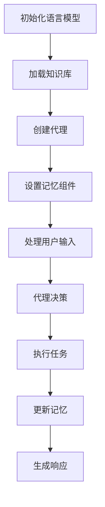

# 【LangChain编程：从入门到实践】构建记忆系统

## 1. 背景介绍

### 1.1 人工智能的发展

人工智能(AI)技术在过去几年里取得了长足的进步,尤其是在自然语言处理(NLP)和机器学习(ML)领域。随着计算能力的不断提升和海量数据的积累,AI系统能够处理和理解人类语言,并提供智能化的服务和解决方案。

### 1.2 记忆系统的重要性

在人工智能系统中,记忆系统扮演着至关重要的角色。它允许AI系统记住过去的交互和信息,从而提供更加连贯和个性化的体验。记忆系统使AI系统能够跟踪上下文,避免重复性的对话,并根据用户的偏好和历史记录提供更加相关的响应。

### 1.3 LangChain介绍

LangChain是一个强大的Python库,旨在构建具有记忆能力的AI应用程序。它提供了一套模块化的组件,使开发人员能够轻松地集成不同的语言模型、知识库和其他AI服务。LangChain的设计理念是将复杂的AI系统分解为可组合的链条,从而简化了开发过程。

## 2. 核心概念与联系

### 2.1 语言模型

语言模型是自然语言处理领域的核心技术之一。它通过分析大量的文本数据,学习语言的统计规律和语义关系。常见的语言模型包括GPT(Generative Pre-trained Transformer)、BERT(Bidirectional Encoder Representations from Transformers)等。

在LangChain中,语言模型扮演着关键的角色。它们用于理解用户的输入,生成相关的响应,并与其他组件(如知识库和代理)进行交互。

### 2.2 知识库

知识库是存储和管理结构化信息的系统。在LangChain中,知识库可以是各种形式的数据源,如文本文件、PDF文档、数据库等。知识库为语言模型提供了所需的背景知识和上下文信息,从而增强了AI系统的理解和响应能力。

### 2.3 代理

代理是LangChain中的一个重要概念。它充当了AI系统和外部世界之间的中介,负责协调不同组件的交互。代理可以根据用户的请求,调用适当的语言模型、知识库和其他服务,并将结果组合成最终的响应。

代理的设计旨在模拟人类的决策过程,使AI系统能够更加智能和灵活地处理复杂的任务。

### 2.4 记忆

记忆是LangChain中的核心特性之一。它允许AI系统记住过去的交互和上下文信息,从而提供更加连贯和个性化的体验。记忆可以存储在不同的介质中,如内存、文件或数据库。

通过记忆,AI系统可以跟踪对话的历史,避免重复性的响应,并根据用户的偏好和历史记录提供更加相关的建议和解决方案。

## 3. 核心算法原理具体操作步骤

LangChain的核心算法原理基于链式思维模式(Chain-of-Thought)。这种模式将复杂的任务分解为一系列较小的步骤,每个步骤都由特定的语言模型或代理来处理。这些步骤按照一定的顺序链接在一起,形成一个完整的解决方案。

以下是LangChain构建记忆系统的典型操作步骤:



1. **初始化语言模型**: 首先,需要选择并初始化一个适当的语言模型,如GPT或BERT。这个语言模型将用于理解用户的输入和生成响应。

2. **加载知识库**: 根据应用程序的需求,从不同的数据源(如文本文件、PDF文档或数据库)加载相关的知识库。这些知识库为语言模型提供了所需的背景知识和上下文信息。

3. **创建代理**: 创建一个代理,作为AI系统和外部世界之间的中介。代理负责协调不同组件的交互,并根据用户的请求调用适当的语言模型、知识库和其他服务。

4. **设置记忆组件**: 配置记忆组件,以便AI系统能够记住过去的交互和上下文信息。记忆可以存储在内存、文件或数据库中。

5. **处理用户输入**: 当用户提出请求或问题时,AI系统会接收并处理用户的输入。

6. **代理决策**: 代理根据用户的输入和当前的上下文信息,决定需要调用哪些语言模型、知识库或其他服务来处理该请求。

7. **执行任务**: 根据代理的决策,调用相应的组件执行任务。这可能涉及查询知识库、调用语言模型生成响应或执行其他操作。

8. **更新记忆**: 将当前的交互和上下文信息存储在记忆组件中,以便后续的请求能够利用这些信息。

9. **生成响应**: 根据执行任务的结果,生成最终的响应,并将其返回给用户。

通过这种链式思维模式,LangChain能够灵活地组合不同的组件,构建出具有记忆能力的智能系统。每个步骤都可以根据需要进行定制和扩展,从而适应各种复杂的应用场景。

## 4. 数学模型和公式详细讲解举例说明

在LangChain中,数学模型和公式主要用于语言模型的训练和评估。常见的数学模型包括:

### 4.1 n-gram语言模型

n-gram语言模型是一种基于统计的模型,它根据前面的n-1个词来预测下一个词的概率。n-gram模型的数学表达式如下:

$$P(w_1, w_2, \ldots, w_n) = \prod_{i=1}^n P(w_i | w_1, \ldots, w_{i-1})$$

其中,$ P(w_1, w_2, \ldots, w_n) $表示整个句子的概率,$ P(w_i | w_1, \ldots, w_{i-1}) $表示在给定前面单词的情况下,第i个单词出现的条件概率。

通过计算不同长度的n-gram概率,并将它们组合起来,我们可以估计整个句子的概率。这种模型虽然简单,但在某些场景下仍然有效。

### 4.2 神经网络语言模型

随着深度学习技术的发展,神经网络语言模型(Neural Network Language Model, NNLM)成为了一种更加先进的模型。NNLM使用神经网络来学习单词之间的关系,并预测下一个单词的概率。

NNLM的核心思想是将单词表示为向量,并使用神经网络来捕捉单词之间的语义关系。给定一个句子$ (w_1, w_2, \ldots, w_n) $,NNLM的目标是最大化下一个单词$ w_{n+1} $的条件概率:

$$\max_{w_{n+1}} P(w_{n+1} | w_1, w_2, \ldots, w_n)$$

这个条件概率可以通过神经网络的输出层计算得到。

NNLM的优势在于它可以捕捉更加复杂的语言模式,并且具有更好的泛化能力。然而,训练NNLM需要大量的计算资源和数据。

### 4.3 Transformer语言模型

Transformer是一种革命性的神经网络架构,它在自然语言处理领域取得了巨大的成功。Transformer语言模型,如GPT和BERT,基于自注意力(Self-Attention)机制,能够有效地捕捉长距离的依赖关系。

Transformer语言模型的核心思想是将输入序列(如句子)映射为一系列向量表示,然后通过自注意力机制捕捉单词之间的关系。自注意力机制的数学表达式如下:

$$\text{Attention}(Q, K, V) = \text{softmax}\left(\frac{QK^T}{\sqrt{d_k}}\right)V$$

其中,$ Q $、$ K $和$ V $分别表示查询(Query)、键(Key)和值(Value)向量。$ d_k $是缩放因子,用于防止点积过大导致的梯度饱和问题。

通过计算查询向量和所有键向量之间的点积,然后对点积进行缩放和softmax操作,我们可以获得一个注意力分数向量。将这个注意力分数向量与值向量相乘,就可以得到加权后的表示,捕捉到单词之间的依赖关系。

Transformer语言模型通过堆叠多个自注意力层和前馈神经网络层,形成了一个深度的神经网络架构,能够有效地建模复杂的语言模式。

这些数学模型和公式为LangChain提供了强大的理论基础,支持了其在自然语言处理和记忆系统构建方面的应用。

## 5. 项目实践:代码实例和详细解释说明

在本节中,我们将通过一个实际的代码示例,演示如何使用LangChain构建一个具有记忆能力的AI系统。

### 5.1 安装依赖库

首先,我们需要安装LangChain及其依赖库。可以使用pip进行安装:

```bash
pip install langchain openai
```

### 5.2 初始化语言模型

在这个示例中,我们将使用OpenAI的GPT-3语言模型。首先,我们需要从OpenAI获取API密钥,并初始化语言模型:

```python
import os
from langchain.llms import OpenAI

# 设置OpenAI API密钥
os.environ["OPENAI_API_KEY"] = "your_openai_api_key"

# 初始化语言模型
llm = OpenAI(temperature=0.7)
```

### 5.3 创建记忆向量存储

接下来,我们需要创建一个记忆向量存储,用于存储对话历史和上下文信息。在这个示例中,我们将使用基于内存的向量存储:

```python
from langchain.vectorstores import FAISS

# 创建内存向量存储
memory_vector_store = FAISS.from_texts([], embedding=llm.get_embedding())
```

### 5.4 创建记忆代理

现在,我们可以创建一个记忆代理,将语言模型和记忆向量存储结合起来:

```python
from langchain.memory import ConversationBufferMemory
from langchain.agents import initialize_agent

# 创建对话缓冲区内存
memory = ConversationBufferMemory(memory_vector_store.memory_store, llm=llm)

# 初始化记忆代理
memory_agent = initialize_agent(tools=[], 
                                 llm=llm,
                                 agent="conversational-react-description",
                                 verbose=True,
                                 memory=memory)
```

在这个示例中,我们使用了`conversational-react-description`代理,它专门设计用于对话式交互。

### 5.5 与记忆代理交互

现在,我们可以与记忆代理进行交互,并观察它如何利用记忆来提供连贯和个性化的响应:

```python
# 第一次交互
print(memory_agent.run("你好,我是Alice,很高兴认识你!"))

# 第二次交互
print(memory_agent.run("我最近在学习Python编程,你有什么建议吗?"))

# 第三次交互
print(memory_agent.run("我听说LangChain是一个很有用的Python库,你能告诉我更多关于它的信息吗?"))
```

在这个示例中,记忆代理会记住之前的对话历史,并根据上下文提供相关的响应。例如,在第三次交互中,记忆代理可能会回顾之前关于Python编程的对话,并提供有关LangChain库的详细信息。

通过这个简单的示例,我们可以看到LangChain如何简化了具有记忆能力的AI系统的构建过程。通过组合不同的组件,如语言模型、记忆向量存储和代理,我们可以快速创建出智能化的对话系统。

## 6. 实际应用场景

具有记忆能力的AI系统在许多领域都有广泛的应用前景,包括但不限于:

### 6.1 智能助手

智能助手是记忆系统的典型应用场景之一。通过记住用户的偏好、历史交互和上下文信息,智能助手可以提供更加个性化和连贯的服务。例如,