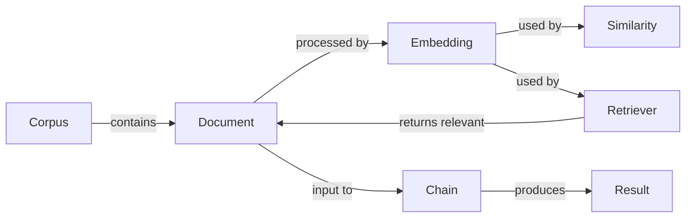
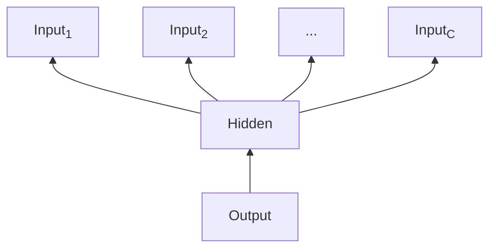

# 【LangChain编程：从入门到实践】需求思考与设计

## 1. 背景介绍
### 1.1 LangChain的兴起
近年来，随着人工智能技术的飞速发展，自然语言处理(NLP)领域取得了突破性进展。而LangChain作为一个强大的NLP编程框架，为开发者提供了便捷的工具和接口，使得构建NLP应用变得更加高效和简单。

### 1.2 LangChain的特点
LangChain的一大特点是模块化设计，它将NLP任务拆分为多个组件，如数据加载、文本预处理、特征提取、模型训练、推理等，每个组件都以统一的接口形式提供。这种设计使得不同组件可以灵活组合，开发者可以根据需求选择合适的模块进行组装，快速构建NLP应用。

### 1.3 LangChain的应用场景
LangChain在工业界和学术界都有广泛应用，比如智能客服、情感分析、文本摘要、机器翻译、知识图谱等。许多知名公司如Google、微软、亚马逊都在其产品中使用了LangChain。

## 2. 核心概念与联系
### 2.1 Document和Corpus
- Document表示一篇文档，是LangChain处理的基本单元。一个Document包含文本内容、元数据等信息。
- Corpus是Document的集合，代表语料库。我们从Corpus中加载数据，进行各种NLP任务。

### 2.2 Embedding
Embedding是将文本转换为数值向量的技术。将文本嵌入到一个高维空间，使得语义相似的文本在该空间中距离更近。常见的Embedding方法有Word2Vec、GloVe、BERT等。

### 2.3 Similarity和Retriever
- Similarity用于计算两个Embedding向量之间的相似度，常用的相似度函数有点积、余弦相似度等。
- Retriever用于从Corpus中检索与Query最相关的Document。Retriever基于Embedding和Similarity实现，先对Query和Document进行Embedding，然后计算它们的相似度，返回Top-K个最相似的Document。

### 2.4 Chains 
Chain是由多个组件顺序连接形成的处理流水线。数据在Chain中流动，经过一系列变换处理，最终输出结果。常见的Chain有:
- SimpleSequentialChain: 最基础的顺序链
- SequentialChain: 支持变量映射的顺序链
- RouterChain: 支持条件分支的链

下图展示了LangChain的核心概念及其关系:



## 3. 核心算法原理与具体操作步骤
### 3.1 文本预处理
文本预处理是NLP任务的第一步，对原始文本进行清洗和规范化，为后续步骤提供干净的数据。主要步骤包括:

1. 分词(Tokenization): 将文本切分为最小语义单元Token
2. 去除停用词(Stop Word Removal): 过滤常见的虚词如"the"、"a"等
3. 词形还原(Lemmatization): 将单词还原为原形，如"went"->"go"
4. 大小写转换: 根据需要将单词转为小写或大写

### 3.2 特征提取
特征提取是将文本转换为数值特征向量的过程。主要方法有:

1. Bag-of-Words(词袋模型): 统计每个单词的出现频次，生成词频向量
2. TF-IDF: 在词频的基础上，考虑单词在语料库中的重要性，生成TF-IDF权重向量 
3. Word Embedding: 通过神经网络学习单词的分布式表示，如Word2Vec、GloVe
4. Sentence/Document Embedding: 在Word Embedding基础上，学习句子或文档级别的Embedding表示，如Doc2Vec、Sentence-BERT

### 3.3 文本匹配
文本匹配用于计算两段文本的相似度，常用于信息检索、问答系统等任务。主要方法有:

1. 基于词频的匹配: 对两段文本的词频向量计算余弦相似度
2. 基于TF-IDF的匹配: 对TF-IDF向量计算余弦相似度
3. 基于Embedding的匹配: 对Embedding向量计算点积、余弦相似度等

具体操作步骤如下:
1. 对文本进行预处理，得到干净的Token序列
2. 提取文本特征，得到特征向量
3. 计算两个特征向量的相似度得分
4. 根据相似度得分排序，返回Top-K个最相似的结果

## 4. 数学模型和公式详细讲解举例说明
### 4.1 TF-IDF
TF-IDF(Term Frequency-Inverse Document Frequency)用于衡量一个单词在文档中的重要性。TF表示词频，IDF表示逆文档频率。

- TF: 单词t在文档d中出现的频次

$$
TF(t,d) = \frac{f_{t,d}}{\sum_{t'\in d} f_{t',d}}
$$

- IDF: 包含单词t的文档数的倒数的对数

$$
IDF(t) = \log \frac{N}{|\{d\in D:t\in d\}|}
$$

其中，N为语料库中文档总数，$|\{d\in D:t\in d\}|$为包含单词t的文档数。

- TF-IDF: TF与IDF的乘积

$$
TFIDF(t,d) = TF(t,d) \times IDF(t)
$$

举例:
假设有2个文档d1和d2:

d1: "I like apple. Apple is healthy food."
d2: "I like banana. Banana is healthy fruit."

对于单词"apple":
- 在d1中出现2次，TF(apple, d1) = 2/8 = 0.25
- 在d2中出现0次，IDF(apple) = log(2/1) = 0.301
- TF-IDF(apple, d1) = 0.25 * 0.301 = 0.075

### 4.2 Word2Vec
Word2Vec是一种学习单词Embedding的神经网络模型，包括CBOW和Skip-Gram两种架构。

以CBOW为例，模型结构如下:



模型的目标是根据上下文单词$w_{t-C},...,w_{t-1},w_{t+1},...,w_{t+C}$来预测中心单词$w_t$。

假设词表大小为V，Embedding维度为N，输入为One-Hot向量。对第i个上下文单词，其Hidden层计算公式为:

$$
h_i=W^T \cdot x_i
$$

其中，$W\in R^{V\times N}$为Embedding矩阵，$x_i\in R^V$为第i个单词的One-Hot向量。

将C个Hidden层向量求和平均，再经过Softmax层，得到中心词的概率分布:

$$
p(w_t|w_{t-C},...,w_{t+C}) = softmax(W'^T \cdot \frac{1}{C}\sum_{i=1}^C h_i)
$$

其中，$W'\in R^{N\times V}$为Softmax层参数矩阵。

模型通过最大化似然函数来学习Embedding矩阵W和W'，优化目标为:

$$
\mathcal{L} = \sum_{t=1}^T \log p(w_t|w_{t-C},...,w_{t+C})
$$

## 5. 项目实践：代码实例和详细解释说明
下面以文本分类任务为例，演示如何使用LangChain构建一个完整的NLP应用。

```python
from langchain.document_loaders import TextLoader
from langchain.text_splitter import CharacterTextSplitter
from langchain.embeddings import OpenAIEmbeddings
from langchain.vectorstores import FAISS
from langchain.chains import RetrievalQA
from langchain.llms import OpenAI

# 加载文本数据
loader = TextLoader('data.txt')
documents = loader.load()

# 文本切割
text_splitter = CharacterTextSplitter(chunk_size=1000, chunk_overlap=0)
texts = text_splitter.split_documents(documents)

# Embedding
embeddings = OpenAIEmbeddings()

# 向量存储
db = FAISS.from_documents(texts, embeddings)

# QA Chain
qa = RetrievalQA.from_chain_type(llm=OpenAI(), chain_type="stuff", retriever=db.as_retriever())

# 查询
query = "What is the capital of China?"
result = qa.run(query)
print(result)
```

代码解释:
1. 使用TextLoader加载原始文本数据，得到Document列表
2. 使用CharacterTextSplitter对文本进行切割，控制每个chunk的长度和重叠度
3. 使用OpenAIEmbeddings对文本进行Embedding，将文本转换为向量表示
4. 使用FAISS对Embedding向量进行索引，构建向量数据库
5. 使用RetrievalQA构建问答Chain，指定使用的LLM和Retriever
6. 输入问题Query，RetrievalQA会从数据库中检索相关文本，并生成答案

## 6. 实际应用场景
LangChain可应用于多种NLP场景，如:

- 智能客服: 利用LangChain构建问答系统，自动回答用户咨询
- 情感分析: 使用LangChain对用户评论进行情感分类，了解用户情绪
- 文本摘要: 使用LangChain对长文档进行摘要，提取关键信息
- 机器翻译: 使用LangChain构建翻译模型，实现不同语言间的转换
- 知识图谱: 使用LangChain从文本中抽取实体和关系，构建知识图谱

## 7. 工具和资源推荐
- 官方文档: https://docs.langchain.com/
- Github: https://github.com/hwchase17/langchain
- LangChain模型中心: https://huggingface.co/models?library=langchain
- Awesome-LangChain: https://github.com/kyrolabs/awesome-langchain
- LangChain Template Gallery: https://github.com/kyrolabs/langchain-templates

## 8. 总结：未来发展趋势与挑战
LangChain作为一个强大的NLP编程框架，极大地降低了构建NLP应用的门槛。未来随着预训练语言模型的不断发展，LangChain有望支持更多先进的模型和技术，如GPT-4、BERT-XXL等。同时，LangChain也面临一些挑战，如推理速度优化、多模态支持等。相信通过社区的共同努力，LangChain会变得更加完善和高效，为NLP技术的发展贡献力量。

## 9. 附录：常见问题与解答
### Q1: LangChain支持哪些文本数据格式？
A1: LangChain支持多种常见的文本格式，如txt、pdf、docx、csv等，可通过对应的DataLoader加载。

### Q2: LangChain能否处理中文文本？
A2: 当然可以，LangChain支持多语言处理，包括中文。可使用中文分词工具如jieba对中文文本进行预处理。

### Q3: LangChain的缺点是什么？
A3: LangChain的一个缺点是某些组件的计算开销较大，如Embedding和Retriever，在处理大规模数据时可能会比较耗时。另外，LangChain的某些功能还不够完善，如对话系统、增量学习等。

### Q4: 如何为LangChain贡献代码？
A4: 你可以在Github上fork LangChain项目，为它贡献代码。提交Pull Request前，请先阅读贡献指南，确保代码风格和质量符合要求。也欢迎你参与Issue讨论，提出宝贵的改进意见。

作者：禅与计算机程序设计艺术 / Zen and the Art of Computer Programming