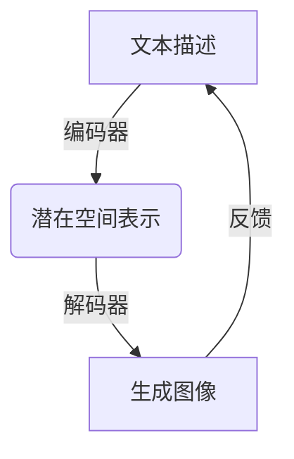

# 【大模型应用开发 动手做AI Agent】OpenAI API的图片生成示例

## 1. 背景介绍

### 1.1 人工智能的发展历程

人工智能(Artificial Intelligence, AI)是当代科技领域最具革命性和颠覆性的技术之一。自20世纪50年代AI概念被正式提出以来,经历了几个重要的发展阶段。早期的AI系统主要依赖专家系统和基于规则的方法,但由于知识库的局限性和缺乏学习能力,其应用范围受到了限制。

### 1.2 深度学习的兴起

21世纪初,深度学习(Deep Learning)的出现为AI注入了新的活力。深度学习是一种基于人工神经网络的机器学习技术,能够从大量数据中自动学习特征表示,并对复杂问题进行建模和预测。凭借强大的数据驱动能力,深度学习在计算机视觉、自然语言处理、语音识别等领域取得了突破性进展。

### 1.3 大模型时代的到来

近年来,随着计算能力的飞速提升和海量数据的积累,大规模预训练语言模型(Large Pre-trained Language Models, LLMs)成为AI发展的新引擎。这些模型通过在海量文本数据上进行预训练,获得了广泛的知识和语义理解能力,可以应用于多种自然语言处理任务。

代表性的大模型包括GPT-3、BERT、DALL-E等,它们展现出令人惊叹的生成能力,在文本生成、图像生成、代码生成等领域取得了突破性进展。OpenAI推出的DALL-E 2就是一款革命性的文本到图像生成模型,能够根据自然语言描述生成逼真的图像,为人工智能的图像生成能力带来了新的突破。

## 2. 核心概念与联系

### 2.1 生成式人工智能(Generative AI)

生成式人工智能(Generative AI)是指能够根据输入数据生成新的、原创性的内容的AI系统。这种系统通过学习现有数据的模式和规律,然后生成新的、看似合理的输出,如文本、图像、音频等。

生成式AI的核心是通过概率模型来捕捉输入数据的潜在分布,然后从该分布中采样生成新的输出。常见的生成模型包括变分自编码器(VAE)、生成对抗网络(GAN)、自回归模型(如GPT)等。

### 2.2 文本到图像生成(Text-to-Image Generation)

文本到图像生成是生成式AI的一个重要应用领域,旨在根据文本描述生成相应的图像。这种技术将自然语言处理和计算机视觉相结合,具有广泛的应用前景,如创意设计、视觉辅助、数据增强等。

文本到图像生成模型通常采用编码器-解码器架构,其中编码器将文本描述映射到一个潜在空间表示,解码器则从该表示生成对应的图像。这种架构需要巧妙地融合视觉和语义信息,以实现高质量的图像生成。

### 2.3 OpenAI DALL-E

OpenAI推出的DALL-E是一款突破性的文本到图像生成模型,它基于Transformer架构,能够理解自然语言描述并生成相应的图像。DALL-E的名称来源于著名的艺术家萨尔瓦多·达利(Salvador Dalí)和像素概念(Pixel)的结合。

DALL-E的核心创新在于引入了一种新的"散射注意力"(Sparse Attention)机制,使模型能够高效地处理长序列输入,并生成高分辨率的图像。此外,DALL-E还采用了一种新的损失函数,能够更好地捕捉图像和文本之间的语义关联。

DALL-E 2更是在原有基础上进行了多方面的改进,如提高了图像质量和分辨率、增强了对文本描述的理解能力、支持图像编辑等新功能。OpenAI还开放了DALL-E 2的API接口,使开发者能够将这一强大的图像生成能力集成到自己的应用中。



## 3. 核心算法原理具体操作步骤

### 3.1 Transformer架构

DALL-E的核心架构基于Transformer,这是一种广泛应用于自然语言处理任务的序列到序列模型。Transformer由编码器(Encoder)和解码器(Decoder)两部分组成,通过自注意力(Self-Attention)机制捕捉输入序列中的长程依赖关系。

在DALL-E中,编码器将文本描述映射到一个潜在空间表示,而解码器则从该表示生成对应的图像。具体来说,编码器首先将文本描述tokenize为一系列token embeddings,然后通过多层self-attention和前馈神经网络(Feed-Forward Neural Network)对这些embeddings进行编码,得到最终的潜在空间表示。

解码器则采用类似的结构,但增加了一个额外的cross-attention机制,用于关注编码器输出的潜在表示。在每一个解码步骤,解码器会根据当前的隐藏状态和编码器的输出,预测下一个像素值或像素块。通过逐步预测,最终生成整个图像。

### 3.2 散射注意力(Sparse Attention)

传统的Transformer模型在处理长序列时会遇到计算效率和内存消耗的瓶颈,因为self-attention需要计算序列中每对元素之间的注意力权重。为了解决这个问题,DALL-E引入了一种新的"散射注意力"(Sparse Attention)机制。

散射注意力的核心思想是只计算序列中一小部分元素对之间的注意力权重,而不是计算所有对。具体来说,它将序列划分为多个块,然后在块内计算全部注意力权重,而在块间只计算一小部分注意力权重。这种稀疏化策略大大降低了计算复杂度,使DALL-E能够高效地处理长序列输入,如高分辨率图像。

### 3.3 对比损失函数(Contrastive Loss)

为了更好地捕捉图像和文本之间的语义关联,DALL-E采用了一种新的对比损失函数(Contrastive Loss)。这种损失函数的目标是最大化正确的图像-文本对之间的相似性分数,同时最小化错误的图像-文本对之间的相似性分数。

具体来说,对于一个批次中的每个图像-文本对,模型会计算该对的相似性分数,以及该图像与其他文本描述之间的相似性分数。然后,模型会最大化正确对的相似性分数,同时最小化错误对的相似性分数,从而学习到更好的图像-文本对应关系。

这种对比损失函数不仅能够提高生成图像的质量,还能够增强模型对文本描述的理解能力,使生成的图像更加符合描述的语义。

## 4. 数学模型和公式详细讲解举例说明

### 4.1 Transformer模型

Transformer模型的核心是自注意力(Self-Attention)机制,它能够捕捉输入序列中任意两个位置之间的依赖关系。对于一个长度为n的序列$X = (x_1, x_2, ..., x_n)$,自注意力计算过程如下:

1. 将输入序列$X$线性映射到查询(Query)、键(Key)和值(Value)向量:

$$
Q = XW^Q, K = XW^K, V = XW^V
$$

其中$W^Q, W^K, W^V$分别是可学习的权重矩阵。

2. 计算查询和键之间的点积,得到注意力分数矩阵:

$$
\text{Attention}(Q, K, V) = \text{softmax}\left(\frac{QK^T}{\sqrt{d_k}}\right)V
$$

其中$d_k$是缩放因子,用于防止点积值过大导致梯度饱和。

3. 对注意力分数矩阵进行行归一化,得到最终的注意力权重矩阵。

4. 将注意力权重矩阵与值向量相乘,得到自注意力的输出。

通过多头注意力(Multi-Head Attention)机制,Transformer能够从不同的子空间捕捉不同的依赖关系,进一步提高模型的表示能力。

### 4.2 散射注意力(Sparse Attention)

散射注意力是DALL-E引入的一种新的注意力机制,旨在降低长序列输入时的计算复杂度。对于一个长度为n的序列,传统的自注意力需要计算$O(n^2)$个注意力分数。而散射注意力通过将序列划分为多个块,只计算块内和部分块间的注意力分数,从而将计算复杂度降低到$O(n \sqrt{n})$。

具体来说,对于一个长度为n的序列$X$,我们将其划分为$\sqrt{n}$个块,每个块长度为$\sqrt{n}$。然后,我们计算以下三种注意力分数:

1. 块内注意力(Local Attention)：计算每个块内所有元素对之间的注意力分数。

2. 散射注意力(Sparse Attention)：对于每个块,随机选择另外$\sqrt{n}$个块,计算当前块与这些块之间的注意力分数。

3. 密集注意力(Dense Attention)：计算整个序列中每个元素与前$\sqrt{n}$个元素之间的注意力分数。

通过上述三种注意力机制的组合,散射注意力能够在保留足够的表示能力的同时,大幅降低计算复杂度,使DALL-E能够高效地处理长序列输入。

### 4.3 对比损失函数(Contrastive Loss)

对比损失函数(Contrastive Loss)是DALL-E采用的一种新的损失函数,旨在更好地捕捉图像和文本之间的语义关联。对于一个批次中的每个图像-文本对$(x, y)$,对比损失函数的计算过程如下:

1. 计算正例相似性分数$s(x, y)$,表示图像$x$与其对应文本描述$y$之间的相似性。

2. 对于同一批次中的其他图像-文本对$(x', y')$,计算负例相似性分数$s(x, y')$和$s(x', y)$。

3. 计算对比损失函数:

$$
\mathcal{L}(x, y) = -\log \frac{e^{s(x, y)}}{e^{s(x, y)} + \sum_{(x', y') \in \mathcal{N}(x, y)} e^{s(x, y')}}
$$

其中$\mathcal{N}(x, y)$表示当前图像-文本对的负例集合。

对比损失函数的目标是最大化正例相似性分数,同时最小化负例相似性分数,从而使模型学习到更好的图像-文本对应关系。通过这种对比学习方式,DALL-E能够生成更加符合文本描述的高质量图像。

## 5. 项目实践:代码实例和详细解释说明

在本节中,我们将通过一个实际的代码示例,演示如何使用OpenAI的DALL-E API生成图像。这个示例使用Python编程语言和OpenAI官方提供的Python SDK。

### 5.1 安装依赖库

首先,我们需要安装OpenAI的Python SDK:

```bash
pip install openai
```

### 5.2 导入必要的模块

```python
import openai
import os
```

### 5.3 设置OpenAI API密钥

为了使用OpenAI的API,我们需要先设置API密钥。你可以在OpenAI的网站上创建一个账户,并获取API密钥。

```python
openai.api_key = "YOUR_API_KEY"
```

### 5.4 定义图像生成函数

接下来,我们定义一个函数,用于根据给定的文本描述生成图像。

```python
def generate_image(prompt, num_images=1):
    response = openai.Image.create(
        prompt=prompt,
        n=num_images,
        size="1024x1024"
    )
    
    image_urls = [data["url"] for data in response["data"]]
    return image_urls
```

这个函数使用`openai.Image.create`方法调用DALL-E API,传入文本描述(`prompt`)和要生成的图像数量(`n`)。`size`参数指定了生成图像的分辨率。函数返回一个包含生成图像URL的列表。

### 5.5 使用示例

现在,我们可以调用`generate_image`函数来生成图像了。

```python
prompt = "A realistic photo of a fu