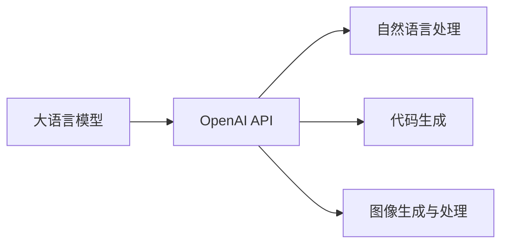

# 【大模型应用开发 动手做AI Agent】何谓OpenAI API

## 1. 背景介绍
### 1.1 人工智能的发展历程
#### 1.1.1 早期人工智能的探索
#### 1.1.2 机器学习的崛起
#### 1.1.3 深度学习的突破

### 1.2 大语言模型的出现
#### 1.2.1 Transformer架构的提出
#### 1.2.2 GPT系列模型的发展
#### 1.2.3 大语言模型的应用前景

### 1.3 OpenAI的创立与发展
#### 1.3.1 OpenAI的成立背景
#### 1.3.2 OpenAI的研究方向
#### 1.3.3 OpenAI在人工智能领域的贡献

## 2. 核心概念与联系
### 2.1 OpenAI API的定义
#### 2.1.1 什么是API
#### 2.1.2 OpenAI API的特点
#### 2.1.3 OpenAI API与其他AI API的区别

### 2.2 OpenAI API的核心功能
#### 2.2.1 自然语言处理
#### 2.2.2 代码生成
#### 2.2.3 图像生成与处理

### 2.3 OpenAI API与大语言模型的关系
#### 2.3.1 OpenAI API基于GPT系列模型
#### 2.3.2 大语言模型为OpenAI API提供强大的语言理解和生成能力
#### 2.3.3 OpenAI API让大语言模型的应用更加便捷



## 3. 核心算法原理具体操作步骤
### 3.1 Transformer架构原理
#### 3.1.1 Self-Attention机制
#### 3.1.2 多头注意力
#### 3.1.3 位置编码

### 3.2 GPT模型的训练过程
#### 3.2.1 预训练阶段
#### 3.2.2 微调阶段
#### 3.2.3 生成阶段

### 3.3 OpenAI API的调用流程
#### 3.3.1 注册和获取API密钥
#### 3.3.2 选择合适的模型
#### 3.3.3 构建请求并发送

## 4. 数学模型和公式详细讲解举例说明
### 4.1 Self-Attention的数学表示
#### 4.1.1 查询、键、值的计算
#### 4.1.2 注意力权重的计算
#### 4.1.3 注意力输出的计算

假设我们有一个输入序列 $X=(x_1,x_2,...,x_n)$，其中 $x_i \in \mathbb{R}^d$ 表示第 $i$ 个词的词向量。Self-Attention的计算过程如下：

1. 计算查询、键、值：
$$
\begin{aligned}
Q &= XW^Q \\
K &= XW^K \\
V &= XW^V
\end{aligned}
$$
其中 $W^Q, W^K, W^V \in \mathbb{R}^{d \times d_k}$ 是可学习的权重矩阵。

2. 计算注意力权重：
$$
\alpha = \text{softmax}(\frac{QK^T}{\sqrt{d_k}})
$$
其中 $\alpha \in \mathbb{R}^{n \times n}$ 表示注意力权重矩阵。

3. 计算注意力输出：
$$
\text{Attention}(Q,K,V) = \alpha V
$$
最终的注意力输出是值向量的加权和。

### 4.2 位置编码的数学表示
#### 4.2.1 正弦位置编码
#### 4.2.2 学习位置编码

Transformer使用位置编码来引入序列中词的位置信息。正弦位置编码的计算公式如下：
$$
\begin{aligned}
PE_{(pos,2i)} &= \sin(pos/10000^{2i/d_{model}}) \\
PE_{(pos,2i+1)} &= \cos(pos/10000^{2i/d_{model}})
\end{aligned}
$$
其中 $pos$ 表示词的位置，$i$ 表示维度的索引，$d_{model}$ 表示词向量的维度。

### 4.3 损失函数的数学表示
#### 4.3.1 交叉熵损失
#### 4.3.2 困惑度的计算

GPT模型使用交叉熵损失函数来衡量模型的预测结果与真实标签之间的差异。给定一个序列 $X=(x_1,x_2,...,x_n)$ 和对应的目标序列 $Y=(y_1,y_2,...,y_n)$，交叉熵损失的计算公式如下：
$$
\mathcal{L}_{CE} = -\sum_{i=1}^n \log p(y_i|x_1,...,x_i)
$$
其中 $p(y_i|x_1,...,x_i)$ 表示模型在给定前 $i$ 个词的情况下，预测下一个词为 $y_i$ 的概率。

困惑度（Perplexity）是另一个常用的评估指标，它与交叉熵损失有直接关系：
$$
\text{PPL} = \exp(\mathcal{L}_{CE})
$$
困惑度越低，表示模型的预测能力越强。

## 5. 项目实践：代码实例和详细解释说明
### 5.1 使用OpenAI API进行文本生成
#### 5.1.1 安装和配置OpenAI库
#### 5.1.2 构建文本生成请求
#### 5.1.3 解析和处理生成结果

以下是使用Python调用OpenAI API进行文本生成的示例代码：

```python
import openai

openai.api_key = "YOUR_API_KEY"

prompt = "Once upon a time"

response = openai.Completion.create(
    engine="davinci",
    prompt=prompt,
    max_tokens=100,
    n=1,
    stop=None,
    temperature=0.7,
)

generated_text = response.choices[0].text.strip()
print(generated_text)
```

在这个示例中，我们首先导入`openai`库，并设置API密钥。然后，我们定义一个提示（prompt）作为生成文本的起点。接下来，我们调用`openai.Completion.create()`方法，指定使用的引擎、提示、最大生成标记数、生成结果数量、停止条件和温度参数。最后，我们从响应中提取生成的文本并打印出来。

### 5.2 使用OpenAI API进行代码生成
#### 5.2.1 准备代码生成的提示
#### 5.2.2 构建代码生成请求
#### 5.2.3 解析和处理生成的代码

以下是使用OpenAI API进行代码生成的示例代码：

```python
import openai

openai.api_key = "YOUR_API_KEY"

prompt = """
def fibonacci(n):
    """计算斐波那契数列的第n项"""
"""

response = openai.Completion.create(
    engine="davinci-codex",
    prompt=prompt,
    max_tokens=100,
    n=1,
    stop=None,
    temperature=0,
)

generated_code = response.choices[0].text.strip()
print(generated_code)
```

在这个示例中，我们使用了一个包含函数签名和注释的提示作为代码生成的起点。我们选择了`davinci-codex`引擎，它专门用于代码生成任务。其他参数与文本生成示例类似。生成的代码将补全函数体的实现。

### 5.3 使用OpenAI API进行图像生成
#### 5.3.1 准备图像生成的提示
#### 5.3.2 构建图像生成请求
#### 5.3.3 保存和显示生成的图像

以下是使用OpenAI API进行图像生成的示例代码：

```python
import openai
import requests
from PIL import Image
from io import BytesIO

openai.api_key = "YOUR_API_KEY"

prompt = "A cute baby sea otter"

response = openai.Image.create(
    prompt=prompt,
    n=1,
    size="1024x1024",
)

image_url = response['data'][0]['url']
image_data = requests.get(image_url).content
image = Image.open(BytesIO(image_data))
image.show()
```

在这个示例中，我们使用文本提示描述要生成的图像内容。我们调用`openai.Image.create()`方法，指定提示、生成图像的数量和尺寸。生成的图像将以URL的形式返回。我们使用`requests`库获取图像数据，并使用PIL（Python Imaging Library）打开和显示图像。

## 6. 实际应用场景
### 6.1 智能客服
#### 6.1.1 客户问询的自动回复
#### 6.1.2 个性化推荐和服务
#### 6.1.3 情感分析和用户反馈处理

### 6.2 内容创作
#### 6.2.1 文章和博客写作辅助
#### 6.2.2 社交媒体帖子生成
#### 6.2.3 广告文案创作

### 6.3 代码开发
#### 6.3.1 代码自动补全和建议
#### 6.3.2 代码错误检测和修复
#### 6.3.3 代码文档生成

### 6.4 创意设计
#### 6.4.1 Logo和图标设计
#### 6.4.2 产品设计和概念图生成
#### 6.4.3 艺术作品创作

## 7. 工具和资源推荐
### 7.1 OpenAI官方文档和示例
#### 7.1.1 API参考文档
#### 7.1.2 示例代码和教程
#### 7.1.3 最佳实践和使用指南

### 7.2 第三方库和框架
#### 7.2.1 OpenAI Python库
#### 7.2.2 Hugging Face Transformers库
#### 7.2.3 TensorFlow和PyTorch

### 7.3 社区资源和交流平台
#### 7.3.1 OpenAI官方论坛
#### 7.3.2 GitHub上的OpenAI相关项目
#### 7.3.3 相关的博客和技术社区

## 8. 总结：未来发展趋势与挑战
### 8.1 大语言模型的持续改进
#### 8.1.1 模型规模的扩大
#### 8.1.2 训练数据的多样性和质量
#### 8.1.3 新的架构和训练方法

### 8.2 API的易用性和可访问性
#### 8.2.1 更友好的开发者体验
#### 8.2.2 降低使用成本和门槛
#### 8.2.3 支持更多编程语言和平台

### 8.3 伦理和安全考量
#### 8.3.1 防止模型滥用和恶意使用
#### 8.3.2 保护用户隐私和数据安全
#### 8.3.3 促进负责任和透明的AI开发

## 9. 附录：常见问题与解答
### 9.1 如何选择合适的OpenAI模型？
### 9.2 OpenAI API的定价和使用限制是什么？
### 9.3 如何处理API返回的错误和异常？
### 9.4 OpenAI API的使用是否有版权限制？
### 9.5 如何提高生成结果的质量和相关性？

OpenAI API为开发者提供了一种便捷、高效的方式来集成先进的人工智能能力到他们的应用程序中。通过深入了解OpenAI API的核心概念、算法原理和实际应用，开发者可以充分发挥大语言模型的潜力，创建出更加智能、自然、有创意的AI应用。随着大语言模型的不断发展和API的持续改进，OpenAI API将在未来为更多领域和场景带来革命性的变化。同时，我们也需要关注和解决在使用过程中可能出现的伦理和安全问题，确保人工智能技术的发展能够造福人类社会。

作者：禅与计算机程序设计艺术 / Zen and the Art of Computer Programming