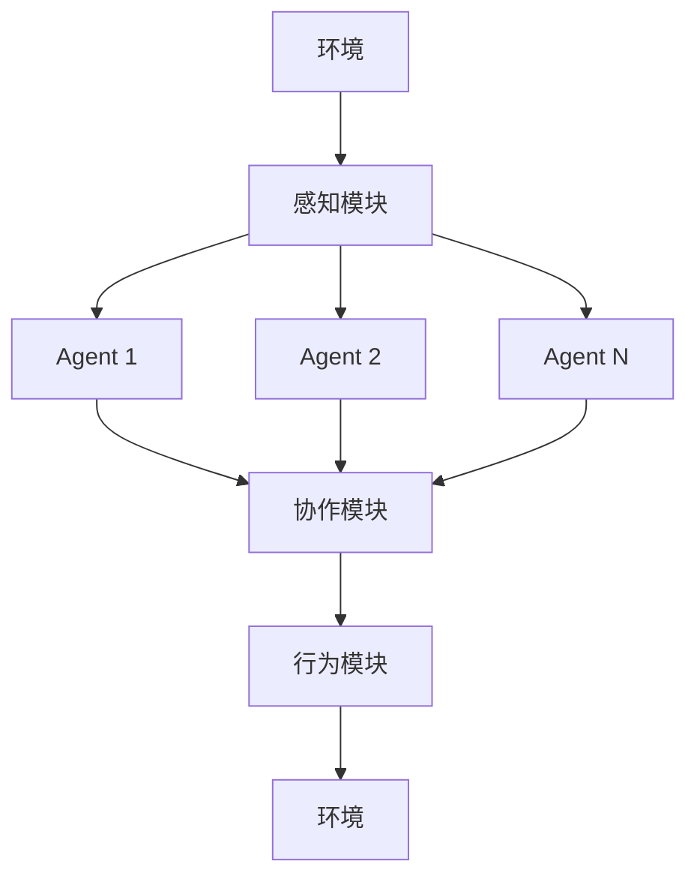

# 【大模型应用开发 动手做AI Agent】多Agent协作

## 1. 背景介绍

在人工智能领域,大型语言模型(Large Language Models, LLMs)的兴起引发了广泛关注。这些模型通过在海量文本数据上进行训练,获得了令人惊叹的自然语言理解和生成能力。然而,单一的大型语言模型通常难以完成复杂的任务,需要与其他组件协同工作,形成智能Agent系统。

Agent是具有一定自主性的软件实体,能够感知环境、执行动作并与其他Agent交互协作。在人工智能系统中,Agent通常被赋予特定的角色和功能,共同完成复杂任务。多Agent协作系统由多个Agent组成,它们通过合理分工、信息共享和行为协调,发挥整体协同作用,完成人类难以单独完成的复杂任务。

随着大型语言模型的不断发展,将其与其他类型的Agent(如规划Agent、推理Agent等)相结合,构建多Agent协作系统,成为了人工智能领域的一个重要研究方向。这种多Agent协作系统不仅能够发挥大型语言模型在自然语言理解和生成方面的优势,还能够利用其他Agent的专长,实现更加智能、更加通用的人工智能应用。

## 2. 核心概念与联系

### 2.1 大型语言模型(LLMs)

大型语言模型是一种基于深度学习的自然语言处理模型,通过在海量文本数据上进行预训练,获得了出色的语言理解和生成能力。常见的大型语言模型包括GPT(Generative Pre-trained Transformer)、BERT(Bidirectional Encoder Representations from Transformers)等。

这些模型具有以下特点:

1. 大规模参数:拥有数十亿甚至上百亿个参数,能够捕捉复杂的语言模式。
2. 通用性:通过预训练,可以在各种自然语言处理任务上表现出色,如文本生成、机器翻译、问答系统等。
3. 上下文理解:能够理解上下文信息,生成与上下文相关的自然语言。
4. 持续学习:可以通过进一步的微调(fine-tuning)来适应特定任务和领域。

### 2.2 智能Agent

智能Agent是一种具有自主性的软件实体,能够感知环境、执行动作并与其他Agent交互协作。Agent通常被赋予特定的角色和功能,如规划Agent、推理Agent、决策Agent等。

智能Agent具有以下特点:

1. 感知能力:能够从环境中获取信息,形成对环境的理解。
2. 行为能力:能够根据感知信息和内部状态,选择合适的动作执行。
3. 目标导向:具有特定的目标或任务,并努力实现这些目标。
4. 自主性:能够独立地做出决策和行动,而不需要人工干预。
5. 社会能力:能够与其他Agent进行交互、协作和协调。

### 2.3 多Agent协作系统

多Agent协作系统由多个智能Agent组成,它们通过合理分工、信息共享和行为协调,共同完成复杂任务。这种系统具有以下优势:

1. 分工协作:不同Agent负责不同的子任务,发挥各自的专长。
2. 并行计算:多个Agent可以同时执行不同的任务,提高系统效率。
3. 鲁棒性:单个Agent出现故障时,其他Agent可以接管任务,提高系统的容错能力。
4. 扩展性:可以根据需求动态增减Agent,使系统具有良好的可扩展性。
5. 复杂问题求解:通过协作,可以解决单个Agent难以处理的复杂问题。

在多Agent协作系统中,Agent之间需要进行有效的通信和协调,以实现高效的协作。常见的协作机制包括契约网协议(Contract Net Protocol)、拍卖机制(Auction Mechanism)、组织模型(Organizational Model)等。

## 3. 核心算法原理具体操作步骤

### 3.1 多Agent协作系统架构

多Agent协作系统的典型架构如下所示:

1. **环境(Environment)**: 系统所处的外部环境,提供感知信息和接收Agent的行为输出。
2. **感知模块(Perception Module)**: 从环境中获取信息,并将其转换为Agent可理解的表示形式。
3. **Agent**: 系统中的智能Agent,每个Agent负责特定的任务或功能。
4. **协作模块(Collaboration Module)**: 协调不同Agent之间的交互和协作,包括信息共享、任务分配、冲突解决等。
5. **行为模块(Action Module)**: 根据Agent的决策,执行相应的行为,并将结果反馈到环境中。

### 3.2 多Agent协作算法

多Agent协作系统中常见的协作算法包括:

1. **契约网协议(Contract Net Protocol, CNP)**: 一种基于市场机制的分布式任务分配协议。Agent之间通过竞标和投标的方式,动态分配任务。
2. **拍卖机制(Auction Mechanism)**: 类似于契约网协议,但更加灵活和通用。Agent可以根据自身状态和偏好,决定是否参与拍卖和出价。
3. **组织模型(Organizational Model)**: 将Agent组织成层级结构或团队,每个Agent在组织中扮演特定的角色,并遵循相应的规则和协议进行协作。
4. **共识算法(Consensus Algorithm)**: 用于在分布式系统中达成一致性决策,如Paxos算法、Raft算法等。
5. **多智能体系统(Multi-Agent System)**: 一种更加通用的多Agent协作框架,包括Agent建模、协作机制设计、决策理论等多个方面。

这些算法的具体实现步骤因算法而异,但通常包括以下几个关键步骤:

1. **Agent发现和注册**: 系统中的Agent相互发现并注册,建立初始的通信链路。
2. **任务分解和分配**: 将复杂任务分解为多个子任务,并根据协作算法将子任务分配给合适的Agent。
3. **信息共享和协调**: Agent之间共享相关信息,协调行为以避免冲突和重复工作。
4. **结果合并和优化**: 将各个Agent的部分结果合并,并进行必要的优化和调整。
5. **反馈和学习**: 根据任务执行的结果,对Agent的行为策略和协作机制进行反馈和学习,以提高系统的整体性能。

### 3.3 大型语言模型与其他Agent协作

将大型语言模型与其他类型的Agent(如规划Agent、推理Agent等)相结合,可以构建更加智能、更加通用的人工智能应用系统。常见的协作方式包括:

1. **语言理解和生成**: 大型语言模型负责自然语言的理解和生成,为其他Agent提供人机交互接口。
2. **知识库构建**: 利用大型语言模型的文本理解能力,从海量文本数据中提取结构化知识,为其他Agent提供知识支持。
3. **任务分解和规划**: 将复杂任务分解为多个子任务,由不同的Agent协作完成。大型语言模型可以参与任务分解和规划的过程。
4. **决策支持**: 大型语言模型可以根据上下文信息和知识库,为其他Agent的决策过程提供建议和支持。
5. **结果解释和交互**: 将其他Agent的执行结果转换为自然语言形式,方便人类理解和交互。

在这种协作架构中,大型语言模型扮演着"语言中介"的角色,实现了人机交互和Agent之间的信息交换。同时,其他Agent则发挥各自的专长,如规划、推理、决策等,共同完成复杂的人工智能任务。

## 4. 数学模型和公式详细讲解举例说明

在多Agent协作系统中,常常需要使用数学模型和公式来描述和优化系统的行为。以下是一些常见的数学模型和公式:

### 4.1 马尔可夫决策过程(Markov Decision Process, MDP)

马尔可夫决策过程是一种用于描述序列决策问题的数学框架,常用于建模智能Agent的决策过程。一个MDP可以用一个元组 $\langle S, A, T, R \rangle$ 来表示,其中:

- $S$ 是状态集合,表示环境的可能状态。
- $A$ 是动作集合,表示Agent可以执行的动作。
- $T(s, a, s')$ 是状态转移概率,表示在状态 $s$ 下执行动作 $a$ 后,转移到状态 $s'$ 的概率。
- $R(s, a, s')$ 是奖励函数,表示在状态 $s$ 下执行动作 $a$ 并转移到状态 $s'$ 时获得的即时奖励。

Agent的目标是找到一个策略 $\pi: S \rightarrow A$,使得在该策略下的期望累积奖励最大化。这可以通过动态规划或强化学习算法来求解。

在多Agent协作系统中,每个Agent可以建模为一个MDP,并通过协作算法来协调各个Agent的策略,实现整体目标的最优化。

### 4.2 博弈论(Game Theory)

博弈论是研究多个理性决策者(Agent)在相互影响下做出决策的数学理论。在多Agent协作系统中,博弈论可以用于分析和优化Agent之间的互动行为。

一个博弈可以用一个元组 $\langle N, A, u \rangle$ 来表示,其中:

- $N$ 是参与者(Agent)集合。
- $A = A_1 \times A_2 \times \cdots \times A_n$ 是行动策略的笛卡尔积,表示每个参与者可选择的行动策略集合。
- $u = (u_1, u_2, \cdots, u_n)$ 是一组实值函数,表示每个参与者在不同行动策略组合下的效用(payoff)。

博弈论中的核心概念包括纳什均衡(Nash Equilibrium)、dominant策略(Dominant Strategy)、合作博弈(Cooperative Game)等,这些概念可以用于分析和设计多Agent协作系统中的协作机制。

### 4.3 组织建模(Organizational Modeling)

组织建模是一种描述多Agent系统结构和行为的方法,常用于设计和分析复杂的多Agent协作系统。一个组织模型通常包括以下几个要素:

- **角色(Role)**: 定义了Agent在组织中的职责和行为规范。
- **交互模式(Interaction Pattern)**: 描述了Agent之间的交互方式,如信息共享、协调机制等。
- **规范(Norm)**: 约束Agent的行为,确保组织的正常运行。
- **组织结构(Organizational Structure)**: 定义了组织的层级关系和权责分配。

组织建模可以使用形式化的数学语言和图论模型来描述,如Petri网、有限状态自动机等。通过组织建模,可以更好地理解和优化多Agent协作系统的行为。

### 4.4 其他数学模型

除了上述模型外,多Agent协作系统中还可能涉及其他数学模型和公式,如:

- **队列论(Queueing Theory)**: 用于分析和优化资源分配和任务调度问题。
- **图论(Graph Theory)**: 用于描述Agent之间的拓扑结构和信息流动。
- **机器学习模型**: 如神经网络、决策树等,用于Agent的行为学习和优化。
- **优化理论**: 如线性规划、非线性规划等,用于求解多目标优化问题。
- **博亦论(Game Theory)**: 用于分析和优化Agent之间的竞争和合作行为。

这些数学模型和公式为多Agent协作系统的建模、分析和优化提供了强有力的理论支持和工具。

## 5. 项目实践:代码实例和详细解释说明

为了更好地理解多Agent协作系统的实现,我们将通过一个简单的示例项目来演示如何使用Python构建一个基于契约网协议(Contract Net Protocol, CNP)的多Agent协作系统。

### 5.1 项目概述

在这个示例项目中,我们将模拟一个任务分配场景。有一个管理者Agent(Manager Agent)和多个工作者Agent(Worker Agent)。管理者Agent需要将一个复杂任务分解为多个子任务,并通过契约网协议将这些子任务分配