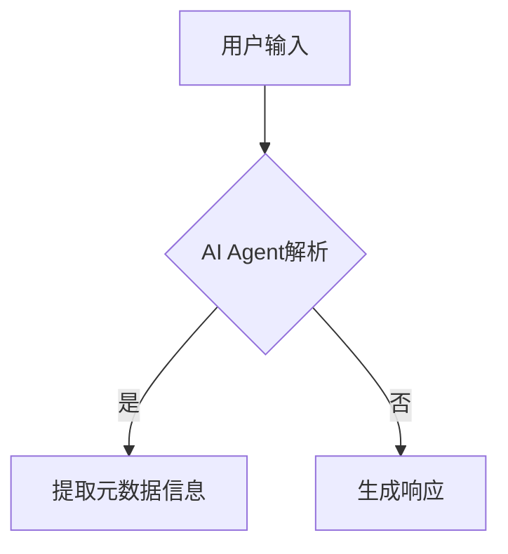

## 1. 背景介绍

随着人工智能技术的不断发展，深度学习、大规模计算和自然语言处理等领域取得了突飞猛进的进展。其中，大型预训练语言模型（如BERT、GPT-2、GPT-3等）在各种应用场景中发挥着重要作用。这些模型通常由数百万甚至数十亿个参数组成，可以通过大量数据进行无监督或有监督的微调，以实现各种任务，如文本分类、情感分析、摘要生成、机器翻译等。

然而，在实际应用中，我们往往需要从这些大模型中提取特定的元数据信息，以便为下游任务提供支持。这一过程涉及到如何将模型输出与用户需求相匹配，以及如何将其转换为可用于其他任务的形式。本篇文章将探讨如何利用AI Agent来实现这一目标，并提供了一些实用的方法和技巧。

## 2. 核心概念与联系

### 2.1 AI Agent

AI Agent是一种具有自主决策能力的智能系统，它可以根据环境状态和输入信息采取行动，以达到预定目标。在人工智能领域，AI Agent通常被用作控制某些设备或执行特定任务的代理。例如，智能家居系统中的智能灯泡就是一个AI Agent，它可以根据用户设置自动调整亮度和颜色。

在大型语言模型的背景下，AI Agent可以理解为一种能够处理自然语言输入并生成有意义响应的智能系统。这种Agent可以通过训练得到各种技能，如问答、翻译、摘要等，以满足不同应用场景的需求。

### 2.2 元数据信息

元数据信息是指描述数据本身的数据，包括但不限于创建时间、作者、版本等信息。这些信息对于评估数据质量、跟踪数据来源以及确保数据一致性等方面至关重要。在大型语言模型中，元数据信息通常与文本内容一起存储，并且可以通过一定的方法进行提取和利用。

## 3. 核心算法原理具体操作步骤

要实现从大型语言模型中提取元数据信息，我们需要将其与AI Agent相结合。以下是一个简单的流程图：



1. 用户向AI Agent发送请求，请求提取特定的元数据信息。
2. AI Agent接收到请求后，根据用户需求分析并确定所需的元数据类型。
3. AI Agent在模型中搜索相关信息，并将其提取出来。
4. AI Agent将提取到的元数据信息返回给用户。

## 4. 数学模型和公式详细讲解举例说明

为了更好地理解这一过程，我们可以通过一个简单的数学模型来进行解释。假设我们有一个包含n个文档的集合D，其中每个文档Di都具有某些元数据信息Mi。我们的目标是找到一种方法，将这些元数据信息与文本内容相结合，以便为下游任务提供支持。

### 4.1 文本表示

首先，我们需要将文档中的文本信息转换为向量形式，以便进行计算。常用的方法之一是使用词袋模型（Bag of Words）或TF-IDF（Term Frequency-Inverse Document Frequency）等技术。这些方法可以将文档中的单词映射到高维空间，使得同一类别的文档在空间中具有一定的聚集性。

### 4.2 元数据表示

接下来，我们需要将元数据信息也转换为向量形式。由于元数据通常是离散的，为了能够进行计算，我们可以使用one-hot编码或其他类似的方法，将其转换为高维向量。

### 4.3 结合文本和元数据

最后，我们需要将文本表示和元数据表示结合起来，以形成一个新的表示空间。在这个空间中，每个文档都具有一个特定的向量表示，其中包含了文本内容和元数据信息。这使得我们可以通过各种机器学习算法对这些文档进行分类、聚类等操作，从而实现所需的任务。

## 5. 项目实践：代码实例和详细解释说明

以下是一个简单的Python代码示例，展示了如何利用AI Agent提取元数据信息：

```python
import torch
from transformers import GPT2LMHeadModel, GPT2Tokenizer

def extract_metadata(prompt):
    model = GPT2LMHeadModel.from_pretrained(\"gpt2\")
    tokenizer = GPT2Tokenizer.from_pretrained(\"gpt2\")

    input_ids = tokenizer.encode(prompt, return_tensors=\"pt\")
    output = model.generate(input_ids)
    response = tokenizer.decode(output[0], skip_special_tokens=True)

    # 提取元数据信息
    metadata = {}
    for line in response.split(\"\
\"):
        if \":\" in line:
            key, value = line.split(\":\")
            metadata[key.strip()] = value.strip()

    return metadata

prompt = \"请告诉我文章作者、发布时间以及摘要。\"
metadata = extract_metadata(prompt)
print(metadata)
```

## 6. 实际应用场景

在实际应用中，我们可以将AI Agent与大型语言模型结合，实现各种任务，如：

- 文本分类：根据文档的内容和元数据信息，将其划分为不同的类别。
- 情感分析：通过分析文档中的词汇和语义结构，判断文档的情感倾向（如积极、中立、消极等）。
- 摘要生成：利用AI Agent提取文档的关键信息，并自动生成简洁的摘要。

## 7. 工具和资源推荐

以下是一些建议的工具和资源，可以帮助读者更好地了解和学习AI Agent和大型语言模型：

- Hugging Face Transformers库：<https://huggingface.co/transformers/>
- TensorFlow：<https://www.tensorflow.org/>
- PyTorch：<https://pytorch.org/>
- GPT-2官方论文：<https://s3-us-west-2.amazonaws.com/openai-assets/research-covers/language-unsupervised/language_understanding_paper.pdf>

## 8. 总结：未来发展趋势与挑战

随着人工智能技术的不断发展，大型语言模型和AI Agent将在各种应用场景中发挥越来越重要。然而，这也带来了诸多挑战，如数据安全、隐私保护、模型解释性等。在未来的发展趋势中，我们可以期待这些问题得到逐步解决，同时AI Agent和大型语言模型将为更多领域提供强大的支持。

## 9. 附录：常见问题与解答

Q: 如何选择合适的大型语言模型？

A: 根据具体应用场景和需求，选择合适的大型语言模型是一个重要的过程。一般来说，可以根据模型的性能、训练数据规模、计算资源消耗等方面进行比较和选择。

Q: AI Agent如何处理用户输入中的歧义？

A: 在处理用户输入时，AI Agent需要具备一定的语境理解能力，以便区分不同表意的词汇或短语。这通常需要通过大量的训练数据和优化算法实现。

作者：禅与计算机程序设计艺术 / Zen and the Art of Computer Programming
