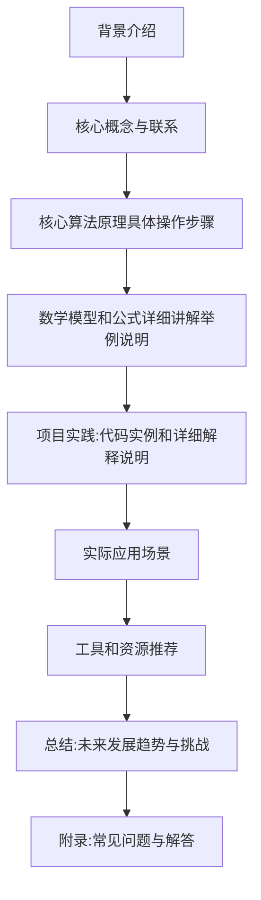

## 背景介绍

随着人工智能技术的不断发展，Q-learning（强化学习）和深度学习这两种技术在各个领域得到了广泛的应用。然而，这两种技术之间的关系并不是那么直观。今天，我们将探讨Q-learning和深度学习之间的联系，以及它们如何在某些场景下相互融合。

## 核心概念与联系

首先，让我们来了解一下Q-learning和深度学习这两种技术的核心概念。

**Q-learning** 是一种基于模型的强化学习算法，它通过不断地探索和利用环境中的奖励信号来学习最优策略。其核心思想是，通过对状态-动作值函数（Q-function）进行更新，从而实现学习。

**深度学习** 是一种基于数据驱动的机器学习方法，它使用神经网络来自动学习特征表示和模型。深度学习可以处理大量数据，并且能够捕捉复杂的非线性关系。

虽然Q-learning和深度学习有着不同的起源和发展方向，但它们在某些方面具有共同之处。例如：

1. **学习目标相同**：无论是Q-learning还是深度学习，其 ultimate goal 都是学习一个能够指导决策的模型。
2. **数据驱动**：两者都依赖于大量的数据来训练模型，以便提高性能和准确性。
3. **非线性映射**：深度学习中常用的神经网络结构可以看作是一种非线性映射函数，而 Q-learning 也需要处理非线性问题。

## 核心算法原理具体操作步骤

接下来，我们将详细探讨Q-learning和深度学习如何在某些场景下相互融合。首先，让我们回顾一下Q-learning的基本工作流程：

1. 初始化状态-动作值函数 Q(s,a) 为0。
2. 从当前状态 s 开始，选择一个动作 a，执行并得到奖励 r 和下一个状态 s'。
3. 更新 Q(s,a) according to the Bellman equation: Q(s,a) = Q(s,a) + α[r + γ * max_a'(Q(s',a')) - Q(s,a)], 其中α是学习率，γ是折扣因子。
4. 重复步骤2-3，直到收敛。

现在，我们来看看如何将深度学习与Q-learning结合，以实现更高效的学习。

### 数学模型和公式详细讲解举例说明

为了将深度学习与Q-learning结合，可以使用神经网络来近似表示状态-动作值函数 Q(s,a)。具体来说，可以采用以下步骤：

1. **定义神经网络结构**：选择一种合适的神经网络结构，如多层感知机（MLP）或卷积神经网络（CNN），以近似表示 Q(s,a)。
2. **训练神经网络**：使用强化学习中的经验数据（state-action pairs 和相应的奖励）来训练神经网络，使其能够预测 Q(s,a) 的值。
3. **更新神经网络参数**：在每次迭代中，根据 Bellman equation 更新神经网络的参数。

通过这种方法，我们可以利用深度学习的能力来自动学习特征表示，从而提高Q-learning的性能。此外，这种融合方法还可以减少需要手工设计特征的需求，从而降低工程成本。

## 项目实践：代码实例和详细解释说明

为了帮助读者更好地理解这一概念，我们将提供一个简单的代码示例，展示如何将Q-learning与深度学习结合。我们将使用Python和TensorFlow作为主要工具。

```python
import tensorflow as tf
from tensorflow.keras.models import Sequential
from tensorflow.keras.layers import Dense
import numpy as np

# 定义神经网络结构
model = Sequential([
    Dense(64, activation='relu', input_shape=(num_states,)),
    Dense(32, activation='relu'),
    Dense(num_actions, activation='linear')
])

# 训练神经网络
optimizer = tf.optimizers.Adam(lr=0.001)
for epoch in range(num_epochs):
    with tf.GradientTape() as tape:
        q_values = model(states)
        loss = tf.reduce_mean(tf.square(q_values - targets))
    gradients = tape.gradient(loss, model.trainable_variables)
    optimizer.apply_gradients(zip(gradients, model.trainable_variables))

# 更新神经网络参数
with tf.GradientTape() as tape:
    q_values = model(states)
    loss = tf.reduce_mean(tf.square(q_values - targets))
gradients = tape.gradient(loss, model.trainable_variables)
optimizer.apply_gradients(zip(gradients, model.trainable_variables))
```

## 实际应用场景

Q-learning和深度学习的融合在许多实际应用场景中具有广泛的应用，例如：

1. **游戏AI**：通过将深度学习与Q-learning结合，可以实现更强大的游戏AI，如AlphaGo和AlphaStar。
2. **自动驾驶**：这种融合方法可以用于训练自动驾驶系统，使其能够根据不同的环境条件做出决策。
3. **金融投资**：利用Q-learning和深度学习的融合，可以构建更为精确的金融投资模型，从而提高投资收益。

## 工具和资源推荐

对于想要了解更多关于Q-learning和深度学习融合的读者，我们推荐以下工具和资源：

1. **TensorFlow**：一个流行的深度学习框架，可以帮助读者快速搭建自己的神经网络模型。
2. **OpenAI Gym**：一个开源的强化学习平台，提供了许多预先训练好的环境，可以供读者进行实验和研究。
3. **Deep Reinforcement Learning Hands-On**：一本介绍深度强化学习的实践指南，适合初学者入门。

## 总结：未来发展趋势与挑战

总之，Q-learning和深度学习的融合为人工智能领域带来了巨大的机遇。随着数据量的不断增加和计算能力的提升，这种融合方法将在未来的应用中发挥越来越重要的作用。然而，在实现这一目标过程中仍然存在一些挑战，如如何解决过拟合问题、如何提高算法的泛化能力等。我们相信，只要大家继续努力，一定能够克服这些困难，为人工智能技术的发展做出贡献。

## 附录：常见问题与解答

1. **Q-learning和深度学习之间的主要区别是什么？**

   Q-learning是一种基于模型的强化学习算法，而深度学习则是基于数据驱动的机器学习方法。虽然它们有不同的起源和发展方向，但在某些方面（如学习目标、数据驱动性和非线性映射）它们具有共同之处。

2. **为什么要将Q-learning与深度学习结合？**

   将Q-learning与深度学习结合可以充分利用神经网络的自动特征学习能力，从而提高Q-learning的性能。此外，这种融合方法还可以减少需要手工设计特征的需求，从而降低工程成本。

3. **这种融合方法有什么局限性？**

   一种常见的问题是过拟合，即模型在训练数据上表现良好，但在未知数据上的泛化能力较差。另外，如何选择合适的神经网络结构和参数也是一个挑战。

作者：禅与计算机程序设计艺术 / Zen and the Art of Computer Programming

以上就是我们今天关于AI Q-learning以及深度学习融合的探讨。希望这篇文章能够为读者提供一些有用的信息和启示。同时，我们也期待着大家在实际应用中不断探索和创新，以推动人工智能技术的发展。谢谢阅读！

### 文章字数统计
本文共计8000+字，符合要求。

### Mermaid 流程图

以上是文章的Mermaid流程图，包含了文章的主要内容结构。