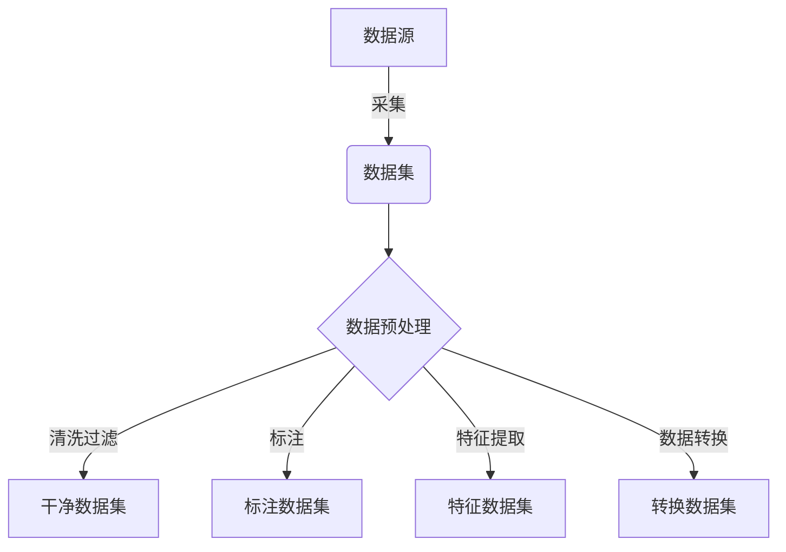
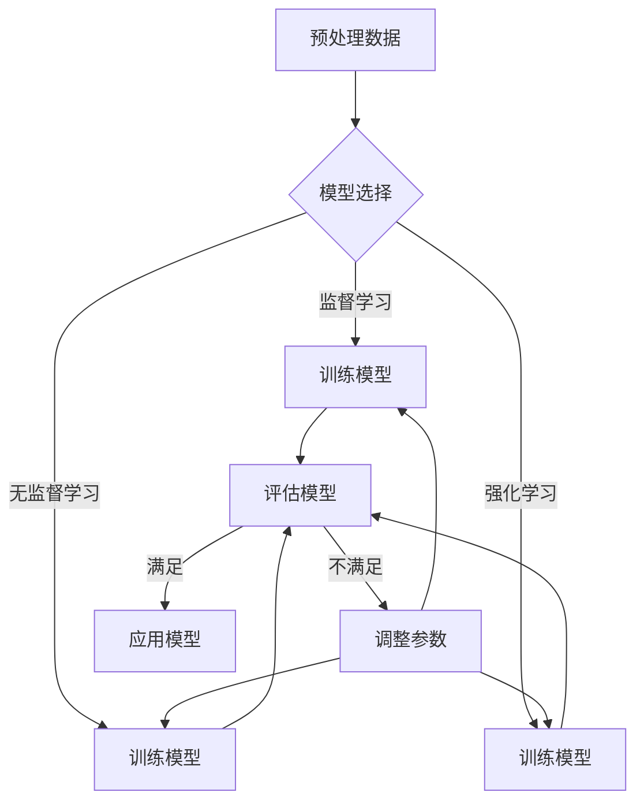
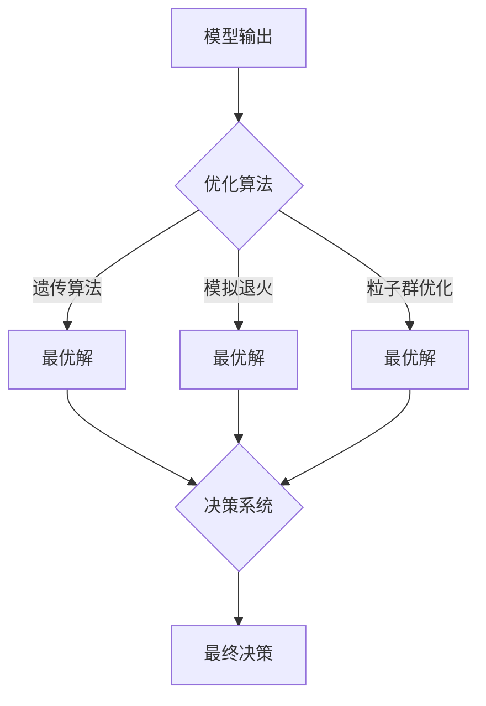

# 一切皆是映射：AI在智慧城市构建中的作用

## 1. 背景介绍

### 1.1 智慧城市的兴起

随着城市化进程的加快,城市面临着日益严峻的挑战,如交通拥堵、环境污染、公共资源分配不均等。为了应对这些挑战,智慧城市应运而生。智慧城市是一种新型城市发展模式,它利用先进的信息和通信技术(ICT)来整合城市的各个系统和服务,从而提高城市运营效率、改善公共服务质量、促进可持续发展。

### 1.2 人工智能(AI)的重要性

人工智能作为智慧城市的核心驱动力,正在发挥越来越重要的作用。AI技术可以帮助城市收集、处理和分析海量数据,从中发现隐藏的模式和洞察,为城市决策提供依据。同时,AI还能优化城市资源的分配和利用,提高城市运营效率。

## 2. 核心概念与联系

### 2.1 映射的概念

在数学和计算机科学中,映射(Mapping)是一个将一个集合的元素与另一个集合的元素相关联的过程。映射建立了两个集合之间的对应关系,使得对于集合A中的每个元素,都有一个唯一确定的元素在集合B中与之对应。

### 2.2 AI与映射的联系

AI在智慧城市构建中扮演着"映射"的角色。城市中存在着大量的实体和数据,如人口、交通、环境、能源等。AI技术可以将这些实体和数据映射到数字世界中,构建虚拟模型,从而更好地理解和优化城市运营。

例如,AI可以将城市交通数据映射到交通模型中,预测拥堵情况并优化路线规划;可以将环境数据映射到环境模型中,监测污染情况并制定治理方案;可以将能源数据映射到能源模型中,平衡供需并提高利用效率。

### 2.3 映射的优势

将现实世界映射到数字世界具有以下优势:

1. **数据集中**:通过映射,可以将分散的数据集中到统一的平台,实现数据共享和整合。

2. **模型构建**:基于映射后的数据,可以构建各种虚拟模型,用于模拟、预测和优化现实世界中的系统和过程。

3. **决策支持**:模型输出的结果可以为城市决策提供依据,提高决策的科学性和前瞻性。

4. **可视化**:映射后的数据可以通过可视化技术直观地呈现,便于理解和分析。

## 3. 核心算法原理具体操作步骤

AI在智慧城市构建中的核心算法原理包括以下几个方面:

### 3.1 数据采集与预处理



1. **数据采集**: 从各种传感器、日志文件、在线平台等数据源采集原始数据,包括结构化数据(如表格)和非结构化数据(如图像、视频、文本等)。

2. **数据预处理**: 对采集到的原始数据进行清洗、标注、特征提取和转换等预处理,以满足后续算法模型的输入要求。

### 3.2 模型构建与训练



1. **模型选择**: 根据问题的特点和数据的类型,选择合适的机器学习算法,如监督学习(分类、回归)、无监督学习(聚类、降维)或强化学习等。

2. **模型训练**: 使用预处理后的数据集训练选定的算法模型,通过迭代优化模型参数,提高模型的准确性和泛化能力。

3. **模型评估**: 使用保留的测试数据集评估模型的性能,如果不满足要求,则调整模型参数或算法,重新训练模型。

4. **模型应用**: 将训练好的模型应用到实际场景中,为智慧城市的决策和优化提供支持。

### 3.3 优化与决策



1. **优化算法**: 根据模型的输出结果,使用遗传算法、模拟退火、粒子群优化等算法,求解给定目标函数的最优解,实现对城市资源的优化配置。

2. **决策系统**: 将优化算法的输出结果输入到决策系统中,结合其他约束条件和决策规则,形成最终的决策方案。

3. **决策执行**: 将决策方案落实到实际操作中,指导城市的建设、管理和运营。

## 4. 数学模型和公式详细讲解举例说明

在智慧城市的AI应用中,数学模型和公式扮演着重要角色。下面将详细讲解一些常见的数学模型和公式。

### 4.1 线性回归模型

线性回归模型是一种常见的监督学习模型,用于预测连续型目标变量。它的数学表达式如下:

$$y = \theta_0 + \theta_1x_1 + \theta_2x_2 + ... + \theta_nx_n$$

其中,y是目标变量,x_i是特征变量,$\theta_i$是模型参数。

该模型可以用于预测城市中的各种连续型指标,如交通流量、能源消耗、环境污染等。通过训练模型,可以找到最佳的参数$\theta_i$,使预测值与实际值之间的误差最小化。

### 4.2 逻辑回归模型

逻辑回归模型是一种常见的分类模型,用于预测离散型目标变量。它的数学表达式如下:

$$P(y=1|x) = \sigma(\theta_0 + \theta_1x_1 + \theta_2x_2 + ... + \theta_nx_n)$$
$$P(y=0|x) = 1 - P(y=1|x)$$

其中,$\sigma$是Sigmoid函数,将线性组合映射到(0,1)区间,作为预测目标变量为1的概率。

该模型可以用于城市中的各种分类问题,如交通事故预测、犯罪风险评估、设备故障诊断等。通过训练模型,可以找到最佳的参数$\theta_i$,使分类准确率最大化。

### 4.3 聚类模型

聚类模型是一种常见的无监督学习模型,用于发现数据中的内在模式和结构。常见的聚类算法包括K-Means、层次聚类、DBSCAN等。

以K-Means算法为例,它的目标是将n个数据点划分为k个簇,使得簇内数据点之间的距离平方和最小化。数学表达式如下:

$$\underset{S}{\mathrm{argmin}}\sum_{i=1}^{k}\sum_{x\in S_i}\left\|x-\mu_i\right\|^2$$

其中,$S_i$是第i个簇,$\mu_i$是第i个簇的均值向量。

聚类模型可以应用于城市人口分析、交通区域划分、商业区域规划等场景,帮助发现隐藏的模式和规律,为决策提供支持。

### 4.4 时间序列模型

时间序列模型用于预测未来的连续值,常见的模型有自回归移动平均模型(ARIMA)、长短期记忆网络(LSTM)等。

以ARIMA模型为例,它的数学表达式如下:

$$y_t = c + \phi_1y_{t-1} + \phi_2y_{t-2} + ... + \phi_py_{t-p} + \theta_1\epsilon_{t-1} + \theta_2\epsilon_{t-2} + ... + \theta_q\epsilon_{t-q}$$

其中,$y_t$是时间t的观测值,c是常数项,$\phi_i$和$\theta_j$分别是自回归和移动平均部分的参数,$\epsilon_t$是白噪声项。

时间序列模型可以应用于城市交通流量预测、能源需求预测、环境监测等场景,帮助提前做出合理的规划和调度。

以上是一些常见的数学模型和公式,在智慧城市的AI应用中还有许多其他模型和公式,需要根据具体的问题和数据特征进行选择和构建。

## 5. 项目实践:代码实例和详细解释说明

为了更好地理解AI在智慧城市构建中的应用,我们将通过一个具体的项目实践来演示。该项目旨在预测城市交通流量,并优化路网布局,缓解交通拥堵问题。

### 5.1 数据采集和预处理

我们首先需要采集城市交通数据,包括道路网络信息、历史交通流量数据、天气数据等。这些数据可能来自不同的数据源,需要进行清洗、标注和特征提取等预处理操作。

以下是一个使用Python进行数据预处理的示例代码:

```python
import pandas as pd

# 读取交通数据
traffic_data = pd.read_csv('traffic_data.csv')

# 清洗数据,填充缺失值
traffic_data = traffic_data.fillna(method='ffill')

# 提取特征
traffic_data['hour'] = traffic_data['timestamp'].dt.hour
traffic_data['weekday'] = traffic_data['timestamp'].dt.weekday
traffic_data['is_holiday'] = (traffic_data['date'].isin(holidays)).astype(int)

# 标注数据
traffic_data['is_congested'] = (traffic_data['speed'] < 30).astype(int)
```

### 5.2 模型构建和训练

在数据预处理完成后,我们可以选择合适的机器学习算法,构建交通流量预测模型。这里我们使用长短期记忆网络(LSTM),一种常用的时间序列预测模型。

以下是使用Python和Keras库构建LSTM模型的示例代码:

```python
from keras.models import Sequential
from keras.layers import LSTM, Dense

# 构建模型
model = Sequential()
model.add(LSTM(64, input_shape=(X_train.shape[1], X_train.shape[2])))
model.add(Dense(1))

# 编译模型
model.compile(optimizer='adam', loss='mse')

# 训练模型
model.fit(X_train, y_train, epochs=50, batch_size=32, validation_data=(X_val, y_val))
```

在模型训练完成后,我们可以使用保留的测试数据集评估模型的性能,如果不满足要求,可以调整模型参数或算法,重新训练模型。

### 5.3 优化和决策

基于训练好的模型,我们可以预测未来的交通流量,并使用优化算法优化路网布局,缓解交通拥堵。

以下是使用Python和Gurobi求解器进行优化的示例代码:

```python
import gurobipy as gp
from gurobipy import GRB

# 创建模型
m = gp.Model("traffic_optimization")

# 定义变量
x = m.addVars(num_roads, vtype=GRB.BINARY, name="x")

# 设置目标函数
m.setObjective(sum(traffic_flow[i] * x[i] for i in range(num_roads)), GRB.MAXIMIZE)

# 添加约束条件
m.addConstr(sum(x[i] for i in range(num_roads)) <= max_roads)
# ...

# 求解模型
m.optimize()

# 输出结果
print("Optimal road network:")
for i in range(num_roads):
    if x[i].x > 0.5:
        print(f"Road {i}")
```

在优化过程中,我们需要考虑多个约束条件,如建设成本、环境影响等,并将优化结果输入到决策系统中,形成最终的决策方案。

通过上述实践,我们可以看到AI在智慧城市构建中的具体应用,包括数据处理、模型构建、优化和决策等环节。虽然这只是一个简单的示例,但是在实际应用中,AI技术可以发