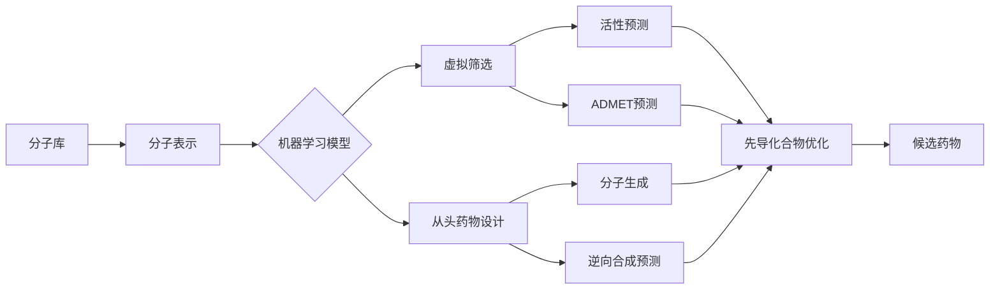

# 一切皆是映射：AI辅助的创新药物发现

## 1. 背景介绍
### 1.1 创新药物发现的重要性
#### 1.1.1 满足未被满足的医疗需求
#### 1.1.2 推动医学科学进步
#### 1.1.3 促进医药产业发展
### 1.2 创新药物发现面临的挑战  
#### 1.2.1 研发周期长、成本高
#### 1.2.2 候选化合物筛选难度大
#### 1.2.3 临床试验失败率高
### 1.3 人工智能在创新药物发现中的应用前景
#### 1.3.1 加速药物发现进程
#### 1.3.2 降低药物研发成本
#### 1.3.3 提高候选药物成功率

## 2. 核心概念与联系
### 2.1 分子表示学习
#### 2.1.1 分子指纹
#### 2.1.2 分子图表示
#### 2.1.3 分子描述符
### 2.2 机器学习模型
#### 2.2.1 支持向量机
#### 2.2.2 随机森林
#### 2.2.3 深度学习
### 2.3 虚拟筛选
#### 2.3.1 基于配体的虚拟筛选
#### 2.3.2 基于结构的虚拟筛选
#### 2.3.3 基于药效团的虚拟筛选
### 2.4 从头药物设计
#### 2.4.1 基于片段的药物设计
#### 2.4.2 基于深度生成模型的药物设计
#### 2.4.3 逆向合成路线设计

## 3. 核心算法原理具体操作步骤
### 3.1 图神经网络(GNN)用于分子表示学习
#### 3.1.1 消息传递神经网络(MPNN) 
#### 3.1.2 注意力机制图神经网络
#### 3.1.3 图同构网络(GIN)
### 3.2 变分自编码器(VAE)用于从头药物设计
#### 3.2.1 基于SMILES的VAE
#### 3.2.2 基于分子图的JTVAE
#### 3.2.3 用于逆向合成路线预测的SCROP
### 3.3 分子对接算法
#### 3.3.1 基于物理的打分函数
#### 3.3.2 基于机器学习的打分函数 
#### 3.3.3 基于共晶结构的对接方法

## 4. 数学模型和公式详细讲解举例说明
### 4.1 图卷积神经网络
$$h_i^{(l+1)} = \sigma\left(\sum_{j \in \mathcal{N}(i)} \frac{1}{c_{ij}} W^{(l)} h_j^{(l)}\right)$$
其中$h_i^{(l)}$表示第$l$层第$i$个节点的特征，$\mathcal{N}(i)$表示节点$i$的邻居节点集合，$c_{ij}$是归一化常数，$W^{(l)}$是权重矩阵，$\sigma$是激活函数。

### 4.2 变分自编码器
$$\mathcal{L}(\theta, \phi) = \mathbb{E}_{q_{\phi}(z|x)}[\log p_{\theta}(x|z)] - D_{KL}(q_{\phi}(z|x) || p(z))$$
其中$\theta$和$\phi$分别是解码器和编码器的参数，$q_{\phi}(z|x)$是近似后验分布，$p_{\theta}(x|z)$是解码器的输出分布，$p(z)$是先验分布，$D_{KL}$表示KL散度。

### 4.3 AutoDock打分函数
$$\Delta G = \Delta G_{vdw} + \Delta G_{hbond} + \Delta G_{elec} + \Delta G_{tor} + \Delta G_{sol}$$
其中$\Delta G_{vdw}$表示范德华力，$\Delta G_{hbond}$表示氢键作用，$\Delta G_{elec}$表示静电作用，$\Delta G_{tor}$表示构象熵，$\Delta G_{sol}$表示溶剂化自由能。

## 5. 项目实践：代码实例和详细解释说明
### 5.1 使用PyTorch Geometric实现图卷积神经网络

```python
import torch
from torch_geometric.nn import GCNConv

class GCN(torch.nn.Module):
    def __init__(self, in_channels, hidden_channels, out_channels):
        super().__init__()
        self.conv1 = GCNConv(in_channels, hidden_channels)
        self.conv2 = GCNConv(hidden_channels, out_channels)

    def forward(self, x, edge_index):
        x = self.conv1(x, edge_index)
        x = torch.relu(x)
        x = self.conv2(x, edge_index)
        return x
```

这段代码定义了一个两层的图卷积神经网络。`GCNConv`是PyTorch Geometric提供的图卷积层，它接受节点特征和边索引作为输入，对节点特征进行聚合和转换。`forward`函数定义了前向传播过程，先经过第一个图卷积层，然后经过ReLU激活，最后经过第二个图卷积层得到输出。

### 5.2 使用RDKit和DeepChem进行虚拟筛选

```python
import deepchem as dc
from rdkit import Chem

# 加载分子数据集
loader = dc.data.CSVLoader(["smiles", "label"], feature_field="smiles", 
                           featurizer=dc.feat.CircularFingerprint(size=1024))
dataset = loader.create_dataset("data.csv")

# 划分训练集和测试集
splitter = dc.splits.ScaffoldSplitter()
train_dataset, test_dataset = splitter.train_test_split(dataset)

# 定义模型
model = dc.models.GraphConvModel(n_tasks=1, mode='classification',
                                 dropout=0.2, learning_rate=0.001)

# 训练模型
model.fit(train_dataset, nb_epoch=50)

# 在测试集上评估模型
metric = dc.metrics.Metric(dc.metrics.roc_auc_score)
print("Test set AUC: ", model.evaluate(test_dataset, [metric]))

# 对新分子进行预测
smiles = ["CC(=O)OC1=CC=CC=C1C(=O)O", "CN1C=NC2=C1C(=O)N(C)C(=O)N2C"]
mols = [Chem.MolFromSmiles(s) for s in smiles] 
feats = dc.feat.ConvMolFeaturizer().featurize(mols)
preds = model.predict_on_batch(dc.data.NumpyDataset(feats))
print("Predictions: ", preds)
```

这段代码展示了如何使用RDKit和DeepChem进行虚拟筛选。首先使用`CSVLoader`加载分子数据集，并使用`CircularFingerprint`计算分子指纹作为特征。然后使用`ScaffoldSplitter`按脚手架将数据集划分为训练集和测试集。接着定义一个图卷积模型`GraphConvModel`，并在训练集上训练模型。在测试集上评估模型性能，使用ROC AUC作为评价指标。最后，对新的分子进行预测，先将SMILES转换为RDKit分子对象，然后使用`ConvMolFeaturizer`计算分子特征，再将特征输入模型进行预测。

## 6. 实际应用场景
### 6.1 抗癌药物发现
#### 6.1.1 基于靶点的抗癌药物筛选
#### 6.1.2 基于表型的抗癌药物筛选
#### 6.1.3 抗癌药物的组合治疗优化
### 6.2 抗菌药物发现 
#### 6.2.1 针对耐药菌的新型抗生素设计
#### 6.2.2 抗病毒药物的发现
#### 6.2.3 抗真菌药物的优化
### 6.3 神经退行性疾病药物发现
#### 6.3.1 阿尔茨海默症药物设计
#### 6.3.2 帕金森症药物优化
#### 6.3.3 渐冻症药物筛选

## 7. 工具和资源推荐
### 7.1 分子表示和特征化
- RDKit: 化学信息学和机器学习软件
- DeepChem: 用于药物发现的深度学习工具包 
- OpenEye: 化学信息学软件套件
### 7.2 机器学习平台
- PyTorch: 基于Python的深度学习框架
- TensorFlow: 端到端的机器学习平台
- scikit-learn: 基于Python的机器学习库
### 7.3 分子对接和虚拟筛选
- AutoDock: 分子对接套件
- Glide: 用于高通量虚拟筛选的分子对接程序
- GOLD: 基于遗传算法的分子对接软件
### 7.4 从头药物设计
- REINVENT: 基于深度学习的从头药物设计平台
- GLN: 用于从头药物设计的图学习网络
- GENTRL: 基于Transformer的药物生成模型

## 8. 总结：未来发展趋势与挑战
### 8.1 多模态数据融合
#### 8.1.1 整合化学、生物学和临床数据
#### 8.1.2 利用知识图谱指导药物发现
#### 8.1.3 多组学数据驱动的药物发现
### 8.2 药物可解释性与安全性
#### 8.2.1 解释机器学习模型的预测结果
#### 8.2.2 基于因果推理的药物安全性评估
#### 8.2.3 药物不良反应预测与监测
### 8.3 精准医疗与个性化药物设计
#### 8.3.1 基于患者分子特征的个性化药物设计
#### 8.3.2 利用真实世界数据优化药物使用
#### 8.3.3 基于人工智能的精准给药策略

## 9. 附录：常见问题与解答
### 9.1 如何选择合适的分子表示方法？
分子表示方法的选择取决于具体的任务和数据特点。对于虚拟筛选任务，通常使用分子指纹等固定长度的表示方法。对于从头药物设计任务，通常使用基于图的表示方法，如分子图或者SMILES序列。此外，还可以根据数据的特点，如分子大小、官能团等，选择不同的分子描述符。最好通过实验比较不同表示方法在特定任务上的性能，从而选择最优的方法。

### 9.2 深度学习模型的超参数如何调节？
深度学习模型的超参数调节是一个试错的过程，需要根据具体问题和数据集来进行调节。一些常见的超参数包括学习率、批量大小、网络深度和宽度、正则化系数等。可以先使用较小的学习率和批量大小，根据训练过程中的损失函数和评价指标的变化情况，逐步调整超参数。此外，还可以使用一些自动化的超参数搜索方法，如网格搜索、随机搜索、贝叶斯优化等，来帮助寻找最优的超参数组合。

### 9.3 如何处理不平衡数据集？
不平衡数据集是指不同类别的样本数量差异较大的数据集，如阳性样本远少于阴性样本。处理不平衡数据集的常见方法包括：
1. 欠采样：从多数类中随机去除一些样本，使得不同类别的样本数量接近。
2. 过采样：对少数类样本进行重复采样，增加其数量。
3. 合成样本：通过插值、旋转、噪声等方式，合成新的少数类样本。
4. 代价敏感学习：在模型训练时，对不同类别的样本赋予不同的权重或惩罚。
5. 集成学习：训练多个模型，每个模型侧重于不同的类别，最后将它们的预测结果结合起来。

在实践中，可以根据具体问题和数据集的特点，选择合适的方法或者将多种方法结合起来使用，提高模型在不平衡数据集上的性能。



作者：禅与计算机程序设计艺术 / Zen and the Art of Computer Programming