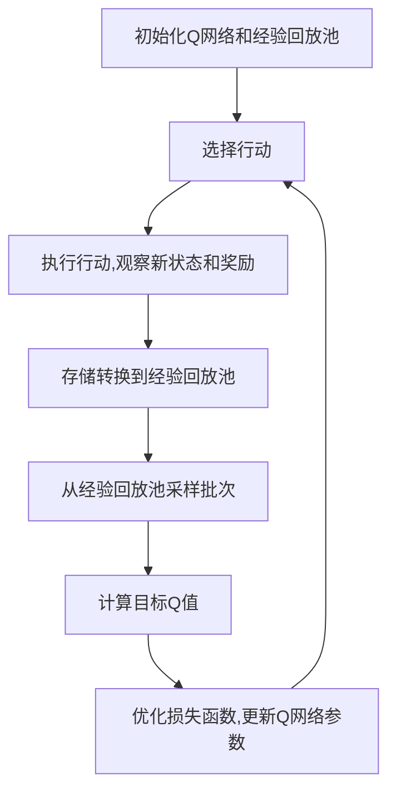
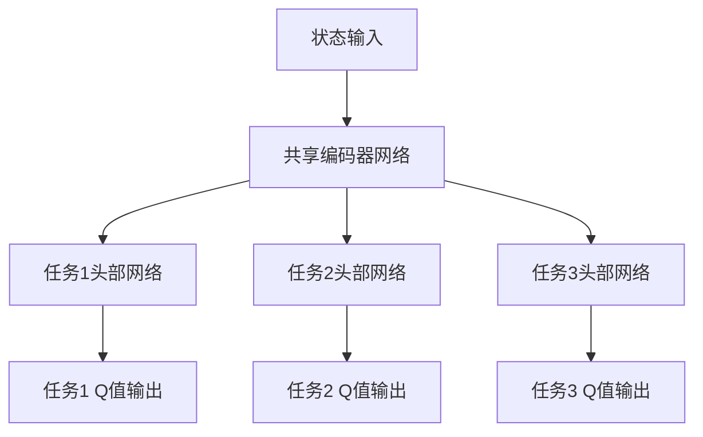
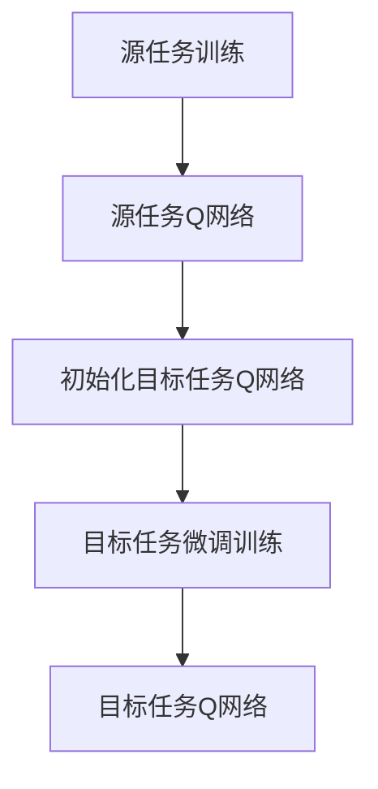

# 一切皆是映射：DQN的多任务学习与迁移学习策略探讨

## 1.背景介绍

### 1.1 强化学习与深度Q网络

强化学习是机器学习的一个重要分支,旨在通过与环境的交互来学习如何采取最优行动。在强化学习中,智能体(agent)与环境(environment)交互,根据当前状态选择行动,然后接收来自环境的反馈(奖励或惩罚),并更新其策略以获得更大的累积奖励。

深度Q网络(Deep Q-Network, DQN)是一种结合深度神经网络和Q学习的强化学习算法,由DeepMind于2015年提出。DQN通过使用深度神经网络来近似Q函数,从而能够处理高维状态空间,并在许多复杂任务中取得了出色的表现。

### 1.2 多任务学习与迁移学习的重要性

在实际应用中,智能体通常需要解决多个相关但不同的任务。传统的强化学习方法是为每个任务单独训练一个智能体,这种方式效率低下且浪费资源。多任务学习(Multi-Task Learning, MTL)旨在同时学习多个相关任务,利用不同任务之间的相关性来提高学习效率和性能。

另一方面,迁移学习(Transfer Learning)则是将在一个任务上学习到的知识迁移到另一个相关任务上,从而加速新任务的学习过程。在强化学习领域,迁移学习可以帮助智能体快速适应新环境,提高学习效率。

### 1.3 DQN在多任务学习和迁移学习中的应用

DQN作为一种强大的深度强化学习算法,在多任务学习和迁移学习领域具有广泛的应用前景。本文将探讨如何将DQN应用于多任务学习和迁移学习,以提高智能体在复杂环境中的学习效率和性能。

## 2.核心概念与联系

### 2.1 深度Q网络(DQN)

DQN算法的核心思想是使用深度神经网络来近似Q函数,即状态-行动值函数。Q函数定义为在给定状态下采取某个行动后可获得的期望累积奖励。通过训练深度神经网络来近似Q函数,DQN可以在复杂的状态空间中学习最优策略。

DQN算法的主要步骤如下:

1. 初始化深度神经网络Q(s,a;θ)和经验回放池D。
2. 对于每个时间步:
   - 根据当前状态s_t,选择行动a_t = argmax_a Q(s_t,a;θ)。
   - 执行行动a_t,观察下一个状态s_{t+1}和奖励r_t。
   - 将转换(s_t,a_t,r_t,s_{t+1})存储到经验回放池D中。
   - 从经验回放池D中采样一批转换(s_j,a_j,r_j,s_{j+1})。
   - 计算目标Q值y_j = r_j + γ max_a' Q(s_{j+1},a';θ^-)。
   - 优化损失函数L(θ) = E[(y_j - Q(s_j,a_j;θ))^2]以更新网络参数θ。

其中,θ^-表示目标网络的参数,用于计算目标Q值,以提高训练的稳定性。经验回放池D用于存储过去的转换,以打破相关性并提高数据利用效率。

### 2.2 多任务学习(MTL)

多任务学习旨在同时学习多个相关但不同的任务,利用不同任务之间的相关性来提高学习效率和性能。在DQN的多任务学习中,我们可以使用共享的Q网络来近似多个任务的Q函数,同时为每个任务维护一个单独的输出头。

具体来说,我们可以将Q网络分为两部分:共享的编码器网络和任务特定的头部网络。编码器网络用于从状态中提取通用的特征表示,而头部网络则根据提取的特征计算特定任务的Q值。在训练过程中,我们可以通过共享编码器网络来利用不同任务之间的相关性,同时允许头部网络专门学习每个任务的特定知识。

### 2.3 迁移学习(Transfer Learning)

迁移学习旨在将在一个任务上学习到的知识迁移到另一个相关任务上,从而加速新任务的学习过程。在DQN的迁移学习中,我们可以利用在源任务上训练好的Q网络作为初始化,然后在目标任务上进行微调,以加速目标任务的学习过程。

具体来说,我们可以首先在源任务上训练一个Q网络,然后将其作为初始化网络,在目标任务上进行进一步的训练。由于源任务和目标任务之间存在一定的相关性,因此源任务上学习到的知识可以为目标任务提供有用的先验知识,从而加速目标任务的学习过程。

## 3.核心算法原理具体操作步骤

### 3.1 DQN的多任务学习算法

DQN的多任务学习算法可以概括为以下步骤:

1. 初始化共享的编码器网络和多个任务特定的头部网络,以及对应的经验回放池。
2. 对于每个时间步:
   - 对于每个任务,根据当前状态s_t,选择行动a_t = argmax_a Q_k(s_t,a;θ_k),其中Q_k表示第k个任务的Q网络。
   - 执行行动a_t,观察下一个状态s_{t+1}和奖励r_t。
   - 将转换(s_t,a_t,r_t,s_{t+1},k)存储到对应任务k的经验回放池D_k中。
   - 对于每个任务k:
     - 从经验回放池D_k中采样一批转换(s_j,a_j,r_j,s_{j+1})。
     - 计算目标Q值y_j = r_j + γ max_a' Q_k(s_{j+1},a';θ_k^-)。
     - 优化损失函数L_k(θ_k) = E[(y_j - Q_k(s_j,a_j;θ_k))^2]以更新任务k的头部网络参数θ_k。
   - 定期更新目标网络参数θ_k^-。

在这种算法中,我们为每个任务维护一个单独的头部网络和经验回放池,但共享同一个编码器网络。这样可以利用不同任务之间的相关性来提高学习效率,同时允许每个任务专门学习自己的特定知识。

### 3.2 DQN的迁移学习算法

DQN的迁移学习算法可以概括为以下步骤:

1. 在源任务上训练一个Q网络Q_s(s,a;θ_s)。
2. 初始化目标任务的Q网络Q_t(s,a;θ_t)使用源任务Q网络的参数θ_s作为初始化。
3. 在目标任务上进行训练:
   - 对于每个时间步:
     - 根据当前状态s_t,选择行动a_t = argmax_a Q_t(s_t,a;θ_t)。
     - 执行行动a_t,观察下一个状态s_{t+1}和奖励r_t。
     - 将转换(s_t,a_t,r_t,s_{t+1})存储到经验回放池D_t中。
     - 从经验回放池D_t中采样一批转换(s_j,a_j,r_j,s_{j+1})。
     - 计算目标Q值y_j = r_j + γ max_a' Q_t(s_{j+1},a';θ_t^-)。
     - 优化损失函数L_t(θ_t) = E[(y_j - Q_t(s_j,a_j;θ_t))^2]以更新目标任务Q网络参数θ_t。
   - 定期更新目标网络参数θ_t^-。

在这种算法中,我们首先在源任务上训练一个Q网络,然后将其作为初始化网络,在目标任务上进行进一步的训练。由于源任务和目标任务之间存在一定的相关性,因此源任务上学习到的知识可以为目标任务提供有用的先验知识,从而加速目标任务的学习过程。

## 4.数学模型和公式详细讲解举例说明

### 4.1 Q学习

Q学习是一种基于时间差分的强化学习算法,旨在学习状态-行动值函数Q(s,a),表示在状态s下采取行动a后可获得的期望累积奖励。Q函数可以通过下式进行更新:

$$Q(s_t, a_t) \leftarrow Q(s_t, a_t) + \alpha \left[ r_t + \gamma \max_{a} Q(s_{t+1}, a) - Q(s_t, a_t) \right]$$

其中:

- $\alpha$ 是学习率,控制了新信息对Q值的影响程度。
- $\gamma$ 是折扣因子,用于平衡当前奖励和未来奖励的权重。
- $r_t$ 是在时间步t获得的即时奖励。
- $\max_{a} Q(s_{t+1}, a)$ 是在下一个状态s_{t+1}下采取最优行动可获得的期望累积奖励。

通过不断更新Q函数,我们可以学习到最优策略,即在每个状态下选择能够最大化期望累积奖励的行动。

### 4.2 深度Q网络(DQN)

深度Q网络(DQN)是一种结合深度神经网络和Q学习的强化学习算法。DQN使用深度神经网络来近似Q函数,即:

$$Q(s, a; \theta) \approx Q^*(s, a)$$

其中$\theta$是神经网络的参数,Q^*(s,a)是真实的Q函数。

在训练过程中,我们可以通过最小化下式来优化神经网络参数$\theta$:

$$L(\theta) = \mathbb{E}_{(s, a, r, s')\sim D}\left[ \left(r + \gamma \max_{a'} Q(s', a'; \theta^-) - Q(s, a; \theta)\right)^2 \right]$$

其中:

- D是经验回放池,用于存储过去的转换(s,a,r,s')。
- $\theta^-$是目标网络的参数,用于计算目标Q值,以提高训练的稳定性。

通过不断优化神经网络参数$\theta$,我们可以得到一个近似于真实Q函数的神经网络模型,从而在复杂的状态空间中学习最优策略。

### 4.3 多任务学习中的损失函数

在DQN的多任务学习中,我们可以使用共享的编码器网络和任务特定的头部网络来近似多个任务的Q函数。对于第k个任务,我们可以定义如下损失函数:

$$L_k(\theta_k, \phi) = \mathbb{E}_{(s, a, r, s')\sim D_k}\left[ \left(r + \gamma \max_{a'} Q_k(s', a'; \theta_k^-, \phi^-) - Q_k(s, a; \theta_k, \phi)\right)^2 \right]$$

其中:

- $\theta_k$是第k个任务的头部网络参数。
- $\phi$是共享的编码器网络参数。
- $\theta_k^-$和$\phi^-$分别是第k个任务的目标头部网络参数和目标编码器网络参数。
- $D_k$是第k个任务的经验回放池。

我们可以通过最小化所有任务的加权损失函数来优化网络参数:

$$L(\theta_1, \theta_2, \ldots, \theta_K, \phi)