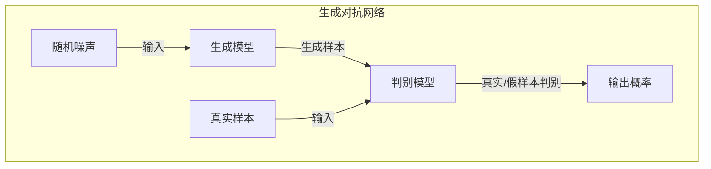
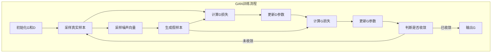

# 一切皆是映射：GAN在艺术创作中的应用实例

## 1.背景介绍

### 1.1 人工智能与艺术创作的交汇

人工智能(AI)技术在近年来取得了长足的进步,不仅在科学计算、自动驾驶等传统领域发挥着重要作用,而且还渗透到了艺术创作的领域。作为深度学习领域的一个重要分支,生成对抗网络(Generative Adversarial Networks,GAN)展现出了在图像生成、音乐创作等艺术领域的巨大潜力。

### 1.2 GAN的本质:生成对抗

GAN是一种由生成网络(Generator)和判别网络(Discriminator)组成的生成模型。生成网络从噪声数据中生成假样本,而判别网络则需要判断输入是真实样本还是生成网络生成的假样本。两个网络相互对抗、相互博弈,最终达到生成网络生成的假样本以假乱真的效果。

### 1.3 艺术创作中的GAN应用

在艺术创作领域,GAN可以用于生成逼真的图像、音乐等艺术作品,为艺术家提供创作灵感和素材。同时,GAN也可以辅助艺术风格迁移、图像修复等任务,为艺术家提供高效的辅助工具。本文将重点探讨GAN在艺术创作中的应用实例,揭示其背后的原理和实现方法。

## 2.核心概念与联系

### 2.1 生成模型与判别模型

生成模型(Generator)是GAN的核心部分之一,它的作用是从随机噪声中生成逼真的假样本数据。生成模型通常由一个深度神经网络构成,将随机噪声作为输入,经过多层非线性变换,最终输出所需的样本数据(如图像、音频等)。

判别模型(Discriminator)是GAN的另一个核心部分,它的作用是判断输入数据是真实样本还是生成模型生成的假样本。判别模型同样由一个深度神经网络构成,将真实样本或生成样本作为输入,经过多层非线性变换,最终输出一个0到1之间的概率值,表示输入数据是真实样本的概率。

生成模型和判别模型在GAN中是相互对抗的关系。生成模型的目标是生成足够逼真的假样本来欺骗判别模型,而判别模型则需要尽可能准确地将真实样本和生成样本区分开来。通过这种对抗训练,生成模型和判别模型都会不断提升自身的性能,最终使得生成模型能够生成高质量的样本数据。

### 2.2 GAN的损失函数

GAN的训练过程实际上是一个最小化生成模型和判别模型的联合损失函数的过程。生成模型的损失函数是期望判别模型将其生成的样本判别为假样本的概率最小,而判别模型的损失函数则是期望能够正确判别出真实样本和生成样本。

具体来说,生成模型G的损失函数可以表示为:

$$J^{(G)}(G) = \mathbb{E}_{z\sim p_z(z)}[log(1-D(G(z)))]$$

其中,z是从噪声先验分布$p_z(z)$中采样得到的噪声向量,G(z)是生成模型根据噪声z生成的假样本,$D(G(z))$表示判别模型对假样本的判别结果(0到1之间的概率值)。生成模型的目标是最小化这个损失函数,使得判别模型判别其生成的样本为假样本的概率最小。

判别模型D的损失函数可以表示为:

$$J^{(D)}(D) = -\mathbb{E}_{x\sim p_{data}(x)}[log(D(x))] - \mathbb{E}_{z\sim p_z(z)}[log(1-D(G(z)))]$$

其中,x是从真实数据分布$p_{data}(x)$中采样得到的真实样本,D(x)表示判别模型对真实样本的判别结果。判别模型的目标是最大化这个损失函数,使得能够正确判别出真实样本和生成样本。

通过交替优化生成模型和判别模型的损失函数,GAN可以达到生成高质量样本的目的。

## 3.核心算法原理具体操作步骤 

### 3.1 GAN训练流程

GAN的训练过程可以概括为以下步骤:

1. 初始化生成模型G和判别模型D的参数
2. 从真实数据集中采样一个批次的真实样本
3. 从噪声先验分布中采样一个批次的噪声向量
4. 使用生成模型G根据噪声向量生成一个批次的假样本
5. 计算判别模型D对真实样本和假样本的判别结果
6. 计算判别模型D的损失函数,并使用反向传播算法更新D的参数
7. 计算生成模型G的损失函数,并使用反向传播算法更新G的参数
8. 重复步骤2-7,直到模型收敛或达到预设的迭代次数

在每个训练迭代中,判别模型D首先被训练以提高对真实样本和生成样本的判别能力。然后,生成模型G被训练以生成更加逼真的假样本,从而欺骗判别模型D。通过这种对抗式的训练方式,生成模型G和判别模型D都会不断提高自身的性能。

### 3.2 GAN训练的挑战与优化策略

尽管GAN具有强大的生成能力,但训练GAN模型并非一蹴而就。GAN训练过程中存在一些典型的挑战和问题,如模式崩溃(mode collapse)、生成样本质量不佳等。为了解决这些问题,研究人员提出了多种优化策略,例如:

1. **改进损失函数**: 传统的GAN损失函数存在一些缺陷,如梯度饱和、不稳定等问题。研究人员提出了改进的损失函数,如Wasserstein GAN(WGAN)损失函数、最小二乘GAN(LSGAN)损失函数等,以提高GAN的训练稳定性。

2. **正则化技术**: 引入正则化技术可以提高GAN的生成质量和训练稳定性。常用的正则化技术包括梯度惩罚(Gradient Penalty)、层归一化(Layer Normalization)等。

3. **架构改进**: 改进生成模型和判别模型的网络架构,可以提高GAN的生成能力。例如,引入残差连接(Residual Connection)、注意力机制(Attention Mechanism)等,可以增强网络的表达能力。

4. **条件生成**: 在GAN中引入条件信息(如类别标签、文本描述等),可以实现条件生成,生成符合特定条件的样本。这为GAN在艺术创作中的应用提供了更大的灵活性。

5. **多模态生成**: 传统的GAN主要用于生成单一模态的数据(如图像)。研究人员提出了多模态GAN,能够同时生成多种模态的数据,如图像和文本、视频和音频等,拓展了GAN在多模态艺术创作中的应用范围。

通过采用这些优化策略,GAN的训练过程可以变得更加稳定和高效,生成的样本质量也会得到显著提升。

## 4.数学模型和公式详细讲解举例说明

### 4.1 GAN的基本数学模型

在数学上,GAN可以被建模为一个min-max优化问题,目标是找到一个生成模型G和一个判别模型D,使得它们的联合损失函数最小化。具体来说,GAN的目标函数可以表示为:

$$\min_G \max_D V(D,G) = \mathbb{E}_{x\sim p_{data}(x)}[\log D(x)] + \mathbb{E}_{z\sim p_z(z)}[\log (1-D(G(z)))]$$

其中,$p_{data}(x)$是真实数据分布,$p_z(z)$是噪声先验分布,G(z)表示生成模型根据噪声z生成的假样本,D(x)和D(G(z))分别表示判别模型对真实样本x和生成样本G(z)的判别结果。

这个目标函数实际上是生成模型G和判别模型D的损失函数之和。判别模型D的目标是最大化这个目标函数,使得能够正确判别出真实样本和生成样本。而生成模型G的目标是最小化这个目标函数,使得判别模型无法区分其生成的样本和真实样本。

在理想情况下,当G和D达到纳什均衡时,生成模型G学习到的分布$p_g$与真实数据分布$p_{data}$完全一致,即$p_g = p_{data}$。此时,判别模型D无法区分真实样本和生成样本,对于任意输入x,都有D(x) = 1/2。

然而,在实际训练过程中,由于GAN的优化问题是一个非凸优化问题,很难找到全局最优解。因此,GAN训练通常会陷入一些局部最优解或出现模式崩溃等问题。为了缓解这些问题,研究人员提出了多种改进的GAN变体和优化策略,以提高GAN的训练稳定性和生成质量。

### 4.2 WGAN及其改进

Wasserstein GAN(WGAN)是一种改进的GAN变体,它通过改变GAN的目标函数,使得优化问题变为一个更加稳定的Wasserstein距离最小化问题。WGAN的目标函数可以表示为:

$$\min_G \max_{D\in\mathcal{D}} \mathbb{E}_{x\sim p_{data}(x)}[D(x)] - \mathbb{E}_{z\sim p_z(z)}[D(G(z))]$$

其中,$\mathcal{D}$是所有1-Lipschitz连续函数的集合,即满足$\|D(x_1) - D(x_2)\| \leq \|x_1 - x_2\|$的函数集合。

WGAN通过强加1-Lipschitz约束,使得判别模型D的梯度范数被限制在一个紧凑集合内,从而避免了梯度饱和和模式崩溃等问题,提高了GAN的训练稳定性。

然而,直接强加1-Lipschitz约束并不容易实现。因此,WGAN提出了一种梯度惩罚(Gradient Penalty)的方法来近似实现1-Lipschitz约束。具体来说,WGAN的目标函数被修改为:

$$\min_G \max_D \mathbb{E}_{x\sim p_{data}(x)}[D(x)] - \mathbb{E}_{z\sim p_z(z)}[D(G(z))] - \lambda \mathbb{E}_{\hat{x}\sim p_{\hat{x}}}[(\|\nabla_{\hat{x}}D(\hat{x})\|_2 - 1)^2]$$

其中,$\lambda$是一个超参数,用于控制梯度惩罚项的权重。$p_{\hat{x}}$是真实数据分布和生成数据分布的插值分布,即$\hat{x} = \epsilon x + (1-\epsilon)G(z)$,其中$\epsilon$是一个均匀随机变量。

通过引入梯度惩罚项,WGAN可以近似地满足1-Lipschitz约束,从而提高了GAN的训练稳定性和生成质量。WGAN及其改进版本(如WGAN-GP、SN-GAN等)在图像生成、风格迁移等任务中取得了优异的表现。

### 4.3 StyleGAN及其改进

StyleGAN是一种专门用于生成高质量人脸图像的GAN架构,它通过引入自适应实例归一化(Adaptive Instance Normalization,AdaIN)和噪声注入等技术,大幅提高了生成图像的质量和多样性。

StyleGAN的核心思想是将传统生