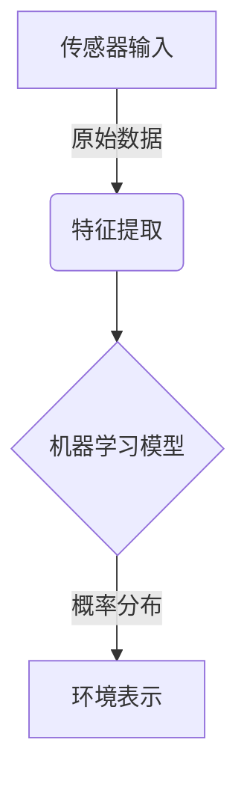
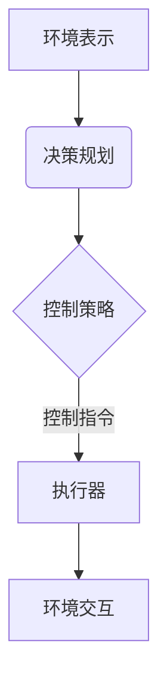
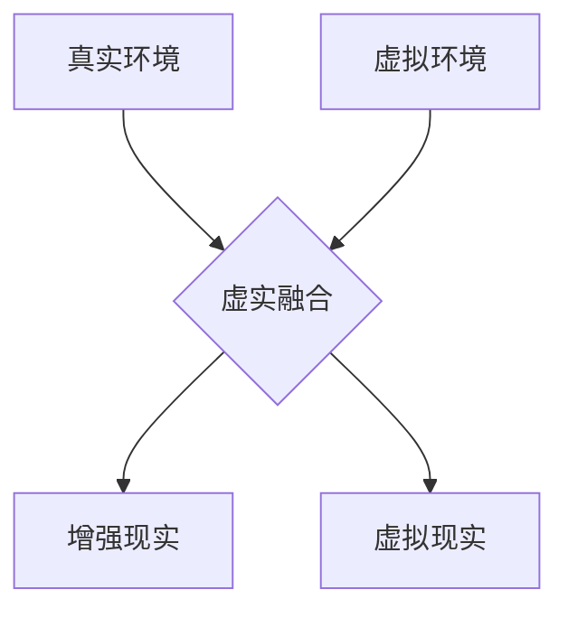

# 一切皆是映射：具象化人工智能：从数字到现实世界

## 1.背景介绍

### 1.1 人工智能的崛起

人工智能(Artificial Intelligence, AI)已经成为当代科技发展的核心驱动力。从语音助手到自动驾驶汽车,从医疗诊断到金融分析,人工智能系统正在渗透到我们生活的方方面面。然而,传统的人工智能系统大多局限于数字领域,处理抽象的数字数据和符号。如何将人工智能的强大能力延伸到现实世界,并与物理环境紧密结合,是当前人工智能发展面临的重大挑战。

### 1.2 现实世界的复杂性

现实世界是一个高度复杂、多变和不确定的环境。它包含了无数的物体、事件和相互作用,这些要素相互影响、相互制约。要在这种复杂的环境中实现智能行为,需要人工智能系统具备对现实世界的深入理解和建模能力。然而,将抽象的数字世界与物理现实世界相互映射,并非一蹴而就的简单任务。

### 1.3 具象化人工智能的重要性

具象化人工智能(Embodied AI)旨在将人工智能系统与现实世界紧密融合,使其能够感知、理解和操纵物理环境。通过将传感器、执行器和决策系统集成到一个统一的框架中,具象化人工智能系统可以直接与现实世界交互,实现智能行为。这不仅有助于扩展人工智能的应用范围,还能促进人工智能技术的发展,为解决现实世界中的复杂问题提供新的思路和方法。

## 2.核心概念与联系

### 2.1 感知与建模

具象化人工智能系统的核心任务之一是感知和建模现实世界。通过各种传感器(如相机、雷达、激光雷达等),系统可以获取环境的视觉、声音、深度等多模态信息。然后,利用机器学习和计算机视觉等技术,从原始数据中提取有意义的特征,构建对环境的内部表示。

这种环境表示不仅包括静态的物体和场景,还需要捕捉动态过程和相互作用,形成对环境的全面理解。

### 2.2 决策与控制

基于对环境的理解,具象化人工智能系统需要做出智能决策,并通过执行器(如机械臂、机器人等)对环境进行操作。这涉及规划、决策和控制等多个环节,需要综合考虑任务目标、环境约束和不确定性等多种因素。

在这个过程中,系统需要持续学习和适应,根据环境的变化动态调整策略,形成一个闭环的感知-决策-行动循环。

### 2.3 虚实融合

具象化人工智能不仅需要处理真实的物理环境,还需要与虚拟环境紧密结合。一方面,可以在仿真环境中预先训练和测试智能系统,避免在真实环境中出现安全隐患。另一方面,虚实融合技术可以将虚拟信息与现实环境无缝集成,为人机交互提供增强现实(AR)和虚拟现实(VR)等新型交互方式。

通过虚实融合,具象化人工智能系统可以更好地理解和操纵现实世界,同时为人类提供更自然、更身临其境的交互体验。

## 3.核心算法原理具体操作步骤  

### 3.1 感知与建模算法

#### 3.1.1 计算机视觉算法

计算机视觉是具象化人工智能感知环境的关键技术之一。常用的计算机视觉算法包括:

1. **目标检测(Object Detection)**:在图像或视频中定位并识别出感兴趣的目标物体,如人、车辆、交通标志等。典型算法有YOLO、Faster R-CNN等。

2. **语义分割(Semantic Segmentation)**:将图像像素级别上进行分类,为每个像素赋予语义标签,如人、车、道路、建筑物等。常用算法有FCN、DeepLab、Mask R-CNN等。

3. **实例分割(Instance Segmentation)**:在语义分割的基础上,将属于同一类别的不同实例进行区分。

4. **3D重建**:从2D图像或多视角信息重建出3D场景的几何和深度信息。经典算法有结构光、视觉SLAM等。

5. **动作识别**:从视频序列中识别出人体的动作,如行走、跳跃、挥手等。

这些算法通常基于深度学习模型(如卷积神经网络)实现,对大量标注数据进行训练。

#### 3.1.2 多模态感知融合

除了视觉信息外,具象化人工智能系统还需要融合其他模态的传感器数据,如声音、深度、力触等,形成对环境的多模态表示。常用的多模态融合方法包括:

1. **早期融合**:在特征提取阶段对不同模态的数据进行融合。

2. **晚期融合**:分别对每一模态数据进行特征提取,然后在更高层次上融合不同模态的特征。

3. **中间融合**:在深度网络的中间层对不同模态的特征进行融合。

4. **注意力融合**:使用注意力机制动态调节不同模态特征的权重。

无论采用何种融合策略,都需要设计合适的网络架构来有效地捕获不同模态之间的相关性。

#### 3.1.3 时序建模

现实世界是一个动态变化的过程,具象化人工智能系统需要对时序数据进行建模,捕捉环境的动态演变。常用的时序建模方法包括:

1. **递归神经网络(RNN)**:可以对序列数据进行有效建模,如长短期记忆网络(LSTM)、门控循环单元(GRU)等。

2. **时间卷积网络(TCN)**:使用一维卷积层对时序数据进行建模,具有并行计算的优势。

3. **注意力机制**:通过自注意力机制捕获时序数据中长期依赖关系,如Transformer等。

4. **图神经网络(GNN)**:将时序数据建模为时空图,通过图卷积等操作对其进行处理。

除了对单一模态的时序数据建模外,还需要对多模态的时序数据进行融合,以捕捉不同模态之间的相互影响和约束。

#### 3.1.4 概率图模型

概率图模型(如贝叶斯网络、马尔可夫随机场等)是表示和推理复杂系统不确定性的有效工具。在具象化人工智能中,概率图模型可用于:

1. **多模态融合**:通过概率推理融合来自不同模态的不确定信息。

2. **时序推理**:对动态环境进行时序推理,预测未来状态。

3. **因果建模**:建立环境中各个要素之间的因果关系模型。

4. **主观推理**:融合主观先验知识和客观观测数据进行推理。

5. **规划与决策**:在存在不确定性的情况下进行规划和决策。

概率图模型为具象化人工智能系统提供了一种统一的框架,能够有效处理现实世界中的不确定性和复杂性。

### 3.2 决策与控制算法

#### 3.2.1 强化学习

强化学习(Reinforcement Learning)是具象化人工智能系统进行决策和控制的核心算法之一。它通过与环境的交互,不断尝试不同的行为策略,根据获得的奖励信号调整策略,最终学习到最优策略。常用的强化学习算法包括:

1. **值函数方法**:如Q-Learning、Sarsa等,通过估计状态(或状态-行为对)的值函数来学习最优策略。

2. **策略梯度方法**:如REINFORCE、PPO等,直接对策略进行参数化,通过梯度上升优化策略参数。

3. **模型based方法**:显式建立环境动态模型,通过规划算法求解最优策略。

4. **多智能体强化学习**:在多个智能体之间进行协作或竞争,学习最优的交互策略。

强化学习算法在具象化人工智能中的应用场景包括机器人控制、自动驾驶、智能调度等。

#### 3.2.2 机器人运动规划

机器人运动规划是具象化人工智能系统与物理世界交互的关键环节。常用的运动规划算法包括:

1. **采样based算法**:如RRT、PRM等,通过在配置空间中随机采样生成运动轨迹。

2. **优化based算法**:将运动规划建模为优化问题,通过数学优化方法求解,如CHOMP、STOMP等。

3. **反向运动学**:根据期望的末端执行器位置,求解机器人各关节的运动轨迹。

4. **轨迹优化**:对初始轨迹进行优化,使其满足各种约束条件,如TRAJOPT等。

除了考虑机器人本身的运动约束外,还需要结合环境信息(如障碍物、动态目标等)进行全局路径规划,并实时根据环境变化进行重新规划。

#### 3.2.3 控制理论

控制理论为具象化人工智能系统与物理世界的交互提供了理论基础。常用的控制算法包括:

1. **PID控制**:经典的比例-积分-微分控制器,广泛应用于各种控制系统。

2. **最优控制**:将控制问题建模为最优化问题,通过动态规划、LQR等方法求解最优控制序列。

3. **鲁棒控制**:设计能够抵抗外部干扰和模型不确定性的鲁棒控制器,如H无穷控制等。

4. **自适应控制**:控制器能够在线识别系统参数,并自适应调整控制策略。

5. **非线性控制**:处理非线性系统的控制问题,如反步法、滑模控制等。

除了传统的控制理论外,近年来机器学习在控制领域的应用也日益广泛,如基于强化学习的控制、从数据中学习控制策略等。

### 3.3 虚实融合算法

#### 3.3.1 仿真与数据合成

在具象化人工智能系统的开发过程中,仿真和数据合成技术扮演着重要角色。通过构建高度真实的虚拟环境,可以安全、高效地训练和测试智能系统,避免在真实环境中出现安全隐患。常用的仿真引擎包括Gazebo、Carla、AirSim等。

除了几何和物理模拟外,还需要合成各种传感器数据(如RGB图像、深度图、点云等),以模拟真实环境中的感知过程。数据合成技术包括基于物理的渲染、基于深度学习的生成对抗网络等。

通过仿真和数据合成,可以快速构建大规模的训练数据集,缓解了真实数据采集的成本和困难。同时,还可以在虚拟环境中模拟各种极端和边缘情况,提高系统的鲁棒性。

#### 3.3.2 虚实对齐

虽然仿真环境可以较为真实地模拟现实世界,但由于建模误差和简化假设,仍然存在一定的虚实差异(Reality Gap)。因此,需要通过虚实对齐技术,缩小虚拟系统与真实系统之间的差距。常用的虚实对齐方法包括:

1. **域适应**:通过对抗训练或其他域适应技术,减小虚拟数据与真实数据之间的分布差异。

2. **模型修正**:根据真实环境中采集的数据,对仿真模型进行校准和修正。

3. **渐进式训练**:先在虚拟环境中预训练系统,然后在真实环境中继续微调,实现平