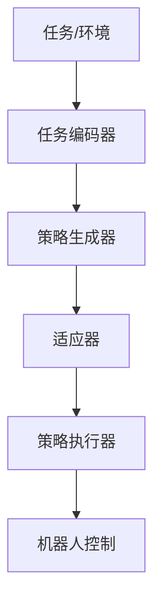

# 一切皆是映射：实现机器人快速适应性的元学习框架

## 1. 背景介绍

### 1.1 机器人适应性的重要性

在当今快速发展的科技时代,机器人正在越来越多的领域发挥着重要作用。无论是工业生产、家庭服务,还是探索未知环境,机器人都需要具备快速适应不同任务和环境的能力。传统的机器人控制方法通常需要针对特定任务进行大量的编程和调试,难以应对动态变化的现实世界。因此,如何赋予机器人快速适应性,使其能够像人类一样灵活地学习和完成各种任务,已经成为机器人领域亟待解决的关键问题。

### 1.2 元学习的兴起

近年来,元学习(Meta-Learning)作为一种实现快速适应性的新范式,受到了学术界和工业界的广泛关注。元学习,又称为"学会学习"(Learning to Learn),旨在通过学习如何学习的过程,使机器能够在面对新任务时快速适应和学习。与传统的机器学习方法不同,元学习不仅关注特定任务的训练,更注重从过去的学习经验中提取通用的知识和策略,从而实现在新任务上的快速学习和泛化。

### 1.3 本文的目标和贡献

本文旨在探索一种基于映射(Mapping)的元学习框架,以实现机器人的快速适应性。我们将从数学和计算机科学的角度出发,深入分析映射在元学习中的重要作用,并提出一种创新的元学习算法和架构。通过将任务和环境映射到机器人的策略空间,我们可以实现策略的快速生成和优化,使机器人能够在新环境中快速适应。本文的主要贡献如下:

1. 提出了一种基于映射的元学习框架,将任务和环境映射到策略空间,实现机器人的快速适应性。
2. 设计了一种高效的元学习算法,通过学习映射函数,实现策略的快速生成和优化。
3. 构建了一个模块化的元学习架构,包括任务编码器、策略生成器和适应器等关键组件。
4. 在仿真和真实机器人平台上进行了广泛的实验,验证了所提出方法的有效性和优越性。

## 2. 核心概念与联系

### 2.1 元学习的定义与分类

元学习是一种旨在学习如何学习的机器学习范式。与传统的机器学习方法专注于解决特定任务不同,元学习关注从过去的学习经验中提取通用的知识和策略,使机器能够在面对新任务时快速适应和学习。元学习可以分为以下三类:

1. 基于度量的元学习:通过学习任务之间的相似性度量,实现对新任务的快速适应。
2. 基于模型的元学习:通过学习任务的通用模型或优化过程,在新任务上进行快速优化。
3. 基于优化的元学习:通过学习优化算法本身的参数,实现对新任务的快速优化。

### 2.2 映射的数学定义与性质

映射是数学中的一个重要概念,描述了两个集合之间的对应关系。形式化地,映射可以定义为:

设 $X$ 和 $Y$ 是两个非空集合,如果存在一个法则 $f$,使得对于 $X$ 中的每个元素 $x$,在 $Y$ 中都有唯一确定的元素 $y$ 与之对应,则称 $f$ 为从 $X$ 到 $Y$ 的映射,记作 $f: X \rightarrow Y$。其中, $x$ 称为 $y$ 的原像, $y$ 称为 $x$ 的像。

映射具有以下重要性质:

1. 映射可以是单射、满射或双射。
2. 映射可以进行复合,即将多个映射组合成一个新的映射。
3. 映射可以进行逆运算,即找到一个映射的反函数。

### 2.3 映射在元学习中的作用

在本文提出的元学习框架中,映射扮演着关键的角色。我们利用映射将任务和环境映射到机器人的策略空间,实现策略的快速生成和优化。具体而言,映射在元学习中有以下作用:

1. 建立任务/环境与策略之间的对应关系,实现策略的快速生成。
2. 通过学习映射函数,捕捉任务/环境的共性和差异性,实现策略的快速优化。
3. 利用映射的复合和逆运算,实现策略的组合和泛化,提高适应性。

下图展示了映射在元学习框架中的核心作用:

## 3. 核心算法原理与具体操作步骤

### 3.1 元学习框架概述

本文提出的元学习框架由以下关键组件构成:

1. 任务编码器:将任务和环境信息编码为低维表示。
2. 策略生成器:根据任务编码生成初始策略。
3. 适应器:在新环境中快速优化策略参数。
4. 策略执行器:将优化后的策略应用于机器人控制。

下图展示了元学习框架的整体架构:

### 3.2 任务编码器

任务编码器的目标是将任务和环境信息编码为一个低维表示,用于后续的策略生成和优化。我们采用了基于图神经网络(Graph Neural Network, GNN)的编码方法。具体步骤如下:

1. 将任务和环境建模为一个图 $G=(V,E)$,其中节点 $v \in V$ 表示物体或地标,边 $e \in E$ 表示它们之间的关系。
2. 使用GNN对图进行编码,学习节点的嵌入表示 $h_v$。
3. 通过对节点嵌入进行池化,得到任务的整体编码 $z_G$。

GNN的前向传播过程可以表示为:

$$
h_v^{(l+1)} = \sigma \left(\sum_{u \in N(v)} W^{(l)} h_u^{(l)} + b^{(l)} \right)
$$

其中,$h_v^{(l)}$ 表示第 $l$ 层的节点嵌入,$N(v)$ 表示节点 $v$ 的邻居节点集合,$W^{(l)}$ 和 $b^{(l)}$ 分别表示第 $l$ 层的权重矩阵和偏置向量,$\sigma$ 是非线性激活函数。

### 3.3 策略生成器

策略生成器根据任务编码 $z_G$ 生成初始策略 $\pi_0$。我们使用了条件变分自编码器(Conditional Variational Autoencoder, CVAE)作为策略生成器。CVAE通过最大化如下的变分下界(Evidence Lower Bound, ELBO)来学习策略分布:

$$
\mathcal{L}(\theta,\phi;z_G,\pi) = \mathbb{E}_{q_\phi(\pi|z_G)}[\log p_\theta(z_G|\pi)] - D_{KL}(q_\phi(\pi|z_G) || p(\pi))
$$

其中,$\theta$ 和 $\phi$ 分别表示生成器和推断器的参数,$p_\theta(z_G|\pi)$ 表示生成模型,$q_\phi(\pi|z_G)$ 表示变分推断模型,$p(\pi)$ 是先验分布。

策略生成器的具体操作步骤如下:

1. 将任务编码 $z_G$ 输入到推断器 $q_\phi(\pi|z_G)$ 中,得到策略分布的参数。
2. 从策略分布中采样得到初始策略 $\pi_0$。
3. 将初始策略 $\pi_0$ 输入到生成器 $p_\theta(z_G|\pi)$ 中,重构任务编码。
4. 优化ELBO,更新生成器和推断器的参数。

### 3.4 适应器

适应器在新环境中快速优化策略参数,使策略能够适应新的任务。我们使用了基于梯度的元学习算法MAML(Model-Agnostic Meta-Learning)作为适应器。MAML的目标是学习一个初始化参数 $\theta$,使得策略在经过少量梯度更新后,能够快速适应新任务。

MAML的优化过程可以表示为:

$$
\theta^* = \arg\min_\theta \mathbb{E}_{T \sim p(T)} \left[ \mathcal{L}_{T} \left( U_T^k(\theta) \right) \right]
$$

其中,$T$ 表示任务,$p(T)$ 是任务分布,$U_T^k$ 表示在任务 $T$ 上进行 $k$ 次梯度更新,$\mathcal{L}_{T}$ 是任务 $T$ 上的损失函数。

适应器的具体操作步骤如下:

1. 在元训练阶段,从任务分布 $p(T)$ 中采样一批任务 $\{T_i\}$。
2. 对每个任务 $T_i$,使用 $\theta$ 初始化策略,并进行 $k$ 次梯度更新,得到任务特定的参数 $\theta_i'$。
3. 使用更新后的参数 $\theta_i'$ 在任务 $T_i$ 上计算损失 $\mathcal{L}_{T_i}$。
4. 对所有任务的损失进行梯度反传,更新初始参数 $\theta$。
5. 在元测试阶段,使用学习到的初始参数 $\theta$ 在新任务上进行快速适应。

### 3.5 策略执行器

策略执行器将优化后的策略应用于机器人控制,生成实际的动作序列。我们使用了基于Actor-Critic的强化学习方法作为策略执行器。具体而言,我们使用了Proximal Policy Optimization (PPO)算法,它通过限制策略更新的幅度,提高了训练的稳定性和样本效率。

PPO的目标函数可以表示为:

$$
\mathcal{L}^{CLIP}(\theta) = \hat{\mathbb{E}}_t \left[ \min \left( r_t(\theta) \hat{A}_t, \text{clip} \left( r_t(\theta), 1-\epsilon, 1+\epsilon \right) \hat{A}_t \right) \right]
$$

其中,$r_t(\theta) = \frac{\pi_\theta(a_t|s_t)}{\pi_{\theta_{old}}(a_t|s_t)}$ 是概率比,$\hat{A}_t$ 是优势函数的估计,$\epsilon$ 是超参数,用于限制概率比的变化范围。

策略执行器的具体操作步骤如下:

1. 使用适应后的策略 $\pi_\theta$ 与环境交互,收集轨迹数据 $\{(s_t,a_t,r_t,s_{t+1})\}$。
2. 计算优势函数的估计 $\hat{A}_t$。
3. 优化PPO目标函数 $\mathcal{L}^{CLIP}(\theta)$,更新策略参数 $\theta$。
4. 重复步骤1-3,直到策略收敛或达到预定的交互步数。

## 4. 数学模型和公式详细讲解举例说明

### 4.1 图神经网络(GNN)

GNN是一种用于处理图结构数据的深度学习模型。它通过迭代地聚合节点的邻居信息,学习节点的嵌入表示。以下是一个简单的GNN例子:

考虑一个无向图 $G=(V,E)$,其中 $V$ 是节点集合,$E$ 是边集合。每个节点 $v \in V$ 有一个特征向量 $x_v \in \mathbb{R}^d$。GNN的目标是学习一个函数 $f: V \rightarrow \mathbb{R}^h$,将节点映射到 $h$ 维的嵌入空间。

GNN的聚合函数可以定义为:

$$
h_v^{(l+1)} = \sigma \left( W_1^{(l)} x_v + W_2^{(l)} \sum_{u \in N(v)} h_u^{(l)} \right)
$$

其中,$h_v^{(l)}$ 表示第 $l$ 层的节点嵌入,$N(v)$ 表示节点 $v$ 的邻居节点集合,$W_1^{(l)}$ 和 $W_2^{(l)}$ 是可