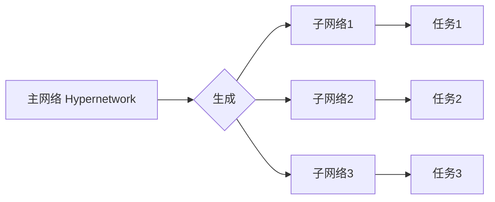

# 一切皆是映射：探索Hypernetworks在元学习中的作用

## 1. 背景介绍

### 1.1 元学习的定义与意义

元学习（Meta-Learning），也被称为"学会学习"（Learning to Learn），是机器学习领域的一个重要研究方向。它的目标是设计出能够快速适应新任务的学习算法，使机器能够像人类一样，在面对新问题时利用过去的经验快速学习。元学习的意义在于提高机器学习的效率和泛化能力，使其能够更好地应对实际应用中的各种挑战。

### 1.2 Hypernetworks的提出与发展

Hypernetworks是由 David Ha 等人在 2016 年提出的一种神经网络架构。它的核心思想是利用一个主网络（通常是一个多层感知机）来生成另一个网络的权重。这种架构使得网络的权重不再是固定的，而是可以根据输入动态调整，从而大大提高了网络的表达能力和灵活性。随后，Hypernetworks 被广泛应用于各种领域，如图像生成、语音合成、强化学习等。

### 1.3 Hypernetworks与元学习的结合

近年来，研究者们发现 Hypernetworks 与元学习有着天然的联系。Hypernetworks 可以被视为一种元学习的实现方式，它通过主网络生成子网络的权重，实现了对新任务的快速适应。同时，元学习的思想也为 Hypernetworks 的设计和训练提供了新的视角和方法。二者的结合为解决机器学习中的诸多挑战提供了新的可能。

## 2. 核心概念与联系

### 2.1 Hypernetworks的核心思想

Hypernetworks 的核心思想可以用一个简单的公式来表达：

$$W_t = f_\theta(z_t)$$

其中，$W_t$ 表示在时刻 $t$ 生成的网络权重，$f_\theta$ 表示主网络（即 Hypernetwork），$z_t$ 表示时刻 $t$ 的输入。这个公式表明，网络的权重不再是固定的，而是由另一个网络根据输入动态生成的。

### 2.2 元学习的核心思想

元学习的核心思想是通过设计合适的学习算法，使模型能够在少量样本上快速适应新任务。常见的元学习方法包括：

- 基于度量的方法：通过学习一个度量函数，度量新样本与已有样本的相似性，从而实现快速适应。
- 基于优化的方法：通过学习一个优化器，使其能够在新任务上快速收敛。
- 基于模型的方法：通过学习一个可以快速适应新任务的模型，如记忆增强神经网络（MANN）。

### 2.3 Hypernetworks与元学习的联系

Hypernetworks 可以被视为一种基于模型的元学习方法。主网络（即 Hypernetwork）可以看作是一个元模型，它根据任务的特点生成适应该任务的子网络。这种动态生成权重的机制使得模型能够快速适应新任务，体现了元学习的思想。

下图展示了 Hypernetworks 与元学习的关系：



## 3. 核心算法原理与具体操作步骤

### 3.1 Hypernetworks的训练过程

Hypernetworks 的训练过程可以分为两个阶段：

1. 预训练阶段：在一个大规模数据集上训练主网络（即 Hypernetwork），使其能够生成适应不同任务的子网络权重。
2. 微调阶段：在新任务的少量样本上微调主网络，使其能够快速适应新任务。

具体的训练步骤如下：

1. 准备数据：收集并预处理大规模数据集，用于预训练阶段；收集新任务的少量样本，用于微调阶段。
2. 设计网络架构：设计主网络（即 Hypernetwork）和子网络的架构。主网络通常是一个多层感知机，子网络可以是任意的神经网络架构，如 CNN、RNN 等。
3. 预训练主网络：在大规模数据集上训练主网络，使其能够生成适应不同任务的子网络权重。这一步通常使用随机梯度下降等优化算法，并使用适当的损失函数，如均方误差、交叉熵等。
4. 微调主网络：在新任务的少量样本上微调主网络，使其能够快速适应新任务。这一步通常使用较大的学习率，并进行少量的迭代。
5. 生成子网络：使用训练好的主网络生成适应新任务的子网络权重。
6. 评估模型：在新任务的测试集上评估生成的子网络的性能，以验证模型的泛化能力。

### 3.2 Hypernetworks的推理过程

Hypernetworks 的推理过程非常简单，可以分为两步：

1. 生成子网络：使用训练好的主网络生成适应新任务的子网络权重。
2. 前向传播：将新任务的输入传入生成的子网络，得到预测结果。

具体的推理步骤如下：

1. 准备数据：收集新任务的输入数据。
2. 生成子网络：使用训练好的主网络生成适应新任务的子网络权重。
3. 前向传播：将新任务的输入传入生成的子网络，得到预测结果。
4. 输出结果：将预测结果输出，或进行后续的处理和分析。

## 4. 数学模型与公式详细讲解

### 4.1 Hypernetworks的数学模型

Hypernetworks 的数学模型可以用以下公式来表示：

$$W_t = f_\theta(z_t)$$

其中，$W_t$ 表示在时刻 $t$ 生成的网络权重，$f_\theta$ 表示主网络（即 Hypernetwork），$z_t$ 表示时刻 $t$ 的输入。

主网络 $f_\theta$ 通常是一个多层感知机，可以表示为：

$$f_\theta(z_t) = \sigma(W_n \cdot \sigma(W_{n-1} \cdot \ldots \cdot \sigma(W_1 \cdot z_t + b_1) \ldots + b_{n-1}) + b_n)$$

其中，$W_i$ 和 $b_i$ 分别表示第 $i$ 层的权重矩阵和偏置向量，$\sigma$ 表示激活函数（如 ReLU、sigmoid 等）。

### 4.2 Hypernetworks的损失函数

Hypernetworks 的损失函数取决于具体的任务和问题。对于分类任务，常用的损失函数是交叉熵损失：

$$L(\theta) = -\frac{1}{N} \sum_{i=1}^N \sum_{j=1}^C y_{ij} \log(\hat{y}_{ij})$$

其中，$N$ 表示样本数，$C$ 表示类别数，$y_{ij}$ 表示第 $i$ 个样本属于第 $j$ 类的真实标签（0 或 1），$\hat{y}_{ij}$ 表示第 $i$ 个样本属于第 $j$ 类的预测概率。

对于回归任务，常用的损失函数是均方误差损失：

$$L(\theta) = \frac{1}{N} \sum_{i=1}^N (y_i - \hat{y}_i)^2$$

其中，$N$ 表示样本数，$y_i$ 表示第 $i$ 个样本的真实值，$\hat{y}_i$ 表示第 $i$ 个样本的预测值。

### 4.3 Hypernetworks的优化算法

Hypernetworks 的训练通常使用随机梯度下降（SGD）及其变体，如 Adam、RMSprop 等。以 SGD 为例，其更新规则为：

$$\theta_{t+1} = \theta_t - \eta \cdot \nabla_\theta L(\theta_t)$$

其中，$\theta_t$ 表示在时刻 $t$ 的模型参数，$\eta$ 表示学习率，$\nabla_\theta L(\theta_t)$ 表示在时刻 $t$ 的损失函数对模型参数的梯度。

## 5. 项目实践：代码实例与详细解释

下面是一个使用 PyTorch 实现 Hypernetworks 的简单示例，用于 MNIST 手写数字识别任务：

```python
import torch
import torch.nn as nn
import torch.optim as optim
from torchvision import datasets, transforms

# 定义主网络（即 Hypernetwork）
class HyperNetwork(nn.Module):
    def __init__(self, latent_dim, output_dim):
        super(HyperNetwork, self).__init__()
        self.latent_dim = latent_dim
        self.output_dim = output_dim
        
        self.fc1 = nn.Linear(latent_dim, 128)
        self.fc2 = nn.Linear(128, output_dim)
        
    def forward(self, z):
        h = torch.relu(self.fc1(z))
        w = self.fc2(h)
        return w

# 定义子网络
class SubNetwork(nn.Module):
    def __init__(self, input_dim, hidden_dim, output_dim):
        super(SubNetwork, self).__init__()
        self.input_dim = input_dim
        self.hidden_dim = hidden_dim
        self.output_dim = output_dim
        
        self.fc1 = nn.Linear(input_dim, hidden_dim)
        self.fc2 = nn.Linear(hidden_dim, output_dim)
        
    def forward(self, x, w):
        h = torch.relu(self.fc1(x))
        h = h * w[:self.hidden_dim].view(1, -1)
        y = self.fc2(h)
        y = y * w[self.hidden_dim:].view(1, -1)
        return y

# 超参数设置
latent_dim = 64
hidden_dim = 128
output_dim = 10
batch_size = 128
num_epochs = 10
learning_rate = 0.001

# 加载 MNIST 数据集
train_dataset = datasets.MNIST(root='./data', train=True, transform=transforms.ToTensor(), download=True)
test_dataset = datasets.MNIST(root='./data', train=False, transform=transforms.ToTensor())
train_loader = torch.utils.data.DataLoader(dataset=train_dataset, batch_size=batch_size, shuffle=True)
test_loader = torch.utils.data.DataLoader(dataset=test_dataset, batch_size=batch_size, shuffle=False)

# 初始化网络
hyper_network = HyperNetwork(latent_dim, hidden_dim + output_dim)
sub_network = SubNetwork(28 * 28, hidden_dim, output_dim)

# 定义损失函数和优化器
criterion = nn.CrossEntropyLoss()
optimizer = optim.Adam(hyper_network.parameters(), lr=learning_rate)

# 训练模型
for epoch in range(num_epochs):
    for i, (images, labels) in enumerate(train_loader):
        images = images.view(-1, 28 * 28)
        
        # 生成子网络权重
        z = torch.randn(latent_dim)
        w = hyper_network(z)
        
        # 前向传播
        outputs = sub_network(images, w)
        loss = criterion(outputs, labels)
        
        # 反向传播及优化
        optimizer.zero_grad()
        loss.backward()
        optimizer.step()
        
        if (i + 1) % 100 == 0:
            print('Epoch [{}/{}], Step [{}/{}], Loss: {:.4f}'.format(epoch + 1, num_epochs, i + 1, len(train_loader), loss.item()))

# 测试模型
with torch.no_grad():
    correct = 0
    total = 0
    for images, labels in test_loader:
        images = images.view(-1, 28 * 28)
        z = torch.randn(latent_dim)
        w = hyper_network(z)
        outputs = sub_network(images, w)
        _, predicted = torch.max(outputs.data, 1)
        total += labels.size(0)
        correct += (predicted == labels).sum().item()

    print('Accuracy of the network on the 10000 test images: {} %'.format(100 * correct / total))
```

这个示例中，我们定义了两个网络：主网络（即 Hypernetwork）和子网络。主网络接受一个随机噪声向量 $z$ 作为输入，生成子网络的权重 $w$。子网络接受图像和权重作为输入，输出预测结果。

在训练过程中，我们首先从主网络生成子网络的权重，然后将图像传入子网络进行前向传播，计算损失函数，并通过反向传播更新主网络的参数。在测试过程中，我们使用训练好的主网络生成子网络的权重，然后将测试图像传入子网络进行预测。

这个示例展示了 Hypernetworks 的基本用法，但在实际应用中，我们通常需要设计更加复杂的网络架构，并使用更大的数据集进行训练。此外，我们还可以将 Hyper