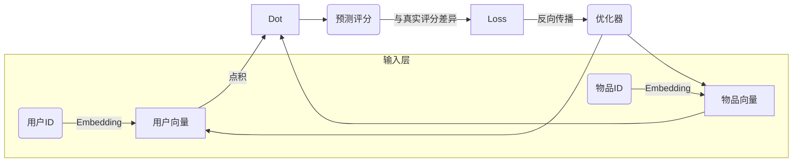
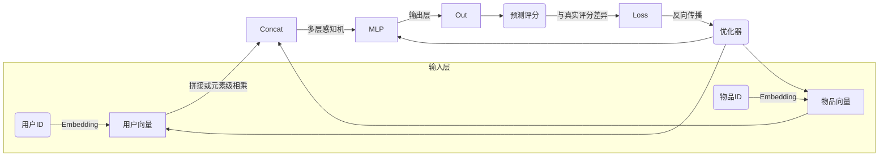
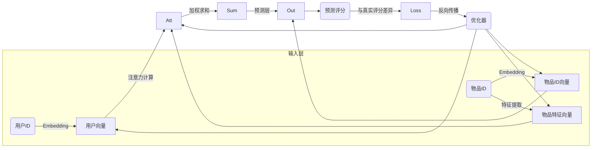

# 一切皆是映射：深度学习在推荐系统中的应用

## 1.背景介绍

### 1.1 推荐系统的重要性

在当今信息过载的时代,推荐系统已经无处不在,渗透到我们生活的方方面面。从电商网站的商品推荐、视频网站的影片推荐,到社交媒体的好友推荐、新闻资讯的个性化推送,再到智能音箱的语音助手推荐等,推荐系统都在为我们提供个性化、高效的信息服务。

推荐系统的核心目标是为用户推荐最感兴趣、最有价值的信息,从海量信息中过滤无关内容,解决信息过载问题。良好的推荐系统不仅能提升用户体验,还可以为企业带来可观的商业价值,提高用户黏性和转化率。

### 1.2 传统推荐系统的局限性

早期的推荐系统主要基于协同过滤(Collaborative Filtering)等传统机器学习算法,通过分析用户的历史行为数据(如浏览记录、购买记录等)发现用户兴趣模式,进而推荐相似用户喜欢的内容。这种方法虽然简单有效,但也存在一些局限性:

1. 数据稀疏问题:对于新用户或新物品,由于缺乏足够的交互数据,难以做出准确推荐。
2. 冷启动问题:新系统上线时缺乏足够的用户行为数据,无法快速建立高质量的推荐模型。
3. 内容理解能力差:仅利用用户行为数据,无法深入理解物品内容的语义,难以发现潜在的用户兴趣。

### 1.3 深度学习在推荐系统中的机遇

近年来,深度学习技术在计算机视觉、自然语言处理等领域取得了巨大成功,展现出强大的特征学习能力。将深度学习引入推荐系统,能够更好地解决传统方法的局限,为推荐系统带来新的机遇:

1. 自动特征学习:深度神经网络能够自动从原始数据(如文本、图像等)中学习高质量的特征表示,捕捉用户兴趣和物品内容的深层次语义信息。
2. 端到端模型:深度学习支持端到端的模型训练,无需复杂的特征工程,简化了系统设计和开发流程。
3. 泛化能力强:深度模型能够从有限的样本中学习到潜在的通用模式,从而更好地解决冷启动和数据稀疏等问题。

## 2.核心概念与联系

在深入探讨深度学习在推荐系统中的应用之前,我们需要先理解一些核心概念及其内在联系。

### 2.1 推荐系统的基本概念

推荐系统通常包含三个基本元素:用户(User)、物品(Item)和用户对物品的反馈(Feedback)。

- 用户(User):系统的服务对象,可以是个人用户或组织机构等。
- 物品(Item):系统推荐的对象,可以是有形物品(如书籍、电影等)或无形服务(如新闻、音乐等)。
- 反馈(Feedback):用户对物品的评价或互动行为,如点击、购买、评分等。

推荐系统的目标是基于用户的历史反馈,为用户推荐感兴趣的新物品。这可以形式化为一个评分预测问题:给定一个用户u和物品i,预测u对i的评分或兴趣程度。

### 2.2 深度学习与表示学习

深度学习的核心思想是通过构建多层非线性变换网络,从原始数据中自动学习多层次的抽象特征表示。这种端到端的表示学习方式,能够有效捕捉数据的深层次语义信息,避免了传统方法中复杂的特征工程过程。

在推荐系统中,我们需要学习用户和物品的低维向量表示,即将用户和物品映射到同一个低维向量空间中。这些向量表示能够编码用户的兴趣偏好和物品的内容语义,从而通过度量向量之间的相似性来预测用户对物品的兴趣程度。

### 2.3 深度学习与推荐系统的映射关系

深度学习与推荐系统之间存在一种天然的映射关系:

- 输入数据:用户的历史反馈数据(如点击、购买等行为数据)和物品的内容数据(如文本、图像等)。
- 模型目标:学习用户和物品的低维向量表示,使相似用户和相似物品的向量更接近。
- 模型输出:预测用户对给定物品的兴趣评分或排序。

因此,我们可以将推荐问题建模为一个特殊的机器学习问题,利用深度神经网络从原始数据中端到端地学习用户和物品的向量表示,并基于这些向量表示进行个性化推荐。

这种深度学习与推荐系统的映射关系,为我们提供了一种新的视角和思路去设计和优化推荐系统。接下来,我们将详细介绍一些核心算法原理和实践案例。

## 3.核心算法原理具体操作步骤

### 3.1 基于矩阵分解的协同过滤

矩阵分解是协同过滤算法中最经典和有影响力的方法之一。其基本思想是将用户-物品评分矩阵R分解为两个低维矩阵的乘积:

$$R \approx P^TQ$$

其中P是用户向量矩阵,Q是物品向量矩阵。每个用户u对应一个向量$p_u$,每个物品i对应一个向量$q_i$。通过最小化评分矩阵R与重构矩阵$P^TQ$之间的差异,我们可以学习到用户和物品的低维向量表示。

在深度学习的框架下,我们可以将矩阵分解建模为一个神经网络,如下所示:

具体操作步骤如下:

1. 将用户ID和物品ID通过Embedding层转换为低维向量表示。
2. 计算用户向量和物品向量的点积,作为预测评分。
3. 将预测评分与真实评分的差异作为损失函数。
4. 通过反向传播算法优化用户向量和物品向量,使损失函数最小化。

通过上述端到端的训练过程,我们可以学习到能够很好地拟合用户偏好的向量表示,从而提高推荐的准确性。

### 3.2 基于神经协同过滤的算法

神经协同过滤(Neural Collaborative Filtering, NCF)是将深度学习与传统矩阵分解相结合的一种创新方法。NCF通过构建深度神经网络,对用户和物品的向量表示进行非线性映射,以更好地捕捉用户-物品之间的复杂关系。

NCF的核心思想是将传统矩阵分解的双向向量与深度学习的非线性特征映射相结合。具体来说,NCF包含以下几个主要组件:

1. **输入层**:用户ID和物品ID通过Embedding层转换为低维向量表示。
2. **双向向量组合层**:将用户向量和物品向量拼接或元素级相乘,得到初始特征向量。
3. **多层感知机**:初始特征向量经过多层全连接网络的非线性映射,提取高阶特征交互信息。
4. **预测层**:最终输出一个评分预测值,与真实评分计算损失函数。
5. **优化器**:通过反向传播算法优化所有可训练参数,最小化损失函数。

NCF的模型结构如下所示:

NCF通过引入非线性映射层,能够更好地捕捉用户-物品之间的高阶特征交互,从而提高了推荐的准确性和泛化能力。

### 3.3 基于注意力机制的算法

注意力机制(Attention Mechanism)是深度学习中一种广泛使用的技术,能够自适应地分配不同特征的权重,从而提高模型对重要特征的关注程度。在推荐系统中,注意力机制可以用于捕捉用户-物品之间的动态兴趣关联,提高推荐的个性化程度。

一种典型的基于注意力机制的推荐算法是NeuralAttentionRegression(NAR)模型。NAR的核心思想是通过注意力机制,自适应地学习用户对不同物品特征的关注程度,从而更好地捕捉用户的个性化兴趣偏好。

NAR模型的主要组成部分包括:

1. **Embedding层**:将用户ID和物品ID转换为低维向量表示。
2. **特征提取层**:对物品特征(如文本、图像等)进行编码,得到物品特征向量。
3. **注意力层**:计算用户向量与每个物品特征向量的相关性权重,得到用户对各物品特征的注意力分布。
4. **特征聚合层**:根据注意力分布,对物品特征向量进行加权求和,得到用户感兴趣的物品表示。
5. **预测层**:将用户向量与感兴趣物品表示进行组合,输出预测评分。

NAR模型结构如下所示:

通过注意力机制,NAR能够自动分配不同物品特征的权重,从而更好地捕捉用户的个性化偏好,提高推荐的准确性和解释性。

## 4.数学模型和公式详细讲解举例说明

在上一节中,我们介绍了几种基于深度学习的核心推荐算法。这些算法都涉及到一些数学模型和公式,下面我们将对其进行详细的讲解和举例说明。

### 4.1 矩阵分解

在矩阵分解算法中,我们需要将用户-物品评分矩阵R分解为两个低维矩阵的乘积:

$$R \approx P^TQ$$

其中P是用户向量矩阵,Q是物品向量矩阵。每个用户u对应一个向量$p_u$,每个物品i对应一个向量$q_i$。

我们的目标是通过最小化评分矩阵R与重构矩阵$P^TQ$之间的差异,来学习用户和物品的低维向量表示。常用的损失函数是均方误差(Mean Squared Error, MSE):

$$\mathcal{L}_{MSE} = \frac{1}{|R|}\sum_{(u,i)\in R}(r_{ui} - p_u^Tq_i)^2 + \lambda(\|P\|_F^2 + \|Q\|_F^2)$$

其中$|R|$表示已观测评分的数量,$\lambda$是正则化系数,用于防止过拟合。$\|P\|_F$和$\|Q\|_F$分别表示P和Q的Frobenius范数,作为正则化项。

通过优化上述损失函数,我们