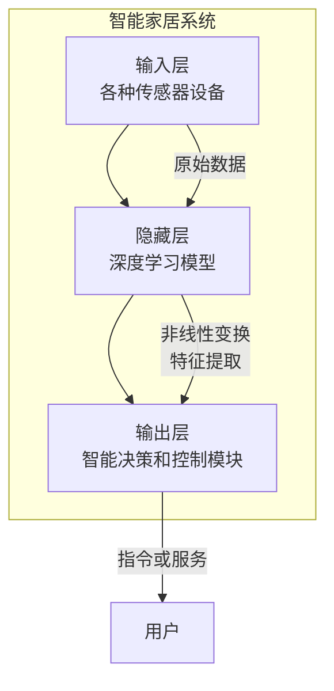

# 一切皆是映射：深度学习在智能家居系统中的应用

## 1. 背景介绍

### 1.1 智能家居系统的兴起

随着物联网技术的飞速发展,智能家居系统逐渐走进千家万户。智能家居系统旨在通过将各种智能设备连接到网络,实现对家居环境的自动化控制和优化,为用户带来更加舒适、便利、安全和节能的生活体验。

### 1.2 智能家居系统的挑战

然而,智能家居系统面临着诸多挑战:

- **设备异构性**:不同厂商的设备使用不同的通信协议和数据格式,导致设备之间难以互通互联。
- **用户需求多样性**:不同用户对智能家居系统的需求存在很大差异,系统需要具备高度的可定制性和适应性。
- **数据复杂性**:智能家居系统需要处理来自多个传感器的大量时序数据,并从中提取有价值的信息。

### 1.3 深度学习在智能家居系统中的作用

深度学习作为一种强大的机器学习技术,在解决上述挑战方面展现出巨大潜力。深度学习能够自动从大量数据中学习出复杂的模式和规律,并对这些模式进行高效的映射和建模,从而实现智能决策和控制。

本文将探讨深度学习在智能家居系统中的应用,包括核心概念、算法原理、实践案例等,旨在为读者提供一个全面的认识。

## 2. 核心概念与联系

### 2.1 深度学习概述

深度学习是机器学习的一个新的研究热点,它模仿人脑的机制来解释数据,通过对数据进行表征学习,获取多层次的分层特征表示。与传统的机器学习方法相比,深度学习具有以下优势:

- 自动从数据中学习特征表示,无需人工设计特征
- 能够学习到多层次的抽象特征表示
- 在处理高维数据(如图像、语音等)时表现出色

深度学习模型通常由多个隐藏层组成,每一层对上一层的输出进行非线性变换,逐层提取更加抽象的特征表示。常见的深度学习模型包括卷积神经网络(CNN)、循环神经网络(RNN)、长短期记忆网络(LSTM)等。

### 2.2 深度学习在智能家居系统中的作用

在智能家居系统中,深度学习可以发挥以下作用:

1. **设备异构性处理**: 通过深度学习模型对异构设备的数据进行端到端的映射,实现设备之间的无缝连接和互操作。

2. **用户需求建模**: 利用深度学习模型对用户行为和偏好进行学习,从而构建个性化的用户模型,为用户提供定制化的智能服务。

3. **环境感知与控制**: 基于深度学习对多源传感器数据进行融合和建模,实现对家居环境的全面感知,并进行智能控制和优化。

4. **异常检测与故障诊断**: 通过对历史数据的学习,深度学习模型能够及时发现系统运行中的异常情况,并进行故障诊断和预警。

5. **数据挖掘与决策支持**: 深度学习可以从海量的家居数据中挖掘出隐藏的模式和规律,为智能决策提供有力支持。

### 2.3 深度学习与智能家居系统的映射关系

深度学习在智能家居系统中的应用,实际上是一种将复杂的输入数据(如传感器数据、用户行为数据等)映射到期望的输出(如设备控制指令、个性化服务等)的过程。这种映射关系可以通过深度神经网络模型来学习和建模。

我们可以将整个智能家居系统看作一个巨大的深度神经网络,其中:

- 输入层对应各种传感器设备,接收来自环境的原始数据
- 隐藏层对应深度学习模型,对输入数据进行非线性变换和特征提取
- 输出层对应智能决策和控制模块,产生对应的指令或服务

通过对该深度神经网络进行有监督或无监督的训练,我们可以获得一个能够精准映射输入和输出的模型,从而实现智能家居系统的智能化管理和优化。

上图展示了深度学习在智能家居系统中扮演的映射角色。通过对原始数据进行非线性变换和特征提取,深度学习模型能够学习出精准的映射关系,从而实现智能决策和控制,为用户提供个性化的智能服务。

## 3. 核心算法原理具体操作步骤  

### 3.1 深度神经网络基本原理

深度神经网络是一种由多个隐藏层组成的人工神经网络模型。每个隐藏层由多个神经元组成,每个神经元对上一层的输出进行加权求和,并通过非线性激活函数进行转换,产生该神经元的输出。

$$
y = f\left(\sum_{i=1}^{n}w_ix_i + b\right)
$$

其中,$y$表示神经元的输出,$x_i$表示第$i$个输入,$w_i$表示与第$i$个输入相关的权重,$b$表示偏置项,$f$表示非线性激活函数。

深度神经网络通过反向传播算法对网络中的权重和偏置进行迭代优化,使得输出值与期望值之间的误差最小化。反向传播算法的核心思想是:

1. 计算输出层的误差
2. 计算隐藏层的误差,并更新隐藏层的权重和偏置
3. 重复上述步骤,直到网络收敛

### 3.2 卷积神经网络

卷积神经网络(CNN)是一种广泛应用于计算机视觉领域的深度神经网络模型。CNN通过卷积操作和池化操作,能够自动从图像数据中提取出局部特征和空间特征,从而实现对图像的高效表征和分类。

CNN的基本结构包括:

1. **卷积层**: 通过卷积核对输入数据进行卷积操作,提取局部特征
2. **池化层**: 对卷积层的输出进行下采样,降低数据维度,提取空间特征
3. **全连接层**: 将前面层的特征映射到样本标记空间

CNN在智能家居系统中的应用包括:

- 人脸识别和人体姿态识别,用于智能安防和人机交互
- 场景识别,用于智能照明和能源管理
- 图像分类和目标检测,用于智能监控和异常检测

### 3.3 循环神经网络

循环神经网络(RNN)是一种适用于处理序列数据(如文本、语音、时序数据等)的深度神经网络模型。与传统的前馈神经网络不同,RNN在隐藏层之间引入了循环连接,使得网络能够捕捉序列数据中的长期依赖关系。

RNN的核心思想是:在处理当前输入时,不仅考虑当前输入,还考虑了前一时刻的隐藏状态,从而能够学习到序列数据中的上下文信息。

$$
h_t = f(x_t, h_{t-1})
$$

其中,$h_t$表示当前时刻的隐藏状态,$x_t$表示当前输入,$h_{t-1}$表示前一时刻的隐藏状态,$f$表示非线性激活函数。

RNN在智能家居系统中的应用包括:

- 语音识别和语义理解,用于智能语音助手
- 时序数据预测,如能源消耗预测、环境参数预测等
- 异常检测,如检测设备故障、入侵行为等

### 3.4 生成对抗网络

生成对抗网络(GAN)是一种无监督的深度学习模型,它由一个生成器网络和一个判别器网络组成。生成器网络的目标是从随机噪声中生成逼真的样本数据,而判别器网络的目标是区分生成的样本和真实样本。通过生成器和判别器之间的对抗训练,GAN能够学习到数据的真实分布,从而生成高质量的样本数据。

GAN在智能家居系统中的应用包括:

- 图像生成,如生成虚拟家居场景、家具样品等
- 数据增强,通过生成合成数据来扩充训练集
- 隐私保护,通过生成合成数据来代替真实数据,保护用户隐私

### 3.5 深度强化学习

深度强化学习是将深度学习与强化学习相结合的一种技术,它允许智能体通过与环境的交互来学习最优策略。在深度强化学习中,智能体的策略由一个深度神经网络表示,该网络将环境状态作为输入,输出相应的行动。

深度强化学习在智能家居系统中的应用包括:

- 智能控制,如智能调节温度、照明等,实现能源优化
- 智能决策,如根据用户偏好和环境状态,制定个性化的智能服务方案
- 机器人控制,如控制智能家居机器人执行各种家务任务

## 4. 数学模型和公式详细讲解举例说明

### 4.1 深度神经网络的数学模型

深度神经网络可以看作一个由多个层次组成的复合函数,每一层对上一层的输出进行非线性变换。设输入为$\mathbf{x}$,第$l$层的权重矩阵为$\mathbf{W}^{(l)}$,偏置向量为$\mathbf{b}^{(l)}$,激活函数为$f^{(l)}$,则第$l$层的输出可表示为:

$$
\mathbf{a}^{(l)} = f^{(l)}(\mathbf{W}^{(l)}\mathbf{a}^{(l-1)} + \mathbf{b}^{(l)})
$$

其中,$\mathbf{a}^{(0)} = \mathbf{x}$。

对于一个包含$L$层的深度神经网络,其输出可表示为:

$$
\hat{\mathbf{y}} = \mathbf{a}^{(L)} = f^{(L)}(\mathbf{W}^{(L)}f^{(L-1)}(\cdots f^{(1)}(\mathbf{W}^{(1)}\mathbf{x} + \mathbf{b}^{(1)}) + \cdots) + \mathbf{b}^{(L)})
$$

在训练过程中,我们需要通过优化网络的参数(权重和偏置),使得输出$\hat{\mathbf{y}}$与期望输出$\mathbf{y}$之间的损失函数$\mathcal{L}(\hat{\mathbf{y}}, \mathbf{y})$最小化。常用的损失函数包括均方误差损失、交叉熵损失等。

通过反向传播算法,我们可以计算出损失函数相对于每一层的权重和偏置的梯度,并使用优化算法(如梯度下降、Adam等)对参数进行迭代更新,从而使网络逐渐收敛到最优解。

### 4.2 卷积神经网络的数学模型

卷积神经网络中的卷积操作可以看作是一种特殊的线性运算。设输入特征图为$\mathbf{X}$,卷积核为$\mathbf{K}$,则卷积操作可表示为:

$$
\mathbf{Y}(i, j) = \sum_{m}\sum_{n}\mathbf{X}(i+m, j+n)\mathbf{K}(m, n)
$$

其中,$\mathbf{Y}$表示输出特征图,$i$和$j$表示输出特征图的坐标,(m, n)表示卷积核的坐标。

通过卷积操作,CNN能够自动从输入数据中提取出局部特征。而池化操作则用于降低特征图的维度,提取空间特征。常用的池化操作包括最大池化和平均池化。

对于一个包含多个卷积层和池化层的CNN模型,其输出可表示为:

$$
\hat{\