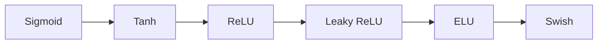

# 一切皆是映射：激活函数的选择与影响

作者：禅与计算机程序设计艺术 / Zen and the Art of Computer Programming

## 1. 背景介绍

### 1.1 人工神经网络的兴起

人工神经网络(Artificial Neural Networks, ANNs)是一种模仿生物神经网络的结构和功能的数学模型,广泛应用于模式识别、自然语言处理、图像识别等领域。自20世纪80年代以来,随着计算机硬件性能的提升和大数据时代的来临,人工神经网络得到了飞速的发展。

### 1.2 激活函数的重要性

在人工神经网络中,激活函数(Activation Function)扮演着至关重要的角色。它决定了神经元是否被激活,引入了非线性因素,赋予了神经网络强大的表达和学习能力。可以说,没有合适的激活函数,就没有真正意义上的深度学习。

### 1.3 激活函数的选择困境

然而,面对众多的激活函数,如何选择最适合特定任务的激活函数,一直是一个困扰研究者和工程师的问题。不同的激活函数有着不同的数学性质和计算效率,会对网络的训练难度和泛化能力产生重要影响。

## 2. 核心概念与联系

### 2.1 激活函数的定义与作用

激活函数是神经网络中不可或缺的一部分,它将神经元的加权输入映射到输出。其数学定义为:
$$a=f(z)=f(\sum w_i x_i + b)$$
其中,$x_i$是输入,$w_i$是权重,$b$是偏置,$z$是加权输入,$f$是激活函数,$a$是神经元的输出。

激活函数的主要作用包括:

1. 引入非线性,增加网络的表达能力
2. 将无界的输入映射到有界的输出,提高网络稳定性  
3. 提供梯度,使网络可训练
4. 提供稀疏性,增强网络泛化能力

### 2.2 常见的激活函数

目前使用的激活函数主要有:

- Sigmoid函数: $f(z)=\frac{1}{1+e^{-z}}$
- Tanh函数: $f(z)=\frac{e^z - e^{-z}}{e^z + e^{-z}}$ 
- ReLU函数: $f(z)=max(0,z)$
- Leaky ReLU函数: $f(z)=max(\alpha z,z), \alpha是常数$
- ELU函数: $f(z)=\begin{cases} z, & \text{if } z>0 \\ \alpha (e^z-1), & \text{if } z\leq 0 \end{cases}$
- Swish函数: $f(z)=\frac{z}{1+e^{-z}}$

它们的函数曲线和导数曲线如下图所示:



### 2.3 激活函数的性质比较

不同激活函数的性质比较如下表:

| 函数 | 连续可导 | 非线性 | 单调性 | 有界性 | 零中心化 |
|------|----------|--------|--------|--------|----------|
| Sigmoid | √ | √ | √ | [0,1] | × |
| Tanh | √ | √ | √ | [-1,1] | √ |
| ReLU | × | √ | √ | [0,+∞] | × |
| Leaky ReLU | √ | √ | √ | [-∞,+∞] | × |
| ELU | √ | √ | √ | [-α,+∞] | √ |  
| Swish | √ | √ | × | [-∞,+∞] | × |

可以看出,不同激活函数在数学性质上各有优劣。Sigmoid和Tanh函数连续光滑,但容易出现梯度消失。ReLU简单高效,但非零中心化,且在0点不可导。Leaky ReLU、ELU和Swish则在ReLU的基础上进行了改进,但也有各自的局限性。

## 3. 核心算法原理与操作步骤

### 3.1 反向传播算法

激活函数的选择与神经网络的训练密切相关。目前主流的神经网络训练算法是反向传播(Backpropagation)。其核心思想是:

1. 前向传播,计算每一层的加权输入和激活值 
2. 计算输出层的损失函数
3. 反向传播,计算每一层激活函数关于加权输入的梯度
4. 梯度下降,更新每一层的权重和偏置

其中,第3步需要用到激活函数的导数。设第$l$层第$j$个神经元关于其加权输入的梯度为$\delta_j^l$,则有:

$$\delta_j^l = \begin{cases} 
f'(z_j^l) \odot (w^{l+1})^T \delta^{l+1}, & l<L \\
f'(z_j^L) \odot \frac{\partial C}{\partial a_j^L}, & l=L
\end{cases}$$

其中,$\odot$表示Hadamard乘积,$C$表示损失函数。可见,激活函数的导数直接参与了梯度的计算。

### 3.2 基于激活函数的网络优化

除了影响梯度计算,激活函数还与网络的优化算法密切相关。常见的优化算法有:

- 随机梯度下降(SGD): $w \leftarrow w - \eta \nabla_w C$ 
- 动量法(Momentum): $v \leftarrow \alpha v - \eta \nabla_w C, w \leftarrow w + v$
- RMSprop: $s \leftarrow \beta s + (1-\beta) (\nabla_w C)^2, w \leftarrow w - \frac{\eta}{\sqrt{s+\epsilon}} \nabla_w C$  
- Adam: $m \leftarrow \beta_1 m + (1-\beta_1) \nabla_w C, v \leftarrow \beta_2 v + (1-\beta_2) (\nabla_w C)^2, w \leftarrow w - \frac{\eta}{\sqrt{\hat{v}+\epsilon}} \hat{m}$

其中,$\eta$是学习率,$\alpha$是动量系数,$\beta$是衰减率,$m$和$v$分别是梯度的一阶矩和二阶矩的指数加权平均。

不同的激活函数与优化算法的匹配程度不同。例如,ReLU函数与Adam算法搭配使用时,常常表现出良好的收敛速度和泛化能力。而Sigmoid函数则更适合与SGD等基本优化算法配合。

## 4. 数学模型与公式详解

### 4.1 Sigmoid函数与Logistic回归

Sigmoid函数源于Logistic回归模型。在二分类问题中,设样本$x$属于正类的概率为$p$,则Logistic回归模型假设:

$$ln \frac{p}{1-p} = w^T x + b$$

移项可得:
$$p=\frac{1}{1+e^{-(w^T x + b)}}=\sigma(w^T x + b)$$

其中,$\sigma(z)=\frac{1}{1+e^{-z}}$就是Sigmoid函数。可见,Sigmoid函数实际上是Logistic回归的决策函数,可以将实数映射到(0,1)区间,表示样本属于正类的概率。

Sigmoid函数的导数为:

$$\sigma'(z) = \sigma(z)(1-\sigma(z))$$

导数在z=0处达到最大值0.25,两端趋于0,这意味着Sigmoid函数在z较大或较小时,梯度较小,不易优化。

### 4.2 Softmax函数与多分类

Sigmoid函数可以推广到多分类问题,即Softmax函数:

$$p_i = \frac{e^{z_i}}{\sum_j e^{z_j}}, i=1,2,...,K$$

其中,$z_i=w_i^T x + b_i$是第$i$类的得分函数,$K$是类别总数。Softmax函数可以将$K$个实数映射到(0,1)区间,并且$\sum_i p_i=1$,因此$p_i$可以解释为样本属于第$i$类的概率。

Softmax函数的导数为:

$$\frac{\partial p_i}{\partial z_j} = \begin{cases}
p_i(1-p_i), & i=j \\
-p_i p_j, & i \neq j
\end{cases}$$

可以看出,Softmax函数的梯度也容易趋于0,导致梯度消失问题。

## 5. 项目实践：代码实例与详解

下面以Python为例,演示如何使用PyTorch实现基于不同激活函数的神经网络。

### 5.1 Sigmoid激活函数

```python
import torch
import torch.nn as nn

class SigmoidNet(nn.Module):
    def __init__(self, in_dim, hidden_dim, out_dim):
        super(SigmoidNet, self).__init__()
        self.layer1 = nn.Linear(in_dim, hidden_dim)
        self.layer2 = nn.Linear(hidden_dim, out_dim)
        self.sigmoid = nn.Sigmoid()

    def forward(self, x):
        x = self.layer1(x)
        x = self.sigmoid(x)
        x = self.layer2(x)
        x = self.sigmoid(x)
        return x
```

这里定义了一个两层的全连接网络,每层都使用了Sigmoid激活函数。`forward`函数定义了前向传播的过程。

### 5.2 ReLU激活函数

```python
class ReLUNet(nn.Module):
    def __init__(self, in_dim, hidden_dim, out_dim):
        super(ReLUNet, self).__init__()
        self.layer1 = nn.Linear(in_dim, hidden_dim)
        self.layer2 = nn.Linear(hidden_dim, out_dim)
        self.relu = nn.ReLU()

    def forward(self, x):
        x = self.layer1(x)
        x = self.relu(x)
        x = self.layer2(x)
        x = self.relu(x)
        return x
```

与Sigmoid版本类似,这里将激活函数替换为ReLU。可见,在PyTorch中更换激活函数非常方便。

### 5.3 训练与测试

```python
net = SigmoidNet(10, 20, 2) # 或 net = ReLUNet(10, 20, 2)
criterion = nn.CrossEntropyLoss()
optimizer = torch.optim.Adam(net.parameters(), lr=0.01)

for epoch in range(num_epochs):
    for i, (inputs, labels) in enumerate(train_loader):
        outputs = net(inputs)
        loss = criterion(outputs, labels)
        
        optimizer.zero_grad()
        loss.backward()
        optimizer.step()
```

这里展示了训练网络的基本流程。可以灵活地替换不同的激活函数、损失函数和优化算法,以达到最佳的训练效果。

## 6. 实际应用场景

激活函数的选择在神经网络的实际应用中至关重要。下面列举几个典型的应用场景。

### 6.1 图像分类

在图像分类任务中,ReLU函数是最常用的激活函数。相比Sigmoid和Tanh,ReLU在训练深层网络时更加稳定,且能缓解梯度消失问题。例如,经典的卷积神经网络AlexNet、VGGNet、ResNet等都采用了ReLU激活函数。

### 6.2 语音识别

在语音识别领域,传统的DNN-HMM混合系统通常使用Sigmoid或Tanh激活函数。但近年来,ReLU及其变体如Leaky ReLU、PReLU等逐渐成为主流选择。研究表明,ReLU能够加速训练收敛,提高识别准确率。

### 6.3 自然语言处理

在自然语言处理领域,RNN及其变体LSTM、GRU等常用Tanh作为激活函数。Tanh函数在-1到1之间饱和,与LSTM的门结构匹配良好。但一些研究也尝试使用ReLU、Leaky ReLU等激活函数,以提高模型的非线性表达能力。

### 6.4 生成对抗网络

生成对抗网络(GAN)常用Leaky ReLU作为生成器和判别器的激活函数。相比ReLU,Leaky ReLU在负数部分保留了一定的梯度,能够缓解"死ReLU"问题,使训练更加稳定。但也有工作尝试使用Tanh、Sigmoid等激活函数,以达到不同的生成效果。

## 7. 工具与资源推荐

### 7.1 深度学习框架

- PyTorch: http://pytorch.org/
- TensorFlow: http://tensorflow.org/  
- Keras: http://keras.io/
- Caffe: http://caffe.berkeleyvision.org/
- MXNet: http://mxnet.incubator.apache.org/

### 7.2 激活函数可视化工具

- NN-SVG: http://alexlenail.me/NN-SVG/
- TensorFlow Playground: