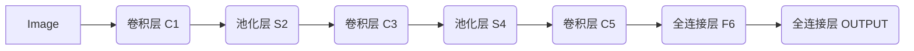

# 一切皆是映射：神经网络在图像识别中的应用案例

## 1. 背景介绍
### 1.1 图像识别的重要性
在当今数字化时代,图像无处不在。从手机拍摄的照片到医学影像,从卫星遥感图像到工业检测图像,海量的图像数据蕴含着丰富的信息,如何高效准确地从图像中提取有价值的信息,是一个极具挑战性又充满机遇的课题。图像识别技术应运而生,它利用计算机对图像进行分析和理解,自动识别图像中包含的目标对象及其属性,在安防监控、医疗诊断、工业自动化、自动驾驶等众多领域发挥着越来越重要的作用。

### 1.2 传统图像识别方法的局限性
传统的图像识别方法主要基于人工设计的特征,如 SIFT、HOG 等,先从图像中提取特征,再用分类器如 SVM 进行分类。这类方法在特定场景下取得了不错的效果,但面临以下局限:

1. 特征工程复杂,需要大量人工设计和调试,难以适应不同场景。
2. 特征表达能力有限,难以刻画图像的高层语义信息。 
3. 分类器性能受限于特征质量,难以处理复杂的图像内容。

因此,亟需一种更加智能化、自动化、高效准确的图像识别方法。

### 1.3 深度学习的崛起
近年来,以深度学习为代表的人工智能技术取得了突破性进展。深度学习通过构建多层神经网络,可以自动学习图像的层次化特征表示,从低层的边缘、纹理到高层的部件、整体,逐层抽象,直至学习到与任务相关的语义特征。在 ImageNet 大规模图像识别竞赛中,深度学习模型的top-5错误率从2012年的16%降到2017年的2.25%,远超人类水平。深度学习在图像分类、检测、分割等任务上展现出了强大的能力,成为图像识别的主流方法。

## 2. 核心概念与联系
### 2.1 人工神经网络 
人工神经网络(Artificial Neural Network,ANN)是一种模拟生物神经系统结构和功能的数学模型,由大量的人工神经元相互连接构成。每个神经元接收一些输入信号,通过带权重的连接传递给其他神经元,经过非线性变换产生输出信号。通过调整神经元之间连接的权重,神经网络可以学习到输入到输出的映射关系,具备一定的学习、记忆和泛化能力。

### 2.2 深度前馈网络
深度前馈网络(Deep Feedforward Network)是一种经典的神经网络结构,也称多层感知机(Multilayer Perceptron,MLP)。它包含输入层、若干隐藏层和输出层,每层由多个神经元组成,相邻层之间全连接,信号自前向后传播。隐藏层使用非线性激活函数如 ReLU,增强网络的表达能力。输出层根据任务的类型(分类、回归)使用 Softmax、恒等函数等。

### 2.3 卷积神经网络
卷积神经网络(Convolutional Neural Network,CNN)是一种专门用于处理网格拓扑结构数据(如图像)的神经网络。它利用卷积、池化等操作,提取图像的局部特征,具有平移不变性。典型的CNN包含若干卷积层和池化层,最后接全连接层和输出层。卷积层使用卷积核(滤波器)对输入特征图进行卷积操作,提取不同尺度和抽象层次的特征。池化层对特征图下采样,减小数据维度,提取主要特征。全连接层对卷积特征进行非线性变换,生成最终的特征表示,用于分类或回归任务。

### 2.4 端到端学习范式
传统的模式识别流程通常包括特征提取、特征选择、分类器设计等多个独立的步骤,每个步骤需要人工参与设计和调优,流程复杂。而端到端学习(End-to-End Learning)则将原始输入直接映射到输出,中间的特征提取、分类等过程全部由模型自动学习,不需要人工干预。深度神经网络天然适合端到端学习,可以将图像识别任务构建为一个整体的框架,输入图像,输出识别结果,中间的特征学习、分类判别都交给网络完成,大大简化了流程。

### 2.5 关键概念之间的联系
在图像识别任务中,我们希望学习到一个映射函数 $f$,将输入图像 $\boldsymbol{x}$ 映射到输出标签 $\boldsymbol{y}$,即 $f:\boldsymbol{x} \rightarrow \boldsymbol{y}$。人工神经网络可以通过学习逼近这一映射。其中,卷积神经网络是图像识别任务的首选模型,它利用卷积、池化等操作,自动提取图像的多尺度、层次化特征,避免了复杂的特征工程。而端到端学习范式将特征提取、分类等环节统一到一个模型中,使整个识别流程高度自动化,不需要人工参与。可以说,卷积神经网络是实现图像识别端到端学习的有力工具。

## 3. 核心算法原理具体操作步骤
图像识别的核心是如何从原始图像数据出发,经过一系列处理,得到图像所属的类别标签。下面我们以经典的卷积神经网络 LeNet-5 为例,详细讲解其核心算法原理和具体操作步骤。

### 3.1 网络结构
LeNet-5 由 7 层网络组成(不含输入层),分别是:卷积层 C1、池化层 S2、卷积层 C3、池化层 S4、卷积层 C5、全连接层 F6、全连接层(输出层)OUTPUT,如下图所示:

### 3.2 前向传播
前向传播是指将输入图像通过网络的逐层计算,得到最终的输出。具体步骤如下:

1. 输入层: 将 32x32 的灰度图像输入网络。

2. 卷积层 C1: 使用6个 5x5 的卷积核对输入图像进行卷积操作,得到6个 28x28 的特征图。卷积公式为:
$$
\boldsymbol{z}^{(l)}=\boldsymbol{W}^{(l)} * \boldsymbol{a}^{(l-1)}+\boldsymbol{b}^{(l)} \\
\boldsymbol{a}^{(l)}=\sigma(\boldsymbol{z}^{(l)})
$$
其中, $\boldsymbol{W}^{(l)}$ 为卷积核权重, $\boldsymbol{b}^{(l)}$ 为偏置, $\boldsymbol{a}^{(l-1)}$ 为上一层输出, $*$ 表示卷积操作, $\sigma$ 为激活函数(如 ReLU)。

3. 池化层 S2: 对 C1 的输出进行 2x2 最大池化,得到6个 14x14 的特征图。池化公式为:
$$
\boldsymbol{a}^{(l)}_{i,j}=\max_{m,n} \boldsymbol{a}^{(l-1)}_{i \times s+m,j \times s+n}
$$
其中, $s$ 为池化步长, $m,n$ 为池化窗口内的坐标。

4. 卷积层 C3: 使用16个 5x5 的卷积核对 S2 的输出进行卷积,得到16个 10x10 的特征图。

5. 池化层 S4: 对 C3 的输出进行 2x2 最大池化,得到16个 5x5 的特征图。

6. 卷积层 C5: 使用120个 5x5 的卷积核对 S4 的输出进行卷积,得到120个 1x1 的特征图,相当于全连接层。

7. 全连接层 F6: 对 C5 的输出进行全连接,得到84维特征向量。全连接公式为:
$$
\boldsymbol{z}^{(l)}=\boldsymbol{W}^{(l)} \boldsymbol{a}^{(l-1)}+\boldsymbol{b}^{(l)} \\
\boldsymbol{a}^{(l)}=\sigma(\boldsymbol{z}^{(l)})
$$

8. 输出层 OUTPUT: 将 F6 的输出通过 Softmax 函数归一化,得到10个类别的概率分布。Softmax 公式为:
$$
\hat{\boldsymbol{y}}=\text{softmax}(\boldsymbol{z}^{(L)})=\frac{\exp(\boldsymbol{z}^{(L)})}{\sum_j \exp(z_j^{(L)})}
$$

最终,网络输出图像属于每个类别的概率,取概率最大的类别作为识别结果。

### 3.3 反向传播
网络通过反向传播算法学习模型参数(卷积核权重、全连接层权重)。具体步骤为:

1. 计算损失函数(如交叉熵)关于网络输出的梯度:
$$
\frac{\partial J}{\partial \boldsymbol{a}^{(L)}}=\hat{\boldsymbol{y}}-\boldsymbol{y}
$$

2. 逐层反向传播梯度:对于全连接层,梯度传播公式为:
$$
\frac{\partial J}{\partial \boldsymbol{z}^{(l)}}=\frac{\partial J}{\partial \boldsymbol{a}^{(l)}} \odot \sigma'(\boldsymbol{z}^{(l)}) \\
\frac{\partial J}{\partial \boldsymbol{W}^{(l)}}=\frac{\partial J}{\partial \boldsymbol{z}^{(l)}} \boldsymbol{a}^{(l-1)T} \\
\frac{\partial J}{\partial \boldsymbol{b}^{(l)}}=\frac{\partial J}{\partial \boldsymbol{z}^{(l)}} \\
\frac{\partial J}{\partial \boldsymbol{a}^{(l-1)}}={\boldsymbol{W}^{(l)}}^T \frac{\partial J}{\partial \boldsymbol{z}^{(l)}}
$$
对于卷积层和池化层,梯度传播需要考虑卷积、池化等操作的特性,一般通过梯度的卷积、转置卷积、取最大值的位置传播等方式实现。

3. 更新模型参数:使用优化算法(如随机梯度下降)更新卷积核权重 $\boldsymbol{W}$ 和偏置 $\boldsymbol{b}$:
$$
\boldsymbol{W}^{(l)}=\boldsymbol{W}^{(l)}-\alpha \frac{\partial J}{\partial \boldsymbol{W}^{(l)}} \\
\boldsymbol{b}^{(l)}=\boldsymbol{b}^{(l)}-\alpha \frac{\partial J}{\partial \boldsymbol{b}^{(l)}}
$$
其中 $\alpha$ 为学习率。

4. 重复步骤1-3,直到损失函数收敛或达到预设的迭代次数。

## 4. 数学模型和公式详细讲解举例说明
下面我们详细讲解卷积神经网络中的几个关键数学模型和公式。

### 4.1 卷积运算
卷积是 CNN 的核心操作,它通过卷积核(滤波器)在输入特征图上滑动,提取局部特征。二维卷积的数学定义为:

$$(f*g)(i,j)=\sum_m \sum_n f(m,n)g(i-m,j-n)$$

其中, $f$ 为输入特征图, $g$ 为卷积核, $*$ 表示卷积操作。

举例说明:假设输入特征图 $\boldsymbol{X}$ 和卷积核 $\boldsymbol{W}$ 分别为:

$$
\boldsymbol{X}=\begin{bmatrix}
1 & 2 & 3 \\
4 & 5 & 6 \\
7 & 8 & 9
\end{bmatrix},
\boldsymbol{W}=\begin{bmatrix}
1 & 0 \\
0 & 1
\end{bmatrix}
$$

则卷积结果为:

$$