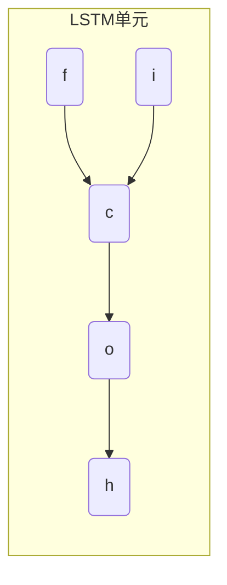
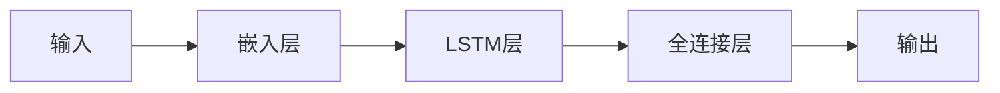

# 一切皆是映射：长短时记忆网络(LSTM)与文本生成

## 1.背景介绍

### 1.1 文本生成的重要性

在自然语言处理领域中,文本生成是一项极具挑战的任务。它旨在根据给定的上下文或提示,自动生成连贯、流畅且语义合理的文本。文本生成技术在诸多领域都有广泛的应用,例如机器翻译、自动文本摘要、对话系统、内容生成等。

随着深度学习技术的不断发展,基于神经网络的文本生成模型展现出了令人振奋的潜力。其中,循环神经网络(Recurrent Neural Network,RNN)因其擅长处理序列数据而备受关注。然而,传统的RNN在处理长序列时存在梯度消失或梯度爆炸的问题,难以很好地捕捉长期依赖关系。

### 1.2 长短时记忆网络(LSTM)的出现

为了解决RNN的长期依赖问题,长短时记忆网络(Long Short-Term Memory,LSTM)应运而生。LSTM是一种特殊的RNN,它通过精心设计的门控机制和记忆单元,能够有效地捕捉长期依赖关系,从而在处理长序列数据时表现出色。

自从1997年由Hochreiter和Schmidhuber提出以来,LSTM已成为处理序列数据的主流模型之一,在语音识别、机器翻译、文本生成等多个领域取得了卓越的成绩。本文将重点探讨LSTM在文本生成任务中的应用,揭示其核心原理和实现细节,并分享相关的最佳实践和未来发展趋势。

## 2.核心概念与联系

### 2.1 序列建模与文本生成

文本生成可以被视为一个序列建模问题。给定一个起始序列(例如一个句子的开头),我们需要预测下一个单词,然后基于已生成的序列继续预测下一个单词,如此循环,直到生成完整的文本。

序列建模的目标是学习序列数据的概率分布,从而能够生成新的序列。在文本生成中,我们需要估计下一个单词的条件概率,给定之前生成的单词序列。这可以表示为:

$$P(w_t|w_1,w_2,...,w_{t-1})$$

其中,$w_t$表示第$t$个单词,$w_1,w_2,...,w_{t-1}$表示之前生成的单词序列。

### 2.2 LSTM在序列建模中的作用

传统的RNN在处理长序列时存在梯度消失或梯度爆炸的问题,这使得它难以捕捉长期依赖关系。LSTM通过引入门控机制和记忆单元,有效地解决了这一问题。

LSTM的核心思想是维护一个细胞状态(cell state),它像一条传输带一样,沿着序列传递相关信息。门控机制决定了何时从细胞状态中读取信息、何时修改细胞状态以及何时将新信息加入细胞状态。这种设计使得LSTM能够有选择地保留或忘记过去的信息,从而更好地捕捉长期依赖关系。

在文本生成任务中,LSTM可以学习到单词之间的长期依赖关系,从而生成更加连贯、流畅的文本。它不仅考虑了当前单词,还综合了之前生成的单词序列,从而产生更加合理的预测。

## 3.核心算法原理具体操作步骤

### 3.1 LSTM的结构

LSTM的核心结构包括一个记忆单元(Memory Cell)和三个控制门(Gates):遗忘门(Forget Gate)、输入门(Input Gate)和输出门(Output Gate)。这些门控机制决定了信息在记忆单元中的流动方式。



1. **遗忘门(Forget Gate)**: 决定从上一时刻的细胞状态中保留多少信息,并将不再需要的信息过滤掉。
2. **输入门(Input Gate)**: 决定从当前输入和上一时刻的隐藏状态中获取多少新信息,并将其与遗忘门的输出进行组合,更新细胞状态。
3. **输出门(Output Gate)**: 决定从当前细胞状态中输出多少信息作为当前时刻的隐藏状态。

### 3.2 LSTM的计算过程

LSTM的计算过程可以分为以下几个步骤:

1. **遗忘门计算**:
   $$f_t = \sigma(W_f \cdot [h_{t-1}, x_t] + b_f)$$
   其中,$f_t$表示遗忘门的输出,$\sigma$是sigmoid激活函数,$W_f$和$b_f$分别是遗忘门的权重和偏置,$h_{t-1}$是上一时刻的隐藏状态,$x_t$是当前时刻的输入。

2. **输入门计算**:
   $$i_t = \sigma(W_i \cdot [h_{t-1}, x_t] + b_i)$$
   $$\tilde{C}_t = \tanh(W_C \cdot [h_{t-1}, x_t] + b_C)$$
   其中,$i_t$表示输入门的输出,$\tilde{C}_t$是候选细胞状态,$W_i$、$W_C$和$b_i$、$b_C$分别是输入门和候选细胞状态的权重和偏置。

3. **细胞状态更新**:
   $$C_t = f_t \odot C_{t-1} + i_t \odot \tilde{C}_t$$
   其中,$C_t$是当前时刻的细胞状态,$\odot$表示元素wise乘积。细胞状态是通过遗忘门和输入门的输出进行更新的。

4. **输出门计算**:
   $$o_t = \sigma(W_o \cdot [h_{t-1}, x_t] + b_o)$$
   $$h_t = o_t \odot \tanh(C_t)$$
   其中,$o_t$表示输出门的输出,$h_t$是当前时刻的隐藏状态,$W_o$和$b_o$是输出门的权重和偏置。隐藏状态是通过输出门和细胞状态计算得到的。

通过上述步骤,LSTM能够有选择地保留或忘记过去的信息,并将当前输入与之前的信息进行整合,从而更好地捕捉长期依赖关系。

## 4.数学模型和公式详细讲解举例说明

在文本生成任务中,我们通常将LSTM与其他神经网络层(如Embedding层和全连接层)结合使用,构建一个端到端的模型。以下是一个典型的LSTM文本生成模型的架构:



1. **嵌入层(Embedding Layer)**:
   将输入的单词(通常使用one-hot编码表示)映射到低维的连续向量空间,这些向量被称为单词嵌入(Word Embeddings)。单词嵌入能够捕捉单词之间的语义和语法关系,为后续的LSTM层提供有意义的输入表示。

2. **LSTM层**:
   LSTM层接收嵌入层的输出序列,并通过前面介绍的门控机制和记忆单元,学习序列数据的长期依赖关系。LSTM层的输出是一个隐藏状态序列,它编码了输入序列的上下文信息。

3. **全连接层(Fully Connected Layer)**:
   全连接层将LSTM层的隐藏状态作为输入,并将其映射到词汇表的大小,产生一个概率分布。这个概率分布表示下一个单词属于每个词汇的概率。

4. **输出层**:
   输出层根据概率分布采样或选择概率最大的单词作为下一个生成的单词。

在训练过程中,我们将输入序列和目标序列(期望生成的文本)输入模型,并通过反向传播算法优化模型参数,使模型能够最小化预测序列与目标序列之间的差异。

以下是一个简单的LSTM文本生成模型的数学表示:

假设输入序列为$X = (x_1, x_2, ..., x_T)$,目标序列为$Y = (y_1, y_2, ..., y_T)$,其中$x_t$和$y_t$分别表示第$t$个时间步的输入单词和目标单词。

1. 嵌入层:
   $$e_t = E(x_t)$$
   其中,$E$是嵌入矩阵,将单词$x_t$映射到嵌入向量$e_t$。

2. LSTM层:
   $$h_t, c_t = \text{LSTM}(e_t, h_{t-1}, c_{t-1})$$
   其中,$h_t$和$c_t$分别是第$t$个时间步的隐藏状态和细胞状态,$\text{LSTM}$表示LSTM的计算过程。

3. 全连接层和输出层:
   $$\hat{y}_t = \text{softmax}(W_o h_t + b_o)$$
   其中,$W_o$和$b_o$是全连接层的权重和偏置,$\hat{y}_t$是预测的单词概率分布。

4. 损失函数:
   $$\mathcal{L} = -\sum_{t=1}^{T} \log P(y_t | X, \theta)$$
   其中,$\theta$表示模型的所有可训练参数,损失函数是预测序列与目标序列之间的交叉熵损失。

通过最小化损失函数,我们可以优化模型参数$\theta$,使模型能够生成更加符合目标序列的文本。

以上是LSTM文本生成模型的基本数学表示,实际应用中还可能涉及到注意力机制、beam search等技术,以提高模型的性能和生成质量。

## 5.项目实践:代码实例和详细解释说明

为了更好地理解LSTM在文本生成中的应用,我们将通过一个基于PyTorch的代码示例来实现一个简单的LSTM文本生成模型。

### 5.1 数据准备

首先,我们需要准备训练数据。在这个示例中,我们将使用一个小型的文本语料库,其中包含了一些英文句子。我们将对这些句子进行预处理,将它们转换为单词索引序列。

```python
import torch
import torch.nn as nn
import numpy as np

# 加载数据
with open('data.txt', 'r') as f:
    text = f.read()

# 构建字典
vocab = set(text)
vocab_to_idx = {word: i for i, word in enumerate(vocab)}
idx_to_vocab = {i: word for i, word in enumerate(vocab)}

# 将文本转换为单词索引序列
data = [vocab_to_idx[char] for char in text]
data = torch.tensor(data)
```

### 5.2 LSTM模型定义

接下来,我们定义LSTM模型的结构。在这个示例中,我们将使用一个单层的LSTM,并将其与Embedding层和全连接层结合使用。

```python
class LSTMModel(nn.Module):
    def __init__(self, vocab_size, embedding_dim, hidden_dim):
        super(LSTMModel, self).__init__()
        self.embedding = nn.Embedding(vocab_size, embedding_dim)
        self.lstm = nn.LSTM(embedding_dim, hidden_dim)
        self.fc = nn.Linear(hidden_dim, vocab_size)

    def forward(self, x, hidden, cell):
        x = self.embedding(x)
        output, (hidden, cell) = self.lstm(x.unsqueeze(1), (hidden, cell))
        output = self.fc(output.squeeze(1))
        return output, hidden, cell

# 模型实例化
model = LSTMModel(len(vocab), embedding_dim=128, hidden_dim=256)
```

在上述代码中,我们定义了一个`LSTMModel`类,它继承自`nn.Module`。在`__init__`方法中,我们初始化了Embedding层、LSTM层和全连接层。`forward`方法定义了模型的前向传播过程。

### 5.3 模型训练

接下来,我们定义训练循环,并使用反向传播算法优化模型参数。

```python
# 超参数设置
batch_size = 32
num_epochs = 100
learning_rate = 0.001

# 损失函数和优化器
criterion = nn.CrossEntropyLoss()
optimizer = torch.optim.Adam(model.parameters(), lr=learning_rate)

# 训练循环
for epoch in range(num_epochs):
    hidden = torch.zeros(1, batch_size, 256)
    cell = torch.zeros(