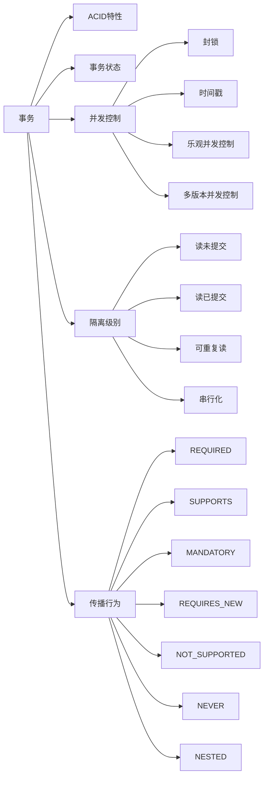

# 事务 原理与代码实例讲解

## 1. 背景介绍
### 1.1 事务的定义与特性
事务是数据库管理系统执行过程中的一个逻辑单位，由一个或多个数据库操作序列组成。事务具有ACID四大特性：

- 原子性(Atomicity)：事务中的所有操作要么全部成功执行，要么全部不执行，不可能出现部分成功部分失败的情况。
- 一致性(Consistency)：事务执行前后，数据库状态必须保持一致。
- 隔离性(Isolation)：多个事务并发执行时，一个事务的执行不应影响其他事务的执行。
- 持久性(Durability)：事务一旦提交，对数据库的修改就是永久性的。

### 1.2 事务的重要性
在实际应用系统中，事务发挥着至关重要的作用：

- 保证数据完整性：通过事务可以保证数据在并发访问、系统崩溃等异常情况下的完整性和一致性。
- 实现复杂业务逻辑：很多业务操作需要多个数据库操作共同完成，事务可以将它们组合为一个原子操作单元。
- 提供数据回滚能力：当事务执行过程中出现异常，事务回滚可以撤销已执行的操作，使数据库回到一致状态。

## 2. 核心概念与联系
### 2.1 事务的状态
一个事务在执行过程中会经历不同的状态：

- 活动态(Active)：事务执行过程中的状态。
- 部分提交态(Partially Committed)：事务的最后一个操作执行完，但未提交前的状态。
- 失败态(Failed)：事务执行失败，将进行回滚的状态。
- 中止态(Aborted)：事务回滚完成，回到事务执行前的状态。
- 提交态(Committed)：事务执行成功并提交，对数据库的修改生效。

### 2.2 并发控制
并发控制是指对并发执行的多个事务进行调度，使其可以并发执行而不破坏数据库的一致性。常见的并发控制技术有：

- 封锁(Locking)：通过对数据加锁来实现互斥访问。
- 时间戳(Timestamp)：为每个事务分配一个时间戳，根据时间戳的顺序来调度事务的执行。
- 乐观并发控制(Optimistic Concurrency Control)：事务读取数据时不加锁，在提交时检查是否有冲突。
- 多版本并发控制(Multi-Version Concurrency Control)：为数据维护多个版本，事务读取自己的版本，写操作生成新版本。

### 2.3 事务的隔离级别
为了在并发事务之间提供不同程度的隔离，数据库定义了四种隔离级别：

- 读未提交(Read Uncommitted)：一个事务可以读取另一个未提交事务的修改。
- 读已提交(Read Committed)：一个事务只能读取已提交事务的修改。
- 可重复读(Repeatable Read)：一个事务执行期间，其他事务无法修改它读取过的数据。
- 串行化(Serializable)：事务串行执行，避免了所有并发问题，但并发性能最低。

### 2.4 事务的传播行为
事务传播行为定义了一个事务方法被另一个事务方法调用时，事务如何传播：

- REQUIRED：如果当前没有事务，就新建一个事务，如果已经存在一个事务中，加入到这个事务中。
- SUPPORTS：如果当前在事务中，则加入该事务；如果当前没有事务，就以非事务方式执行。
- MANDATORY：使用当前的事务，如果当前没有事务，就抛出异常。
- REQUIRES_NEW：新建事务，如果当前存在事务，把当前事务挂起。
- NOT_SUPPORTED：以非事务方式执行操作，如果当前存在事务，就把当前事务挂起。
- NEVER：以非事务方式执行，如果当前存在事务，则抛出异常。
- NESTED：如果当前存在事务，则在嵌套事务内执行。如果当前没有事务，则执行与REQUIRED类似的操作。

### 2.5 核心概念关系图
下面使用Mermaid流程图展示事务的核心概念之间的关系：

## 3. 核心算法原理具体操作步骤
### 3.1 两阶段提交协议(2PC)
两阶段提交是分布式事务实现原子提交的一种常用算法，具体步骤如下：

1. 请求阶段(Prepare Phase)
   - 事务协调者向所有参与者发送Prepare消息
   - 参与者执行事务操作，并将Undo和Redo信息记录到事务日志中
   - 参与者响应协调者，如果事务执行成功则回应Yes，否则回应No

2. 提交阶段(Commit Phase)
   - 如果所有参与者都回应Yes
     - 协调者向所有参与者发送Commit消息
     - 参与者提交事务，释放锁资源
     - 参与者向协调者响应Ack消息
     - 协调者收到所有Ack后，完成事务
   - 如果任一参与者回应No或者超时
     - 协调者向所有参与者发送Rollback消息
     - 参与者回滚事务，释放锁资源
     - 参与者向协调者响应Ack消息
     - 协调者收到所有Ack后，中断事务

### 3.2 三阶段提交协议(3PC) 
三阶段提交是对两阶段提交的改进，通过引入超时机制来解决协调者单点故障问题。具体步骤如下：

1. CanCommit阶段
   - 协调者向参与者发送CanCommit请求
   - 参与者响应CanCommit请求，如果可以提交则回应Yes，否则回应No

2. PreCommit阶段
   - 如果所有参与者都回应Yes
     - 协调者向所有参与者发送PreCommit请求
     - 参与者接收到PreCommit请求后，执行事务操作，并在本地事务日志中记录Undo和Redo信息
     - 参与者响应PreCommit请求，发送ACK消息
     - 协调者接收到所有参与者的ACK响应，进入下一阶段
   - 如果任一参与者回应No或者超时
     - 协调者向所有参与者发送中断请求
     - 参与者接收到中断请求后，执行事务回滚操作，并释放资源
     - 参与者反馈ACK消息给协调者
     - 协调者接收到所有参与者反馈的ACK消息后，中断事务

3. DoCommit阶段
   - 协调者向参与者发送DoCommit请求
   - 参与者接收到DoCommit请求后，正式提交事务，并释放资源
   - 参与者向协调者反馈ACK消息
   - 协调者接收到所有参与者的ACK响应后，完成事务

引入PreCommit阶段后，只要协调者和参与者无一例外地进入PreCommit阶段，则事务最终一定会被提交。

### 3.3 Paxos算法
Paxos是一种基于消息传递的一致性算法，常用于分布式系统的共识问题。Paxos算法中有三类角色：

- Proposer：提出议案
- Acceptor：批准议案
- Learner：获取批准结果

Paxos算法的执行过程可以分为两个阶段：

1. Prepare阶段
   - Proposer选择一个提案编号n，向所有Acceptor广播Prepare(n)请求
   - Acceptor收到Prepare(n)请求后，如果n大于它已经回应的所有Prepare请求的编号，则承诺不再接受编号小于n的提案，并且带上之前已经Accept过的提案中编号最大的提案，回复Proposer

2. Accept阶段
   - 如果Proposer收到半数以上的Acceptor对Prepare(n)的回应，则向Acceptor发送Accept(n,v)请求，v是收到的回复中编号最大的提案的value，如果回复中不包含任何提案，那么v就由Proposer自己决定
   - Acceptor收到Accept(n,v)请求，如果n不小于它已经回应的所有Prepare请求的编号，则接受该提案

Learner不断获取Acceptor批准的提案，当发现有半数以上的Acceptor批准了同一个提案，则认为该提案被选定，将结果通知所有Proposer。

## 4. 数学模型和公式详细讲解举例说明
### 4.1 CAP定理
CAP定理指出，一个分布式系统最多只能同时满足一致性(Consistency)、可用性(Availability)和分区容错性(Partition tolerance)这三项中的两项。

我们可以用数学公式表示CAP定理：

$CAP = C \wedge A \wedge P$

其中，$C$表示一致性，$A$表示可用性，$P$表示分区容错性，$\wedge$表示"与"操作。由于$P$在分布式系统中是必须要满足的，因此实际上的选择只有$CP$和$AP$两种。

- CP系统：保证一致性和分区容错性，但牺牲可用性。当出现网络分区时，为了保证一致性，系统可能会拒绝请求，降低可用性。如Paxos、Raft等。
- AP系统：保证可用性和分区容错性，但牺牲一致性。系统允许在不同节点间短暂地出现数据不一致，但最终会达成一致。如Dynamo、Cassandra等。

### 4.2 FLP不可能性定理
FLP不可能性定理指出，在异步通信模型下，即使只有一个进程可能失败，也没有任何确定性算法能够在有限时间内达成共识。

我们可以用数学语言描述FLP定理：

假设一个异步系统有n个进程，其中最多有f个进程可能失败。系统满足以下条件：

1. 每个进程都有一个初始值，0或1。
2. 所有进程的目标是达成共识，即最终所有进程都决定相同的值。
3. 共识算法满足以下两个条件：
   - 终止性(Termination)：所有正确进程都能在有限时间内做出决定。
   - 协议(Agreement)：所有正确进程做出相同的决定。

FLP定理证明，在上述假设下，不存在任何确定性算法能够在有限时间内达成共识。

### 4.3 Paxos算法的活锁问题
Paxos算法可能会出现活锁问题，即两个Proposer不断地提出编号更大的提案，但都无法获得足够的Accept回应，导致无法形成决议。

我们可以用概率模型分析Paxos算法的活锁问题。假设有n个Acceptor，两个Proposer分别以概率p和q提出提案，且提案编号服从均匀分布。

令X表示形成决议所需的提案轮数，则X服从几何分布：

$P(X=k) = (1-r)^{k-1}r, k=1,2,...$

其中，$r$表示一轮提案能够形成决议的概率。由于两个Proposer相互竞争，$r$的计算如下：

$r = p(1-q)^n + q(1-p)^n$

因此，形成决议所需的期望轮数为：

$E(X) = \frac{1}{r} = \frac{1}{p(1-q)^n + q(1-p)^n}$

可见，当p和q比较接近，且n较大时，形成决议的期望轮数会很大，出现活锁的可能性增加。

为了避免活锁，可以采取以下措施：

- 引入随机等待时间，避免两个Proposer同时提出提案。
- 限制Proposer的数量，减少竞争。
- 增加Acceptor的数量，提高形成决议的概率。

## 5. 项目实践：代码实例和详细解释说明
下面以Java语言为例，演示如何使用Spring框架实现声明式事务管理。