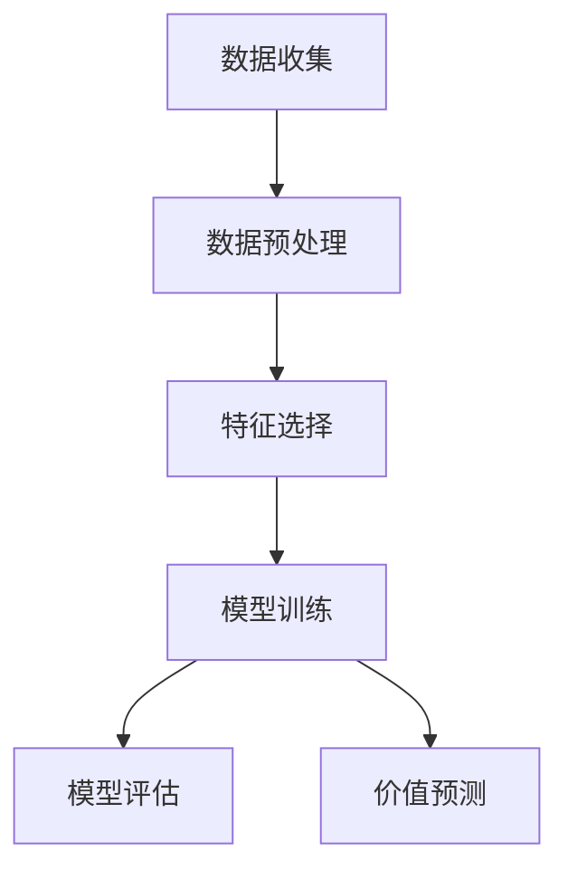

## 1.背景介绍

随着社会经济的发展，汽车已经成为人们生活中不可或缺的一部分。然而，新车的价格高昂，使得许多人选择购买二手车。二手车市场的蓬勃发展，也带来了一些问题，其中最主要的就是二手车的价值评估。二手车的价值评估涉及到许多因素，如车龄、行驶里程、车况等，这些因素都会影响到二手车的价格。因此，如何准确地评估二手车的价值，成为了一个亟待解决的问题。

## 2.核心概念与联系

二手车价值评估系统是一个利用计算机技术，通过分析和处理大量的二手车交易数据，对二手车进行价值评估的系统。它主要包括数据收集、数据预处理、特征选择、模型训练、模型评估和价值预测等环节。



## 3.核心算法原理具体操作步骤

### 3.1 数据收集

数据收集是二手车价值评估系统的第一步。我们可以从各大二手车交易网站上收集二手车的交易数据，这些数据包括车龄、行驶里程、车况等。

### 3.2 数据预处理

数据预处理主要包括数据清洗和数据转换。数据清洗是去除数据中的噪声和异常值，数据转换是将原始数据转换为能够用于模型训练的格式。

### 3.3 特征选择

特征选择是从原始数据中选择出对二手车价值评估有影响的特征。我们可以使用相关性分析、主成分分析等方法进行特征选择。

### 3.4 模型训练

模型训练是使用选择出的特征和对应的二手车价格，训练出一个可以预测二手车价值的模型。我们可以使用线性回归、决策树、随机森林等机器学习算法进行模型训练。

### 3.5 模型评估

模型评估是评估训练出的模型的性能。我们可以使用均方误差、决定系数等指标进行模型评估。

### 3.6 价值预测

价值预测是使用训练出的模型，对新的二手车进行价值预测。

## 4.数学模型和公式详细讲解举例说明

### 4.1 线性回归

线性回归是一种常用的预测模型，它假设特征和目标之间存在线性关系。线性回归的模型可以表示为：

$$
y = \beta_0 + \beta_1x_1 + \beta_2x_2 + \cdots + \beta_nx_n + \epsilon
$$

其中，$y$是目标变量，$x_1, x_2, \cdots, x_n$是特征，$\beta_0, \beta_1, \cdots, \beta_n$是模型参数，$\epsilon$是误差项。

### 4.2 决定系数

决定系数是评估模型性能的一个指标，它表示模型解释目标变量变动的比例。决定系数可以表示为：

$$
R^2 = 1 - \frac{SS_{res}}{SS_{tot}}
$$

其中，$SS_{res}$是残差平方和，$SS_{tot}$是总平方和。

## 5.项目实践：代码实例和详细解释说明

以下是一个使用Python的sklearn库进行二手车价值评估的简单示例：

```python
from sklearn.model_selection import train_test_split
from sklearn.linear_model import LinearRegression
from sklearn.metrics import mean_squared_error, r2_score
import pandas as pd

# 读取数据
df = pd.read_csv('used_car_data.csv')

# 数据预处理
df = df.dropna()

# 特征选择
X = df[['Mileage', 'Year', 'Condition']]
y = df['Price']

# 划分训练集和测试集
X_train, X_test, y_train, y_test = train_test_split(X, y, test_size=0.2, random_state=42)

# 模型训练
model = LinearRegression()
model.fit(X_train, y_train)

# 模型评估
y_pred = model.predict(X_test)
mse = mean_squared_error(y_test, y_pred)
r2 = r2_score(y_test, y_pred)
print('MSE: ', mse)
print('R^2: ', r2)
```

## 6.实际应用场景

二手车价值评估系统可以广泛应用于二手车交易市场。对于二手车买家，他们可以通过价值评估系统，了解到二手车的合理价格，避免被高价卖家欺骗。对于二手车卖家，他们可以通过价值评估系统，合理定价，提高交易成功率。对于二手车交易平台，他们可以通过价值评估系统，提供更好的服务，吸引更多的买家和卖家。

## 7.工具和资源推荐

- Python：一种广泛用于数据分析和机器学习的编程语言。
- sklearn：一个提供大量机器学习算法的Python库。
- pandas：一个提供数据处理和分析功能的Python库。

## 8.总结：未来发展趋势与挑战

随着大数据和人工智能技术的发展，二手车价值评估系统的准确性将得到进一步提高。然而，二手车价值评估也面临着一些挑战，如如何处理大量的数据、如何选择合适的特征、如何训练出准确的模型等。这些都需要我们进行深入的研究和探索。

## 9.附录：常见问题与解答

Q: 二手车价值评估系统的数据从哪里来？
A: 二手车价值评估系统的数据可以从各大二手车交易网站上收集。

Q: 二手车价值评估系统如何处理数据？
A: 二手车价值评估系统通过数据预处理，包括数据清洗和数据转换，处理数据。

Q: 二手车价值评估系统如何选择特征？
A: 二手车价值评估系统可以使用相关性分析、主成分分析等方法进行特征选择。

Q: 二手车价值评估系统如何训练模型？
A: 二手车价值评估系统可以使用线性回归、决策树、随机森林等机器学习算法进行模型训练。

Q: 二手车价值评估系统如何评估模型？
A: 二手车价值评估系统可以使用均方误差、决定系数等指标进行模型评估。

作者：禅与计算机程序设计艺术 / Zen and the Art of Computer Programming