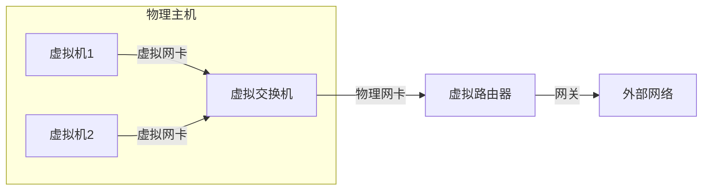
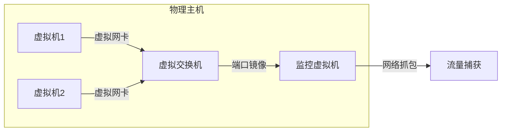
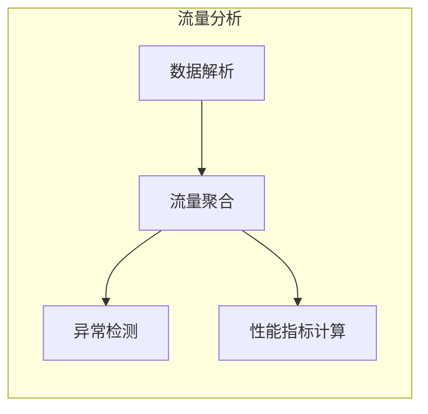

# 云环境下虚拟主机通信监控系统

## 1.背景介绍

### 1.1 云计算环境概述

随着云计算技术的快速发展,越来越多的企业和组织开始将其IT基础设施和应用程序迁移到云端。云计算为用户提供了按需使用计算资源的灵活性,同时降低了硬件和软件的采购成本。在云计算环境中,虚拟机(VM)是最常用的资源形式之一,它可以在物理服务器上运行多个独立的操作系统实例。

### 1.2 虚拟机通信的重要性

由于云环境的分布式和动态特性,虚拟机之间的通信成为了确保应用程序正常运行的关键因素。虚拟机可能会频繁迁移到不同的物理主机上,并且需要与其他虚拟机或外部系统进行通信。因此,有效监控和管理虚拟机通信流量对于维护系统的可用性、性能和安全性至关重要。

### 1.3 虚拟机通信监控系统的作用

虚拟机通信监控系统旨在实时跟踪和分析虚拟机之间的网络流量,帮助管理员和运维人员及时发现并解决潜在的问题。该系统可以提供以下主要功能:

- 网络流量可视化:直观展示虚拟机之间的通信模式和流量趋势。
- 性能监控:监测网络延迟、吞吐量等指标,确保应用程序的高效运行。
- 安全监控:检测异常流量模式,防范潜在的安全威胁。
- 故障排查:快速定位网络问题的根源,缩短故障恢复时间。
- 容量规划:根据历史流量数据,合理规划网络资源的扩展。

## 2.核心概念与联系

### 2.1 虚拟机(Virtual Machine)

虚拟机是一种通过软件模拟的计算机系统,它在主机操作系统之上运行,具有独立的操作系统、CPU、内存、存储和网络资源。虚拟机可以像物理机一样运行应用程序,但具有更好的可移植性、隔离性和灵活性。

### 2.2 虚拟交换机(Virtual Switch)

虚拟交换机是一种软件定义的网络设备,用于连接同一主机上的多个虚拟机。它模拟物理交换机的功能,实现虚拟机之间的通信,并将流量转发到外部网络。

### 2.3 虚拟路由器(Virtual Router)

虚拟路由器是一种软件定义的网络设备,用于连接不同子网或虚拟网络之间的通信。它模拟物理路由器的功能,根据路由表将数据包转发到目标网络。



上图展示了虚拟机、虚拟交换机和虚拟路由器在云环境下的典型部署架构。虚拟机通过虚拟网卡连接到虚拟交换机,实现本地通信;虚拟交换机通过物理网卡连接到虚拟路由器,将流量转发到外部网络。

## 3.核心算法原理具体操作步骤  

虚拟机通信监控系统的核心算法主要包括流量捕获、流量分析和可视化三个主要步骤。

### 3.1 流量捕获

#### 3.1.1 端口镜像(Port Mirroring)

端口镜像是一种在交换机或虚拟交换机上复制网络流量的技术。它将指定端口上的所有流量复制到另一个监控端口,以便进行分析和监控。在虚拟环境中,可以在虚拟交换机上配置端口镜像,将虚拟机之间的通信流量复制到监控虚拟机。

#### 3.1.2 网络抓包(Packet Capture)

网络抓包是另一种流量捕获方法,通常使用诸如tcpdump或Wireshark等工具在操作系统层面捕获网络数据包。在虚拟环境中,可以在监控虚拟机上运行这些工具,捕获经过虚拟网卡的所有网络流量。



上图展示了在虚拟环境中使用端口镜像和网络抓包技术捕获虚拟机通信流量的过程。端口镜像将虚拟交换机上的流量复制到监控虚拟机,而网络抓包则直接在监控虚拟机上捕获经过虚拟网卡的数据包。

### 3.2 流量分析

捕获到的网络流量数据需要进行进一步的分析和处理,以提取有用的信息。流量分析的主要步骤包括:

#### 3.2.1 数据解析

根据不同的网络协议(如TCP/IP、HTTP、DNS等),对捕获的数据包进行解析,提取出源IP、目标IP、端口号、协议类型等关键信息。

#### 3.2.2 流量聚合

将解析后的数据按照特定维度(如源IP、目标IP、协议类型等)进行聚合,统计出每个维度的流量大小、数据包数量等指标。

#### 3.2.3 异常检测

通过建立正常流量模型,对聚合后的流量数据进行分析,检测是否存在异常模式,如突发流量、新出现的通信对等等。

#### 3.2.4 性能指标计算

根据流量数据,计算网络性能相关指标,如延迟、丢包率、吞吐量等,用于评估网络质量和应用程序性能。



上图展示了流量分析的主要步骤。数据解析提取原始数据包的关键信息,流量聚合对解析后的数据进行统计和聚合,异常检测和性能指标计算则基于聚合后的流量数据进行进一步分析。

### 3.3 可视化

为了便于管理员和运维人员快速理解和分析网络流量数据,需要将分析结果以直观的方式进行可视化展示。可视化的主要方式包括:

#### 3.3.1 拓扑图

使用图形化的方式展示虚拟机之间的通信拓扑结构,直观反映出虚拟机的连接关系和流量大小。

#### 3.3.2 流量趋势图

绘制不同维度(如源IP、目标IP、协议类型等)的流量趋势图,展示流量的变化情况,方便发现异常波动。

#### 3.3.3 性能仪表盘

使用仪表盘的形式,实时展示关键性能指标(如延迟、吞吐量等),并设置阈值和警报,及时发现性能问题。

#### 3.3.4 异常事件列表

列出检测到的异常流量事件,包括事件类型、发生时间、涉及的虚拟机等详细信息,方便进一步分析和处理。


上图展示了可视化的主要组成部分。通过拓扑图、流量趋势图、性能仪表盘和异常事件列表等不同形式,管理员和运维人员可以全面了解虚拟机通信的情况,并及时发现和解决潜在问题。

## 4.数学模型和公式详细讲解举例说明

在虚拟机通信监控系统中,一些关键的性能指标需要通过数学模型和公式进行计算和评估。

### 4.1 网络延迟

网络延迟是指数据包在网络中传输的时间,它直接影响应用程序的响应速度和用户体验。在虚拟环境中,网络延迟主要来自虚拟化开销、网络拥塞和物理网络延迟等因素。

延迟可以通过测量数据包的往返时间(RTT)来计算,公式如下:

$$RTT = t_r - t_s$$

其中,\$t_s\$表示发送数据包的时间戳,\$t_r\$表示接收响应数据包的时间戳。

为了评估网络延迟的质量,可以引入以下指标:

- 平均延迟(\$\overline{RTT}\$):在一段时间内所有测量值的算术平均值。
- 最大延迟(\$RTT_{max}\$):所有测量值中的最大值。
- 延迟变化率(\$\Delta RTT\$):连续两次测量值之间的差值。

### 4.2 网络吞吐量

网络吞吐量是指在单位时间内通过网络传输的数据量,它反映了网络的带宽利用率和传输效率。在虚拟环境中,虚拟机之间的吞吐量受到虚拟化开销、网络拥塞和物理网络带宽等因素的影响。

吞吐量可以通过统计单位时间内传输的字节数或数据包数来计算,公式如下:

$$Throughput = \frac{Bytes}{Duration}$$

其中,\$Bytes\$表示传输的字节数,\$Duration\$表示时间段的持续时间。

为了评估网络吞吐量的质量,可以引入以下指标:

- 平均吞吐量(\$\overline{Throughput}\$):在一段时间内所有测量值的算术平均值。
- 最大吞吐量(\$Throughput_{max}\$):所有测量值中的最大值。
- 吞吐量利用率(\$Utilization\$):实际吞吐量与理论最大吞吐量的比值。

### 4.3 丢包率

丢包率是指在网络传输过程中丢失的数据包占总数据包的比例。高丢包率会导致数据传输不完整,影响应用程序的正常运行。在虚拟环境中,丢包可能由于网络拥塞、虚拟化开销或硬件故障等原因引起。

丢包率可以通过比较发送和接收的数据包数量来计算,公式如下:

$$PacketLossRate = \frac{PacketsSent - PacketsReceived}{PacketsSent}$$

其中,\$PacketsSent\$表示发送的数据包数量,\$PacketsReceived\$表示接收的数据包数量。

为了评估丢包率的质量,可以引入以下指标:

- 平均丢包率(\$\overline{PacketLossRate}\$):在一段时间内所有测量值的算术平均值。
- 最大丢包率(\$PacketLossRate_{max}\$):所有测量值中的最大值。
- 丢包率阈值(\$PacketLossRate_{threshold}\$):应用程序可接受的最大丢包率。

通过对上述关键性能指标进行实时监控和评估,虚拟机通信监控系统可以及时发现网络质量下降的情况,并采取相应的优化措施,确保应用程序的稳定运行。

## 5.项目实践:代码实例和详细解释说明

为了更好地理解虚拟机通信监控系统的实现,我们将提供一个基于Python和libpcap库的简单示例。该示例实现了在虚拟环境中捕获和分析虚拟机通信流量的基本功能。

### 5.1 环境准备

首先,我们需要在监控虚拟机上安装Python和libpcap库。libpcap是一个用于网络流量捕获的著名库,它提供了跨平台的数据包捕获接口。

```bash
# 安装Python和libpcap
sudo apt-get update
sudo apt-get install python3 python3-pip libpcap-dev

# 安装Python绑定库
pip3 install pypcap
```

### 5.2 代码实现

下面是一个简单的Python脚本,用于捕获和分