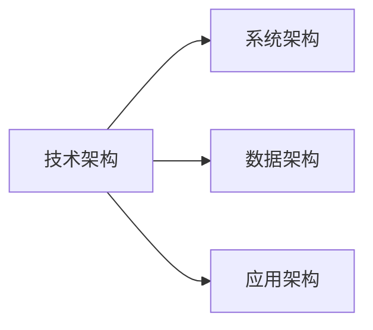
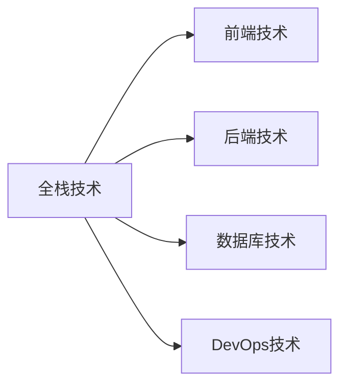
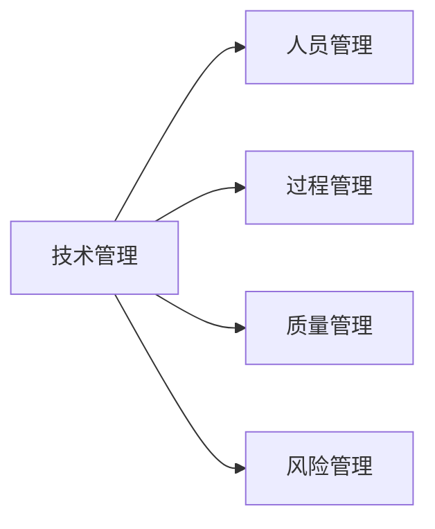

# 互联网技术架构全栈技术管理核心能力

## 1.背景介绍

随着互联网技术的快速发展,企业对技术架构师和全栈工程师的需求与日俱增。技术架构师需要掌握全面的技术知识和管理能力,能够规划、设计、实施和维护整个系统架构。全栈工程师则需要熟练掌握前端、后端、数据库、DevOps等多个技术领域,能够独立完成整个项目的开发。

当今互联网公司面临着快速迭代、高并发、大数据等诸多挑战,传统的技术架构和开发模式已无法满足需求。因此,掌握互联网技术架构全栈技术管理核心能力势在必行。

## 2.核心概念与联系

### 2.1 技术架构

技术架构是指系统的整体技术设计蓝图,包括系统架构、数据架构、应用架构等多个层面。良好的技术架构能够确保系统的可扩展性、可维护性和高性能。



### 2.2 全栈技术

全栈技术是指掌握了从前端到后端,从理论到实践,贯穿整个技术栈的知识和能力。一名优秀的全栈工程师需要熟练掌握前端、后端、数据库、DevOps等多个领域。



### 2.3 技术管理

技术管理是指对技术团队和技术活动的规划、组织、领导和控制。技术管理包括人员管理、过程管理、质量管理、风险管理等多个方面。



## 3.核心算法原理具体操作步骤

互联网技术架构全栈技术管理涉及多个领域,每个领域都有自己的核心算法原理。以下是一些典型算法的具体操作步骤:

### 3.1 负载均衡算法

负载均衡是高可用系统的关键技术,其核心算法包括轮询、加权轮询、最小连接等。

1. 轮询算法:将请求依次分配给每个服务器。
2. 加权轮询算法:根据服务器性能为每台服务器分配不同的权重,性能好的服务器分配更高的权重。
3. 最小连接算法:将请求分配给当前连接数最小的服务器。

### 3.2 缓存算法

缓存是提高系统性能的重要手段,常用的缓存算法包括LRU、LFU等。

1. LRU(最近最少使用)算法:将最近最少使用的数据淘汰。
2. LFU(最少使用)算法:将访问频率最低的数据淘汰。

### 3.3 排序算法

排序算法在很多场景下都有应用,如数据处理、搜索等。常用的排序算法有快速排序、归并排序等。

1. 快速排序:选择一个基准元素,将比它小的元素移到左边,大的移到右边,递归执行该过程。
2. 归并排序:将数组分成两半,分别排序后合并。

## 4.数学模型和公式详细讲解举例说明

### 4.1 负载均衡算法模型

假设有n台服务器,第i台服务器的权重为$w_i$,请求数为$r_i$,则加权轮询算法可以表示为:

$$
r_i = \frac{w_i}{\sum_{j=1}^n w_j} \times R
$$

其中R为总的请求数。

### 4.2 缓存命中率模型

缓存命中率是衡量缓存效率的重要指标。设缓存大小为C,访问序列长度为N,则LRU算法的缓存命中率可以表示为:

$$
\text{hit rate} = 1 - \frac{1}{C} \sum_{i=C+1}^N \frac{1}{i}
$$

### 4.3 排序算法时间复杂度

- 快速排序的平均时间复杂度为$O(n\log n)$
- 归并排序的时间复杂度为$O(n\log n)$

## 5.项目实践:代码实例和详细解释说明

### 5.1 负载均衡示例

```python
class LoadBalancer:
    def __init__(self, servers):
        self.servers = servers
        self.weights = [1] * len(servers)  # 默认权重为1
        self.current = 0

    def add_weight(self, server, weight):
        """为指定服务器添加权重"""
        index = self.servers.index(server)
        self.weights[index] = weight

    def next(self):
        """返回下一个服务器"""
        total = sum(self.weights)
        i = 0
        while True:
            w = self.weights[self.current]
            if i + w >= total:
                break
            i += w
            self.current = (self.current + 1) % len(self.servers)
        self.current = (self.current + 1) % len(self.servers)
        return self.servers[self.current - 1]
```

上述代码实现了一个加权轮询负载均衡器。`__init__`方法初始化服务器列表和权重列表。`add_weight`方法可以为指定服务器添加权重。`next`方法根据权重选择下一个服务器。

### 5.2 LRU缓存示例

```python
class LRUCache:
    def __init__(self, capacity):
        self.capacity = capacity
        self.cache = {}
        self.lru = []

    def get(self, key):
        if key not in self.cache:
            return -1
        self.lru.remove(key)
        self.lru.append(key)
        return self.cache[key]

    def put(self, key, value):
        if key in self.cache:
            self.lru.remove(key)
        elif len(self.cache) == self.capacity:
            del self.cache[self.lru.pop(0)]
        self.lru.append(key)
        self.cache[key] = value
```

上述代码实现了一个LRU缓存。`__init__`方法初始化缓存容量、缓存字典和LRU链表。`get`方法获取键值,并将键移到链表尾部。`put`方法插入键值对,若缓存已满则删除链表头部元素。

## 6.实际应用场景

互联网技术架构全栈技术管理在实际应用中扮演着重要角色,以下是一些典型场景:

### 6.1 高可用系统

高可用系统需要合理的技术架构设计和负载均衡算法,以确保系统的稳定性和可扩展性。

### 6.2 大数据处理

大数据处理需要高效的缓存和排序算法,以提高数据处理效率。

### 6.3 微服务架构

微服务架构需要全栈技术,以实现服务的解耦和独立部署。同时也需要合理的技术管理,确保服务的协调一致。

## 7.工具和资源推荐

以下是一些互联网技术架构全栈技术管理领域的优秀工具和学习资源:

### 7.1 工具

- Nginx: 高性能的反向代理服务器和负载均衡器
- Redis: 高性能的键值对缓存数据库
- Docker: 容器化部署和管理工具
- Kubernetes: 容器编排和管理平台

### 7.2 学习资源

- 《软件架构师的12项修炼》
- 《系统性能优化权威指南》
- 《大规模分布式存储系统》
- 《微服务设计模式》

## 8.总结:未来发展趋势与挑战

互联网技术架构全栈技术管理是一个不断发展的领域,未来的发展趋势包括:

1. 云原生架构:采用容器、微服务、Serverless等技术构建云原生应用。
2. 人工智能:将人工智能技术应用于系统优化、预测等领域。
3. 边缘计算:将计算资源部署在网络边缘,提高响应速度。

同时,这个领域也面临着一些挑战:

1. 技术复杂度不断增加,需要更高的技术管理能力。
2. 系统安全性和隐私保护越来越受关注。
3. 人才短缺,高素质的全栈工程师和架构师较为缺乏。

## 9.附录:常见问题与解答

### 9.1 什么是技术债务?如何应对?

技术债务是指在软件开发过程中为了赶进度而做出的一些妥协,导致代码质量下降。应对技术债务的方法包括:

1. 重构代码,提高代码质量。
2. 制定技术债务清理计划,持续优化代码。
3. 加强代码审查,防止新的技术债务产生。

### 9.2 如何实现系统的高可用?

实现系统高可用的关键技术包括:

1. 负载均衡,将请求分发到多个服务器。
2. 主从复制,实现数据备份和故障转移。
3. 缓存技术,减轻数据库压力。
4. 集群部署,实现服务的水平扩展。

### 9.3 微服务架构的优缺点是什么?

微服务架构的优点包括:

1. 服务解耦,提高开发效率。
2. 单一职责,便于部署和扩展。
3. 技术栈多样化,适应不同场景需求。

缺点包括:

1. 分布式系统复杂,需要解决一致性等问题。
2. 运维成本较高,需要精细化管理。
3. 性能开销较大,存在远程调用开销。

作者: 禅与计算机程序设计艺术 / Zen and the Art of Computer Programming