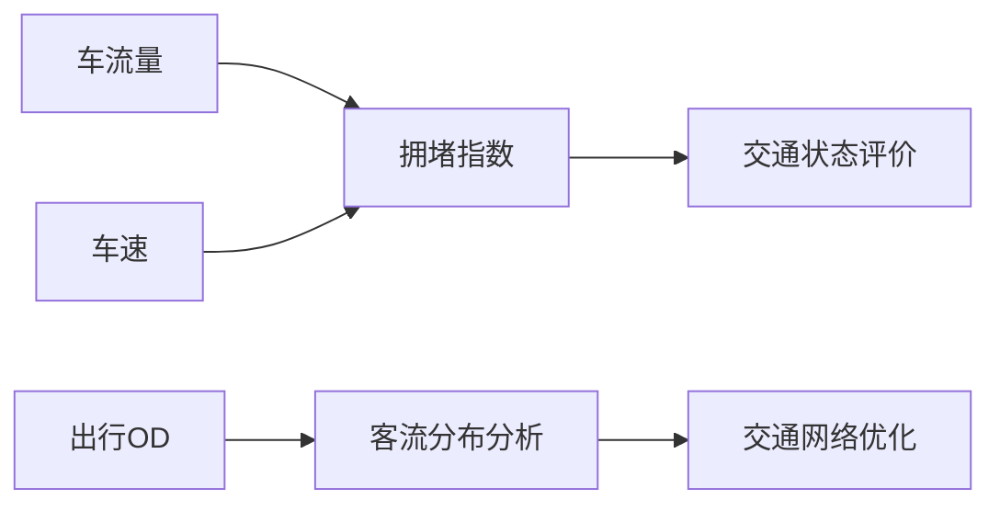

# 交通数据集：城市交通的数字化脉络

## 1. 背景介绍
### 1.1 交通数据的重要性
交通数据是城市交通管理和规划的重要基础。随着城市化进程的加快和交通压力的增大,如何利用数据分析技术优化交通管理,提高交通效率,已成为全球城市面临的共同课题。交通数据集的建立和应用,为解决这一问题提供了新的思路和方法。

### 1.2 交通数据集的内涵
交通数据集是指通过各种传感器、监控设备等采集的反映城市交通状态的数据集合,包括车流量、车速、拥堵指数、事故信息等多个维度的数据。这些数据经过清洗、标注、整合后,形成结构化的大规模交通数据集,为交通管理和决策提供数据支撑。

### 1.3 交通数据集的应用前景
交通数据集的应用前景广阔。一方面,交通数据可用于描述城市交通运行的规律,优化交通信号配时、公交线路规划等,提高交通管理的科学性和精细化水平。另一方面,交通数据也为出行服务、导航应用等提供数据基础,为市民出行提供更加智能、便捷的服务。交通数据已成为智慧交通不可或缺的数字化基础设施。

## 2. 核心概念与联系
### 2.1 车流量
车流量是指单位时间内通过某一断面的车辆数,是描述道路通行能力和饱和度的重要指标。车流量数据一般通过地磁、视频等车辆检测器采集。

### 2.2 车速
车速反映了车辆通行的快慢,是评价道路畅通程度的关键参数。车速数据可通过GPS、视频等方式采集。瞬时车速的聚合可以计算路段的平均车速、中位车速等指标。

### 2.3 拥堵指数
拥堵指数是对道路交通状态的综合评价,一般结合车流量、车速等参数计算得到。常见的拥堵指数包括平均车速比、延误指数等。拥堵指数直观反映了道路的通畅情况。

### 2.4 出行OD
出行OD(Origin-Destination)指的是出行的起讫点分布,反映了城市居民出行的空间分布规律。出行OD可通过手机信令、浮动车数据等方式获取,是分析客流分布、优化交通网络的重要依据。

### 2.5 关系图
以下是这些核心概念之间联系的Mermaid流程图:



车流量和车速数据经过融合分析,可以计算拥堵指数,进而对道路交通状态进行评价。出行OD数据则反映了人们出行需求的空间分布,是进行客流分析、交通网络优化的基础。这些概念环环相扣,共同构成了城市交通的数字化图景。

## 3. 核心算法原理与操作步骤
### 3.1 数据采集
交通数据的采集是数据集构建的基础。常见的数据采集方法包括:

1. 车辆检测器法:利用地磁、微波雷达、视频等车辆检测器直接采集通过车辆的数量、速度、车型等信息。
2. 浮动车法:通过在车辆上安装GPS设备,采集车辆轨迹数据,并结合地图信息还原路网交通状态。
3. 手机信令法:通过采集手机信令数据,获取用户位置轨迹,进而分析区域内人口流动和出行分布。
4. 公共交通IC卡数据:通过采集公交、地铁的刷卡数据,分析客流分布和站点客流量。

### 3.2 数据清洗与匹配
原始采集的交通数据往往存在噪声、异常值、缺失值等问题,需要进行数据清洗。常见的清洗操作包括:

1. 异常值剔除:剔除超出合理范围的异常测量值,如超高/超低的车速值等。
2. 缺失值填充:对于缺失的数据,可通过插值、数据对齐等方法进行填充。
3. 噪声过滤:使用卡尔曼滤波、移动平均等方法去除高频噪声。
4. 数据匹配:将采集的数据与地图道路进行匹配,建立数据与路网的对应关系。

### 3.3 数据融合与挖掘
不同来源、不同粒度的交通数据需要进行融合,以获得更全面、准确的交通状态估计。常用的融合方法包括:

1. 数据关联:将不同来源数据根据时空属性进行关联,如将浮动车数据与路况数据结合等。
2. 多源融合:利用卡尔曼滤波、贝叶斯融合等方法,对同一目标的多个观测值进行融合,提高估计精度。
3. 时空插值:利用克里金插值、IDW等方法,对采样点进行时空插值,获得连续的交通状态数据。

在数据融合的基础上,可利用数据挖掘技术发现交通数据中蕴含的模式和规律,如:

1. 聚类分析:使用K-Means、DBSCAN等聚类算法,发现道路网络中的关键节点和片区。
2. 关联规则挖掘:挖掘不同路段、时段之间车流量的关联规则,发现交通流的时空演化规律。
3. 异常检测:利用统计检验、机器学习等方法,实时检测交通流中的异常事件。

### 3.4 操作步骤

交通数据集的构建和应用一般包括以下步骤:

1. 确定数据需求:根据应用场景,确定需要采集的交通参数、时空范围、数据粒度等。
2. 数据采集:选择合适的数据采集方案,如地磁检测器、浮动车系统等,开展数据采集工作。
3. 数据预处理:对采集数据进行清洗、去噪、匹配等预处理,提高数据质量。
4. 数据融合:将多源异构数据进行关联、融合,生成统一的数据视图。
5. 数据存储:将融合后的数据存储在关系型数据库、NoSQL数据库、分布式文件系统等存储系统中。
6. 数据分析与挖掘:利用统计分析、机器学习等方法,对数据进行分析挖掘,提炼有价值的信息和规律。
7. 数据应用:将分析结果应用于交通管理、出行服务等领域,如信号优化、诱导屏信息发布等。
8. 数据更新:定期对数据进行更新和维护,保证数据的时效性和准确性。

## 4. 数学模型与公式详解
### 4.1 交通流基本参数
交通流参数是描述交通流状态的基本物理量,主要包括流量、密度和速度三个参数。

1. 流量(Flow): 单位时间内通过某一断面的车辆数,用 $q$ 表示,单位是$veh/h$。
2. 密度(Density): 单位路段长度上的车辆数,用 $k$ 表示,单位是$veh/km$。
3. 速度(Speed): 车辆通过某一断面的平均速度,用 $v$ 表示,单位是$km/h$。

这三个参数满足以下关系:

$$q=k\cdot v$$

即流量等于密度与速度的乘积。这个公式反映了交通流的基本属性,在交通流建模中广泛应用。

### 4.2 交通流宏观模型

交通流宏观模型使用连续介质力学的方法,将车流看作连续介质,建立交通流密度、速度、流量之间的演化关系。代表性的宏观模型包括LWR模型和PW模型。

#### LWR模型

LWR模型由Lighthill, Whitham和Richards在上世纪50年代提出,假设车流密度 $k$ 和速度 $v$ 满足以下关系:

$$v=v_e(k)$$

其中 $v_e(k)$ 是均衡速度,是密度的单调递减函数。再结合连续方程:

$$\frac{\partial k}{\partial t}+\frac{\partial q}{\partial x}=0$$

可得到LWR模型的基本方程:

$$\frac{\partial k}{\partial t}+\frac{\partial kv_e(k)}{\partial x}=0$$

求解该方程可得到交通流密度的时空演化规律。

#### PW模型

PW模型由Payne和Whitham提出,在LWR模型的基础上引入了速度动力学方程:

$$\frac{\partial v}{\partial t}+v\frac{\partial v}{\partial x}=\frac{v_e(k)-v}{\tau}-\frac{c_0^2}{k}\frac{\partial k}{\partial x}$$

其中 $\tau$ 为驾驶员对速度变化的松弛时间,$c_0$ 为交通流传播速度。PW模型能够描述交通流的不稳定现象如停止波、虚波等。

### 4.3 交通流微观模型

交通流微观模型关注每一辆车的行为,常用的微观模型包括:

#### 跟驰模型(Car-following Model)

跟驰模型描述了车辆跟驰行为,即后车根据与前车的相对位置和速度调整自身速度。代表性的跟驰模型有最优速度模型(OV Model):

$$\frac{dv_n}{dt}=\frac{V(\Delta x_n)-v_n}{τ}$$

其中 $v_n$ 为第 $n$ 辆车的速度,$\Delta x_n$ 为车头间距, $V(\Delta x_n)$ 为最优速度函数。

#### 元胞自动机模型(Cellular Automata Model)

元胞自动机模型将道路离散为元胞,每个元胞要么为空,要么被一辆车占据。车辆根据元胞自动机规则在元胞间转移,常用的规则有NaSch模型:

1. 加速:$v_n \to \min(v_n+1,v_{max})$
2. 减速:$v_n \to \min(v_n,d_n)$
3. 随机慢化:以概率 $p$,$v_n \to \max(v_n-1,0)$
4. 位置更新:$x_n \to x_n+v_n$

其中 $d_n$ 为第 $n$ 辆车与前车的间距。元胞自动机模型能够再现交通流的很多复杂特性。

## 5. 项目实践：代码实例与详解
下面以Python为例,展示如何利用交通数据集进行数据分析和可视化。

### 5.1 数据读取与预处理

首先读取交通流量数据,并进行预处理:

```python
import pandas as pd
import numpy as np
import matplotlib.pyplot as plt

# 读取数据
data = pd.read_csv('traffic_data.csv')

# 数据预处理
data['timestamp'] = pd.to_datetime(data['timestamp'])  # 转换时间戳
data = data.set_index('timestamp')  # 设置时间戳为索引
data = data.resample('5min').mean()  # 按5分钟聚合
data = data.fillna(method='ffill')  # 填充缺失值
```

这里我们读取了一个交通流量数据集,将时间戳转换为日期时间格式,并设置为数据框的索引。然后按5分钟对数据进行聚合,并用前向填充法处理缺失值。

### 5.2 交通流量可视化

接下来我们对处理后的数据进行可视化分析:

```python
# 绘制交通流量时间序列图
plt.figure(figsize=(12,4))
for col in data.columns:
    plt.plot(data[col], label=col)
plt.xlabel('Time')
plt.ylabel('Traffic Flow (veh/h)')
plt.legend()
plt.tight_layout()
plt.show()

# 绘制交通流量日变化图
data['hour'] = data.index.hour
data_hour = data.groupby('hour').mean()
plt.figure(figsize=(8,4))
for col in data.columns:
    if col != 'hour':
        plt.plot(data_hour[col], label=col)
plt.xlabel('Hour')
plt.ylabel('Traffic Flow (veh/h)')
plt.legend()
plt.tight_layout()
plt.show()
```

第一个图展示了各路段交通流量的时间变化曲线,可以看出不同路段的交通流量差异和变化趋势。第二个图展示了平均的