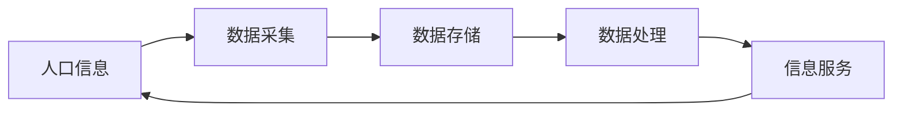

# 人口管理系统详细设计与具体代码实现

## 1.背景介绍
### 1.1 人口管理系统的重要性
随着社会的快速发展和人口的不断增长,高效、准确地管理人口信息已成为各级政府部门和相关机构的重要任务。人口管理系统作为一种现代化的信息管理工具,在优化人口资源配置、制定合理的人口政策以及提高公共服务质量等方面发挥着至关重要的作用。

### 1.2 人口管理系统的发展历程
人口管理系统的发展经历了从手工登记到计算机化管理的过程。早期的人口管理主要依赖于纸质档案和人工统计,效率低下且易出错。随着计算机技术的普及,人口管理逐步实现了电子化和网络化,极大地提高了数据处理和信息共享的效率。近年来,大数据、云计算等新兴技术的应用,为人口管理系统的智能化发展提供了新的机遇。

### 1.3 人口管理系统面临的挑战
尽管人口管理系统取得了长足进步,但仍面临着诸多挑战。首先,人口数据的采集和更新需要投入大量的人力和物力,数据的时效性和准确性有待提高。其次,不同地区和部门之间的数据标准不统一,信息孤岛现象严重,影响了数据的共享和利用。此外,个人隐私保护和数据安全也是亟待解决的问题。

## 2.核心概念与联系
### 2.1 人口信息
人口信息是人口管理系统的核心数据,主要包括个人基本信息(如姓名、性别、出生日期、身份证号等)、家庭信息(如户籍地址、家庭成员等)、教育和就业信息(如学历、职业等)以及其他相关信息(如婚姻状况、健康状况等)。

### 2.2 数据采集
数据采集是指从各种渠道获取人口信息并录入系统的过程。常见的数据采集方式包括人工录入、OCR识别、数据接口对接等。数据采集的及时性、准确性和完整性直接影响系统的数据质量。

### 2.3 数据存储
数据存储是指将采集到的人口信息按照一定的格式和规则保存在数据库中。常用的数据库有关系型数据库(如MySQL、Oracle等)和非关系型数据库(如MongoDB、HBase等)。数据存储需要考虑数据的安全性、可靠性和可扩展性。

### 2.4 数据处理
数据处理是指对存储的人口信息进行加工、分析和挖掘,以满足各种应用需求。常见的数据处理操作包括数据清洗、数据集成、数据统计、数据挖掘等。数据处理需要利用各种算法和工具,如机器学习、数据可视化等。

### 2.5 信息服务
信息服务是指根据用户需求,以一定的方式提供人口信息查询、统计分析等服务。常见的信息服务方式包括网页查询、移动APP、微信公众号等。信息服务需要考虑用户体验、数据安全和系统性能。

### 2.6 各概念之间的联系
人口信息是人口管理系统的核心,其他概念都是围绕人口信息展开的。数据采集是获取人口信息的手段,数据存储是保存人口信息的方式,数据处理是加工人口信息的过程,信息服务是利用人口信息的目的。这些概念环环相扣,共同构成了人口管理系统的完整生命周期。



## 3.核心算法原理具体操作步骤
### 3.1 数据清洗算法
数据清洗是指检测并纠正数据中的错误、不一致、重复等问题,以提高数据质量。常用的数据清洗算法包括:

1. 异常值检测:利用统计学方法(如3σ原则)或机器学习算法(如孤立森林)识别异常值并进行处理。
2. 缺失值处理:对缺失值进行删除、插值(如均值插补、回归插补)或不处理。
3. 重复值处理:对重复记录进行删除或合并。
4. 数据标准化:将不同来源、不同格式的数据转换为统一的标准格式。

### 3.2 数据集成算法
数据集成是指将多个数据源的数据整合到一个一致的数据存储中,以方便数据的管理和使用。常用的数据集成算法包括:

1. ETL(Extract-Transform-Load):将数据从源系统抽取出来,经过转换处理后加载到目标系统。
2. ELT(Extract-Load-Transform):先将数据抽取并加载到目标系统,再在目标系统中进行转换处理。
3. CDC(Change Data Capture):捕获源系统数据的变化并同步到目标系统,保持数据的实时一致性。

### 3.3 数据挖掘算法
数据挖掘是指从大量数据中发现隐藏的、有价值的知识的过程。常用的数据挖掘算法包括:

1. 关联规则挖掘:发现数据项之间的关联关系,如购物篮分析。常用算法有Apriori、FP-growth等。
2. 聚类分析:将相似的数据对象归为一类。常用算法有K-means、DBSCAN等。
3. 分类预测:根据已知类别的数据建立分类模型,对新数据进行类别预测。常用算法有决策树、支持向量机等。
4. 异常检测:发现数据中的异常模式或异常个体。常用算法有基于统计的方法、基于距离的方法等。

## 4.数学模型和公式详细讲解举例说明
### 4.1 线性回归模型
线性回归模型是一种常用的数据分析和预测方法,用于研究因变量y和自变量x之间的线性关系。其数学模型为:

$$y=\beta_0+\beta_1x_1+\beta_2x_2+...+\beta_kx_k+\epsilon$$

其中,$\beta_0$是截距项,$\beta_1,\beta_2,...,\beta_k$是回归系数,$\epsilon$是随机误差项。

举例说明:假设我们要研究一个地区的人口数量(y)与GDP(x1)、人均收入(x2)之间的关系,可以建立如下线性回归模型:

$$y=\beta_0+\beta_1x_1+\beta_2x_2+\epsilon$$

通过收集历史数据并使用最小二乘法估计回归系数,就可以得到一个拟合的线性模型,用于预测未来的人口数量。

### 4.2 逻辑回归模型
逻辑回归模型是一种常用的二分类方法,用于研究因变量y(取值为0或1)与自变量x之间的关系。其数学模型为:

$$P(y=1|x)=\frac{1}{1+e^{-(\beta_0+\beta_1x_1+\beta_2x_2+...+\beta_kx_k)}}$$

其中,$P(y=1|x)$表示在给定自变量x的条件下y取值为1的概率,$\beta_0$是截距项,$\beta_1,\beta_2,...,\beta_k$是回归系数。

举例说明:假设我们要研究一个地区的人口是否迁移(y,0表示不迁移,1表示迁移)与年龄(x1)、教育程度(x2)之间的关系,可以建立如下逻辑回归模型:

$$P(y=1|x)=\frac{1}{1+e^{-(\beta_0+\beta_1x_1+\beta_2x_2)}}$$

通过收集历史数据并使用极大似然估计法估计回归系数,就可以得到一个拟合的逻辑回归模型,用于预测人口迁移的概率。

### 4.3 时间序列模型
时间序列模型是一种常用的时序数据分析和预测方法,用于研究一个指标在不同时间点上的变化规律。常用的时间序列模型包括:

1. 移动平均模型(MA):用过去若干个时期的随机扰动项的加权平均值来预测当前值。
2. 自回归模型(AR):用过去若干个时期的观测值的加权平均值来预测当前值。
3. 自回归移动平均模型(ARMA):结合了AR和MA模型,既考虑过去的观测值,也考虑过去的随机扰动。
4. 差分自回归移动平均模型(ARIMA):在ARMA模型的基础上引入差分运算,可以处理非平稳时间序列。

举例说明:假设我们要研究一个地区过去10年的人口数量(y),并预测未来5年的人口变化趋势,可以建立如下ARIMA模型:

$$(1-\sum_{i=1}^{p}\phi_iB^i)(1-B)^dX_t=(1+\sum_{i=1}^{q}\theta_iB^i)\epsilon_t$$

其中,p为AR项阶数,q为MA项阶数,d为差分阶数,B为滞后算子,即$B^iX_t=X_{t-i}$。通过对历史数据进行模型识别、参数估计和模型检验,就可以得到一个拟合的ARIMA模型,用于预测未来的人口数量。

## 5.项目实践：代码实例和详细解释说明
下面以Python为例,演示如何使用Pandas和Scikit-learn库实现人口数据的基本处理和分析。

### 5.1 数据读取和查看
```python
import pandas as pd

# 读取CSV文件
data = pd.read_csv('population.csv')

# 查看数据前几行
print(data.head())

# 查看数据基本信息
print(data.info())

# 查看数据统计描述
print(data.describe())
```

说明:
- `pd.read_csv()`函数可以读取CSV格式的数据文件,返回一个DataFrame对象。
- `head()`方法可以查看DataFrame的前几行数据,默认为5行。
- `info()`方法可以查看DataFrame的基本信息,如行数、列数、数据类型等。
- `describe()`方法可以查看DataFrame的统计描述信息,如均值、标准差、最大最小值等。

### 5.2 数据清洗和预处理
```python
# 检查缺失值
print(data.isnull().sum())

# 填充缺失值
data.fillna(data.mean(), inplace=True)

# 去除重复值
data.drop_duplicates(inplace=True)

# 数据标准化
from sklearn.preprocessing import StandardScaler

scaler = StandardScaler()
data_scaled = scaler.fit_transform(data)
```

说明:
- `isnull()`方法可以检查DataFrame中的缺失值,返回一个布尔型DataFrame。
- `fillna()`方法可以填充DataFrame中的缺失值,这里使用列的均值进行填充。
- `drop_duplicates()`方法可以去除DataFrame中的重复行。
- `StandardScaler`类可以对数据进行标准化,使其均值为0,标准差为1。

### 5.3 数据可视化
```python
import matplotlib.pyplot as plt

# 绘制人口数量直方图
plt.hist(data['population'], bins=20)
plt.xlabel('Population')
plt.ylabel('Frequency')
plt.title('Histogram of Population')
plt.show()

# 绘制人口数量折线图
data['population'].plot()
plt.xlabel('Year')
plt.ylabel('Population')
plt.title('Line Chart of Population')
plt.show()

# 绘制人口金字塔
data['age'].value_counts().sort_index().plot(kind='bar', rot=0)
plt.xlabel('Age')
plt.ylabel('Population')
plt.title('Population Pyramid')
plt.show()
```

说明:
- `hist()`函数可以绘制直方图,展示数据的分布情况。
- `plot()`函数可以绘制折线图,展示数据的变化趋势。
- `value_counts()`方法可以统计每个值出现的次数,`sort_index()`方法可以对索引进行排序,`kind='bar'`表示绘制柱状图,`rot=0`表示横轴标签旋转0度。

### 5.4 数据建模和预测
```python
from sklearn.linear_model import LinearRegression
from sklearn.model_selection import train_test_split

# 划分特征变量和目标变量
X = data[['age', 'education', 'income']]
y = data['population'] 

# 划分训练集和测试集
X_train, X_test, y_train, y_test = train_test_split(X, y, test_size=0.2, random_state=42)

# 创建线性回归模型
model = LinearRegression()

# 训练模型
model.