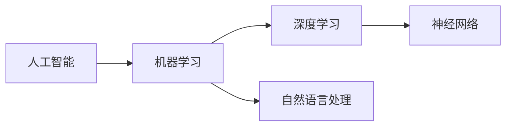

## 1.背景介绍

人工智能（AI）是计算机科学的一个分支，旨在创建和应用智能机器。AI的概念最初是在1956年的达特茅斯会议上提出的，会议中的参与者讨论了“所有与学习或任何其他智能过程有关的特性，可以精确地描述出来，一个机器就可以被使得模拟它。”这个定义给出了AI的基本理念：如果一个过程可以被精确地描述，那么它可以被自动化。

## 2.核心概念与联系

人工智能的核心概念包括机器学习、深度学习、神经网络和自然语言处理等。这些概念之间的关系可以用以下Mermaid流程图来表示：



## 3.核心算法原理具体操作步骤

机器学习算法的核心原理是通过从数据中学习并做出预测或决策，而不是被明确地编程来执行某项任务。这个过程可以分为以下步骤：

1. 数据收集：首先，我们需要收集和准备数据。这可能包括数据清理和预处理步骤，以确保数据的质量和适用性。

2. 数据分析：然后，我们需要对数据进行分析，以确定其特性和结构。这可能包括统计分析和可视化。

3. 选择模型：基于我们对数据的理解，我们可以选择一个或多个机器学习模型来尝试解决问题。

4. 训练模型：我们使用我们的数据来训练模型。这是一个迭代的过程，我们通过调整模型的参数来最小化预测错误。

5. 评估模型：我们需要评估模型的性能，以确定其预测能力。这可能包括使用不同的度量标准和评估方法。

6. 预测：最后，我们可以使用训练好的模型来对新的数据进行预测。

## 4.数学模型和公式详细讲解举例说明

让我们以线性回归为例来详细解释一下机器学习的数学模型和公式。线性回归是一种简单的机器学习模型，它假设目标变量和输入变量之间存在线性关系。

线性回归的数学模型可以表示为：

$$ y = a * x + b $$

其中，$y$是目标变量，$x$是输入变量，$a$和$b$是模型参数，需要从数据中学习。

线性回归的学习过程就是找到最优的$a$和$b$，使得预测的$y$和真实的$y$之间的差异最小。这个差异通常用均方误差（MSE）来衡量，其公式为：

$$ MSE = \frac{1}{n} \sum_{i=1}^{n} (y_i - (a * x_i + b))^2 $$

其中，$n$是数据点的数量，$y_i$和$x_i$是第$i$个数据点的目标值和输入值。

## 5.项目实践：代码实例和详细解释说明

下面是一个使用Python和scikit-learn库进行线性回归的例子：

```python
from sklearn.linear_model import LinearRegression
from sklearn.model_selection import train_test_split
from sklearn.datasets import make_regression

# 生成数据
X, y = make_regression(n_samples=100, n_features=1, noise=0.1)

# 划分训练集和测试集
X_train, X_test, y_train, y_test = train_test_split(X, y, test_size=0.2)

# 创建并训练模型
model = LinearRegression()
model.fit(X_train, y_train)

# 预测
y_pred = model.predict(X_test)
```

这段代码首先生成了一个包含100个样本、1个特征的回归问题数据集，然后将数据集划分为训练集和测试集。接着，创建一个线性回归模型，并使用训练集数据来训练模型。最后，使用训练好的模型对测试集数据进行预测。

## 6.实际应用场景

人工智能在许多领域都有广泛的应用，包括但不限于：

- **医疗健康**：AI可以用于疾病诊断、药物发现、患者护理等。
- **金融**：AI可以用于信用评分、欺诈检测、投资决策等。
- **交通运输**：AI可以用于自动驾驶、交通流量预测、路线规划等。
- **教育**：AI可以用于个性化学习、自动评分、学生行为分析等。

## 7.工具和资源推荐

以下是一些推荐的人工智能学习和开发工具和资源：

- **Python**：Python是一种广泛用于AI和机器学习的编程语言，有许多相关的库和框架，如scikit-learn、TensorFlow和PyTorch等。
- **Jupyter Notebook**：Jupyter Notebook是一个开源的网络应用程序，允许你创建和共享包含实时代码、方程、可视化和解释性文本的文档。
- **Google Colab**：Google Colab是一个基于云的Jupyter Notebook环境，提供免费的GPU资源，适合进行机器学习和深度学习实验。
- **Coursera**：Coursera提供了许多高质量的在线课程，包括Andrew Ng的“机器学习”和“深度学习专项课程”。

## 8.总结：未来发展趋势与挑战

人工智能的发展趋势是向更深层次、更广泛的应用领域和更高的自动化程度发展。然而，也面临着一些挑战，如数据安全和隐私、算法公平性和透明度、AI的伦理问题等。

## 9.附录：常见问题与解答

1. **问：人工智能和机器学习有什么区别？**

   答：人工智能是一个广泛的概念，涵盖了使机器能够执行看起来像人类的智能行为的所有技术。而机器学习是实现AI的一种方法，它是通过让机器从数据中学习，而不是进行明确的编程。

2. **问：我需要什么样的背景知识才能学习AI？**

   答：学习AI通常需要一些基础知识，包括编程（如Python）、数学（如线性代数、概率论和统计）、和机器学习基础。但是，有许多在线资源可以帮助你从零开始学习这些知识。

3. **问：我如何开始学习AI？**

   答：一种常见的方法是通过在线课程开始学习，如Coursera的“机器学习”课程。然后，你可以选择一个具体的项目来实践你的技能。

作者：禅与计算机程序设计艺术 / Zen and the Art of Computer Programming