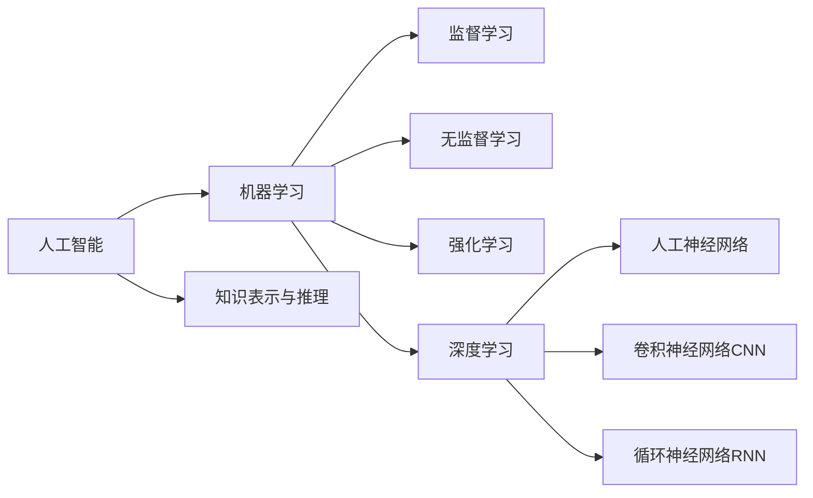

# 人工智能(Artificial Intelligence) - 原理与代码实例讲解

## 1.背景介绍
### 1.1 人工智能的发展历程
#### 1.1.1 早期人工智能的探索
#### 1.1.2 专家系统的兴起
#### 1.1.3 机器学习的崛起
### 1.2 人工智能的定义与分类
#### 1.2.1 人工智能的定义
#### 1.2.2 人工智能的分类
### 1.3 人工智能的应用领域
#### 1.3.1 自然语言处理
#### 1.3.2 计算机视觉
#### 1.3.3 机器人技术
#### 1.3.4 智能决策系统

## 2.核心概念与联系
### 2.1 机器学习
#### 2.1.1 监督学习
#### 2.1.2 无监督学习
#### 2.1.3 强化学习
### 2.2 深度学习
#### 2.2.1 人工神经网络
#### 2.2.2 卷积神经网络(CNN)
#### 2.2.3 循环神经网络(RNN)
### 2.3 知识表示与推理
#### 2.3.1 知识表示方法
#### 2.3.2 知识推理技术
### 2.4 核心概念之间的联系


## 3.核心算法原理具体操作步骤
### 3.1 支持向量机(SVM)
#### 3.1.1 SVM的基本原理
#### 3.1.2 SVM的数学推导
#### 3.1.3 SVM的优化算法
### 3.2 决策树
#### 3.2.1 决策树的基本概念
#### 3.2.2 ID3算法
#### 3.2.3 C4.5算法
### 3.3 随机森林
#### 3.3.1 随机森林的基本原理
#### 3.3.2 随机森林的构建过程
#### 3.3.3 随机森林的优缺点分析
### 3.4 梯度提升决策树(GBDT)  
#### 3.4.1 GBDT的基本原理
#### 3.4.2 GBDT的训练过程
#### 3.4.3 GBDT的优化技巧

## 4.数学模型和公式详细讲解举例说明
### 4.1 线性回归
#### 4.1.1 一元线性回归模型
$$y=w_0+w_1x$$
其中，$y$为预测值，$x$为输入变量，$w_0$和$w_1$为待求参数。
#### 4.1.2 多元线性回归模型  
$$y=w_0+w_1x_1+w_2x_2+...+w_nx_n$$
其中，$y$为预测值，$x_1,x_2,...,x_n$为输入变量，$w_0,w_1,...,w_n$为待求参数。
#### 4.1.3 最小二乘法求解线性回归参数
$$\min_{w} \sum_{i=1}^{n}(y_i-w^Tx_i)^2$$
### 4.2 逻辑回归
#### 4.2.1 逻辑回归模型
$$P(y=1|x)=\frac{1}{1+e^{-w^Tx}}$$
其中，$P(y=1|x)$表示在给定$x$的条件下$y=1$的概率，$w$为待求参数。
#### 4.2.2 逻辑回归的损失函数
$$J(w)=-\frac{1}{m}\sum_{i=1}^{m}[y_i\log(h_w(x_i))+(1-y_i)\log(1-h_w(x_i))]$$
其中，$h_w(x)=\frac{1}{1+e^{-w^Tx}}$，$m$为样本数量。
#### 4.2.3 梯度下降法求解逻辑回归参数
$$w:=w-\alpha\frac{\partial J(w)}{\partial w}$$
其中，$\alpha$为学习率。

## 5.项目实践：代码实例和详细解释说明
### 5.1 使用Python实现线性回归
```python
import numpy as np

class LinearRegression:
    def __init__(self):
        self.w = None
        
    def fit(self, X, y):
        X = np.insert(X, 0, 1, axis=1)
        self.w = np.linalg.inv(X.T.dot(X)).dot(X.T).dot(y)
        
    def predict(self, X):
        X = np.insert(X, 0, 1, axis=1)
        y_pred = X.dot(self.w)
        return y_pred
```
上述代码实现了一个简单的线性回归模型，通过最小二乘法求解模型参数。`fit`方法用于训练模型，`predict`方法用于预测。
### 5.2 使用TensorFlow实现逻辑回归
```python
import tensorflow as tf

class LogisticRegression:
    def __init__(self, learning_rate=0.01, num_epochs=100):
        self.learning_rate = learning_rate
        self.num_epochs = num_epochs
        
    def fit(self, X, y):
        self.X = tf.placeholder(tf.float32, [None, X.shape[1]])
        self.y = tf.placeholder(tf.float32, [None, 1])
        
        self.w = tf.Variable(tf.zeros([X.shape[1], 1]))
        self.b = tf.Variable(tf.zeros([1]))
        
        y_pred = tf.sigmoid(tf.matmul(self.X, self.w) + self.b)
        loss = tf.reduce_mean(-self.y * tf.log(y_pred) - (1 - self.y) * tf.log(1 - y_pred))
        
        optimizer = tf.train.GradientDescentOptimizer(self.learning_rate)
        train_op = optimizer.minimize(loss)
        
        with tf.Session() as sess:
            sess.run(tf.global_variables_initializer())
            
            for epoch in range(self.num_epochs):
                _, loss_val = sess.run([train_op, loss], feed_dict={self.X: X, self.y: y.reshape(-1, 1)})
                
                if (epoch + 1) % 10 == 0:
                    print(f"Epoch {epoch+1}, Loss: {loss_val:.4f}")
            
            self.w_val, self.b_val = sess.run([self.w, self.b])
        
    def predict(self, X):
        y_pred = tf.sigmoid(tf.matmul(X, self.w_val) + self.b_val)
        return y_pred.eval()
```
上述代码使用TensorFlow实现了逻辑回归模型，通过梯度下降法优化模型参数。`fit`方法用于训练模型，`predict`方法用于预测。

## 6.实际应用场景
### 6.1 智能客服系统
#### 6.1.1 基于自然语言处理的问答系统
#### 6.1.2 情感分析与用户情绪识别
#### 6.1.3 个性化推荐与服务
### 6.2 智能医疗诊断
#### 6.2.1 医学影像分析与疾病诊断
#### 6.2.2 电子病历分析与辅助决策
#### 6.2.3 药物研发与虚拟筛选
### 6.3 自动驾驶
#### 6.3.1 环境感知与目标检测
#### 6.3.2 路径规划与决策控制
#### 6.3.3 车辆状态监测与故障预测

## 7.工具和资源推荐
### 7.1 机器学习框架
#### 7.1.1 Scikit-learn
#### 7.1.2 TensorFlow
#### 7.1.3 PyTorch
### 7.2 数据集资源
#### 7.2.1 Kaggle
#### 7.2.2 UCI机器学习库
#### 7.2.3 ImageNet
### 7.3 在线学习平台
#### 7.3.1 Coursera
#### 7.3.2 edX
#### 7.3.3 Udacity

## 8.总结：未来发展趋势与挑战
### 8.1 人工智能的发展趋势
#### 8.1.1 跨领域融合与应用
#### 8.1.2 可解释性与可信赖性
#### 8.1.3 数据隐私与安全
### 8.2 人工智能面临的挑战
#### 8.2.1 算法偏差与公平性
#### 8.2.2 数据质量与标注成本
#### 8.2.3 模型鲁棒性与泛化能力
### 8.3 人工智能的未来展望
#### 8.3.1 人机协作与增强智能
#### 8.3.2 自主学习与持续进化
#### 8.3.3 通用人工智能的探索

## 9.附录：常见问题与解答
### 9.1 什么是过拟合和欠拟合？如何避免？
过拟合是指模型在训练数据上表现很好，但在新数据上泛化能力差。欠拟合是指模型无法很好地捕捉数据的特征和规律。可以通过正则化、交叉验证、数据增强等方法来避免过拟合和欠拟合。
### 9.2 如何选择合适的模型和超参数？
可以通过交叉验证、网格搜索、随机搜索等方法来选择合适的模型和超参数。还可以借助一些自动机器学习工具，如Auto-sklearn、Auto-Keras等。
### 9.3 人工智能会取代人类吗？
人工智能旨在辅助和增强人类的能力，而非取代人类。人工智能与人类应该是互补和协作的关系，共同推动社会的进步和发展。

作者：禅与计算机程序设计艺术 / Zen and the Art of Computer Programming