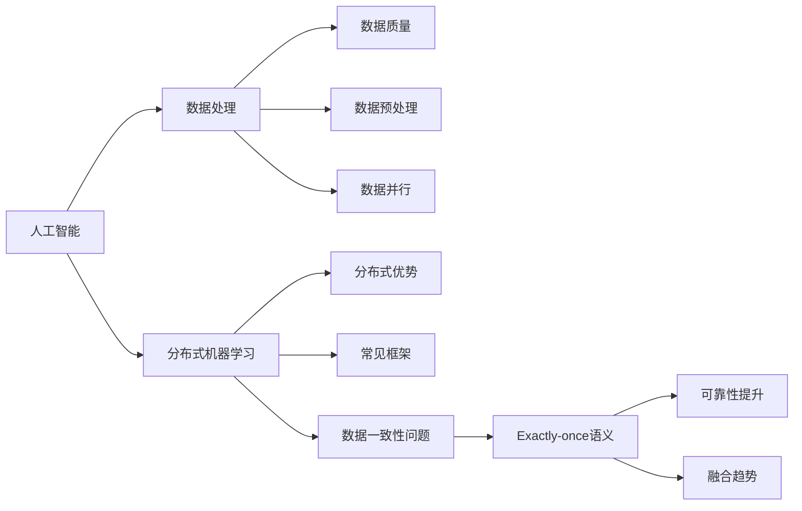

# 人工智能与exactly-once语义的结合

## 1. 背景介绍
### 1.1 人工智能的发展现状
#### 1.1.1 人工智能的定义与范畴
#### 1.1.2 人工智能技术的发展历程
#### 1.1.3 人工智能在各行业的应用现状

### 1.2 分布式系统中的数据一致性问题
#### 1.2.1 分布式系统的特点与挑战
#### 1.2.2 数据一致性问题的定义与分类
#### 1.2.3 常见的数据一致性模型

### 1.3 Exactly-once语义的提出
#### 1.3.1 At-most-once与At-least-once语义的局限性
#### 1.3.2 Exactly-once语义的定义与特点
#### 1.3.3 Exactly-once语义在分布式系统中的重要性

## 2. 核心概念与联系
### 2.1 人工智能中的数据处理
#### 2.1.1 人工智能对数据质量的要求
#### 2.1.2 数据预处理与特征工程
#### 2.1.3 数据并行与模型并行

### 2.2 分布式机器学习框架
#### 2.2.1 分布式机器学习的优势
#### 2.2.2 常见的分布式机器学习框架
#### 2.2.3 分布式机器学习中的数据一致性问题

### 2.3 Exactly-once语义与人工智能的结合
#### 2.3.1 Exactly-once语义在人工智能中的应用场景
#### 2.3.2 Exactly-once语义对人工智能系统可靠性的提升
#### 2.3.3 Exactly-once语义与人工智能的融合趋势

## 3. 核心算法原理具体操作步骤
### 3.1 Exactly-once语义的实现原理
#### 3.1.1 幂等操作与事务性
#### 3.1.2 全局唯一标识符的生成与管理
#### 3.1.3 端到端的Exactly-once语义保证

### 3.2 分布式机器学习中的Exactly-once语义算法
#### 3.2.1 参数服务器架构下的Exactly-once语义实现
#### 3.2.2 AllReduce架构下的Exactly-once语义实现
#### 3.2.3 Exactly-once语义与容错机制的结合

### 3.3 Exactly-once语义算法的优化与改进
#### 3.3.1 减少Exactly-once语义的开销
#### 3.3.2 提高Exactly-once语义的吞吐量
#### 3.3.3 Exactly-once语义算法的适应性优化

## 4. 数学模型和公式详细讲解举例说明
### 4.1 Exactly-once语义的形式化定义
#### 4.1.1 事件与状态的数学表示
#### 4.1.2 Exactly-once语义的形式化描述
#### 4.1.3 Exactly-once语义的数学性质

### 4.2 分布式机器学习中的数学模型
#### 4.2.1 梯度下降算法与参数更新
#### 4.2.2 模型同步与参数聚合
#### 4.2.3 分布式优化算法的收敛性分析

### 4.3 Exactly-once语义的数学分析
#### 4.3.1 Exactly-once语义对数据一致性的保证
#### 4.3.2 Exactly-once语义对算法收敛性的影响
#### 4.3.3 Exactly-once语义的数学优化方法

## 5. 项目实践：代码实例和详细解释说明
### 5.1 基于Kafka的Exactly-once语义实现
#### 5.1.1 Kafka的Exactly-once语义保证机制
#### 5.1.2 生产者与消费者的Exactly-once语义配置
#### 5.1.3 端到端的Exactly-once语义实现示例

### 5.2 分布式机器学习框架中的Exactly-once语义实现
#### 5.2.1 TensorFlow中的Exactly-once语义支持
#### 5.2.2 PyTorch中的Exactly-once语义实现
#### 5.2.3 MXNet中的Exactly-once语义优化

### 5.3 Exactly-once语义在实际项目中的应用
#### 5.3.1 大规模推荐系统中的Exactly-once语义保证
#### 5.3.2 金融风控模型中的Exactly-once语义实现
#### 5.3.3 智能语音助手中的Exactly-once语义优化

## 6. 实际应用场景
### 6.1 Exactly-once语义在金融领域的应用
#### 6.1.1 银行交易系统中的Exactly-once语义保证
#### 6.1.2 股票交易平台中的Exactly-once语义实现
#### 6.1.3 区块链技术中的Exactly-once语义应用

### 6.2 Exactly-once语义在电商领域的应用
#### 6.2.1 订单处理系统中的Exactly-once语义保证
#### 6.2.2 物流配送系统中的Exactly-once语义优化
#### 6.2.3 推荐系统中的Exactly-once语义实现

### 6.3 Exactly-once语义在工业领域的应用
#### 6.3.1 智能制造中的Exactly-once语义保证
#### 6.3.2 能源管理系统中的Exactly-once语义实现
#### 6.3.3 物联网平台中的Exactly-once语义优化

## 7. 工具和资源推荐
### 7.1 Exactly-once语义的开源实现
#### 7.1.1 Apache Flink的Exactly-once语义保证
#### 7.1.2 Apache Spark的Exactly-once语义支持
#### 7.1.3 Apache Pulsar的Exactly-once语义实现

### 7.2 分布式机器学习框架的Exactly-once语义扩展
#### 7.2.1 TensorFlow的Exactly-once语义插件
#### 7.2.2 PyTorch的Exactly-once语义库
#### 7.2.3 MXNet的Exactly-once语义模块

### 7.3 Exactly-once语义的学习资源
#### 7.3.1 相关论文与研究文献
#### 7.3.2 在线课程与教程
#### 7.3.3 开源项目与代码示例

## 8. 总结：未来发展趋势与挑战
### 8.1 Exactly-once语义的研究方向
#### 8.1.1 Exactly-once语义的形式化验证
#### 8.1.2 Exactly-once语义的自适应优化
#### 8.1.3 Exactly-once语义的硬件加速

### 8.2 人工智能与Exactly-once语义的融合趋势
#### 8.2.1 Exactly-once语义在深度学习中的应用
#### 8.2.2 Exactly-once语义与强化学习的结合
#### 8.2.3 Exactly-once语义在联邦学习中的优化

### 8.3 Exactly-once语义面临的挑战
#### 8.3.1 Exactly-once语义的性能瓶颈
#### 8.3.2 Exactly-once语义的安全隐患
#### 8.3.3 Exactly-once语义的标准化困境

## 9. 附录：常见问题与解答
### 9.1 Exactly-once语义与At-least-once语义的区别
### 9.2 Exactly-once语义在分布式系统中的局限性
### 9.3 Exactly-once语义与ACID事务的关系
### 9.4 Exactly-once语义在大规模数据处理中的应用
### 9.5 Exactly-once语义与容错机制的配合
### 9.6 Exactly-once语义在实时计算中的挑战
### 9.7 Exactly-once语义与数据一致性模型的选择
### 9.8 Exactly-once语义在机器学习中的应用前景

作者：禅与计算机程序设计艺术 / Zen and the Art of Computer Programming