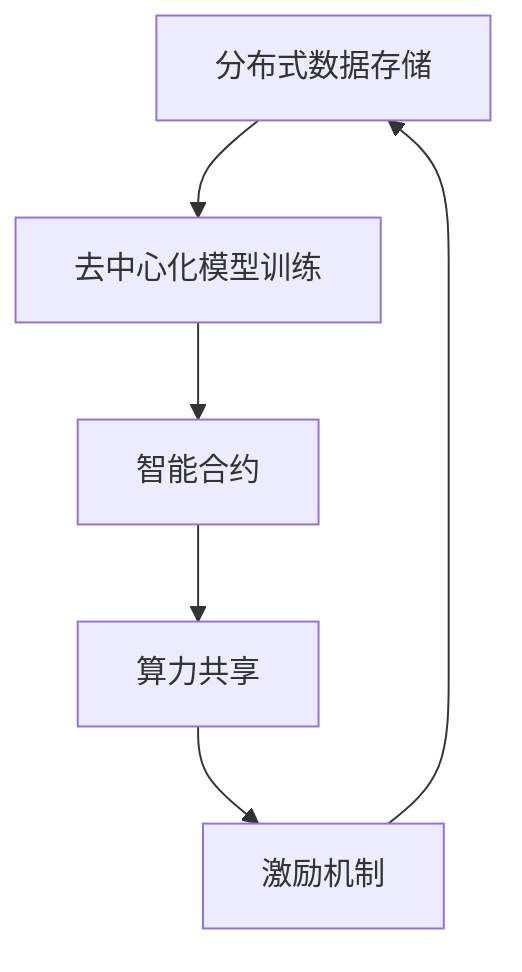
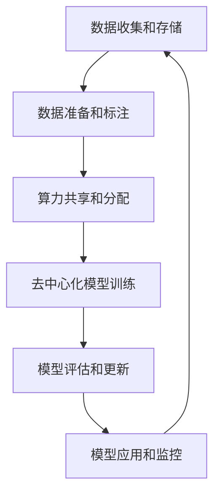

# 人工智能与区块链:去中心化智能的未来愿景

## 1.背景介绍

在当今时代,人工智能(AI)和区块链技术正在改变着我们的生活和工作方式。这两种颠覆性技术的结合,正在开辟一个前所未有的全新领域——去中心化智能(Decentralized AI,DAI)。

去中心化智能旨在创建一个开放、透明、安全和公平的人工智能生态系统,摆脱传统的集中式AI系统所面临的诸多挑战,如数据隐私、算力垄断、模型偏差等。通过将人工智能算法与区块链的分布式账本技术相结合,DAI有望实现真正的去中心化、数据所有权和算力共享。

### 人工智能的集中化挑战

传统的人工智能系统通常由少数科技巨头所控制,他们拥有海量的数据和算力资源。这种集中式架构存在以下几个主要问题:

1. **数据隐私**: 用户的个人数据被集中收集,存在潜在的隐私泄露风险。
2. **算力垄断**: 算力资源高度集中,造成计算能力的不公平分配。
3. **模型偏差**: 训练数据和算法可能存在偏差,导致AI模型做出不公平的决策。
4. **单点故障**: 集中式系统容易受到单点故障和攻击的影响。

### 区块链的去中心化优势

区块链技术通过分布式账本、共识机制和加密技术,为去中心化提供了坚实的基础。它具有以下关键优势:

1. **去中心化**: 无需依赖任何中心化的权威机构,实现真正的点对点交互。
2. **不可篡改**: 基于密码学原理,数据一旦被记录就无法被修改或删除。
3. **透明公开**: 所有交易和数据都是公开透明的,任何人都可以验证。
4. **可追溯性**: 区块链上的所有操作都留有永久的审计线索。

## 2.核心概念与联系

去中心化智能是人工智能和区块链技术的有机结合,它包含以下几个核心概念:

### 分布式数据存储

传统的AI系统依赖于集中式的数据存储,而DAI则利用区块链技术实现了分布式的数据存储。用户可以自主控制自己的数据,并选择是否将其用于训练AI模型。这不仅保护了用户的隐私,还促进了数据的公平分布。

### 算力共享

DAI通过算力共享网络,将计算资源分散到各个节点上。任何拥有闲置算力的个人或组织,都可以加入这个网络,并获得相应的加密货币奖励。这种共享机制打破了算力垄断,提高了整体计算效率。

### 去中心化模型训练

在DAI系统中,AI模型的训练过程是去中心化的。分布在不同节点上的数据和算力资源,通过协作的方式参与模型训练,从而避免了单一实体对模型的控制。这种方式有助于减少模型偏差,提高模型的公平性和准确性。

### 智能合约

智能合约是DAI系统的核心组成部分。它是一种自动执行的计算机程序,可以在满足预定条件时自动执行相应的操作。智能合约用于管理数据访问权限、算力分配、模型训练流程等,确保整个系统的透明性和可追溯性。

### 激励机制

为了吸引更多的参与者加入DAI生态系统,需要设计合理的激励机制。通过发放加密货币token作为奖励,可以激励用户贡献数据、提供算力、参与模型训练等行为。这种激励机制有助于构建一个可持续发展的DAI生态圈。

上述核心概念相互关联、相辅相成,共同构建了一个去中心化的人工智能生态系统。

## 3.核心算法原理具体操作步骤

去中心化智能系统的核心算法原理包括以下几个关键步骤:

1. **数据收集和存储**

   用户可以自主决定是否将自己的数据贡献给DAI系统。如果选择贡献,他们需要将数据上传到DAI的分布式存储网络中。这些数据会被加密和分散存储在不同的节点上,确保数据的安全性和隐私性。

2. **数据准备和标注**

   上传的原始数据需要进行预处理和标注,以便于后续的模型训练。这一步骤可以由专业的数据标注团队或众包的方式完成。标注好的数据会被存储在区块链上,并通过智能合约管理数据的访问权限。

3. **算力共享和分配**

   DAI系统会根据模型训练的需求,动态地分配算力资源。拥有闲置算力的节点可以加入算力共享网络,并获得相应的加密货币奖励。智能合约会根据预定的规则,公平地分配算力资源。

4. **去中心化模型训练**

   模型训练过程是完全去中心化的。分布在不同节点上的数据和算力资源,通过协作的方式参与模型训练。每个节点只能访问到被授权的数据子集,从而保护了数据隐私。训练过程中的中间结果会被记录在区块链上,确保了可追溯性。

5. **模型评估和更新**

   训练完成后,需要对模型进行评估和测试,检查其性能和公平性。如果模型达到预期,就可以部署到DAI系统中;否则需要进行模型优化或重新训练。模型的更新和迭代也会记录在区块链上,保证了透明性。

6. **模型应用和监控**

   经过评估的AI模型可以被应用到各种场景中,如医疗诊断、金融风险评估、智能交通等。DAI系统会持续监控模型的运行情况,一旦发现异常就会触发相应的处理机制,确保模型的可靠性和安全性。

上述算法步骤相互衔接,形成了一个完整的去中心化智能生态系统。

## 4.数学模型和公式详细讲解举例说明

在去中心化智能系统中,数学模型和公式扮演着至关重要的角色。下面我们将详细讲解一些常见的模型和公式。

### 联邦学习

联邦学习(Federated Learning)是一种去中心化的机器学习范式,它允许多个客户端在不共享原始数据的情况下协作训练模型。这种方法可以保护数据隐私,同时提高模型的性能。

联邦学习的基本思想是,每个客户端在本地使用自己的数据训练模型,然后将模型参数(而不是原始数据)上传到服务器。服务器会对所有客户端的模型参数进行聚合,得到一个全局模型,并将其分发回各个客户端。客户端再使用全局模型在本地数据上继续训练,重复这个过程直到模型收敛。

联邦学习的数学模型可以表示为:

$$\min_{w} F(w) = \sum_{k=1}^{K} \frac{n_k}{n} F_k(w)$$

其中:
- $w$ 表示模型参数
- $K$ 是客户端的总数
- $n_k$ 是第 $k$ 个客户端的数据量
- $n = \sum_{k=1}^{K} n_k$ 是所有客户端的数据总量
- $F_k(w)$ 是第 $k$ 个客户端的本地目标函数

服务器的目标是最小化所有客户端的加权平均损失函数 $F(w)$。

在每一轮迭代中,客户端 $k$ 会使用随机梯度下降(SGD)或其变体来优化本地目标函数:

$$w_k^{t+1} = w_k^t - \eta \nabla F_k(w_k^t)$$

其中 $\eta$ 是学习率。

然后,服务器会对所有客户端的模型参数进行加权平均:

$$w^{t+1} = \sum_{k=1}^{K} \frac{n_k}{n} w_k^{t+1}$$

得到新的全局模型参数 $w^{t+1}$,并分发回各个客户端进行下一轮迭代。

联邦学习的优点是可以保护数据隐私,同时利用多个数据源来提高模型性能。但它也面临一些挑战,如通信开销、系统异构性、数据不平衡等。

### 区块链共识算法

区块链系统依赖于共识算法来确保网络的一致性和不可篡改性。常见的共识算法包括工作量证明(PoW)、权益证明(PoS)、实用拜占庭容错(PBFT)等。

#### 工作量证明(PoW)

工作量证明是比特币等加密货币所采用的共识机制。它要求矿工们解决一个计算密集型的难题(即"工作"),以获得记账权并获得奖励。

PoW的核心思想是,要想在区块链上添加一个新块,矿工必须找到一个满足特定条件的随机数 $nonce$,使得将该数与当前区块头的其他字段(如前一个区块的哈希值、交易数据等)拼接后的字符串的SHA-256哈希值小于一个预定的目标值。

数学上,这可以表示为:

$$H(prev\_hash \| tx\_data \| nonce) < target$$

其中:
- $H$ 是SHA-256哈希函数
- $prev\_hash$ 是前一个区块的哈希值
- $tx\_data$ 是当前区块中的交易数据
- $nonce$ 是需要找到的随机数
- $target$ 是一个预定的目标值,它决定了解决难题的难度

由于SHA-256是一个不可逆的哈希函数,因此矿工只能通过不断尝试不同的 $nonce$ 值来寻找满足条件的解。这个过程被称为"挖矿"。

一旦某个矿工找到了符合条件的 $nonce$,它就可以广播这个新区块,并获得相应的奖励。其他节点可以快速验证这个解的正确性,从而达成共识。

PoW的优点是安全性高、去中心化程度高,但缺点是计算开销和能耗巨大。

#### 权益证明(PoS)

权益证明是一种替代PoW的共识算法,它根据节点持有的加密货币数量来决定记账权。持有更多货币的节点获得记账权的概率更高,从而避免了大量的计算工作。

在PoS系统中,每个节点需要锁定一定数量的货币作为"权益"。系统会随机选择一个节点来创建并验证下一个区块,选择的概率与节点的权益成正比。

具体来说,对于节点 $i$,它被选中的概率可以表示为:

$$P_i = \frac{stake_i}{\sum_{j=1}^{N} stake_j}$$

其中:
- $stake_i$ 是节点 $i$ 锁定的权益数量
- $N$ 是网络中所有节点的数量
- $\sum_{j=1}^{N} stake_j$ 是所有节点权益的总和

被选中的节点将获得相应的奖励,同时也需要承担一定的惩罚机制,以防止作恶行为。

PoS的优点是能耗低、效率高,但它也面临着"无利润攻击"、"无权重攻击"等安全挑战。

上述只是区块链共识算法的一个简单介绍,实际上还有许多变种和改进版本,如权益委托证明(DPoS)、Casper协议等。不同的共识算法在安全性、去中心化程度、效率等方面有不同的权衡取舍。

### 隐私保护技术

在去中心化智能系统中,保护用户数据隐私是一个重要课题。常见的隐私保护技术包括同态加密、差分隐私、多方安全计算等。

#### 同态加密

同态加密允许在密文上直接进行计算,而无需先解密。这使得我们可以在不泄露原始数据的情况