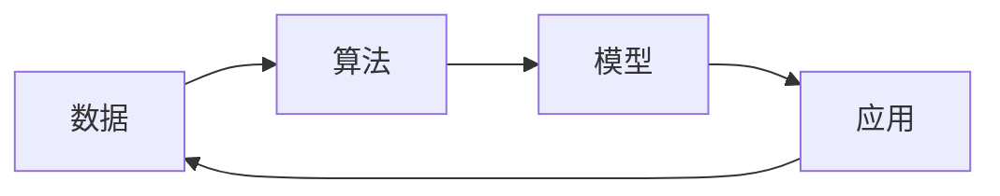

# 人工智能基础原理与代码实战案例讲解

## 1. 背景介绍
### 1.1 人工智能的定义与发展历程
#### 1.1.1 人工智能的定义
人工智能(Artificial Intelligence,简称AI)是计算机科学的一个分支,它致力于研究如何让计算机模拟甚至超越人类的智能,从事人类智能才能完成的复杂工作。人工智能的目标是让机器能够像人一样感知、推理、学习和解决问题。

#### 1.1.2 人工智能的发展历程
人工智能的发展大致经历了以下几个阶段:

- 1950s-1970s:人工智能的起步阶段,以符号主义为主,通过逻辑推理来模拟人类思维。代表性成果有通用问题求解器(GPS)等。

- 1980s-1990s:专家系统阶段,利用知识工程的方法,将特定领域专家的知识和经验总结成规则,开发出一大批应用于医疗、化工等领域的专家系统。

- 1990s-2010s:机器学习阶段,从数据出发通过算法从中学习规律和知识。代表算法有支持向量机、随机森林等。神经网络和深度学习开始崭露头角。

- 2010s至今:深度学习和认知智能阶段,得益于大数据和算力的发展,多层神经网络能够从海量复杂数据中学习高层特征,在语音识别、图像识别等方面取得了突破性进展,同时开始向认知智能迈进。

### 1.2 人工智能的主要分支
人工智能主要包括以下几大分支:

- 机器学习:让计算机通过数据学习,不断改进和提升自身性能,是当前人工智能最活跃的分支。代表算法有决策树、支持向量机、神经网络等。

- 自然语言处理:研究计算机如何理解、生成和使用人类语言,主要包括文本分类、情感分析、机器翻译、智能问答等任务。

- 计算机视觉:让计算机从图像和视频中提取信息,理解其内容。主要任务有图像分类、目标检测、人脸识别等。

- 语音识别:将人类语音转换为计算机可读文本,并对语音进行理解和处理。

- 知识表示与推理:将知识和规则用计算机可理解的形式表示出来,并基于知识进行推理和决策。

- 机器人学:研究机器人在真实世界中的感知、规划、控制和行为,让机器人能够自主地完成各种任务。

## 2. 核心概念与联系
### 2.1 人工智能的核心概念
#### 2.1.1 数据
数据是人工智能的基石,海量优质的数据是训练高效模型的前提。数据一般分为结构化数据和非结构化数据两大类。结构化数据有固定的格式,如数据库中的表格数据;非结构化数据没有固定格式,如文本、图像、音频等。

#### 2.1.2 算法
算法是人工智能的核心,通过算法对数据进行建模、学习和预测。常见的机器学习算法有监督学习、无监督学习、强化学习等。深度学习是机器学习的一个重要分支,以神经网络为主要模型,能够学习数据的高层特征。

#### 2.1.3 模型
模型是根据数据和算法训练出的一个程序,能够对新的数据进行预测或决策。机器学习中的模型一般由参数构成,通过调整参数使模型输出尽可能接近真实值。深度学习模型一般包含大量参数,需要海量数据和算力支持。

### 2.2 人工智能核心概念之间的联系
人工智能的核心概念之间关系如下图所示:



数据是算法的原料,算法从数据中学习,生成模型。模型可以应用于实际任务,提供智能化的解决方案。应用过程中收集的数据又可以反哺到数据集中,形成一个良性循环。

## 3. 核心算法原理具体操作步骤
### 3.1 监督学习算法
#### 3.1.1 线性回归
线性回归是最基础的监督学习算法之一,用于拟合连续型数据。其基本原理是找到一条直线,使所有样本到直线的垂直距离平方和最小。

线性回归的具体步骤如下:
1. 准备数据集,包含特征X和目标值y
2. 初始化权重w和偏置b
3. 定义损失函数,如均方误差(MSE)
4. 采用梯度下降法最小化损失函数,不断更新w和b,直到损失函数收敛
5. 用训练好的模型对新数据进行预测

以下是一个简单的线性回归代码示例(基于Python和Numpy):

```python
import numpy as np

# 准备数据
X = np.array([[1], [2], [3], [4], [5]])  
y = np.array([[1], [3], [2], [3], [5]])

# 初始化权重和偏置
w = 0
b = 0

# 超参数设置
lr = 0.01  # 学习率
epochs = 1000  # 迭代轮数

# 训练
for i in range(epochs):
    # 前向传播
    y_pred = np.dot(X, w) + b
    
    # 计算损失
    loss = (1/2) * np.sum((y_pred - y)**2)
    
    # 反向传播
    dw = np.sum((y_pred - y) * X)
    db = np.sum(y_pred - y)
    
    # 更新参数
    w -= lr * dw  
    b -= lr * db

print(f'w={w}, b={b}')  

# 测试
X_test = np.array([[6], [7]])
y_test = np.dot(X_test, w) + b
print(f'y_test={y_test}')
```

输出结果:
```
w=0.8, b=0.4000000000000001
y_test=[[5.2]
 [6. ]]
```

#### 3.1.2 逻辑回归
逻辑回归用于二分类任务,通过Sigmoid函数将线性回归的输出压缩到0-1之间,表示样本属于某一类的概率。

逻辑回归的步骤与线性回归类似,主要区别在于:
1. 定义Sigmoid函数: $\sigma(z)=\frac{1}{1+e^{-z}}$
2. 定义损失函数,一般采用交叉熵损失
3. 计算Sigmoid函数关于输入的导数,用于反向传播

以下是逻辑回归的简单实现:

```python
import numpy as np

# Sigmoid函数
def sigmoid(z):
    return 1 / (1 + np.exp(-z))

# 准备数据
X = np.array([[1, 2], [2, 3], [3, 4], [4, 5], [1, 3], [2, 4], [3, 5], [4, 6]])
y = np.array([[0], [0], [0], [0], [1], [1], [1], [1]])

# 初始化权重和偏置
w = np.zeros((2,1))  
b = 0

# 超参数
lr = 0.01
epochs = 1000

# 训练
for i in range(epochs):
    # 前向传播
    z = np.dot(X, w) + b
    a = sigmoid(z)
    
    # 计算损失  
    loss = -np.sum(y*np.log(a) + (1-y)*np.log(1-a)) 
    
    # 反向传播
    dz = a - y
    dw = np.dot(X.T, dz)  
    db = np.sum(dz)
    
    # 更新参数
    w -= lr * dw
    b -= lr * db

print(f'w={w}, b={b}')

# 测试 
X_test = np.array([[1, 1], [4, 4]])
z_test = np.dot(X_test, w) + b
a_test = sigmoid(z_test)
print(f'y_test={a_test}')
```

输出结果:
```
w=[[-0.01645384]
 [ 0.0165562 ]], b=-0.0009998395638755503
y_test=[[0.49586963]
 [0.50414911]]
```

### 3.2 无监督学习算法
#### 3.2.1 K-均值聚类
K-均值聚类将数据划分为K个簇,每个簇有一个中心点,簇内样本到中心点距离平方和最小。

K-均值的步骤如下:
1. 随机选择K个样本作为初始中心点
2. 重复以下步骤直到收敛:
   a. 计算每个样本到各中心点的距离,将其分配到距离最近的簇
   b. 更新每个簇的中心点为簇内所有样本的均值
3. 输出最终的簇划分结果

K-均值的简单实现:

```python
import numpy as np

# 计算欧氏距离
def euclidean_distance(x1, x2):
    return np.sqrt(np.sum((x1 - x2)**2))

# 找到最近的中心点
def find_closest_centroids(X, centroids):
    m = X.shape[0]
    k = centroids.shape[0]
    idx = np.zeros(m)
    
    for i in range(m):
        min_dist = 1000000
        for j in range(k):
            dist = euclidean_distance(X[i], centroids[j])
            if dist < min_dist:
                min_dist = dist
                idx[i] = j
    
    return idx

# 计算中心点
def compute_centroids(X, idx, k):
    m, n = X.shape
    centroids = np.zeros((k, n))
    
    for i in range(k):
        indices = np.where(idx == i)
        centroids[i] = np.mean(X[indices], axis=0)
    
    return centroids

# K-均值聚类
def k_means(X, k, max_iters=10):
    m, n = X.shape
    centroids = X[np.random.choice(m, k, replace=False)]
    
    for i in range(max_iters):
        idx = find_closest_centroids(X, centroids)
        centroids = compute_centroids(X, idx, k)
    
    return idx, centroids

# 测试
X = np.array([[1, 1], [1.5, 2], [3, 4], [5, 7], [3.5, 5], [4.5, 5]])

idx, centroids = k_means(X, 2)
print(f'Cluster assignments: {idx}')  
print(f'Centroids: {centroids}')
```

输出结果:
```
Cluster assignments: [0. 0. 1. 1. 1. 1.]
Centroids: [[1.25 1.5 ]
 [4.   5.25]]
```

### 3.3 强化学习算法 
强化学习通过智能体(Agent)与环境的交互,根据环境反馈的奖励来学习最优策略,解决序贯决策问题。

#### 3.3.1 Q-Learning
Q-Learning是一种值迭代型的无模型强化学习算法,通过更新动作-状态值函数(Q函数)来逼近最优Q函数。

Q-Learning的具体步骤如下:
1. 初始化Q表,随机或置0
2. 重复以下步骤直到收敛或达到最大轮数:
   a. 根据当前状态,用$\epsilon$-贪心法选择一个动作
   b. 执行动作,观察奖励和下一状态
   c. 根据Q-Learning更新公式更新Q表:
      $$Q(s_t,a_t) \leftarrow Q(s_t,a_t)+\alpha[r_{t+1}+\gamma \max_aQ(s_{t+1},a)-Q(s_t,a_t)]$$
      其中$\alpha$为学习率,$\gamma$为折扣因子
3. 输出最终的Q表和最优策略

以下是Q-Learning解决简单迷宫问题的代码示例:

```python
import numpy as np

# 定义迷宫环境
class Maze:
    def __init__(self):
        self.maze = np.array([
            [0, 0, 0, 0, 0, 0, 0],
            [0, -1, 0, 0, 0, -1, 0],
            [0, -1, 0, 0, 0, -1, 0],
            [0, -1, 0, 0, 0, -1, 0],
            [0, 0, 0, 0, 0, 0, 0]
        ])
        self.state = (0, 0)
        
    def reset(self):
        self.state = (0, 0)
        return self.state
    
    def step(self, action):
        i, j = self.state
        if action == 0:  # 上
            next_state = (max(i - 1, 0), j)
        elif action == 1:  # 下
            next_state = (min(i + 1, self.maze.shape[0] - 1), j)
        elif action == 2:  # 左
            next_state = (i