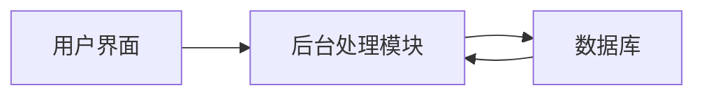

## 1. 背景介绍

在当今的企业中，人才管理是一个非常重要的环节。有效的人才管理可以提高员工的工作效率，提升企业的竞争力。为了提高人才管理的效率，许多企业开始引入人才管理系统。本文将详细介绍人才管理系统的设计与实现过程。

## 2. 核心概念与联系

### 2.1 人才管理系统的概念

人才管理系统是一种信息管理系统，主要用于管理企业的人力资源。它包括员工的招聘、培训、考核、激励等各个环节。

### 2.2 人才管理系统的结构

人才管理系统通常包括用户界面、数据库和后台处理模块三个部分。用户界面是员工和管理员与系统交互的界面；数据库用于存储员工的信息；后台处理模块负责处理用户的请求。



## 3. 核心算法原理具体操作步骤

### 3.1 数据库设计

数据库是人才管理系统的核心，它存储了所有的员工信息。在设计数据库时，我们需要考虑到数据的完整性、一致性和安全性。我们可以使用ER模型来设计数据库。

### 3.2 用户界面设计

用户界面是员工和管理员与系统交互的平台。在设计用户界面时，我们需要考虑到用户的使用习惯和操作的便捷性。我们可以使用HTML和CSS来设计用户界面。

### 3.3 后台处理模块设计

后台处理模块是人才管理系统的核心，它负责处理用户的请求。在设计后台处理模块时，我们需要考虑到系统的性能和稳定性。我们可以使用Java或Python来编写后台处理模块。

## 4. 数学模型和公式详细讲解举例说明

在人才管理系统中，我们需要使用一些数学模型和公式来进行数据分析。例如，我们可以使用线性回归模型来预测员工的工作效率。

线性回归模型的公式为：

$$ y = ax + b $$

其中，$y$是员工的工作效率，$x$是员工的工作时长，$a$和$b$是模型的参数。

## 5. 项目实践：代码实例和详细解释说明

在实现人才管理系统时，我们可以使用Python和Django框架。以下是一个简单的示例代码：

```python
from django.shortcuts import render
from .models import Employee

def index(request):
    employees = Employee.objects.all()
    return render(request, 'index.html', {'employees': employees})
```

这段代码首先导入了Django的`render`函数和`Employee`模型。然后，它定义了一个视图函数`index`，这个函数获取了所有的员工信息，并将这些信息传递给`index.html`模板。

## 6. 实际应用场景

人才管理系统可以应用于各种企业，无论是大型企业还是中小型企业，都可以通过人才管理系统来提高人力资源管理的效率。例如，企业可以通过人才管理系统来进行员工的招聘、培训、考核和激励。

## 7. 工具和资源推荐

在实现人才管理系统时，我们可以使用以下工具和资源：

- Python：一种广泛用于Web开发的编程语言。
- Django：一个基于Python的Web开发框架。
- MySQL：一个开源的关系型数据库管理系统。
- Bootstrap：一个前端开发框架，可以用来设计美观的用户界面。

## 8. 总结：未来发展趋势与挑战

随着信息技术的发展，人才管理系统将会越来越智能化。例如，人才管理系统可以通过人工智能技术来进行数据分析，帮助企业做出更好的决策。然而，人才管理系统也面临着一些挑战，例如数据安全和隐私保护。

## 9. 附录：常见问题与解答

Q: 人才管理系统的数据如何保护？

A: 我们可以通过加密技术来保护数据的安全。此外，我们也需要定期备份数据，以防止数据丢失。

Q: 人才管理系统如何进行维护？

A: 我们可以通过定期更新和升级系统来进行维护。此外，我们也需要定期检查系统的性能和稳定性。

作者：禅与计算机程序设计艺术 / Zen and the Art of Computer Programming