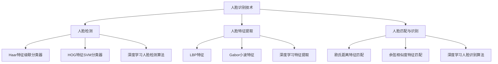

# 人脸识别技术的AI伦理争议与规范建议

## 1. 背景介绍
### 1.1 人脸识别技术的发展历程
#### 1.1.1 早期人脸识别技术的探索
#### 1.1.2 深度学习时代的人脸识别技术突破
#### 1.1.3 人脸识别技术的广泛应用

### 1.2 人脸识别技术引发的伦理争议
#### 1.2.1 隐私权的侵犯
#### 1.2.2 数据安全与滥用的风险
#### 1.2.3 算法偏差与歧视的问题

### 1.3 探讨人脸识别技术伦理规范的必要性
#### 1.3.1 保护个人隐私与权益
#### 1.3.2 促进技术的负责任发展
#### 1.3.3 维护社会公平与正义

## 2. 核心概念与联系
### 2.1 人脸识别技术的基本原理
#### 2.1.1 人脸检测
#### 2.1.2 人脸特征提取
#### 2.1.3 人脸匹配与识别

### 2.2 人脸识别技术与AI伦理的关系
#### 2.2.1 人工智能的伦理属性
#### 2.2.2 人脸识别技术中的伦理考量
#### 2.2.3 AI伦理框架对人脸识别技术的指导

### 2.3 人脸识别技术的伦理争议焦点
#### 2.3.1 隐私权的界定与保护
#### 2.3.2 数据采集与使用的伦理规范
#### 2.3.3 算法公平性与反歧视

## 3. 核心算法原理具体操作步骤
### 3.1 人脸检测算法
#### 3.1.1 基于Haar特征的级联分类器
#### 3.1.2 基于HOG特征的SVM分类器
#### 3.1.3 基于深度学习的人脸检测算法

### 3.2 人脸特征提取算法
#### 3.2.1 局部二值模式(LBP)特征
#### 3.2.2 Gabor小波特征
#### 3.2.3 深度学习特征提取方法

### 3.3 人脸匹配与识别算法
#### 3.3.1 基于欧氏距离的特征匹配
#### 3.3.2 基于余弦相似度的特征匹配
#### 3.3.3 基于深度学习的人脸识别算法

## 4. 数学模型和公式详细讲解举例说明
### 4.1 人脸检测中的数学模型
#### 4.1.1 Haar特征的数学表示
#### 4.1.2 AdaBoost算法的数学原理
#### 4.1.3 级联分类器的数学描述

### 4.2 人脸特征提取中的数学模型
#### 4.2.1 LBP特征的数学定义
#### 4.2.2 Gabor小波的数学表达
#### 4.2.3 卷积神经网络的数学原理

### 4.3 人脸匹配与识别中的数学模型
#### 4.3.1 欧氏距离的数学公式
#### 4.3.2 余弦相似度的数学表达
#### 4.3.3 Triplet Loss的数学定义

## 5. 项目实践：代码实例和详细解释说明
### 5.1 基于OpenCV的人脸检测实例
#### 5.1.1 环境配置与库安装
#### 5.1.2 人脸检测代码实现
#### 5.1.3 结果分析与优化

### 5.2 基于深度学习的人脸特征提取实例
#### 5.2.1 数据集准备与预处理
#### 5.2.2 构建深度学习模型
#### 5.2.3 模型训练与评估

### 5.3 人脸匹配与识别系统的搭建
#### 5.3.1 人脸数据库的建立
#### 5.3.2 人脸匹配算法的实现
#### 5.3.3 系统性能评测与优化

## 6. 实际应用场景
### 6.1 公共安全领域的应用
#### 6.1.1 犯罪嫌疑人识别
#### 6.1.2 人群监控与管理
#### 6.1.3 反恐与国家安全

### 6.2 商业领域的应用
#### 6.2.1 智能支付与身份验证
#### 6.2.2 客户分析与精准营销
#### 6.2.3 智能门禁与考勤系统

### 6.3 医疗健康领域的应用
#### 6.3.1 患者身份识别与管理
#### 6.3.2 医疗影像分析与辅助诊断
#### 6.3.3 智能护理与远程医疗

## 7. 工具和资源推荐
### 7.1 开源人脸识别库和框架
#### 7.1.1 OpenCV
#### 7.1.2 Dlib
#### 7.1.3 FaceNet

### 7.2 公开人脸数据集
#### 7.2.1 LFW (Labeled Faces in the Wild)
#### 7.2.2 CASIA-WebFace
#### 7.2.3 VGGFace2

### 7.3 相关学习资源
#### 7.3.1 在线课程与教程
#### 7.3.2 学术论文与研究报告
#### 7.3.3 技术博客与社区

## 8. 总结：未来发展趋势与挑战
### 8.1 人脸识别技术的发展趋势
#### 8.1.1 多模态融合识别
#### 8.1.2 跨年龄与跨姿态识别
#### 8.1.3 隐私保护与联邦学习

### 8.2 人脸识别技术面临的挑战
#### 8.2.1 算法偏差与公平性问题
#### 8.2.2 数据隐私与安全风险
#### 8.2.3 法律法规与伦理规范的完善

### 8.3 人脸识别技术的未来展望
#### 8.3.1 技术创新与突破
#### 8.3.2 行业应用的深化与拓展
#### 8.3.3 伦理规范与法律法规的协同发展

## 9. 附录：常见问题与解答
### 9.1 人脸识别技术的准确性如何？
### 9.2 如何保护个人隐私免受人脸识别技术的侵犯？
### 9.3 人脸识别技术是否会加剧社会的不公平和歧视？
### 9.4 如何规范人脸识别技术的应用，避免滥用和违规使用？
### 9.5 个人如何合法合理地使用人脸识别技术？

人脸识别技术是人工智能领域的一个重要分支，其快速发展和广泛应用引发了诸多伦理争议。一方面，人脸识别技术为公共安全、商业服务、医疗健康等领域带来了便利和效率提升；另一方面，其在数据采集、算法设计、应用监管等方面存在隐私侵犯、歧视偏见、滥用风险等伦理问题。

人脸识别技术的核心原理包括人脸检测、特征提取和匹配识别三个步骤。人脸检测常用的算法有Haar特征级联分类器、HOG特征SVM分类器和基于深度学习的方法。特征提取可以采用LBP、Gabor小波等传统特征，也可以利用深度学习自动学习高层语义特征。匹配识别则通过欧氏距离、余弦相似度等度量方式，或使用深度学习的损失函数如Triplet Loss来判断人脸身份。

在实际应用中，人脸识别技术在公共安全、商业服务、医疗健康等领域发挥着重要作用，如犯罪嫌疑人识别、人群监控、智能支付、客户分析、患者管理等。但同时也面临着隐私保护、数据安全、算法偏差等伦理挑战。

为了促进人脸识别技术的负责任发展，需要在技术创新的同时加强伦理规范和法律法规的制定。一方面，要完善隐私保护制度，加强数据安全管理，提高算法的可解释性和公平性；另一方面，要加强公众教育，提高用户的隐私意识和数字素养，引导社会各界合法合理地使用人脸识别技术。

未来，人脸识别技术将向着多模态融合、跨年龄跨姿态、隐私保护等方向发展，不断突破技术瓶颈，拓展应用场景。同时，伦理规范和法律法规也将与技术创新协同发展，共同营造一个负责任、可信赖的人工智能生态环境。

作为个人，我们应该积极关注人脸识别技术的发展动态，学习相关知识，提高隐私保护意识。在享受技术便利的同时，也要合法合理地使用，尊重他人隐私，共同维护一个健康有序的数字社会。

人脸识别技术的发展是一把双刃剑，机遇与挑战并存。只有在技术创新与伦理规范的协同发展中，人脸识别才能真正造福人类社会，成为AI时代的一道亮丽风景。

作者：禅与计算机程序设计艺术 / Zen and the Art of Computer Programming