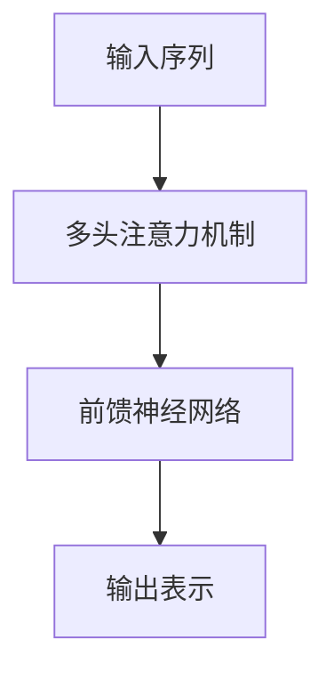

# 从零开始大模型开发与微调：BERT的基本架构与应用

## 1. 背景介绍

### 1.1 自然语言处理的重要性

在当今的数字时代，自然语言处理(NLP)已经成为人工智能领域中最重要和最具挑战性的研究方向之一。它旨在使计算机能够理解、解释和生成人类语言,为各种应用程序提供强大的语言处理能力。随着大数据和计算能力的不断提高,NLP技术已经广泛应用于机器翻译、问答系统、情感分析、文本摘要等领域,极大地提高了人机交互的效率和质量。

### 1.2 传统NLP模型的局限性

传统的NLP模型,如基于规则的系统和统计机器学习模型,存在一些固有的局限性。它们通常需要大量的人工特征工程,并且难以捕捉语言的深层语义和上下文信息。此外,这些模型通常是基于单词或n-gram的,无法有效地处理长期依赖关系和复杂的语言结构。

### 1.3 BERT的重大突破

2018年,Google AI团队提出了BERT(Bidirectional Encoder Representations from Transformers)模型,这是一种基于Transformer的双向编码器表示,标志着NLP领域的一个重大突破。BERT通过预训练和微调的方式,能够从大规模的语料库中学习通用的语言表示,并将这些表示应用于各种下游NLP任务。与传统模型相比,BERT展现出了卓越的性能,在多项基准测试中取得了最佳成绩。

## 2. 核心概念与联系

### 2.1 Transformer架构

BERT是基于Transformer架构构建的,这是一种全新的序列到序列(Seq2Seq)模型,旨在解决长期依赖问题。与传统的循环神经网络(RNN)不同,Transformer完全依赖于注意力机制,允许模型直接关注输入序列中的不同位置,从而更好地捕捉长期依赖关系。



### 2.2 双向编码器表示

BERT是一种双向编码器表示,这意味着它能够同时利用输入序列中的左侧和右侧上下文信息。这与传统的单向语言模型形成鲜明对比,后者只能利用左侧或右侧的上下文信息。通过双向编码,BERT能够更好地理解语言的语义和上下文,从而提高模型的性能。

### 2.3 预训练和微调

BERT采用了一种两阶段的训练策略:预训练和微调。在预训练阶段,BERT在大规模的语料库上进行无监督训练,学习通用的语言表示。在微调阶段,BERT将预训练的模型参数作为初始化权重,并在特定的下游任务上进行监督微调,以适应特定的任务需求。这种策略可以有效地利用大规模语料库中的知识,并将其转移到各种下游任务中。

## 3. 核心算法原理具体操作步骤

### 3.1 输入表示

BERT的输入序列由三个部分组成:token embeddings、segment embeddings和position embeddings。

1. **Token Embeddings**:将输入序列中的每个单词映射到一个固定维度的向量空间中。
2. **Segment Embeddings**:用于区分输入序列中的不同段落,例如问题和答案。
3. **Position Embeddings**:捕捉输入序列中单词的位置信息。

这三种嵌入向量相加,形成BERT的初始输入表示。

### 3.2 多头注意力机制

BERT的核心是多头注意力机制,它允许模型同时关注输入序列中的不同位置,捕捉长期依赖关系。每个注意力头都会学习不同的注意力分布,最终将所有头的注意力输出进行拼接和线性变换,得到最终的注意力输出。

$$
\begin{aligned}
\text{MultiHead}(Q, K, V) &= \text{Concat}(\text{head}_1, \ldots, \text{head}_h)W^O\\
\text{where}\  \text{head}_i &= \text{Attention}(QW_i^Q, KW_i^K, VW_i^V)
\end{aligned}
$$

其中 $Q$、$K$、$V$ 分别代表查询(Query)、键(Key)和值(Value)矩阵。

### 3.3 前馈神经网络

在每个编码器层中,注意力输出将被传递到一个前馈神经网络中,该网络由两个线性变换和一个非线性激活函数(如ReLU)组成。这个操作可以为模型引入非线性能力,并允许它学习更复杂的特征表示。

$$
\text{FFN}(x) = \max(0, xW_1 + b_1)W_2 + b_2
$$

### 3.4 预训练任务

BERT在预训练阶段采用了两种无监督任务:掩码语言模型(Masked Language Model,MLM)和下一句预测(Next Sentence Prediction,NSP)。

1. **掩码语言模型(MLM)**:随机掩码输入序列中的一些单词,并要求模型预测这些被掩码的单词。这有助于BERT学习理解上下文和捕捉语义关系。
2. **下一句预测(NSP)**:给定两个句子,模型需要预测第二个句子是否为第一个句子的下一句。这有助于BERT学习理解句子之间的关系和语境。

### 3.5 微调

在微调阶段,BERT将预训练的模型参数作为初始化权重,并在特定的下游任务上进行监督微调。根据任务的不同,可能需要对BERT的输出进行适当的处理,例如添加一个分类层或生成层。微调过程通常只需要少量的标注数据,就可以获得良好的性能。

## 4. 数学模型和公式详细讲解举例说明

### 4.1 注意力机制

注意力机制是BERT中的关键组成部分,它允许模型关注输入序列中的不同位置,并捕捉长期依赖关系。注意力分数计算如下:

$$
\text{Attention}(Q, K, V) = \text{softmax}(\frac{QK^T}{\sqrt{d_k}})V
$$

其中 $Q$ 为查询矩阵,表示当前位置需要关注的信息; $K$ 为键矩阵,表示其他位置的信息; $V$ 为值矩阵,表示需要获取的值。$d_k$ 是缩放因子,用于防止内积过大导致梯度消失。

softmax函数用于计算注意力分数的概率分布,确保所有分数之和为1。最终,注意力输出是所有值矩阵 $V$ 的加权和,其中权重由注意力分数决定。

### 4.2 多头注意力

为了捕捉不同的注意力模式,BERT采用了多头注意力机制。每个注意力头都会学习不同的注意力分布,最终将所有头的注意力输出进行拼接和线性变换,得到最终的注意力输出。

$$
\begin{aligned}
\text{MultiHead}(Q, K, V) &= \text{Concat}(\text{head}_1, \ldots, \text{head}_h)W^O\\
\text{where}\  \text{head}_i &= \text{Attention}(QW_i^Q, KW_i^K, VW_i^V)
\end{aligned}
$$

其中 $W_i^Q$、$W_i^K$、$W_i^V$ 分别是第 $i$ 个注意力头的查询、键和值的线性变换矩阵,用于将输入映射到不同的子空间。$W^O$ 是最终的线性变换矩阵,用于将所有头的输出拼接在一起。

通过多头注意力机制,BERT可以同时关注不同的注意力模式,从而更好地捕捉输入序列中的丰富信息。

### 4.3 位置编码

由于BERT不像RNN那样具有顺序结构,因此需要一种机制来捕捉输入序列中单词的位置信息。BERT采用了一种称为位置编码(Position Encoding)的技术,它将位置信息直接编码到输入表示中。

位置编码是一个固定的向量,其值由特定的位置决定。它可以通过三角函数计算得到,具体公式如下:

$$
\begin{aligned}
\text{PE}_{(pos, 2i)} &= \sin(pos / 10000^{2i / d_\text{model}})\\
\text{PE}_{(pos, 2i+1)} &= \cos(pos / 10000^{2i / d_\text{model}})
\end{aligned}
$$

其中 $pos$ 是单词在序列中的位置,而 $i$ 是位置编码向量的维度索引。$d_\text{model}$ 是模型的隐藏层维度大小。

通过将位置编码与单词嵌入相加,BERT可以同时捕捉单词的语义信息和位置信息,从而更好地理解输入序列的上下文。

## 5. 项目实践:代码实例和详细解释说明

在这一部分,我们将提供一个基于PyTorch实现的BERT模型示例,并详细解释每一步的代码。

### 5.1 导入所需库

```python
import torch
import torch.nn as nn
from transformers import BertModel, BertTokenizer
```

我们首先导入所需的库,包括PyTorch、PyTorch的nn模块和Hugging Face的Transformers库。

### 5.2 定义BERT模型

```python
class BERTClassifier(nn.Module):
    def __init__(self, num_classes):
        super(BERTClassifier, self).__init__()
        self.bert = BertModel.from_pretrained('bert-base-uncased')
        self.dropout = nn.Dropout(0.1)
        self.classifier = nn.Linear(self.bert.config.hidden_size, num_classes)

    def forward(self, input_ids, attention_mask=None, token_type_ids=None):
        outputs = self.bert(input_ids=input_ids,
                            attention_mask=attention_mask,
                            token_type_ids=token_type_ids)
        pooled_output = outputs.pooler_output
        pooled_output = self.dropout(pooled_output)
        logits = self.classifier(pooled_output)
        return logits
```

这个代码定义了一个BERT分类器模型,它继承自PyTorch的`nn.Module`。在初始化函数中,我们加载预训练的BERT模型,并添加一个dropout层和一个线性分类层。在前向传播函数中,我们将输入传递给BERT模型,获取pooled输出,然后通过dropout层和分类层得到最终的logits输出。

### 5.3 数据预处理

```python
tokenizer = BertTokenizer.from_pretrained('bert-base-uncased')

def encode_data(text, max_length=512):
    encoded = tokenizer.encode_plus(
        text,
        add_special_tokens=True,
        max_length=max_length,
        padding='max_length',
        truncation=True,
        return_tensors='pt'
    )
    return encoded
```

这个函数使用BERT的tokenizer对输入文本进行编码,包括添加特殊标记、填充和截断操作。它返回一个包含输入id、注意力掩码和标记类型id的字典。

### 5.4 训练和评估

```python
model = BERTClassifier(num_classes=2)
optimizer = torch.optim.Adam(model.parameters(), lr=2e-5)
criterion = nn.CrossEntropyLoss()

for epoch in range(num_epochs):
    for text, label in train_data:
        encoded = encode_data(text)
        logits = model(encoded['input_ids'], encoded['attention_mask'], encoded['token_type_ids'])
        loss = criterion(logits, label)
        
        optimizer.zero_grad()
        loss.backward()
        optimizer.step()
        
    # 评估模型
    model.eval()
    with torch.no_grad():
        correct = 0
        total = 0
        for text, label in test_data:
            encoded = encode_data(text)
            logits = model(encoded['input_ids'], encoded['attention_mask'], encoded['token_type_ids'])
            predicted = logits.argmax(dim=1)
            total += label.size(0)
            correct += (predicted == label).sum().item()
        
    accuracy = correct / total
    print(f'Epoch {epoch+1}/{num_epochs}, Accuracy: {accuracy:.4f}')
```

这段代码演示了如何使用PyTorch训练和评估BERT分类器模型。我们首先定义模型、优化器和损失函数。然后,在每个epoch中,我们遍历训练数据,对输入进行编码,将其传递给模型获取logits输出,计算损失,并执行反向传播和优化步骤。

在每个epoch结束时,我们将模型切换到评估模式,并在测试数据上计算模型的准确率。我们遍历测试数据,对输入进行编码,获取logits输出,计算