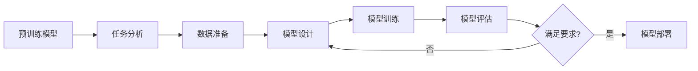

# 从零开始大模型开发与微调：CIFAR-10数据集简介

## 1. 背景介绍
### 1.1 大模型发展现状
近年来,随着深度学习技术的快速发展,大规模预训练模型(Pre-trained Models)已经成为自然语言处理(NLP)、计算机视觉(CV)等领域的研究热点。谷歌的BERT、OpenAI的GPT系列、微软的Megatron-Turing NLG等大模型相继问世,在多个任务上取得了state-of-the-art的性能,展现了大模型的强大能力。

### 1.2 大模型微调的重要性
尽管这些大模型在通用任务上表现优异,但对于特定领域的任务,直接使用预训练的大模型效果往往不尽如人意。因此,如何在特定任务上微调(Fine-tune)大模型,使其更好地适应具体任务,成为了一个重要的研究方向。通过微调,可以显著提升大模型在下游任务上的性能。

### 1.3 CIFAR-10数据集介绍
CIFAR-10是一个经典的图像分类数据集,被广泛应用于机器学习和计算机视觉领域。它由60000张32x32像素的彩色图像组成,包含10个类别:飞机、汽车、鸟类、猫、鹿、狗、青蛙、马、船和卡车。其中50000张图像作为训练集,10000张作为测试集。CIFAR-10常被用来评估各种图像分类算法的性能。

本文将以CIFAR-10数据集为例,介绍如何从零开始进行大模型的开发与微调,帮助读者掌握大模型实践的基本流程和技巧。

## 2. 核心概念与联系
### 2.1 迁移学习
迁移学习是指将一个问题上学习到的知识迁移到另一个相关但不同的问题上。在深度学习中,通常是利用在大规模数据集上预训练的模型所学习到的特征表示,应用到新的任务中,从而提高模型的泛化能力和训练效率。大模型的微调本质上就是一种迁移学习。

### 2.2 微调
微调是指在预训练模型的基础上,使用新的数据集和任务对模型进行二次训练,使其适应特定领域的任务。相比从头开始训练一个模型,微调可以显著减少所需的数据量和训练时间,并取得更好的效果。微调的关键在于如何设计新的网络结构和损失函数,以及如何选择合适的优化策略。

### 2.3 数据增强
数据增强是一种常用的正则化技术,通过对训练数据进行一系列随机变换(如翻转、裁剪、旋转等),生成新的训练样本,从而扩大训练集的规模和多样性。数据增强可以有效缓解模型过拟合,提高模型的鲁棒性和泛化能力。在CIFAR-10等图像分类任务中,数据增强被广泛采用。

### 2.4 Mermaid流程图
下面使用Mermaid绘制了大模型开发与微调的核心流程:



## 3. 核心算法原理具体操作步骤
### 3.1 大模型选择
第一步是选择合适的预训练大模型作为基础。常见的图像分类大模型有ResNet、EfficientNet、Vision Transformer等。需要综合考虑模型的性能、计算效率、可用资源等因素。本文选择ResNet-50作为基础模型。

### 3.2 任务分析
分析CIFAR-10图像分类任务的特点,确定微调的目标和评估指标。CIFAR-10属于多分类问题,模型需要预测图像所属的10个类别。常用的评估指标有准确率(Accuracy)、精确率(Precision)、召回率(Recall)、F1分数等。

### 3.3 数据准备
下载CIFAR-10数据集,并划分为训练集和测试集。对图像数据进行预处理,包括归一化、数据增强等。可使用随机水平翻转、随机裁剪等增强方式,扩充训练集。

### 3.4 模型设计
在ResNet-50的基础上,根据CIFAR-10任务的特点,调整网络结构和参数。如调整最后一个全连接层的输出维度为10,对应10个类别。冻结预训练模型的部分层,只微调顶部的几层。

### 3.5 模型训练
使用准备好的数据集,对模型进行微调训练。设置合适的超参数,如批量大小(batch size)、学习率(learning rate)、训练轮数(epochs)等。采用交叉熵损失函数和Adam优化器,进行梯度下降优化。

### 3.6 模型评估
在测试集上评估微调后的模型性能,计算准确率等指标。使用混淆矩阵(Confusion Matrix)分析模型的分类效果。对模型进行错误分析,查找误分类的样本,分析原因。

### 3.7 模型调优
根据评估结果,进一步调整模型和训练策略,如尝试不同的学习率、正则化方法、数据增强策略等。重复步骤3.5和3.6,直到满足性能要求。

### 3.8 模型部署
将微调后的模型集成到实际应用系统中,进行推理和预测。需要权衡模型的性能和推理速度,选择合适的部署方式,如使用TensorFlow Serving、Flask等工具搭建推理服务。

## 4. 数学模型和公式详细讲解举例说明
### 4.1 交叉熵损失函数
交叉熵损失函数常用于多分类问题。对于CIFAR-10,模型的输出是一个10维向量 $\mathbf{p}=(p_1,\ldots,p_{10})$,表示样本属于各个类别的概率。假设真实标签为 $\mathbf{y}=(y_1,\ldots,y_{10})$,其中正确类别对应的位置为1,其余为0。则交叉熵损失定义为:

$$
L=-\sum_{i=1}^{10} y_i \log p_i
$$

例如,如果一个样本的真实标签为"猫"(编号为3),模型预测概率向量为(0.1,0.2,0.4,0.2,0.05,0.01,0.01,0.01,0.01,0.02),则交叉熵损失为:

$$
L=-(0\log 0.1+0\log 0.2+1\log 0.4+0\log 0.2+\ldots)=-\log 0.4=0.916
$$

### 4.2 Adam优化器
Adam是一种自适应学习率的优化算法,结合了动量(Momentum)和RMSprop的优点。设当前时刻为 $t$,参数为 $\theta$,学习率为 $\alpha$,一阶动量和二阶动量的指数衰减率分别为 $\beta_1$ 和 $\beta_2$,则Adam的更新公式为:

$$
\begin{aligned}
m_t &= \beta_1 m_{t-1} + (1-\beta_1) g_t \\
v_t &= \beta_2 v_{t-1} + (1-\beta_2) g_t^2 \\
\hat{m}_t &= \frac{m_t}{1-\beta_1^t} \\
\hat{v}_t &= \frac{v_t}{1-\beta_2^t} \\
\theta_t &= \theta_{t-1} - \alpha \frac{\hat{m}_t}{\sqrt{\hat{v}_t}+\epsilon}
\end{aligned}
$$

其中 $g_t$ 是时刻 $t$ 的梯度, $m_t$ 和 $v_t$ 分别是一阶动量和二阶动量的估计, $\epsilon$ 是一个小常数,用于数值稳定。

例如,设当前梯度为0.2,上一时刻的一阶动量为0.1,二阶动量为0.3,学习率为0.001,衰减率 $\beta_1=0.9$, $\beta_2=0.999$,则更新后的参数为:

$$
\begin{aligned}
m_t &= 0.9\times 0.1 + 0.1\times 0.2 = 0.11 \\
v_t &= 0.999\times 0.3 + 0.001\times 0.2^2 = 0.3004 \\
\hat{m}_t &= \frac{0.11}{1-0.9} = 1.1 \\
\hat{v}_t &= \frac{0.3004}{1-0.999} = 300.4 \\
\theta_t &= \theta_{t-1} - 0.001\times \frac{1.1}{\sqrt{300.4}+10^{-8}} \approx \theta_{t-1} - 0.00006
\end{aligned}
$$

## 5. 项目实践：代码实例和详细解释说明
下面使用Python和TensorFlow 2.x实现CIFAR-10图像分类任务的大模型微调。

### 5.1 环境准备
首先安装必要的库:
```python
!pip install tensorflow-gpu==2.4.0
!pip install tensorflow-datasets
```

### 5.2 数据加载与预处理
使用TensorFlow Datasets加载CIFAR-10数据集,并进行数据增强和预处理:
```python
import tensorflow as tf
import tensorflow_datasets as tfds

# 加载数据集
(ds_train, ds_test), ds_info = tfds.load(
    'cifar10',
    split=['train', 'test'],
    shuffle_files=True,
    as_supervised=True,
    with_info=True,
)

# 数据增强
def augment(image, label):
    image = tf.image.random_flip_left_right(image)
    image = tf.image.random_crop(image, [32, 32, 3])
    return image, label

# 数据预处理
def preprocess(image, label):
    image = tf.cast(image, tf.float32) / 255.
    return image, label

# 构建数据管道
ds_train = ds_train.map(augment, num_parallel_calls=tf.data.AUTOTUNE)
ds_train = ds_train.map(preprocess, num_parallel_calls=tf.data.AUTOTUNE)
ds_train = ds_train.cache()
ds_train = ds_train.shuffle(ds_info.splits['train'].num_examples)
ds_train = ds_train.batch(128)
ds_train = ds_train.prefetch(tf.data.AUTOTUNE)

ds_test = ds_test.map(preprocess, num_parallel_calls=tf.data.AUTOTUNE) 
ds_test = ds_test.batch(128)
ds_test = ds_test.cache()
ds_test = ds_test.prefetch(tf.data.AUTOTUNE)
```

### 5.3 模型构建与微调
加载预训练的ResNet-50模型,并在此基础上进行微调:
```python
# 加载预训练模型
resnet50 = tf.keras.applications.ResNet50(weights='imagenet', include_top=False, input_shape=[32, 32, 3])

# 冻结底层卷积层
resnet50.trainable = False

# 添加分类层
model = tf.keras.Sequential([
    resnet50,
    tf.keras.layers.GlobalAveragePooling2D(),
    tf.keras.layers.Dense(10)
])

# 编译模型
model.compile(
    optimizer=tf.keras.optimizers.Adam(learning_rate=0.0001),
    loss=tf.keras.losses.SparseCategoricalCrossentropy(from_logits=True),
    metrics=['accuracy']
)

# 微调模型
history = model.fit(
    ds_train,
    epochs=10,
    validation_data=ds_test
)
```

### 5.4 模型评估与错误分析
在测试集上评估模型性能,并分析错误样本:
```python
# 评估模型
model.evaluate(ds_test)

# 错误分析
y_pred = model.predict(ds_test)
y_pred = tf.argmax(y_pred, axis=1)

cm = tf.math.confusion_matrix(y_true=ds_test.map(lambda _, y: y), y_pred=y_pred)
print("Confusion Matrix:")
print(cm)
```

## 6. 实际应用场景
CIFAR-10图像分类任务虽然是一个基准测试问题,但其背后的原理和方法可以应用到许多实际场景中,如:

- 自动驾驶中的交通标志识别
- 工业质检中的产品缺陷检测
- 医疗影像分析中的疾病诊断
- 安防领域中的行人和车辆检测
- 零售行业中的商品识别和分类

这些应用场景都需要处理大量的图像数据,并对图像内容进行分类。通过在特定领域数据上微调预训练的大模型,可以显著提升这些任务的性能,降低开发成本。

## 7. 工具和资源推荐