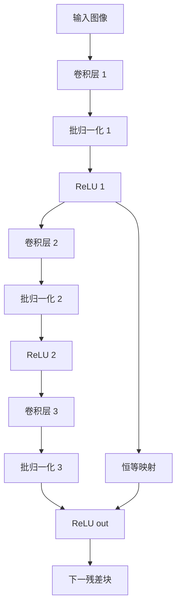

# 从零开始大模型开发与微调：ResNet实战

## 1. 背景介绍
### 1.1 大模型的兴起
### 1.2 ResNet的诞生
### 1.3 本文的目的和意义

## 2. 核心概念与联系
### 2.1 卷积神经网络(CNN)
#### 2.1.1 卷积层
#### 2.1.2 池化层 
#### 2.1.3 全连接层
### 2.2 残差网络(ResNet)
#### 2.2.1 残差块
#### 2.2.2 恒等映射
#### 2.2.3 层间连接
### 2.3 迁移学习与微调
#### 2.3.1 预训练模型
#### 2.3.2 特征提取
#### 2.3.3 微调策略

## 3. 核心算法原理具体操作步骤
### 3.1 ResNet网络结构
#### 3.1.1 基本残差块
#### 3.1.2 瓶颈残差块
#### 3.1.3 不同深度的ResNet变体
### 3.2 前向传播
#### 3.2.1 卷积层计算
#### 3.2.2 批归一化
#### 3.2.3 激活函数
### 3.3 反向传播 
#### 3.3.1 损失函数
#### 3.3.2 梯度计算
#### 3.3.3 权重更新

## 4. 数学模型和公式详细讲解举例说明
### 4.1 卷积运算
#### 4.1.1 二维卷积
$$ O(i,j) = \sum_{m=0}^{k-1}\sum_{n=0}^{k-1}I(i+m,j+n)K(m,n) $$
#### 4.1.2 填充和步幅
### 4.2 批归一化
$$ y_i = \gamma\frac{x_i-\mu_B}{\sqrt{\sigma_B^2+\epsilon}}+\beta $$
### 4.3 ReLU激活函数
$$ f(x)=max(0,x) $$
### 4.4 交叉熵损失函数
$$ L = -\sum_{i=1}^{n}y_ilog(\hat{y}_i) $$

## 5. 项目实践：代码实例和详细解释说明
### 5.1 环境准备
#### 5.1.1 硬件要求
#### 5.1.2 软件依赖
#### 5.1.3 数据集准备
### 5.2 模型构建
#### 5.2.1 ResNet18实现
#### 5.2.2 ResNet50实现  
#### 5.2.3 自定义ResNet
### 5.3 模型训练
#### 5.3.1 数据预处理
#### 5.3.2 训练参数设置
#### 5.3.3 训练过程可视化
### 5.4 模型评估
#### 5.4.1 测试集准确率
#### 5.4.2 混淆矩阵
#### 5.4.3 可视化分析

## 6. 实际应用场景
### 6.1 图像分类
### 6.2 目标检测
### 6.3 语义分割
### 6.4 人脸识别

## 7. 工具和资源推荐
### 7.1 深度学习框架
#### 7.1.1 PyTorch
#### 7.1.2 TensorFlow
#### 7.1.3 Keras
### 7.2 预训练模型库
#### 7.2.1 torchvision
#### 7.2.2 TensorFlow Hub
#### 7.2.3 Keras Applications
### 7.3 开源实现
#### 7.3.1 GitHub资源
#### 7.3.2 PaperWithCode

## 8. 总结：未来发展趋势与挑战
### 8.1 更深更宽的网络结构
### 8.2 注意力机制的引入
### 8.3 自监督学习的崛起
### 8.4 模型压缩与加速
### 8.5 跨模态学习的探索

## 9. 附录：常见问题与解答
### 9.1 如何选择合适的ResNet变体？
### 9.2 训练过程中出现梯度消失/爆炸怎么办？ 
### 9.3 如何进行数据增强？
### 9.4 迁移学习时需要注意哪些问题？
### 9.5 如何平衡模型性能与计算效率？

图1：ResNet中的残差块结构示意图

随着深度学习的蓬勃发展，以卷积神经网络(CNN)为代表的大模型在计算机视觉领域取得了突破性进展。ResNet作为CNN的一个里程碑式架构，凭借其独特的残差学习思想，有效解决了深层网络训练困难的问题，使得训练更深的网络成为可能。自ResNet提出以来，基于ResNet的各种变体和改进不断涌现，推动了图像分类、目标检测、语义分割等任务的性能不断刷新。

本文将从ResNet的核心概念出发，详细讲解其网络结构和训练技巧。我们首先回顾CNN的基本组件，如卷积层、池化层和全连接层，然后引出残差网络的核心思想——引入恒等映射(identity mapping)，通过跨层连接缓解梯度消失问题。接下来，我们将逐一剖析ResNet的核心算法和数学原理，包括前向传播和反向传播的过程，以及卷积、批归一化、激活函数等关键操作的数学公式。

在实践部分，我们将手把手带领读者使用PyTorch实现经典的ResNet18和ResNet50模型，并在图像分类任务上进行训练和测试。我们会详细解释每一步的代码实现，以及如何通过迁移学习和微调策略来提升模型性能。此外，我们还将探讨ResNet在目标检测、语义分割、人脸识别等领域的应用，分享一些实用的技巧和经验。

除了代码实践，我们还将推荐一些常用的深度学习框架、预训练模型库和开源实现，帮助读者快速上手ResNet相关的项目。最后，我们将展望ResNet的未来发展趋势，讨论如何进一步改进其性能，如引入注意力机制、探索自监督学习等前沿方向。

通过本文的学习，读者将全面掌握ResNet的原理和实践，并能够将其应用到自己的研究和工作中。无论你是深度学习的初学者，还是有一定经验的从业者，相信本文都能给你带来启发和收获。让我们一起探索ResNet的奇妙世界，感受大模型之美！

作者：禅与计算机程序设计艺术 / Zen and the Art of Computer Programming