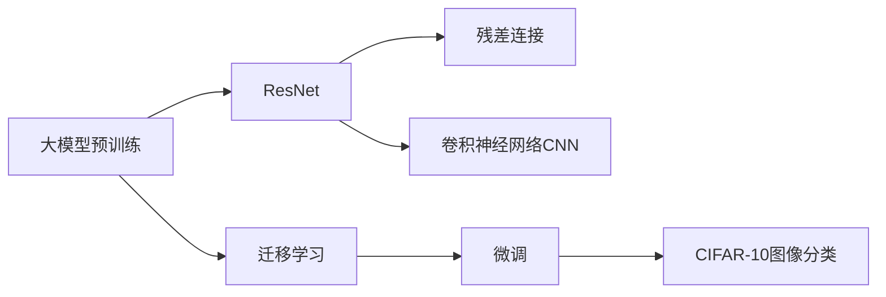

# 从零开始大模型开发与微调：ResNet实战：CIFAR-10数据集分类

## 1. 背景介绍

### 1.1 大模型开发与微调的重要性

随着人工智能技术的飞速发展，大模型在各个领域得到了广泛应用。大模型通过在海量数据上进行预训练，可以学习到丰富的特征表示，具有强大的泛化能力。然而，直接使用预训练的大模型进行具体任务时，可能无法达到最优性能。这时，我们需要在特定任务上对大模型进行微调（Fine-tuning），使其更好地适应任务的特点，提升模型性能。

### 1.2 ResNet与图像分类

ResNet（Residual Network）是计算机视觉领域的重要模型之一，由何凯明等人于2015年提出。ResNet引入了残差连接（Residual Connection）的概念，有效解决了深度神经网络训练中的梯度消失和退化问题，使得训练更深层次的网络成为可能。ResNet在图像分类任务上取得了显著的性能提升，并广泛应用于其他计算机视觉任务中。

### 1.3 CIFAR-10数据集简介

CIFAR-10是一个经典的图像分类数据集，由加拿大高级研究院（Canadian Institute For Advanced Research）收集和发布。该数据集包含60,000张32x32像素的彩色图像，共分为10个类别，每个类别包含6,000张图像。这10个类别分别是：飞机、汽车、鸟、猫、鹿、狗、青蛙、马、船和卡车。CIFAR-10广泛用于评估图像分类算法的性能。

## 2. 核心概念与联系

### 2.1 卷积神经网络（CNN）

卷积神经网络是一种专门用于处理网格结构数据（如图像）的神经网络。CNN通过卷积层对输入图像进行特征提取，通过池化层对特征图进行下采样，最后通过全连接层进行分类。CNN能够有效地学习图像的局部特征和空间关系，在图像分类、目标检测等任务上表现出色。

### 2.2 残差连接（Residual Connection）

残差连接是ResNet的核心思想。在传统的深度神经网络中，随着网络深度的增加，梯度在反向传播过程中容易出现消失或爆炸的问题，导致网络难以训练。残差连接通过在网络的某些层之间添加恒等映射（Identity Mapping），使得网络能够直接学习残差函数，而不是学习完整的输出。这种结构使得梯度能够更容易地流动，缓解了梯度消失问题，使得训练更深的网络成为可能。

### 2.3 迁移学习与微调

迁移学习是指将在一个任务上学习到的知识迁移到另一个相关任务中，以提高模型的性能和泛化能力。在大模型开发中，我们通常使用在大规模数据集上预训练的模型作为基础，然后在特定任务上进行微调。微调是指固定预训练模型的部分层，并在任务特定的数据集上训练剩余的层。通过微调，我们可以利用预训练模型学习到的通用特征，同时适应特定任务的特点，提升模型性能。

### 2.4 核心概念联系图

下面使用Mermaid流程图展示了这些核心概念之间的联系：



## 3. 核心算法原理具体操作步骤

### 3.1 ResNet网络结构

ResNet的核心思想是引入残差连接，使得网络能够学习残差函数，缓解梯度消失问题。一个典型的ResNet残差块由两个卷积层组成，中间使用ReLU激活函数。残差连接通过恒等映射将输入直接添加到卷积层的输出上。ResNet网络由多个残差块堆叠而成，最后通过全局平均池化层和全连接层进行分类。

### 3.2 ResNet训练流程

1. 数据准备：加载CIFAR-10数据集，对图像进行预处理，如归一化、数据增强等。
2. 模型构建：构建ResNet网络，指定残差块的数量和类型。
3. 损失函数和优化器：定义交叉熵损失函数和优化器（如Adam）。
4. 训练循环：遍历数据集进行训练，前向传播计算损失，反向传播更新参数。
5. 模型评估：在验证集上评估模型性能，如准确率、损失等。
6. 微调：根据任务需求，可以在预训练的ResNet上进行微调，调整部分层的参数。
7. 测试：在测试集上评估最终模型的性能。

### 3.3 数据增强技术

数据增强是一种常用的正则化技术，通过对训练数据进行随机变换，生成新的样本，提高模型的泛化能力。常见的数据增强方法包括：

- 随机裁剪（Random Crop）：从原始图像中随机裁剪出指定大小的区域。
- 随机水平翻转（Random Horizontal Flip）：以一定概率对图像进行水平翻转。
- 随机旋转（Random Rotation）：在一定角度范围内随机旋转图像。
- 随机亮度、对比度、饱和度调整：随机调整图像的亮度、对比度和饱和度。

通过数据增强，我们可以有效增加训练样本的多样性，提高模型的鲁棒性和泛化能力。

## 4. 数学模型和公式详细讲解举例说明

### 4.1 卷积操作

卷积是CNN的核心操作，用于提取图像的局部特征。对于一个二维图像$I$和卷积核$K$，卷积操作可以表示为：

$$(I * K)(i,j) = \sum_{m}\sum_{n}I(i+m,j+n)K(m,n)$$

其中，$*$表示卷积操作，$i,j$表示图像的位置索引，$m,n$表示卷积核的位置索引。

举例说明：假设有一个3x3的图像$I$和一个2x2的卷积核$K$，卷积操作的过程如下：

$$I = \begin{bmatrix}
1 & 2 & 3\\
4 & 5 & 6\\
7 & 8 & 9
\end{bmatrix}, K = \begin{bmatrix}
1 & 0\\
0 & 1
\end{bmatrix}$$

对位置$(0,0)$进行卷积操作：

$$(I * K)(0,0) = 1\times1 + 2\times0 + 4\times0 + 5\times1 = 6$$

对其他位置进行类似的卷积操作，得到输出特征图。

### 4.2 批量归一化（Batch Normalization）

批量归一化是一种加速网络训练和提高模型泛化能力的技术。对于一个批次的输入$x_1,x_2,...,x_m$，批量归一化的过程如下：

1. 计算批次的均值和方差：

$$\mu_B = \frac{1}{m}\sum_{i=1}^m x_i$$

$$\sigma_B^2 = \frac{1}{m}\sum_{i=1}^m (x_i - \mu_B)^2$$

2. 对每个样本进行归一化：

$$\hat{x}_i = \frac{x_i - \mu_B}{\sqrt{\sigma_B^2 + \epsilon}}$$

其中，$\epsilon$是一个小常数，用于防止分母为零。

3. 引入可学习的缩放和偏移参数$\gamma$和$\beta$：

$$y_i = \gamma\hat{x}_i + \beta$$

通过批量归一化，可以减少内部协变量偏移，加速网络收敛，并提高模型的泛化能力。

## 5. 项目实践：代码实例和详细解释说明

下面是使用PyTorch实现ResNet-18在CIFAR-10数据集上进行训练和测试的代码示例：

```python
import torch
import torch.nn as nn
import torch.optim as optim
import torchvision
import torchvision.transforms as transforms

# 定义残差块
class BasicBlock(nn.Module):
    def __init__(self, in_channels, out_channels, stride=1):
        super(BasicBlock, self).__init__()
        self.conv1 = nn.Conv2d(in_channels, out_channels, kernel_size=3, stride=stride, padding=1, bias=False)
        self.bn1 = nn.BatchNorm2d(out_channels)
        self.relu = nn.ReLU(inplace=True)
        self.conv2 = nn.Conv2d(out_channels, out_channels, kernel_size=3, stride=1, padding=1, bias=False)
        self.bn2 = nn.BatchNorm2d(out_channels)
        
        self.shortcut = nn.Sequential()
        if stride != 1 or in_channels != out_channels:
            self.shortcut = nn.Sequential(
                nn.Conv2d(in_channels, out_channels, kernel_size=1, stride=stride, bias=False),
                nn.BatchNorm2d(out_channels)
            )
        
    def forward(self, x):
        out = self.relu(self.bn1(self.conv1(x)))
        out = self.bn2(self.conv2(out))
        out += self.shortcut(x)
        out = self.relu(out)
        return out

# 定义ResNet-18网络
class ResNet18(nn.Module):
    def __init__(self, num_classes=10):
        super(ResNet18, self).__init__()
        self.in_channels = 64
        
        self.conv1 = nn.Conv2d(3, 64, kernel_size=3, stride=1, padding=1, bias=False)
        self.bn1 = nn.BatchNorm2d(64)
        self.relu = nn.ReLU(inplace=True)
        
        self.layer1 = self._make_layer(64, 2, stride=1)
        self.layer2 = self._make_layer(128, 2, stride=2)
        self.layer3 = self._make_layer(256, 2, stride=2)
        self.layer4 = self._make_layer(512, 2, stride=2)
        
        self.avg_pool = nn.AdaptiveAvgPool2d((1, 1))
        self.fc = nn.Linear(512, num_classes)
        
    def _make_layer(self, out_channels, num_blocks, stride):
        strides = [stride] + [1] * (num_blocks - 1)
        layers = []
        for stride in strides:
            layers.append(BasicBlock(self.in_channels, out_channels, stride))
            self.in_channels = out_channels
        return nn.Sequential(*layers)
    
    def forward(self, x):
        out = self.relu(self.bn1(self.conv1(x)))
        out = self.layer1(out)
        out = self.layer2(out)
        out = self.layer3(out)
        out = self.layer4(out)
        out = self.avg_pool(out)
        out = out.view(out.size(0), -1)
        out = self.fc(out)
        return out

# 数据准备
transform_train = transforms.Compose([
    transforms.RandomCrop(32, padding=4),
    transforms.RandomHorizontalFlip(),
    transforms.ToTensor(),
    transforms.Normalize((0.4914, 0.4822, 0.4465), (0.2023, 0.1994, 0.2010))
])

transform_test = transforms.Compose([
    transforms.ToTensor(),
    transforms.Normalize((0.4914, 0.4822, 0.4465), (0.2023, 0.1994, 0.2010))
])

trainset = torchvision.datasets.CIFAR10(root='./data', train=True, download=True, transform=transform_train)
trainloader = torch.utils.data.DataLoader(trainset, batch_size=128, shuffle=True, num_workers=2)

testset = torchvision.datasets.CIFAR10(root='./data', train=False, download=True, transform=transform_test)
testloader = torch.utils.data.DataLoader(testset, batch_size=100, shuffle=False, num_workers=2)

# 模型训练
device = torch.device("cuda" if torch.cuda.is_available() else "cpu")
net = ResNet18().to(device)
criterion = nn.CrossEntropyLoss()
optimizer = optim.Adam(net.parameters(), lr=0.001)

for epoch in range(50):
    net.train()
    for i, data in enumerate(trainloader, 0):
        inputs, labels = data[0].to(device), data[1].to(device)
        optimizer.zero_grad()
        outputs = net(inputs)
        loss = criterion(outputs, labels)
        loss.backward()
        optimizer.step()
        
    net.eval()
    correct = 0
    total = 0
    with torch.no_grad():
        for data in testloader:
            images, labels = data[0].to(device), data[1].to(device)
            outputs = net(images)
            _, predicted = torch.max(outputs.data, 1)
            total += labels.size(0)
            correct += (predicted == labels).sum().item()
    
    print('Epoch %d, Accuracy: %.2f %%' % (epoch+1, 100 * correct / total))
```

代码