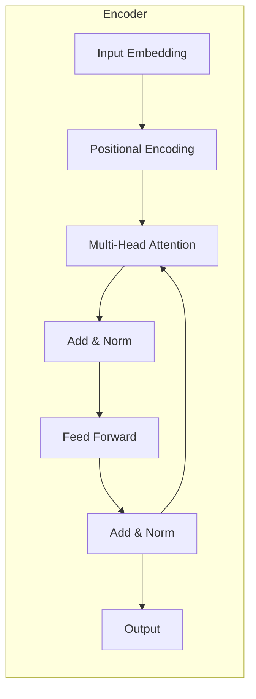

# 从零开始大模型开发与微调：从零开始学习自然语言处理的编码器

## 1. 背景介绍
### 1.1 大语言模型的兴起
近年来，随着深度学习技术的飞速发展，自然语言处理(NLP)领域也取得了巨大的突破。其中，大语言模型(Large Language Model, LLM)的出现，更是掀起了NLP领域的一场革命。从2018年的BERT，到2019年的GPT-2，再到2020年的GPT-3，大语言模型不断刷新着NLP任务的性能上限，展现出了惊人的语言理解和生成能力。

### 1.2 大模型的应用前景
大语言模型强大的语言能力，使其在各个领域都有着广泛的应用前景，如智能客服、内容生成、语言翻译、知识问答等。许多科技巨头和创业公司都在积极布局大模型领域，争相开发自己的大语言模型。可以预见，掌握大模型开发与应用技术，将成为未来NLP从业者的必备技能。

### 1.3 大模型开发与微调的挑战
然而，开发一个高质量的大语言模型并非易事。它不仅需要海量的训练数据和昂贵的算力，还需要复杂的模型架构和训练技巧。对于初学者来说，从零开始开发一个大模型，无疑是一个巨大的挑战。

此外，由于大模型通常是在海量通用语料上预训练得到的，直接应用到下游任务时，效果往往难以令人满意。因此，如何在特定任务上微调大模型，提升其性能，也是一个亟待解决的问题。

### 1.4 本文的主要内容
本文将从零开始，手把手教你如何开发和微调一个大语言模型。我们将重点介绍大模型的核心概念、原理和实现细节，并通过实际的代码示例，演示如何在下游任务上微调大模型。希望通过本文的学习，读者能够掌握大模型开发与应用的基本技能，为进一步探索NLP领域打下坚实的基础。

## 2. 核心概念与联系
### 2.1 Transformer 架构
Transformer 是当前大语言模型的核心架构。它由编码器(Encoder)和解码器(Decoder)两部分组成，能够高效地处理序列数据。与传统的 RNN 和 CNN 相比，Transformer 通过自注意力机制(Self-Attention)实现了并行计算，大大提高了训练效率。同时，它的多头注意力(Multi-Head Attention)和残差连接(Residual Connection)等设计，也使其能够更好地捕捉长距离依赖关系。

### 2.2 预训练与微调范式
预训练与微调(Pre-training and Fine-tuning)是当前大模型的主流范式。预训练阶段在大规模无标注语料上训练模型，学习通用的语言表征；微调阶段在特定任务的标注数据上调整模型参数，使其适应具体任务。这种范式可以显著减少下游任务所需的标注数据，提高模型的泛化能力。

### 2.3 自回归语言模型
自回归语言模型(Auto-regressive Language Model)是一种常见的语言模型类型，它通过已生成的词来预测下一个词。GPT 系列模型就是典型的自回归语言模型，它们在文本生成、对话等任务上表现出色。

### 2.4 编码器-解码器框架
编码器-解码器(Encoder-Decoder)框架是许多 NLP 任务的经典架构，如机器翻译、文本摘要等。编码器负责将输入序列编码为隐向量，解码器根据隐向量生成输出序列。Transformer 就是一种编码器-解码器架构，其编码器和解码器都由多层 Transformer Block 组成。

### 2.5 嵌入层与位置编码
嵌入层(Embedding Layer)将离散的词符号映射为连续的向量表示，是 NLP 模型的重要组成部分。由于 Transformer 没有 RNN 的顺序建模能力，需要引入位置编码(Positional Encoding)来表示词的位置信息。常见的位置编码方法有正弦位置编码和学习的位置嵌入。

下图展示了 Transformer 编码器的核心架构和各部分的联系：



## 3. 核心算法原理与具体操作步骤
### 3.1 Transformer 编码器的计算过程
Transformer 编码器的核心是自注意力机制和前馈神经网络，其计算过程可分为以下几个步骤：

1. 输入嵌入：将输入序列的每个词映射为嵌入向量。
2. 位置编码：将位置编码向量与嵌入向量相加，引入位置信息。
3. 自注意力计算：通过计算 Query、Key、Value 矩阵，得到自注意力权重，并加权求和得到新的表征。
4. 残差连接与层归一化：将自注意力的输出与输入进行残差连接，并进行层归一化。
5. 前馈神经网络：通过两层全连接网络，对上一步的输出进行非线性变换。
6. 残差连接与层归一化：再次进行残差连接和层归一化，得到最终的编码器输出。

### 3.2 自注意力机制的计算细节
自注意力机制是 Transformer 的核心，它允许序列中的每个位置都能attend到序列的其他位置。具体计算过程如下：

1. 根据编码器的输入 $X$，计算 Query、Key、Value 矩阵：
$$ Q = XW^Q, K = XW^K, V = XW^V $$
其中 $W^Q, W^K, W^V$ 是可学习的参数矩阵。

2. 计算自注意力权重矩阵 $A$：
$$ A = softmax(\frac{QK^T}{\sqrt{d_k}}) $$
其中 $d_k$ 是 Key 向量的维度，用于缩放点积结果。

3. 将自注意力权重矩阵与 Value 矩阵相乘，得到加权求和的结果：
$$ Attention(Q,K,V) = AV $$

4. 将多头注意力的结果拼接起来，并经过一个线性变换：
$$ MultiHead(Q,K,V) = Concat(head_1, ..., head_h)W^O $$
其中 $head_i = Attention(QW_i^Q, KW_i^K, VW_i^V)$，$W_i^Q, W_i^K, W_i^V, W^O$ 是可学习的参数矩阵。

### 3.3 前馈神经网络与残差连接
在自注意力计算之后，Transformer 编码器还会使用前馈神经网络对表征进行进一步的非线性变换。前馈神经网络通常由两层全连接网络组成，中间使用 ReLU 激活函数：

$$ FFN(x) = max(0, xW_1 + b_1)W_2 + b_2 $$

其中 $W_1, b_1, W_2, b_2$ 是可学习的参数。

为了促进梯度的反向传播和模型的收敛，Transformer 在自注意力和前馈神经网络之后都会使用残差连接和层归一化。残差连接可以表示为：

$$ x = LayerNorm(x + Sublayer(x)) $$

其中 $Sublayer(x)$ 表示自注意力或前馈神经网络的输出。

## 4. 数学模型和公式详细讲解举例说明
### 4.1 Scaled Dot-Product Attention
Scaled Dot-Product Attention 是 Transformer 中使用的自注意力函数，其数学公式为：

$$ Attention(Q,K,V) = softmax(\frac{QK^T}{\sqrt{d_k}})V $$

其中 $Q,K,V$ 分别表示 Query、Key、Value 矩阵，$d_k$ 是 Key 向量的维度。

这个公式可以这样理解：首先计算 Query 和 Key 的点积相似度，得到注意力权重矩阵；然后对权重矩阵进行 softmax 归一化，使得每一行的权重和为1；最后将归一化后的权重矩阵与 Value 矩阵相乘，得到加权求和的结果。

举个例子，假设我们有一个句子："The animal didn't cross the street because it was too tired"，我们想知道 "it" 指代的是什么。通过自注意力机制，模型可以计算出 "it" 与 "animal" 的相似度较高，从而推断出 "it" 指代的是 "animal"。

### 4.2 Multi-Head Attention
Multi-Head Attention 是 Scaled Dot-Product Attention 的扩展，它将 Query、Key、Value 矩阵线性投影到 $h$ 个不同的子空间，在每个子空间分别进行自注意力计算，然后将结果拼接起来。其数学公式为：

$$ MultiHead(Q,K,V) = Concat(head_1, ..., head_h)W^O $$

$$ head_i = Attention(QW_i^Q, KW_i^K, VW_i^V) $$

其中 $W_i^Q \in \mathbb{R}^{d_model \times d_k}, W_i^K \in \mathbb{R}^{d_model \times d_k}, W_i^V \in \mathbb{R}^{d_model \times d_v}, W^O \in \mathbb{R}^{hd_v \times d_model}$ 是可学习的参数矩阵。

Multi-Head Attention 允许模型在不同的子空间学习到不同的注意力模式，捕捉更丰富的语义信息。例如，在上面的例子中，一个注意力头可能学习到 "it" 与 "animal" 的关系，另一个注意力头可能学习到 "it" 与 "tired" 的关系，从而更全面地理解代词的指代对象。

### 4.3 位置编码
由于 Transformer 不包含 RNN 等顺序建模组件，需要引入位置编码来表示词的位置信息。Transformer 中使用的是正弦位置编码，其数学公式为：

$$ PE_{(pos,2i)} = sin(pos / 10000^{2i/d_model}) $$
$$ PE_{(pos,2i+1)} = cos(pos / 10000^{2i/d_model}) $$

其中 $pos$ 表示位置，$i$ 表示维度，$d_model$ 是嵌入维度。

正弦位置编码可以使得模型容易学习到相对位置关系。例如，对于任意的偏移量 $k$，$PE_{pos+k}$ 可以表示为 $PE_{pos}$ 的线性函数：

$$ PE_{(pos+k,2i)} = sin((pos+k) / 10000^{2i/d_model}) $$
$$ = sin(pos / 10000^{2i/d_model}) cos(k / 10000^{2i/d_model}) + cos(pos / 10000^{2i/d_model}) sin(k / 10000^{2i/d_model}) $$
$$ = PE_{(pos,2i)} cos(k / 10000^{2i/d_model}) + PE_{(pos,2i+1)} sin(k / 10000^{2i/d_model}) $$

这意味着模型可以容易地学习到相对位置关系，而不需要显式地编码绝对位置。

## 5. 项目实践：代码实例和详细解释说明
下面我们通过一个简单的 PyTorch 代码实例，来演示如何实现 Transformer 编码器的核心组件。

### 5.1 位置编码
```python
import torch
import torch.nn as nn
import math

class PositionalEncoding(nn.Module):
    def __init__(self, d_model, max_len=5000):
        super(PositionalEncoding, self).__init__()
        pe = torch.zeros(max_len, d_model)
        position = torch.arange(0, max_len, dtype=torch.float).unsqueeze(1)
        div_term = torch.exp(torch.arange(0, d_model, 2).float() * (-math.log(10000.0) / d_model))
        pe[:, 0::2] = torch.sin(position * div_term)
        pe[:, 1::2] = torch.cos(position * div_term)
        pe = pe.unsqueeze(0).transpose(0, 1)
        self.register_buffer('pe', pe)

    def forward(self, x):
        x = x + self.pe[:x.size(0), :]
        return x
```

这段代码实现了正弦位置编码，其中 `d_model` 表示嵌入维度，`max_len` 表示最大序列长度。`pe` 是一个 `(max_len, d_model)