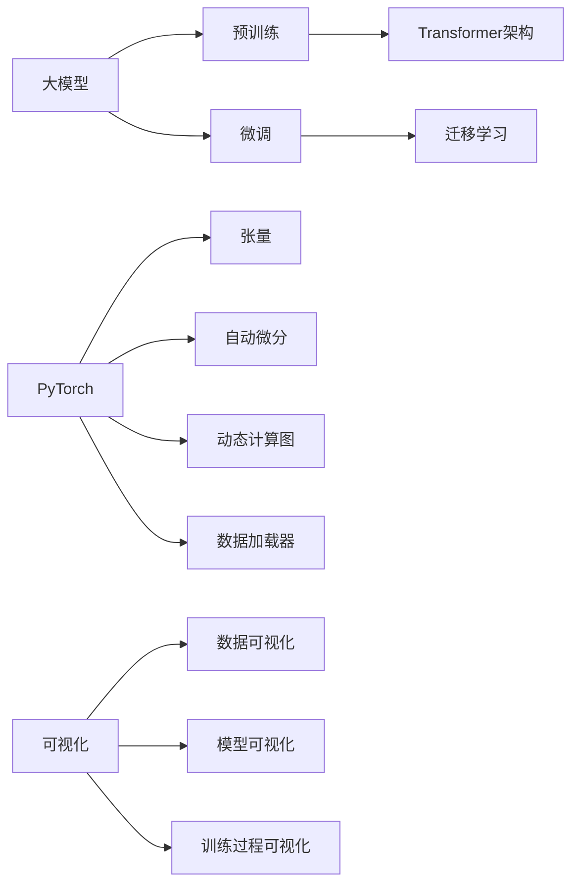

# 从零开始大模型开发与微调：可视化的PyTorch数据处理与模型展示

## 1. 背景介绍

### 1.1 大模型的兴起与发展

近年来，随着深度学习技术的不断进步和计算资源的日益丰富，大规模预训练语言模型（Large Pre-trained Language Models，简称大模型）在自然语言处理领域取得了令人瞩目的成就。从GPT系列到BERT，再到最新的GPT-4，大模型展现出了强大的语言理解和生成能力，在各种NLP任务上都取得了State-of-the-Art的表现。

### 1.2 大模型开发与微调的重要性

尽管大模型已经展现出了非凡的能力，但对于特定领域或任务，直接使用预训练的大模型并不总是最优的选择。通过在特定领域数据上对大模型进行微调（Fine-tuning），可以进一步提升模型在该领域的表现。因此，掌握大模型开发与微调的技能对于NLP研究者和工程师来说至关重要。

### 1.3 PyTorch在大模型开发中的优势

PyTorch作为一个灵活、直观的深度学习框架，在大模型开发与微调中具有独特的优势。PyTorch提供了动态计算图、命令式编程等特性，使得模型开发更加灵活和高效。同时，PyTorch还拥有丰富的生态系统和活跃的社区支持，大大降低了大模型开发的门槛。

### 1.4 可视化在大模型开发中的重要作用

在大模型开发与微调的过程中，可视化扮演着重要的角色。通过可视化技术，我们可以直观地了解数据的分布、模型的结构、训练过程中的各种指标变化等关键信息。可视化不仅能帮助我们更好地理解模型的行为，还能帮助我们发现问题、优化模型，提高开发效率。

## 2. 核心概念与联系

### 2.1 大模型的基本概念

- Transformer架构：大模型的核心架构，基于自注意力机制，能够高效地处理长序列数据。
- 预训练（Pre-training）：在大规模无标注数据上训练模型，学习通用的语言表示。
- 微调（Fine-tuning）：在特定任务数据上调整预训练模型的参数，使其适应特定任务。
- 迁移学习（Transfer Learning）：将在源任务上学习到的知识迁移到目标任务，提高模型的泛化能力。

### 2.2 PyTorch的核心概念

- 张量（Tensor）：PyTorch中的基本数据结构，类似于NumPy的多维数组。
- 自动微分（Autograd）：PyTorch的自动微分机制，用于计算梯度并进行反向传播。
- 动态计算图（Dynamic Computation Graph）：PyTorch采用动态计算图，可以在运行时动态地构建和修改计算图。
- 数据加载器（DataLoader）：用于高效地加载和预处理数据，支持批处理和并行加载。

### 2.3 可视化的核心概念

- 数据可视化：将数据转化为图形化的表示，帮助我们直观地理解数据的分布和特征。
- 模型可视化：将模型的结构、参数等信息可视化，帮助我们理解模型的内部工作原理。
- 训练过程可视化：将训练过程中的各种指标（如损失函数、准确率等）可视化，帮助我们监控训练进度和模型性能。

### 2.4 核心概念之间的联系

大模型开发与微调、PyTorch和可视化之间存在着紧密的联系。PyTorch提供了强大的工具和库，支持大模型的开发与微调。而可视化技术则贯穿于整个开发过程，帮助我们更好地理解数据、模型和训练过程。通过将这些概念有机结合，我们可以更高效、更深入地进行大模型开发与微调。



## 3. 核心算法原理具体操作步骤

### 3.1 大模型预训练

#### 3.1.1 数据准备

- 收集大规模无标注文本数据，如维基百科、新闻语料等。
- 对文本数据进行清洗、分词、编码等预处理操作。
- 将预处理后的数据转化为适合模型训练的格式，如TFRecord、PyTorch的Dataset等。

#### 3.1.2 模型构建

- 选择合适的Transformer架构，如BERT、GPT等。
- 使用PyTorch实现Transformer模型的各个组件，如自注意力层、前馈神经网络等。
- 根据任务需求，调整模型的超参数，如层数、隐藏单元数等。

#### 3.1.3 模型训练

- 使用PyTorch的DataLoader加载预处理后的数据，进行批处理和并行加载。
- 定义损失函数，如语言模型的交叉熵损失等。
- 使用PyTorch的自动微分机制计算梯度，并使用优化器（如Adam）更新模型参数。
- 监控训练过程中的各种指标，如损失函数、学习率等，并使用可视化工具进行展示。

### 3.2 大模型微调

#### 3.2.1 数据准备

- 收集特定任务的标注数据，如情感分析、命名实体识别等。
- 对标注数据进行清洗、分词、编码等预处理操作。
- 将预处理后的数据转化为适合模型微调的格式，如PyTorch的Dataset。

#### 3.2.2 模型调整

- 加载预训练的大模型参数。
- 根据特定任务的需求，调整模型的输入输出层。
- 冻结部分预训练模型的参数，只微调顶层的参数，以加快训练速度并防止过拟合。

#### 3.2.3 模型训练

- 使用PyTorch的DataLoader加载预处理后的标注数据，进行批处理和并行加载。
- 定义特定任务的损失函数，如分类任务的交叉熵损失等。
- 使用PyTorch的自动微分机制计算梯度，并使用优化器（如Adam）更新模型参数。
- 监控训练过程中的各种指标，如损失函数、准确率等，并使用可视化工具进行展示。

### 3.3 模型评估与推理

- 在验证集或测试集上评估微调后的模型性能，计算各种评估指标，如准确率、F1值等。
- 使用微调后的模型对新的输入数据进行推理，生成预测结果。
- 对推理结果进行后处理，如去重、过滤等，以提高输出质量。

## 4. 数学模型和公式详细讲解举例说明

### 4.1 Transformer的自注意力机制

Transformer的核心是自注意力机制，它允许模型在处理序列数据时考虑序列中不同位置之间的依赖关系。自注意力机制可以表示为：

$$
Attention(Q,K,V) = softmax(\frac{QK^T}{\sqrt{d_k}})V
$$

其中，$Q$、$K$、$V$ 分别表示查询（Query）、键（Key）和值（Value），$d_k$ 表示键的维度。

举例来说，假设我们有一个句子 "The quick brown fox jumps over the lazy dog"，我们可以将其表示为一个矩阵 $X$：

$$
X = 
\begin{bmatrix}
x_1 & x_2 & \cdots & x_n
\end{bmatrix}
$$

其中，$x_i$ 表示句子中第 $i$ 个单词的词向量表示。

通过自注意力机制，我们可以计算句子中每个单词与其他单词之间的注意力权重：

$$
A = softmax(\frac{XX^T}{\sqrt{d_k}})
$$

得到的注意力矩阵 $A$ 表示了句子中每个单词与其他单词之间的相关性。这种自注意力机制使得Transformer能够捕捉序列数据中的长距离依赖关系，从而在各种NLP任务上取得优异的表现。

### 4.2 语言模型的交叉熵损失

在大模型预训练中，我们通常使用语言模型的交叉熵损失作为优化目标。给定一个文本序列 $x_1, x_2, \cdots, x_n$，语言模型的目标是最大化下一个单词的条件概率：

$$
P(x_1, x_2, \cdots, x_n) = \prod_{i=1}^n P(x_i | x_1, x_2, \cdots, x_{i-1})
$$

在实践中，我们通常使用交叉熵损失来衡量模型的预测与真实单词分布之间的差异：

$$
\mathcal{L}(\theta) = -\frac{1}{n} \sum_{i=1}^n \log P(x_i | x_1, x_2, \cdots, x_{i-1}; \theta)
$$

其中，$\theta$ 表示模型的参数。

举例来说，假设我们有一个句子 "The quick brown fox"，我们希望模型能够预测下一个单词 "jumps"。假设模型预测下一个单词的概率分布为：

$$
P(x_5 | x_1, x_2, x_3, x_4) = 
\begin{bmatrix}
jumps & 0.6 \\
runs & 0.3 \\
sleeps & 0.1
\end{bmatrix}
$$

则交叉熵损失可以计算为：

$$
\mathcal{L}(\theta) = -\log 0.6 \approx 0.51
$$

通过最小化交叉熵损失，我们可以使模型的预测概率分布与真实单词分布尽可能接近，从而提高模型的语言建模能力。

## 5. 项目实践：代码实例和详细解释说明

下面我们通过一个简单的示例来演示如何使用PyTorch进行大模型的开发与微调。我们将使用一个基于Transformer的语言模型，在WikiText-2数据集上进行预训练，然后在情感分析任务上进行微调。

### 5.1 环境准备

首先，我们需要安装必要的依赖库，包括PyTorch、Transformers等：

```bash
pip install torch transformers datasets
```

### 5.2 数据准备

我们使用Hugging Face的Datasets库来加载WikiText-2数据集：

```python
from datasets import load_dataset

dataset = load_dataset('wikitext', 'wikitext-2-raw-v1')
```

接下来，我们对数据进行预处理，包括分词、编码等：

```python
from transformers import GPT2Tokenizer

tokenizer = GPT2Tokenizer.from_pretrained('gpt2')

def preprocess_function(examples):
    return tokenizer(examples['text'])

tokenized_dataset = dataset.map(preprocess_function, batched=True, num_proc=4, remove_columns=dataset.column_names)
```

### 5.3 模型构建

我们使用Hugging Face的Transformers库来构建基于GPT-2的语言模型：

```python
from transformers import GPT2LMHeadModel

model = GPT2LMHeadModel.from_pretrained('gpt2')
```

### 5.4 模型训练

我们使用PyTorch的DataLoader来加载数据，并使用Adam优化器和交叉熵损失函数来训练模型：

```python
from transformers import DataCollatorForLanguageModeling
from torch.utils.data import DataLoader
from torch.optim import Adam
from torch.nn import CrossEntropyLoss

data_collator = DataCollatorForLanguageModeling(tokenizer=tokenizer, mlm=False)
train_dataloader = DataLoader(tokenized_dataset['train'], batch_size=8, shuffle=True, collate_fn=data_collator)

optimizer = Adam(model.parameters(), lr=1e-5)
loss_fn = CrossEntropyLoss()

model.train()
for epoch in range(3):
    for batch in train_dataloader:
        inputs = batch['input_ids'].to(model.device)
        labels = batch['labels'].to(model.device)
        outputs = model(inputs, labels=labels)
        loss = outputs.loss
        loss.backward()
        optimizer.step()
        optimizer.zero_grad()
```

### 5.5 模型微调

在完成预训练后，我们可以在情感分析任务上对模型进行微调。我们使用IMDb数据集作为微调数据：

```python
imdb_dataset = load_dataset('imdb')

def preprocess_function(examples):
    return tokenizer(examples['text'], truncation=True, padding='max_length', max_length=512)

tokenized_imdb_dataset = imdb_dataset.map(preprocess_function, batched=True