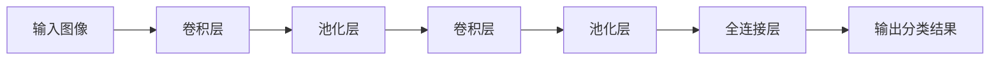
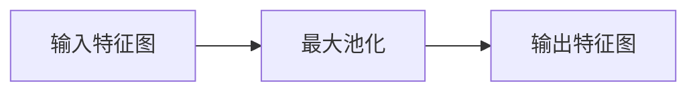

# 从零开始大模型开发与微调：实战：基于卷积的MNIST手写体分类

## 1. 背景介绍

### 1.1 手写体识别的重要性

在当今数字化时代，手写体识别技术在多个领域发挥着重要作用。从银行支票的自动处理到邮政编码的自动识别,再到智能教学系统中的作业批改,手写体识别无处不在。随着人工智能技术的不断发展,手写体识别的准确性和效率也在不断提高。

### 1.2 MNIST数据集简介

MNIST (Mixed National Institute of Standards and Technology)数据集是一个入门级的计算机视觉数据集,由来自美国人口普查局员工的手写数字图像组成。它包含60,000个训练图像和10,000个测试图像,每个图像都是28x28像素的手写数字,标记为0到9之间的某个数字。MNIST数据集因其相对简单的结构和广泛的应用而备受欢迎,被视为机器学习和深度学习领域的"Hello World"。

### 1.3 卷积神经网络在手写体识别中的应用

卷积神经网络(Convolutional Neural Network, CNN)是一种专门用于处理图像数据的深度学习模型。它通过多层卷积和池化操作来提取图像的特征,最终将这些特征映射到相应的类别。由于其强大的特征提取能力,CNN在手写体识别任务中表现出色,成为该领域的主流方法之一。

## 2. 核心概念与联系

### 2.1 卷积神经网络的基本结构

卷积神经网络通常由以下几个关键组件组成:

1. **卷积层(Convolutional Layer)**: 通过滑动卷积核(kernel)在输入图像上进行卷积操作,提取局部特征。
2. **池化层(Pooling Layer)**: 对卷积层的输出进行下采样,减小特征图的维度,提高模型的鲁棒性。
3. **全连接层(Fully Connected Layer)**: 将提取的特征映射到最终的分类结果。

这些层按照特定的顺序组合在一起,形成了卷积神经网络的基本架构。



### 2.2 卷积操作原理

卷积操作是CNN中最关键的步骤之一。它通过在输入图像上滑动卷积核,计算局部区域的加权和,从而提取该区域的特征。每个卷积核都会学习到检测特定模式的能力,如边缘、曲线等。

$$
\text{Output}(x,y) = \sum_{i,j} \text{Input}(x+i, y+j) \cdot \text{Kernel}(i, j)
$$

其中,$(x, y)$表示输出特征图的坐标,$(i, j)$表示卷积核的坐标。通过在整个输入图像上滑动卷积核,我们可以获得一个新的特征图,捕获了输入图像的局部模式。

### 2.3 池化操作原理

池化操作的目的是降低特征图的维度,同时保留重要的特征信息。常见的池化方法包括最大池化(Max Pooling)和平均池化(Average Pooling)。

在最大池化中,我们将输入特征图划分为多个小区域,并从每个区域中选取最大值作为输出。这种操作可以保留区域内最显著的特征,同时减小特征图的尺寸。



### 2.4 全连接层和分类

经过多层卷积和池化操作后,CNN会将提取的特征展平,并输入到一个或多个全连接层中。全连接层的作用是将这些特征映射到最终的分类结果。

在手写体识别任务中,全连接层的输出通常是一个长度为10的向量,对应0到9这10个数字类别。通过使用合适的损失函数(如交叉熵损失)和优化算法(如随机梯度下降),我们可以训练CNN模型,使其能够准确地将手写数字图像分类到正确的类别。

## 3. 核心算法原理具体操作步骤

### 3.1 数据预处理

在开始训练CNN模型之前,我们需要对MNIST数据集进行适当的预处理。常见的预处理步骤包括:

1. **数据归一化**: 将像素值缩放到0到1的范围内,以提高训练的数值稳定性。
2. **数据增强**: 通过旋转、平移等操作生成更多的训练数据,增强模型的泛化能力。

### 3.2 模型构建

构建CNN模型通常包括以下步骤:

1. **定义卷积层**: 指定卷积核的数量、大小和步长。
2. **定义池化层**: 选择合适的池化方法(如最大池化或平均池化)和池化窗口大小。
3. **定义全连接层**: 确定全连接层的数量和神经元数量。
4. **选择激活函数**: 常用的激活函数包括ReLU、Sigmoid和Tanh。
5. **定义损失函数**: 对于分类任务,通常使用交叉熵损失函数。
6. **选择优化器**: 常见的优化器包括SGD、Adam和RMSprop。

以下是一个基于PyTorch构建的简单CNN模型示例:

```python
import torch.nn as nn

class CNN(nn.Module):
    def __init__(self):
        super(CNN, self).__init__()
        self.conv1 = nn.Conv2d(1, 32, kernel_size=3, stride=1, padding=1)
        self.pool = nn.MaxPool2d(kernel_size=2, stride=2)
        self.conv2 = nn.Conv2d(32, 64, kernel_size=3, stride=1, padding=1)
        self.fc1 = nn.Linear(64 * 7 * 7, 128)
        self.fc2 = nn.Linear(128, 10)

    def forward(self, x):
        x = self.pool(nn.functional.relu(self.conv1(x)))
        x = self.pool(nn.functional.relu(self.conv2(x)))
        x = x.view(-1, 64 * 7 * 7)
        x = nn.functional.relu(self.fc1(x))
        x = self.fc2(x)
        return x
```

### 3.3 模型训练

训练CNN模型的过程通常包括以下步骤:

1. **准备数据加载器**: 将数据集划分为训练集和测试集,并使用PyTorch的`DataLoader`加载数据。
2. **定义优化器和损失函数**: 选择合适的优化器(如Adam)和损失函数(如交叉熵损失)。
3. **训练循环**: 在训练循环中,我们将数据输入到模型中,计算损失,并使用优化器更新模型参数。
4. **模型评估**: 在每个epoch结束时,使用测试集评估模型的性能。
5. **模型保存**: 将训练好的模型权重保存到文件中,以便后续使用。

以下是一个简单的训练循环示例:

```python
import torch.optim as optim

model = CNN()
criterion = nn.CrossEntropyLoss()
optimizer = optim.Adam(model.parameters(), lr=0.001)

for epoch in range(num_epochs):
    running_loss = 0.0
    for inputs, labels in train_loader:
        optimizer.zero_grad()
        outputs = model(inputs)
        loss = criterion(outputs, labels)
        loss.backward()
        optimizer.step()
        running_loss += loss.item()
    
    epoch_loss = running_loss / len(train_loader)
    print(f'Epoch {epoch+1}, Loss: {epoch_loss:.4f}')
    
    # 在测试集上评估模型
    model.eval()
    correct = 0
    total = 0
    with torch.no_grad():
        for inputs, labels in test_loader:
            outputs = model(inputs)
            _, predicted = torch.max(outputs.data, 1)
            total += labels.size(0)
            correct += (predicted == labels).sum().item()
    
    accuracy = 100 * correct / total
    print(f'Accuracy on test set: {accuracy:.2f}%')
    model.train()

# 保存模型权重
torch.save(model.state_dict(), 'mnist_cnn.pth')
```

## 4. 数学模型和公式详细讲解举例说明

在卷积神经网络中,有几个关键的数学模型和公式需要详细讲解。

### 4.1 卷积操作

卷积操作是CNN中最关键的步骤之一。它通过在输入图像上滑动卷积核,计算局部区域的加权和,从而提取该区域的特征。卷积操作的数学表达式如下:

$$
\text{Output}(x,y) = \sum_{i,j} \text{Input}(x+i, y+j) \cdot \text{Kernel}(i, j)
$$

其中,$(x, y)$表示输出特征图的坐标,$(i, j)$表示卷积核的坐标。通过在整个输入图像上滑动卷积核,我们可以获得一个新的特征图,捕获了输入图像的局部模式。

例如,假设我们有一个3x3的输入图像和一个2x2的卷积核,如下所示:

```
输入图像:
1 2 3
4 5 6
7 8 9

卷积核:
1 0
0 1
```

我们可以计算输出特征图的第一个元素如下:

$$
\text{Output}(0,0) = 1 \cdot 1 + 2 \cdot 0 + 4 \cdot 0 + 5 \cdot 1 = 6
$$

通过在整个输入图像上滑动卷积核,我们可以得到完整的输出特征图。

### 4.2 池化操作

池化操作的目的是降低特征图的维度,同时保留重要的特征信息。最大池化和平均池化是两种常见的池化方法。

**最大池化**

最大池化的数学表达式如下:

$$
\text{Output}(x,y) = \max_{(i,j) \in R} \text{Input}(x+i, y+j)
$$

其中,$(x, y)$表示输出特征图的坐标,$(i, j)$表示池化窗口内的坐标,$R$表示池化窗口的区域。

例如,假设我们有一个4x4的输入特征图,并使用2x2的最大池化窗口,步长为2:

```
输入特征图:
1 3 2 4
5 6 7 8
9 1 2 3
4 5 6 7

最大池化(2x2, stride=2):
6 8
9 6
```

在最大池化中,我们将输入特征图划分为多个2x2的小区域,并从每个区域中选取最大值作为输出。

**平均池化**

平均池化的数学表达式如下:

$$
\text{Output}(x,y) = \frac{1}{|R|} \sum_{(i,j) \in R} \text{Input}(x+i, y+j)
$$

其中,$(x, y)$表示输出特征图的坐标,$(i, j)$表示池化窗口内的坐标,$R$表示池化窗口的区域,$|R|$表示池化窗口的面积。

与最大池化类似,平均池化也是通过在输入特征图上滑动池化窗口,计算每个窗口内元素的平均值作为输出。

### 4.3 全连接层

全连接层的作用是将提取的特征映射到最终的分类结果。全连接层的数学表达式如下:

$$
y = f(\mathbf{W}^T \mathbf{x} + \mathbf{b})
$$

其中,$\mathbf{x}$表示输入向量,$\mathbf{W}$表示权重矩阵,$\mathbf{b}$表示偏置向量,$f$表示激活函数。

在手写体识别任务中,全连接层的输出通常是一个长度为10的向量,对应0到9这10个数字类别。通过使用合适的损失函数(如交叉熵损失)和优化算法(如随机梯度下降),我们可以训练CNN模型,使其能够准确地将手写数字图像分类到正确的类别。

## 5. 项目实践: 代码实例和详细解释说明

在这一部分,我们将提供一个基于PyTorch的完整代码示例,用于训练和评估一个CNN模型,以解决MNIST手写体识别任务。

### 5.1 导入必要的库

```python
import torch
import torchvision
import torchvision.transforms as transforms
import torch.nn as nn
import torch.optim as optim
```

### 5.2 定义CNN模型

```python
class CNN(nn.Module):
    def __init__(self):
        super(CNN, self).__init__()
        self.conv1 = nn.Conv2d(1, 32, kernel