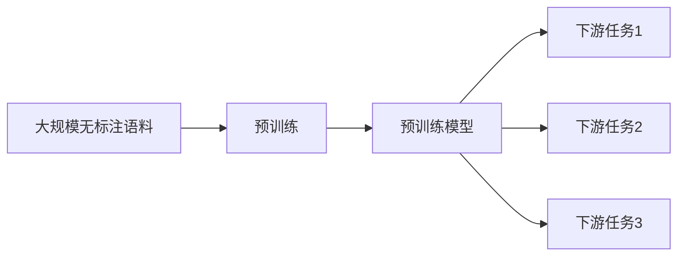

# 从零开始大模型开发与微调：更多的预训练模型

## 1. 背景介绍

### 1.1 大语言模型的兴起

近年来,自然语言处理(NLP)领域出现了一种新的范式,即预训练语言模型(Pre-trained Language Models, PLMs)。这些模型通过在大规模无标注文本语料上进行自监督学习,可以学习到语言的通用表示,并可以应用于下游的各种NLP任务。其中最具代表性的就是大语言模型,如GPT系列、BERT等。

### 1.2 大模型的优势

大语言模型之所以备受关注,主要有以下几个原因:

- 强大的语言理解和生成能力:通过在海量文本上的预训练,大模型可以学习到语言的深层次语义表示,具备较强的语言理解和生成能力,在许多NLP任务上取得了显著的性能提升。
- 少样本学习能力:大模型可以作为通用的语言backbone,通过少量的微调即可适应下游任务,大大降低了任务特定数据的标注成本。
- 知识的储备和组合:大模型在预训练过程中积累了大量的世界知识和常识,并且具备一定的知识组合和推理能力,使其在知识密集型任务上表现出色。

### 1.3 大模型微调的意义

尽管大模型展现出了强大的能力,但直接应用于下游任务时,往往还存在一定的gap。因此,针对特定任务对大模型进行微调(fine-tuning)就显得尤为重要。通过微调,可以进一步提升模型在目标任务上的表现,同时降低所需训练数据的规模。此外,对大模型的微调研究,也有助于我们更好地理解大模型的内在机制,探索更有效的知识转移方式。

## 2. 核心概念与联系

### 2.1 预训练(Pre-training)

预训练是指在大规模无标注语料上,通过自监督学习任务对模型进行训练,使其学习到语言的通用表示。常见的预训练任务包括语言模型、掩码语言模型、次句预测、对比学习等。预训练阶段旨在让模型尽可能地学习语言的内在规律和知识,为下游任务做好准备。

### 2.2 微调(Fine-tuning)

微调是指在预训练模型的基础上,针对特定的下游任务,使用任务特定的标注数据对模型进行进一步训练。微调阶段通常只需要相对较少的训练数据和训练时间,即可让模型适应目标任务。微调可以看作是一种知识转移,即将预训练阶段学到的通用语言知识,迁移到具体的任务中。

### 2.3 预训练模型

预训练模型是指经过预训练阶段得到的模型权重。常见的预训练模型包括GPT系列、BERT系列、RoBERTa、XLNet等。这些模型在不同的语料和预训练任务上训练得到,因此具有不同的特点和适用场景。选择合适的预训练模型作为基础模型,可以大大提升下游任务的性能。

### 2.4 模型架构

预训练语言模型的架构设计是其取得成功的关键因素之一。目前主流的模型架构包括:

- Transformer编码器:如BERT、RoBERTa等,采用双向的Self-Attention机制,主要用于自然语言理解任务。
- Transformer解码器:如GPT系列,采用单向的Self-Attention机制,主要用于语言生成任务。
- Transformer编码器-解码器:如BART、T5等,结合了编码器和解码器,可用于各种NLP任务。

模型架构的选择需要根据任务的特点和需求来权衡。同时,模型的规模(如层数、隐层维度等)也是影响性能的重要因素。

### 2.5 持续学习

大模型的训练是一个渐进的过程,通过持续地在更大规模语料上训练,不断提升模型的性能。一方面,可以扩大预训练语料的规模和领域覆盖面,使模型学到更广泛的知识;另一方面,也可以设计更有效的预训练任务,如多任务学习、对比学习等,来提高模型学习语言知识的效率。

下图展示了预训练语言模型的整体流程:

## 3. 核心算法原理具体操作步骤

本节将详细介绍大模型开发与微调的核心算法原理和具体操作步骤。

### 3.1 预训练阶段

#### 3.1.1 语料准备

首先需要收集和准备大规模的无标注文本语料。语料来源可以包括书籍、新闻、百科、社交媒体等。对语料进行清洗、去重、分词等预处理操作,并根据需要进行格式转换。

#### 3.1.2 模型选择与搭建

选择合适的预训练模型架构,如BERT、GPT等。根据任务需求和计算资源,确定模型的规模(如层数、隐层维度、Attention头数等)。使用深度学习框架如PyTorch、TensorFlow搭建模型。

#### 3.1.3 预训练任务设计

设计合适的预训练任务,如掩码语言模型(MLM)、自回归语言模型(LM)、对比学习等。根据任务的特点,准备相应的训练数据。对于MLM任务,需要对输入文本进行随机掩码;对于LM任务,需要准备连续的文本片段。

#### 3.1.4 模型训练

将准备好的数据输入到模型中,计算预训练任务的损失函数。使用优化算法(如Adam)对模型进行训练,更新模型参数。根据需要设置合适的学习率、Batch Size、训练轮数等超参数。在训练过程中,定期评估模型在验证集上的性能,并保存最优的模型权重。

### 3.2 微调阶段

#### 3.2.1 任务数据准备

针对特定的下游任务,准备相应的标注数据。对数据进行清洗、预处理,并根据任务的输入输出格式,将数据转换为模型可接受的形式。一般来说,微调阶段所需的数据规模远小于预训练阶段。

#### 3.2.2 模型架构调整

根据任务的特点,对预训练模型的架构进行适当的调整和扩展。例如,对于序列标注任务,需要在模型顶层添加一个线性层作为标注器;对于文本分类任务,需要在模型顶层添加一个分类器。对于一些特定任务,可能还需要引入任务特定的模块。

#### 3.2.3 微调训练

加载预训练阶段得到的模型权重,作为微调阶段的初始化参数。将任务数据输入到模型中,计算任务的损失函数(如交叉熵损失)。使用优化算法对模型进行训练,更新模型参数。微调阶段的学习率通常设置得比预训练阶段更小。根据任务的复杂度和数据规模,设置合适的训练轮数。

#### 3.2.4 模型评估与调优

在微调过程中,定期在验证集上评估模型的性能,如准确率、F1值等。根据验证集的反馈,调整模型的超参数,如学习率、Batch Size等,以进一步提升性能。也可以尝试不同的微调策略,如两阶段微调、Adapter等。最终保存性能最优的模型权重,用于后续的推理和应用。

## 4. 数学模型和公式详细讲解举例说明

本节将详细讲解大模型开发与微调中涉及的关键数学模型和公式,并给出具体的举例说明。

### 4.1 Transformer模型

Transformer是目前主流的预训练语言模型的基础架构。其核心是Self-Attention机制和前馈神经网络(FFN)。

#### 4.1.1 Self-Attention

Self-Attention可以捕捉文本序列中任意两个位置之间的依赖关系。对于输入序列 $X \in \mathbb{R}^{n \times d}$,Self-Attention的计算过程如下:

$$
\begin{aligned}
Q &= XW_Q, K = XW_K, V = XW_V \\
\text{Attention}(Q, K, V) &= \text{softmax}(\frac{QK^T}{\sqrt{d_k}})V
\end{aligned}
$$

其中,$Q, K, V$分别表示查询、键、值矩阵,$W_Q, W_K, W_V$是可学习的参数矩阵。$\sqrt{d_k}$是缩放因子,用于控制点积的方差。

举例说明:假设输入序列为"我爱自然语言处理",经过Embedding层得到矩阵$X$。通过与$W_Q, W_K, W_V$相乘,得到$Q, K, V$矩阵。然后计算$QK^T$,得到每个位置与其他位置的相似度得分。经过Softmax归一化后,与$V$相乘,得到每个位置的注意力加权和。这样,就可以捕捉到"我"与"自然语言处理"之间的依赖关系。

#### 4.1.2 前馈神经网络

前馈神经网络(FFN)是一个两层的全连接网络,用于对Self-Attention的输出进行非线性变换。其计算公式为:

$$
\text{FFN}(x) = \max(0, xW_1 + b_1)W_2 + b_2
$$

其中,$W_1, W_2, b_1, b_2$是可学习的参数矩阵和偏置项。

举例说明:假设Self-Attention的输出为$X$,通过第一层线性变换和ReLU激活,得到$H = \max(0, XW_1 + b_1)$。然后再经过第二层线性变换,得到$\text{FFN}(X) = HW_2 + b_2$。这样,就可以对Self-Attention的输出进行非线性变换,提取更高层次的特征表示。

### 4.2 预训练任务

#### 4.2.1 掩码语言模型(MLM)

MLM是BERT等模型采用的预训练任务。其目标是根据上下文预测被掩码的单词。具体来说,对于输入序列$X$,随机选择一部分单词进行掩码,得到掩码后的序列$\hat{X}$。然后将$\hat{X}$输入到模型中,得到每个位置的输出表示$H$。对于被掩码的位置$i$,计算其与词表中所有单词的相似度得分:

$$
P(w_j|\hat{X}, i) = \frac{\exp(H_i \cdot E_j)}{\sum_{k=1}^V \exp(H_i \cdot E_k)}
$$

其中,$E$是词嵌入矩阵,$V$是词表大小。最终的损失函数是所有被掩码位置的交叉熵损失之和:

$$
\mathcal{L}_{\text{MLM}} = -\sum_{i \in \mathcal{M}} \log P(w_i|\hat{X}, i)
$$

其中,$\mathcal{M}$是被掩码的位置集合。

举例说明:假设输入序列为"我爱自然语言处理",随机选择"自然"进行掩码,得到"我爱[MASK]语言处理"。将其输入到BERT中,得到每个位置的输出表示$H$。对于[MASK]位置,计算其与词表中所有单词的相似度得分,得到一个概率分布。然后计算其与真实单词"自然"的交叉熵损失。这样,模型就可以学习到根据上下文预测被掩码单词的能力。

#### 4.2.2 自回归语言模型(LM)

LM是GPT等模型采用的预训练任务。其目标是根据前面的单词预测下一个单词。具体来说,对于输入序列$X = (x_1, x_2, \dots, x_T)$,模型的目标是最大化如下条件概率:

$$
P(X) = \prod_{t=1}^T P(x_t|x_{<t})
$$

其中,$x_{<t}$表示$x_t$之前的所有单词。模型的输出是每个位置的条件概率分布,损失函数是所有位置的交叉熵损失之和:

$$
\mathcal{L}_{\text{LM}} = -\sum_{t=1}^T \log P(x_t|x_{<t})
$$

举例说明:假设输入序列为"我爱自然语言处理",模型的目标