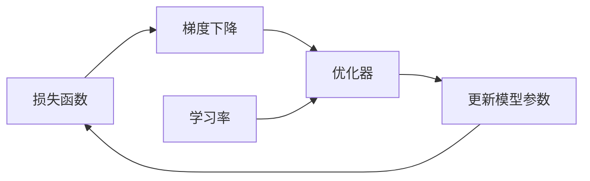

# 优化器：加速神经网络训练的利器

## 1. 背景介绍

### 1.1 深度学习的发展历程

深度学习作为人工智能的一个重要分支,在近年来取得了突飞猛进的发展。从最初的感知机到如今复杂的深度神经网络,深度学习模型的结构和性能不断提升,在计算机视觉、自然语言处理、语音识别等领域取得了广泛应用。

### 1.2 训练深度神经网络面临的挑战

随着深度学习模型规模的不断增大,训练这些模型所需的计算资源和时间成本也在急剧增加。如何高效地训练大规模深度神经网络,成为了一个亟待解决的问题。优化器作为训练神经网络的核心组件之一,在加速训练过程、提升模型性能方面发挥着关键作用。

### 1.3 优化器的重要性

优化器通过调整神经网络的参数,使其在训练数据上的损失函数最小化,从而使模型能够学习到数据中的有用特征和规律。高效的优化算法不仅能加快模型收敛速度,还能帮助模型跳出局部最优,达到更好的性能。因此,深入理解优化器的原理和特性,对于训练出高质量的深度学习模型至关重要。

## 2. 核心概念与联系

### 2.1 损失函数

损失函数衡量了模型预测结果与真实标签之间的差距。常见的损失函数包括均方误差(MSE)、交叉熵(Cross-entropy)等。优化器的目标就是最小化损失函数,使模型的预测结果尽可能接近真实标签。

### 2.2 梯度下降

梯度下降是优化神经网络参数的基本方法。通过计算损失函数对各个参数的梯度,沿着梯度的反方向更新参数,使损失函数逐步减小,直到达到一个局部最小值。

### 2.3 学习率

学习率控制着参数更新的步长。较大的学习率可以加快收敛速度,但可能导致优化过程振荡不稳定;较小的学习率虽然稳定,但收敛速度较慢。因此,选择合适的学习率对优化过程至关重要。

### 2.4 优化器与损失函数、梯度下降、学习率之间的关系

优化器综合利用损失函数、梯度下降和学习率等要素,通过迭代更新模型参数,使损失函数最小化,从而得到性能优异的模型。

## 3. 核心算法原理具体操作步骤

### 3.1 梯度下降算法

1. 初始化模型参数
2. 计算损失函数对各个参数的梯度
3. 沿梯度反方向更新参数: $\theta = \theta - \alpha \nabla_{\theta}J(\theta)$
4. 重复步骤2-3,直到达到停止条件(如损失函数收敛或达到最大迭代次数)

### 3.2 动量(Momentum)优化算法

1. 初始化模型参数和速度
2. 计算梯度: $g_t = \nabla_{\theta}J(\theta)$
3. 更新速度: $v_t = \gamma v_{t-1} + \alpha g_t$
4. 更新参数: $\theta = \theta - v_t$
5. 重复步骤2-4,直到达到停止条件

### 3.3 RMSprop算法

1. 初始化模型参数和梯度累积变量
2. 计算梯度的平方: $g_t^2 = (\nabla_{\theta}J(\theta))^2$
3. 更新梯度累积变量: $E[g^2]_t = \beta E[g^2]_{t-1} + (1-\beta)g_t^2$
4. 计算更新步长: $\Delta \theta_t = -\frac{\alpha}{\sqrt{E[g^2]_t + \epsilon}} g_t$
5. 更新参数: $\theta_{t+1} = \theta_t + \Delta \theta_t$
6. 重复步骤2-5,直到达到停止条件

### 3.4 Adam算法

1. 初始化模型参数、一阶矩估计和二阶矩估计
2. 计算梯度: $g_t = \nabla_{\theta}J(\theta)$
3. 更新一阶矩估计: $m_t = \beta_1 m_{t-1} + (1-\beta_1)g_t$
4. 更新二阶矩估计: $v_t = \beta_2 v_{t-1} + (1-\beta_2)g_t^2$
5. 修正一阶矩估计: $\hat{m}_t = \frac{m_t}{1-\beta_1^t}$
6. 修正二阶矩估计: $\hat{v}_t = \frac{v_t}{1-\beta_2^t}$
7. 更新参数: $\theta_{t+1} = \theta_t - \frac{\alpha}{\sqrt{\hat{v}_t}+\epsilon}\hat{m}_t$
8. 重复步骤2-7,直到达到停止条件

## 4. 数学模型和公式详细讲解举例说明

### 4.1 梯度下降的数学原理

梯度下降法基于以下数学原理:为了找到函数$f(\theta)$的局部最小值,我们沿着负梯度方向更新参数$\theta$,使函数值不断减小,直到达到局部最小点。

假设我们要优化的函数为:

$$f(\theta) = \theta^2 - 2\theta + 1$$

其梯度为:

$$\nabla f(\theta) = 2\theta - 2$$

根据梯度下降法,我们按照以下公式更新参数$\theta$:

$$\theta_{t+1} = \theta_t - \alpha \nabla f(\theta_t)$$

其中$\alpha$为学习率。假设初始$\theta_0=0$,学习率$\alpha=0.1$,迭代更新过程如下:

- $\theta_1 = \theta_0 - \alpha \nabla f(\theta_0) = 0 - 0.1 \times (-2) = 0.2$
- $\theta_2 = \theta_1 - \alpha \nabla f(\theta_1) = 0.2 - 0.1 \times (2 \times 0.2 - 2) = 0.36$
- $\theta_3 = \theta_2 - \alpha \nabla f(\theta_2) = 0.36 - 0.1 \times (2 \times 0.36 - 2) = 0.488$

可以看到,随着迭代次数增加,$\theta$逐渐接近函数$f(\theta)$的最小值点1。这就是梯度下降法的基本原理。

### 4.2 动量优化算法的数学原理

动量法在梯度下降的基础上引入了速度的概念,参数更新不仅取决于当前梯度,还受到之前梯度的影响。这有助于加速收敛并减少振荡。

动量法的参数更新公式为:

$$v_t = \gamma v_{t-1} + \alpha \nabla_{\theta}J(\theta)$$
$$\theta = \theta - v_t$$

其中$v_t$为速度,$\gamma$为动量因子(通常取0.9),$\alpha$为学习率。

以上一节的函数$f(\theta)$为例,假设初始$\theta_0=0$,$v_0=0$,学习率$\alpha=0.1$,动量因子$\gamma=0.9$,迭代更新过程如下:

- $v_1 = 0.9 \times 0 + 0.1 \times (-2) = -0.2$
- $\theta_1 = 0 - (-0.2) = 0.2$
- $v_2 = 0.9 \times (-0.2) + 0.1 \times (2 \times 0.2 - 2) = -0.34$
- $\theta_2 = 0.2 - (-0.34) = 0.54$

可以看到,引入动量后,参数更新幅度更大,收敛速度更快。同时,由于动量项的存在,优化过程也更加平稳。

### 4.3 RMSprop算法的数学原理

RMSprop算法通过自适应调整学习率来加速收敛。其核心思想是对梯度的平方进行指数加权移动平均,然后用梯度除以平方根,得到自适应的学习率。

RMSprop的参数更新公式为:

$$E[g^2]_t = \beta E[g^2]_{t-1} + (1-\beta)g_t^2$$
$$\theta_{t+1} = \theta_t - \frac{\alpha}{\sqrt{E[g^2]_t + \epsilon}} g_t$$

其中$E[g^2]_t$为梯度平方的移动平均,$\beta$为衰减率(通常取0.9),$\epsilon$为平滑项(通常取1e-8),防止分母为0。

以函数$f(\theta)$为例,假设初始$\theta_0=0$,$E[g^2]_0=0$,学习率$\alpha=0.01$,衰减率$\beta=0.9$,迭代更新过程如下:

- $g_1 = 2 \times 0 - 2 = -2$
- $E[g^2]_1 = 0.9 \times 0 + 0.1 \times (-2)^2 = 0.4$
- $\theta_1 = 0 - \frac{0.01}{\sqrt{0.4+1e-8}} \times (-2) \approx 0.0316$
- $g_2 = 2 \times 0.0316 - 2 \approx -1.9368$
- $E[g^2]_2 = 0.9 \times 0.4 + 0.1 \times (-1.9368)^2 \approx 0.7347$
- $\theta_2 \approx 0.0316 - \frac{0.01}{\sqrt{0.7347+1e-8}} \times (-1.9368) \approx 0.0545$

可以看到,RMSprop通过自适应调整学习率,使得参数更新更加稳定和高效。

### 4.4 Adam算法的数学原理

Adam算法结合了动量法和RMSprop的优点,同时对一阶矩(梯度)和二阶矩(梯度平方)进行自适应估计,是一种高效的优化算法。

Adam的参数更新公式为:

$$m_t = \beta_1 m_{t-1} + (1-\beta_1)g_t$$
$$v_t = \beta_2 v_{t-1} + (1-\beta_2)g_t^2$$
$$\hat{m}_t = \frac{m_t}{1-\beta_1^t}$$
$$\hat{v}_t = \frac{v_t}{1-\beta_2^t}$$
$$\theta_{t+1} = \theta_t - \frac{\alpha}{\sqrt{\hat{v}_t}+\epsilon}\hat{m}_t$$

其中$m_t$和$v_t$分别为一阶矩和二阶矩的估计,$\beta_1$和$\beta_2$为衰减率(通常取0.9和0.999),$\hat{m}_t$和$\hat{v}_t$为修正后的估计,用于抵消初始估计的偏差。

以函数$f(\theta)$为例,假设初始$\theta_0=0$,$m_0=0$,$v_0=0$,学习率$\alpha=0.01$,$\beta_1=0.9$,$\beta_2=0.999$,迭代更新过程如下:

- $g_1 = 2 \times 0 - 2 = -2$
- $m_1 = 0.9 \times 0 + 0.1 \times (-2) = -0.2$
- $v_1 = 0.999 \times 0 + 0.001 \times (-2)^2 = 0.004$
- $\hat{m}_1 = \frac{-0.2}{1-0.9} = -2$
- $\hat{v}_1 = \frac{0.004}{1-0.999} = 4$
- $\theta_1 = 0 - \frac{0.01}{\sqrt{4}+1e-8} \times (-2) \approx 0.01$

- $g_2 = 2 \times 0.01 - 2 \approx -1.98$
- $m_2 = 0.9 \times (-0.2) + 0.1 \times (-1.98) \approx -0.378$
- $v_2 = 0.999 \times 0.004 + 0.001 \times (-1.98)^2 \approx 0.00792$
- $\hat{m}_2 = \frac{-0.378}{1-0.9^2} \approx -2.0989$
- $\hat{v}_2 = \frac{0.00792}{1-0.999^2} \approx 3.9600$
- $\theta_2 \approx 0.01 - \frac{0.01}{\sqrt{3.9600}+1e-8} \times (-2.0989) \approx 0.0205$

可以看到